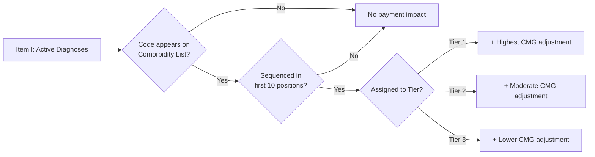

---
tags:
  - irf-pai
  - inpatient-rehabilitation
  - pmr-coding
  - cms
  - fy2026
  - case-mix-group
  - 60-percent-rule
aliases:
  - IRF-PAI v4.2
  - Inpatient Rehab Assessment Instrument
  - IRF PPS Coding Manual
created: 2025-01-20
updated: 2026-07-17
source: https://www.cms.gov/medicare/quality/inpatient-rehabilitation-facility/irf-pai-and-irf-qrp-manual
version: "4.2 (errata 1/1/2026) — v4.4 effective 10/1/2026"
effective_date: 2025-10-01
expiration_date: 2026-09-30
applicable_to: All IRF patients regardless of payer
---

# IRF-PAI Manual Version 4.2 — FY 2026
*Inpatient Rehabilitation Facility Patient Assessment Instrument*

> [!INFO] Document Scope
> The IRF-PAI is the standardized assessment instrument used to collect patient data for **quality measure calculation** and **payment determination** under the IRF Prospective Payment System (PPS) and Quality Reporting Program (QRP).  
> **Effective Date**: October 1, 2025 for all patients discharged on or after this date (FY 2026). Version 4.2 remains the current manual, with a **mid-year errata** (effective 1/1/2026, items J1750/J1800/J1900) layered on top — see note below. **Version 4.4** is finalized and takes effect **October 1, 2026**.

---

## 🔑 Core Framework: Dual Payment/Reporting Systems

### IRF PPS vs. IRF QRP: Two Parallel Tracks
```markdown
┌─────────────────────────────────────────┐
│ IRF PROSPECTIVE PAYMENT SYSTEM (PPS)    │
├─────────────────────────────────────────┤
│ • Determines CMG (Case-Mix Group) payment │
│ • Based on:                              │
│   - Functional status (GG section)       │
│   - Comorbidities (Item I: Active Diagnoses) │
│   - Age, prior functioning, cognitive status │
│ • Payment = Base rate × CMG weight × adjustments │
│ • Base rate FY2026: $19,371 (up from $18,907 FY25) │
└─────────────────────────────────────────┘

┌─────────────────────────────────────────┐
│ IRF QUALITY REPORTING PROGRAM (QRP)     │
├─────────────────────────────────────────┤
│ • Measures: Pressure ulcers, falls, functional improvement │
│ • Data submission via iQIES or NHSN     │
│ • Two completeness thresholds:          │
│   - 95% for IRF-PAI submitted measures  │
│   - 100% for NHSN-reported measures     │
│ • Failure = 2% reduction to AIF         │
└─────────────────────────────────────────┘
```

> [!NOTE] FY 2026 QRP Changes
> CMS removed the **COVID-19 Vaccination Coverage among Healthcare Personnel** measure beginning with the FY 2026 QRP; the **COVID-19 Vaccine Up-to-Date** measure follows suit beginning FY 2028 (CY 2026 data). Four Social Determinants of Health items — **Living Situation (R0310)**, **Food (R0320A/B)**, and **Utilities (R0330)** — are being phased out for patients admitted on/after **October 1, 2026**, so keep collecting them through the current FY [46][43].

> [!WARNING] Critical Distinction  
> **IRF-PAI comorbidity sequencing differs from acute care MS-DRG logic**. Only comorbidities sequenced in the **first 10 positions** of Item I (Active Diagnoses) can impact CMG payment tier assignment.

---

## 📋 IRF-PAI v4.2 Section Overview (Table 2-1)

| Section | Title | Primary Coding Focus | CC/MCC Relevance |
|---------|-------|---------------------|-----------------|
| **A** | Administrative Information | Payer, demographics, transportation | Indirect (affects data completeness) |
| **B** | Hearing, Speech, Vision | Sensory deficits impacting therapy | May support functional limitation documentation |
| **C** | Cognitive Patterns | BIMS, delirium screening | Cognitive impairment may qualify as comorbidity tier |
| **D** | Mood | PHQ-2/9, social isolation | Depression/anxiety may impact therapy participation |
| **GG** | Functional Abilities | Self-care, mobility, prior function | **PRIMARY DRIVER** of CMG assignment |
| **H** | Bladder/Bowel | Continence status | Neurogenic bladder/bowel may qualify as comorbidity |
| **I** | **Active Diagnoses** | **ICD-10-CM codes influencing function or pressure ulcer risk** | **CORE SECTION for comorbidity tier assignment** |
| **J** | Health Conditions | Pain, falls history, prior surgery | Pain severity may support therapy intensity documentation |
| **K** | Swallowing/Nutrition | Nutritional approaches | Malnutrition codes may qualify for comorbidity tier |
| **M** | Skin Conditions | Pressure ulcer staging | Stage 3/4 ulcers = MCC; impacts both payment & quality metrics |
| **N** | Medications | High-risk drug classes | Anticoagulants, psychotropics may support complexity documentation |
| **O** | Special Treatments | Dialysis, ventilation, IV meds | May support medical complexity for CMG assignment |
| **Z** | Assessment Administration | Signatures, dates | Compliance requirement |

---

## 🎯 Section I: Active Diagnoses — Comorbidity Coding Rules

### Purpose & Intent
> *"The items in this section are intended to indicate the presence of active diagnoses that influence a patient's functional outcomes or increase a patient's risk for the development or worsening of pressure ulcer(s)."*

### Comorbidity Tier Payment Logic


### FY 2026 Comorbidity Tier Examples
> [!Info] 
> CMS held the age, comorbidity, and variable per-diem adjustment factors **unchanged from FY 2025** for FY 2026 — only the CMG relative weights and average length-of-stay (ALOS) values were refreshed, using FY2024 claims data and FY2023 cost report data. The tier logic and dollar-range examples below remain directionally accurate, but always verify against the current CMG relative weight table before finalizing payment estimates.

| Tier                 | Clinical Examples                                                                                                                           | Representative ICD-10-CM Codes                         | Payment Impact             |
| -------------------- | ------------------------------------------------------------------------------------------------------------------------------------------- | ------------------------------------------------------ | -------------------------- |
| **Tier 1** (Highest) | • Metastatic cancer<br>• End-stage renal disease on dialysis<br>• Severe malnutrition<br>• Advanced COPD with chronic respiratory failure   | [[C79.51]], [[N18.6]], [[E43]], [[J44.1]] + [[J96.10]] | +$2,500-$4,000 to base CMG |
| **Tier 2**           | • Parkinson disease with complications<br>• Major depressive disorder, recurrent severe<br>• Rheumatoid arthritis with systemic involvement | [[G20]], [[F33.2]], [[M05.9]]                          | +$1,200-$2,400 to base CMG |
| **Tier 3**           | • Hypertension with heart/kidney disease<br>• Type 2 diabetes with complications<br>• Osteoporosis with current pathologic fracture         | [[I13.9]], [[E11.40]], [[M80.08XA]]                    | +$400-$1,100 to base CMG   |

> [!TIP] Sequencing is Critical  
> A comorbidity assigned to a payment tier **must be sequenced within the first 10 comorbidities** on the IRF-PAI to be reported and impact reimbursement.  Always place highest-tier qualifying conditions first.

### Documentation Requirements for Item I 
```markdown
✅ MUST DOCUMENT:
• Diagnosis is ACTIVE (not historical) during the IRF stay
• Diagnosis influences functional outcomes OR increases pressure ulcer risk
• ICD-10-CM code is specific (laterality, stage, severity as required)
• Provider has documented the diagnosis in the medical record

❌ DO NOT CODE:
• Historical conditions with no current impact on care
• Diagnoses ruled out after study
• Signs/symptoms when definitive diagnosis is established
• Conditions not supported by clinical indicators in the record
```

---

## ⚙️ The 60% Rule & Presumptive Compliance

### Regulatory Requirement
> At least **60% of an IRF's patients** must have one or more conditions from the **presumptive compliance list** to maintain **Medicare** certification as an IRF.

### Presumptive Compliance List Highlights 
```markdown
* Neurologic Conditions
G81.90  Hemiplegia, unspecified
G82.50  Tetraplegia, unspecified
G35.D     Multiple sclerosis
G20.C     Parkinson disease
I69.351 Unspecified monoplegia of lower limb following cerebral infarction

* Orthopedic/Musculoskeletal
M84.451A Pathologic fracture, right femur, initial encounter
M16.11  Unilateral primary osteoarthritis, right hip
T84.50XA Infection and inflammatory reaction due to unspecified joint prosthesis

* Other Qualifying Conditions
E11.40  Type 2 diabetes mellitus with diabetic neuropathy, unspecified
I50.9   Heart failure, unspecified
J44.9   Chronic obstructive pulmonary disease, unspecified
```

### Two Methods for 60% Rule Determination 
| Method | How It Works | Data Source |
|--------|-------------|-------------|
| **Presumptive Methodology** | Counts patients with ≥1 diagnosis code from the presumptive list on the IRF-PAI | IRF-PAI Item I (Active Diagnoses) |
| **Medical Review Methodology** | Clinical review of medical records to determine if patient required intensive rehab services regardless of diagnosis code | Full medical record audit |

> [!WARNING] Audit Risk  
> **MACs (Medicare Administrative Contractors)** conduct compliance reviews. Facilities with presumptive compliance near 60% threshold should ensure **accurate, specific coding** of qualifying conditions in Item I. 

---

## 📅 Assessment & Submission Timeline (v4.2)

### Admission Assessment Schedule 
| Milestone                           | Timing Requirement              | Notes                                  |
| ----------------------------------- | ------------------------------- | -------------------------------------- |
| **Assessment Reference Date (Item 13)** | Day 3 of stay*                  | *If stay <3 days, use last day of stay |
| **IRF-PAI Completed By**                | Day 4 of stay                   | All required items encoded             |
| **Data Encoded By**                     | Day 10 of stay                  | Entered into submission software       |
| **Data Transmitted By**                 | With discharge data (see below) | Admission + discharge sent together    |

### Discharge Assessment Schedule
| Milestone                   | Timing Requirement       | Notes                                     |
| --------------------------- | ------------------------ | ----------------------------------------- |
| **Discharge Date**              | Day patient leaves IRF   | Counts as Day 1 of 27-day window          |
| **Assessment Reference Date**   | Discharge date           | Typically same as discharge date          |
| **IRF-PAI Completed By**        | Discharge date + 4 days  | e.g., Discharge 10/16 → Complete by 10/20 |
| **Data Encoded By**             | Discharge date + 10 days | e.g., Discharge 10/16 → Encode by 10/26   |
| **Data Transmitted By**         | Discharge date + 16 days | e.g., Discharge 10/16 → Transmit by 11/1  |
| **Late Transmission Threshold** | Discharge date + 27 days | After this = late submission penalty      |

> [!NOTE] Short Stays (<3 Calendar Days)  
> **For stays less than 3 calendar days:**  
> • Complete admission items only  
> • Admission Assessment Reference Date = last day of stay  
> • Discharge assessment not required <sup>3</sup>

---

## 🔍 High-Yield Coding Scenarios for PMR Specialties
>****
### Scenario 1: Stroke Rehabilitation with Comorbidities
```markdown
Patient admitted for inpatient rehab post-left MCA stroke.
Documented conditions:
• Right hemiplegia (G81.91) — Principal reason for rehab
• Aphasia (R47.01) — Impacts therapy participation
• Type 2 diabetes with CKD stage 4 (E11.22 + N18.4) — Tier 3 comorbidity
• Hypertensive heart disease (I11.9) — Tier 3 comorbidity
• History of MI (Z87.891) — Historical, does NOT qualify

IRF-PAI Item I Sequencing:
1. G81.91 (principal functional diagnosis)
2. R47.01 (impacts therapy)
3. E11.22 (Tier 3 comorbidity) ← Must be in first 10
4. N18.4 (supports E11.22)
5. I11.9 (Tier 3 comorbidity) ← Must be in first 10

✅ Payment Impact: Two Tier 3 comorbidities in first 10 positions = moderate CMG adjustment
```

### Scenario 2: Spinal Cord Injury with Complications
```markdown
Patient with T6 complete paraplegia admitted for rehab.
Complications during stay:
• Stage 3 sacral pressure ulcer developed day 5 (L89.153) — POA=N, MCC
• UTI with E. coli (N39.0 + B96.20) — Treated with IV antibiotics
• Autonomic dysreflexia episode (G90.4) — Required emergency intervention

IRF-PAI Coding:
• Item I (Active Diagnoses): 
  - G82.20 (Paraplegia, complete) — Principal
  - L89.153 (Pressure ulcer stage 3, sacrum) — POA=N, impacts care
  - N39.0 (UTI) — Treated, increased nursing care
• Item M (Skin Conditions): 
  - M0350 = 1 (Pressure ulcer present at discharge)
  - M0360 = 3 (Stage 3)
• Item J (Health Conditions): 
  - J1900 = 1 (Falls since admission) if applicable — **use the revised Injury (except Major) / Major Injury definitions** per the manual errata effective 1/1/2026

✅ Quality Impact: Stage 3 pressure ulcer (POA=N) triggers quality measure review
✅ Payment Impact: UTI and pressure ulcer may support higher CMG if impacting function
```

### Scenario 3: Complex Orthopedic Rehab
```markdown
Patient post-bilateral TKA with multiple comorbidities.
Key documentation:
• Severe protein-calorie malnutrition (E43) — Tier 1 comorbidity
• COPD with acute exacerbation (J44.1) — Tier 1 comorbidity  
• Rheumatoid arthritis with lung involvement (M05.9 + J99) — Tier 2
• Chronic pain syndrome (G89.29) — Supports therapy complexity

IRF-PAI Strategy:
1. Sequence E43 and J44.1 in FIRST TWO positions of Item I
2. Ensure provider documentation explicitly states "severe" malnutrition and "acute exacerbation" COPD
3. Link rheumatoid arthritis to functional limitations in therapy notes
4. Document pain severity and impact on therapy participation in progress notes

✅ Payment Impact: Two Tier 1 comorbidities = highest possible CMG adjustment for non-neurologic cases
```

---

## ⚠️ Common IRF-PAI Coding Pitfalls & Solutions

| Pitfall | Risk | Solution |
|---------|------|----------|
| **Comorbidity sequenced > position 10** | Loss of CMG payment adjustment | Audit Item I sequencing; place qualifying comorbidities first [[-22]] |
| **Using unspecified codes when specificity exists** | Denied presumptive compliance; lower CMG | Train providers on laterality/stage documentation; query for specificity |
| **Coding historical conditions as active** | Audit findings; potential overpayment | Apply UHDDS guidelines: only code conditions affecting current stay |
| **POA indicator errors on complications** | HAC payment adjustments; quality metric penalties | Review POA logic: complications developing during stay = POA=N |
| **Incomplete GG functional scoring** | Incorrect CMG assignment; quality measure errors | Use standardized assessment tools; document baseline vs. discharge scores |
| **Missing pressure ulcer staging** | Inaccurate quality reporting; missed MCC | Ensure wound care documentation includes stage, location, laterality |
| **Using pre-1/1/2026 definitions for J1750/J1800/J1900** | Falls with Major Injury (FMI) measure miscoded; QRP data integrity risk | Apply the errata's broadened "Major Injury" definition; retrain nursing/therapy staff on the new fall/injury documentation standard |

---

## 🔗 Related Vault Notes
- [[CMS MS-DRG Definitions Manual v43.0]]
- [[ICD-10-CM Official Guidelines FY 2026]]

---

## 📚 Official Resources
- [CMS IRF-PAI Manual v4.2 (Full PDF)](https://www.cms.gov/medicare/quality/inpatient-rehabilitation-facility/irf-pai-and-irf-qrp-manual)
- [IRF-PAI Manual v4.2 Errata — effective 1/1/2026 (J1750/J1800/J1900)](https://www.cms.gov/medicare/quality/inpatient-rehabilitation-facility/irf-pai-and-irf-qrp-manual)
- [IRF-PAI Manual v4.4 (Final, effective 10/1/2026) + Change Table](https://www.cms.gov/medicare/quality/inpatient-rehabilitation-facility/irf-pai-and-irf-qrp-manual)
- [FY 2026 IRF PPS Final Rule (CMS-1829-F) Fact Sheet](https://www.cms.gov/newsroom/fact-sheets/fy-2026-inpatient-rehabilitation-facilities-prospective-payment-system-final-rule-cms-1829-f)
- [Presumptive Compliance List (ICD-10-CM)](https://www.cms.gov/files/document/specifications-determining-irf-60-rule-compliance-updated-02-26-2026.pdf) 
- [IRF QRP Technical Information](https://www.cms.gov/Medicare/Quality-Initiatives-Patient-Assessment-Instruments/IRF-QualityReporting/Technical-Information.html) 
- [iQIES Submission Portal](https://www.cms.gov/medicare/quality/initiatives-patient-assessment-instruments/nursinghomequalityinits/submit-data) 

> [!ABSTRACT] Bottom Line  
> IRF-PAI v4.2 coding (FY 2026, base rate $19,371) requires mastery of: (1) **functional assessment logic** (GG section drives CMG), (2) **comorbidity tier rules** (Item I sequencing critical — tier factors held flat from FY25, only CMG weights/ALOS refreshed), (3) **60% rule compliance** (presumptive list accuracy), and (4) **quality measure alignment** (pressure ulcers, falls — note the 1/1/2026 J1750/J1800/J1900 errata, functional improvement). Watch for **v4.4**, effective 10/1/2026, which relocates Item 8 (Gender) to new Item A0810 (Sex), drops Item 14 (Admission Class) entirely, restructures the transportation item (A1250 → A1255, admission-only), and removes the Section R social-needs items (Living Situation, Food, Utilities). Always validate against the official CMS manual and query providers when documentation lacks specificity for tier assignment or presumptive compliance.

---
*Last synced: 2026-07-17*  
*Next update: IRF-PAI v4.4 — finalized, effective October 1, 2026 (monitor CMS IRF PPS website for the FY 2027 proposed rule)*
