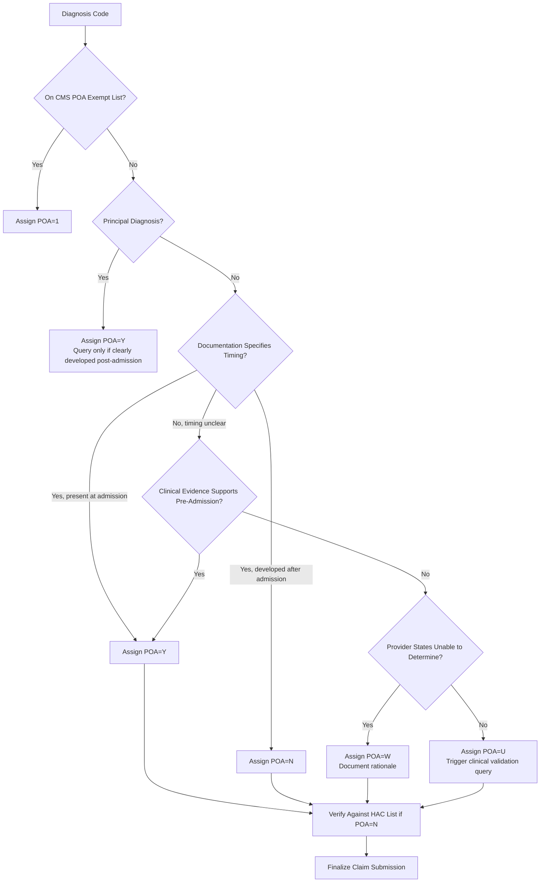

---
tags:
  - poa
  - inpatient-coding
  - cms
  - hac
  - cc-mcc
  - compliance
  - fy2025
  - quick-reference
aliases:
  - Present on Admission Reporting
  - POA Indicator Guidelines
  - HAC POA Logic Reference
  - POA Assignment Cheat Sheet
created: 2025-01-20
updated: 2025-01-20
source: https://www.cms.gov/medicare/coding-billing/present-on-admission-poa-indicator
version: FY 2025 (v42.0)
effective_date: 2024-10-01
expiration_date: 2025-09-30
related_notes:
  - "[[CMS MS-DRG Definitions Manual v42.0]]"
  - "[[ICD-10-CM Official Guidelines FY 2025]]"
  - "[[ADL Data CC/MCC Checklist]]"
---
# 📋 POA Reporting Quick Reference — FY 2025
### POA Reporting Quick Reference
*Present on Admission Indicator Assignment — FY 2025*

> [!INFO] Document Purpose
> This reference provides comprehensive guidance for assigning **Present on Admission (POA) indicators** to diagnosis codes on inpatient claims. POA reporting is required by CMS for all principal and secondary diagnoses to distinguish conditions that develop during hospitalization from those present at admission. Accurate POA assignment directly impacts:  
> • MS-DRG payment (CC/MCC eligibility)  
> • Hospital-Acquired Condition (HAC) payment adjustments  
> • Quality measure reporting (e.g., PSI-90)  
> • Audit defense and compliance  

---

## 🔑 POA Indicator Definitions

### The Five POA Values (CMS Official)
| POA Value | Definition                                                 | When to Use                                                                                             | Payment Impact                                                                            |
| --------- | ---------------------------------------------------------- | ------------------------------------------------------------------------------------------------------- | ----------------------------------------------------------------------------------------- |
| **Y**     | **Yes — Present at the time of inpatient admission**       | Condition documented as existing when patient is formally admitted to the hospital (not ER/observation) | Eligible for CC/MCC payment adjustment if criteria met                                    |
| **N**     | **No — Not present at the time of inpatient admission**    | Condition develops after formal inpatient admission; includes post-procedural complications             | May trigger HAC payment denial if on HAC list; CC/MCC may still apply if not HAC-excluded |
| **U**     | **Unknown — Documentation insufficient to determine**      | Provider documentation does not clarify timing; clinical indicators ambiguous                           | Treated as "N" for payment purposes; query recommended                                    |
| **W**     | **Clinically undetermined — Provider unable to determine** | Provider explicitly states timing cannot be clinically determined after review                          | Treated as "N" for payment; rare; requires provider attestation                           |
| **1**     | **Exempt from POA reporting**                              | Code is on CMS exempt list (e.g., external cause codes, Z codes for circumstances, certain V/Y codes)   | Unaffected by POA logic; no CC/MCC or HAC impact                                          |

> [!WARNING] Critical Distinction  
> **"Admission" = formal inpatient admission order**, NOT emergency department evaluation, observation status, or outpatient encounter. A condition developing in the ED but before inpatient admission = POA=Y. A condition developing after the inpatient order = POA=N.

---

## 🧭 POA Assignment Decision Logic

### Step-by-Step Assignment Workflow
```
1️⃣ IDENTIFY THE DIAGNOSIS
   • Is it the principal diagnosis? → Almost always POA=Y (reason for admission)
   • Is it a secondary diagnosis? → Proceed to step 2

2️⃣ REVIEW DOCUMENTATION FOR TIMING
   • Does H&P, progress note, or discharge summary state "present on admission," "history of," or "developed day X"?
   • Are clinical indicators (labs, imaging, assessments) consistent with pre-admission onset?
   • Does the condition logically relate to the reason for admission?

3️⃣ APPLY POA RULES
   ├─ If documented as existing at inpatient admission → POA=Y
   ├─ If documented as developing after admission → POA=N
   ├─ If timing unclear but clinical evidence suggests pre-admission → POA=Y (default to Y when reasonable)
   ├─ If timing unclear AND no clinical evidence → POA=U (then query)
   └─ If provider states "unable to determine" after review → POA=W (document rationale)

4️⃣ VERIFY EXEMPT STATUS
   • Is code on CMS POA Exempt List? → POA=1
   • Common exempt categories:
     - External cause codes (V00-Y99)
     - Z codes for circumstances (Z00-Z99) when not principal diagnosis
     - Factors influencing health status (Z77-Z99)
     - Certain screening codes (Z12-Z13)

5️⃣ DOCUMENT POA RATIONALE
   • For POA=U/W: Include query response or provider attestation in record
   • For high-risk diagnoses (HAC list): Explicitly document "present on admission" in H&P when applicable
```

### Visual Decision Tree


---

## ⚠️ HAC Interaction: POA=N + HAC List = Payment Denial

### CMS Hospital-Acquired Conditions (HAC) List FY 2025
> [!WARNING] If a diagnosis is **POA=N** AND appears on the HAC list, Medicare will **NOT pay** the higher DRG weight for that CC/MCC. The hospital absorbs the cost.

| HAC Category | Representative ICD-10-CM Codes | POA Assignment Guidance |
|-------------|-------------------------------|------------------------|
| **Stage 3/4 Pressure Ulcers** | [[L89.153]], [[L89.253]], [[L89.309]] | Document staging and location in H&P; if develops during stay, POA=N triggers HAC denial |
| **Catheter-Associated UTI** | [[T83.511A]], [[T83.518A]], [[N39.0]] + [[B96.20]] | Link catheter presence to admission; if CAUTI develops post-insertion, POA=N |
| **Postoperative PE/DVT** | [[I26.99]], [[I82.811]], [[I82.818]] | If VTE develops after surgery and not documented as pre-existing, POA=N = HAC denial |
| **Falls/Trauma in Facility** | [[W00.0XXA]], [[W19.XXXA]] + injury code | Document fall risk assessment on admission; if fall occurs in-hospital, POA=N |
| **Air Embolism** | [[T79.0XXA]] | Rare; if occurs during procedure, POA=N |
| **Blood Incompatibility** | [[T80.410A]], [[T80.418A]] | Transfusion reaction developing post-administration = POA=N |
| **Stage III/IV Intraventricular Hemorrhage in VLBW Infants** | [[P52.01]], [[P52.02]] | Neonatal-specific; timing critical for POA assignment |
| **Foreign Object Retained After Surgery** | [[T81.521A]], [[T81.528A]] | By definition POA=N; triggers HAC review |

> [!TIP] HAC Mitigation Strategy  
> For conditions on the HAC list that are commonly present on admission (e.g., pressure ulcers in long-term care transfers):  
> • Explicitly document "present on admission" in the H&P  
> • Include wound staging/photos in admission assessment  
> • Use POA=Y with clear rationale to avoid automatic HAC denial  

---


> [!example] ## 📋 Common Scenarios: POA Assignment Examples
> 
> ### Scenario 1: Chronic Condition with Acute Exacerbation
> ```markdown
> Patient admitted for acute exacerbation of COPD.
> Documentation: "History of COPD; presents with increased dyspnea, purulent sputum x3 days."
> 
> Diagnoses:
> • [[J44.1]] COPD with acute exacerbation → POA=Y (exacerbation began pre-admission)
> • [[I10]] Essential hypertension → POA=Y (chronic, documented in H&P)
> • [[E11.9]] Type 2 diabetes mellitus → POA=Y (chronic, managed outpatient)
> 
> Rationale: Chronic conditions and their acute exacerbations that prompted admission are POA=Y.
> ```
> 
> ### Scenario 2: Post-Procedural Complication
> ```markdown
> Patient undergoes laparoscopic cholecystectomy on hospital day 2.
> On day 4, develops fever, leukocytosis; CT shows intra-abdominal abscess.
> 
> Diagnoses:
> • [[K80.20]] Calculus of gallbladder without cholecystitis → POA=Y (reason for surgery)
> • [[T81.4XXA]] Infection following procedure, initial encounter → POA=N (developed post-op)
> • [[A41.9]] Sepsis, unspecified organism → POA=N (secondary to post-op infection)
> 
> Payment Impact: 
> • [[T81.4XXA]] is a CC but POA=N; not on HAC list → still eligible for CC payment adjustment
> • [[A41.9]] is an MCC but POA=N; not on HAC list → still eligible for MCC payment adjustment
> ```
> 
> ### Scenario 3: Pressure Ulcer Developed During Stay
> ```markdown
> Patient admitted for stroke rehabilitation.
> Admission skin assessment: intact skin, Braden score 16 (moderate risk).
> Hospital day 7: Stage 3 sacral pressure ulcer noted.
> 
> Diagnoses:
> • [[I69.351]] Hemiplegia following cerebral infarction → POA=Y
> • [[L89.153]] Pressure ulcer of sacral region, stage 3 → POA=N (developed during stay)
> 
> Payment Impact:
> • [[L89.153]] is an MCC AND on HAC list
> • POA=N + HAC list = NO CC/MCC payment adjustment for this diagnosis
> • Hospital absorbs cost of complication
> 
> Documentation Best Practice: 
> • Admission skin assessment with photos/staging prevents ambiguity
> • Daily skin checks with documentation support POA=N assignment
> ```
> 
> ### Scenario 4: Uncertain Timing — Query Required
> ```markdown
> Patient admitted for pneumonia.
> Day 3: Acute kidney injury noted (creatinine rise from 1.0 to 2.4).
> Documentation: "AKI" in progress note; no timing specified.
> 
> Initial Assignment: [[N17.9]] Acute kidney failure, unspecified → POA=U
> 
> Query to Provider:
> "Clinical indicators show creatinine elevation on hospital day 3. 
> Per CMS guidelines, POA assignment requires determination of whether AKI was present at admission or developed during stay. 
> Please clarify: Was acute kidney injury present on admission (POA=Y) or did it develop during hospitalization (POA=N)?"
> 
> Provider Response: "AKI developed secondary to IV contrast administered day 2."
> Final Assignment: [[N17.9]] → POA=N
> 
> Payment Impact: [[N17.9]] is an MCC; POA=N but not on HAC list → still eligible for MCC payment adjustment.
> ```
> 
> ### Scenario 5: Exempt Code Assignment
> ```markdown
> Patient admitted for hip fracture after mechanical fall at home.
> 
> Diagnoses:
> • [[S72.001A]] Fracture of unspecified part of neck of right femur, initial encounter → POA=Y
> • [[W01.0XXA]] Fall on same level from slipping, tripping, stumbling, initial encounter → POA=1 (exempt)
> • [[Y92.010]] Bedroom as place of occurrence → POA=1 (exempt)
> 
> Rationale: External cause codes (V00-Y99) are exempt from POA reporting per CMS guidelines. Assign POA=1 regardless of timing.
> ```
> 

---


> [!info] ## 🎯 Specialty-Specific POA Considerations
> 
> ### PMR / Inpatient Rehabilitation
> ```markdown
> • Comorbidities sequenced in IRF-PAI Item I must have accurate POA to support CMG assignment
> • Complications developing during rehab stay (e.g., pressure ulcers, UTI) = POA=N
> • Document "present on admission" explicitly for conditions impacting functional prognosis
> • POA errors can affect both payment (CMG) and quality metrics (IRF QRP)
> ```
> 
> ### Urology
> ```markdown
> • Post-procedural urinary retention: If develops after catheter removal = POA=N
> • Hematuria: Specify if post-procedural ([[N02.9]]) vs. neoplasm-related ([[C64.9]]) for accurate POA
> • CAUTI ([[T83.511A]]): POA=N by definition if catheter-associated; ensure documentation supports timing
> ```
> 
> ### Otolaryngology
> ```markdown
> • Post-tonsillectomy hemorrhage: Typically POA=N; document timing relative to procedure
> • Airway edema post-op: POA=N if developing after extubation; link to procedure in documentation
> • Aspiration pneumonia ([[J69.0]]): POA=N if occurring during hospitalization; POA=Y if reason for admission
> ```
> 
> ### Ophthalmology (Rare Inpatient Cases)
> ```markdown
> • Endophthalmitis post-cataract surgery: [[H44.001]] + [[T81.4XXA]] → POA=N for both
> • Orbital cellulitis with sepsis: [[H05.011]] may be POA=Y if reason for admission; [[A41.9]] sepsis POA depends on timing
> • Focus POA documentation on systemic complications (sepsis, AKI) rather than ocular diagnosis itself
> ```
> 

---


> [!abstract] ## 🔍 Documentation Requirements for Defensible POA Assignment
> 
> ### What Clinicians Must Document
> ```markdown
> ✅ FOR CONDITIONS PRESENT ON ADMISSION (POA=Y):
> • "History of [condition]" in past medical history section
> • "[Condition] present on admission" or "known prior to admission"
> • Baseline values/labs consistent with chronic condition
> • For exacerbations: "Acute worsening of chronic [condition] beginning [date pre-admission]"
> 
> ✅ FOR CONDITIONS DEVELOPING DURING STAY (POA=N):
> • "[Condition] developed on hospital day X"
> • "New onset [condition] following [procedure/event]"
> • Timeline linking complication to in-hospital intervention
> • Clinical indicators showing change from admission baseline
> 
> ✅ FOR UNCERTAIN TIMING (TRIGGER QUERY):
> • Avoid ambiguous terms: "possible," "rule out," "vs." without clarification
> • If timing truly unclear after review: "Unable to determine if [condition] was present on admission after clinical review" → supports POA=W
> ```
> 

### Red Flag Phrases Requiring Query
| Phrase in Documentation                                | Risk                                | Recommended Query                                                                                |
| ------------------------------------------------------ | ----------------------------------- | ------------------------------------------------------------------------------------------------ |
| **"Rule out sepsis" at discharge**                         | Uncertain diagnosis + uncertain POA | "Was sepsis confirmed? If yes, was it present on admission or developed during stay?"            |
| **"Possible AKI" without timing**                          | POA=U default; may miss MCC         | "Is acute kidney injury confirmed? If yes, what is the onset timing relative to admission?"      |
| **"Post-op infection" without procedure link**             | Ambiguous POA=N assignment          | "Which procedure is associated with this infection? Did it develop after that procedure?"        |
| **"Malnutrition" without severity or timing**              | Missed CC/MCC + unclear POA         | "Does patient meet criteria for moderate or severe malnutrition? Was this present on admission?" |
| **"Pressure ulcer" without stage or admission assessment** | HAC risk + POA ambiguity            | "What is the stage of the pressure ulcer? Was it documented on admission skin assessment?"       |

---


> [!warning] ## ⚙️ POA Logic in MS-DRG Grouper: Technical Details
> 
> ### How POA Affects CC/MCC Eligibility
> ```markdown
> CMS Grouper Logic for Secondary Diagnoses:
> 
> IF diagnosis code is designated as CC or MCC in FY2025 CC/MCC list
> AND POA indicator = Y
> → Diagnosis counts toward CC/MCC stratification → Higher DRG weight
> 
> IF diagnosis code is designated as CC or MCC
> AND POA indicator = N
> AND code is NOT on HAC list
> → Diagnosis STILL counts toward CC/MCC stratification → Higher DRG weight
> 
> IF diagnosis code is designated as CC or MCC
> AND POA indicator = N
> AND code IS on HAC list
> → Diagnosis DOES NOT count toward CC/MCC stratification → Base DRG weight only
> 
> IF POA indicator = U or W
> → Treated as POA=N for payment purposes → Apply HAC logic above
> ```
> 
> ### MCE (Medicare Code Editor) POA Edits
> ```markdown
> Pre-grouper validation rules that reject claims with POA errors:
> 
> ❌ Edit 1: POA indicator missing for non-exempt diagnosis code
> ❌ Edit 2: POA=1 assigned to non-exempt code
> ❌ Edit 3: POA=Y assigned to diagnosis that logically cannot be present on admission (e.g., postprocedural complication without pre-existing condition)
> ❌ Edit 4: POA=N assigned to principal diagnosis (rare; only if principal dx clearly developed post-admission)
> ❌ Edit 5: Inconsistent POA across related codes (e.g., sepsis POA=Y but source infection POA=N without rationale)
> 
> Resolution: Correct POA assignment or provide clinical justification in claim notes.
> ```
> 

---

## 📊 POA Assignment Quick Reference Table

| Diagnosis Category                          | Typical POA | Documentation Tip                                              | HAC Risk?            |
| ------------------------------------------- | ----------- | -------------------------------------------------------------- | -------------------- |
| **Chronic conditions (HTN, DM, CKD)**       | Y           | Document in H&P as "history of" or "managed outpatient"        | No                   |
| **Acute exacerbation of chronic condition** | Y           | Specify exacerbation began pre-admission                       | No                   |
| **Reason for admission (principal dx)**     | Y           | Query only if clearly developed post-admission                 | No                   |
| **Post-procedural infection**               | N           | Link to specific procedure; document day of onset              | Yes (if on HAC list) |
| **Post-op hemorrhage**                      | N           | Quantify blood loss; document intervention required            | No                   |
| **Hospital-acquired pneumonia**             | N           | Distinguish from community-acquired; document timing           | No                   |
| **Pressure ulcer stage 3/4**                | Y or N      | Stage and document on admission assessment                     | Yes (if POA=N)       |
| **CAUTI**                                   | N           | Document catheter insertion date and symptom onset             | Yes                  |
| **Post-op PE/DVT**                          | N           | Document pre-op VTE risk assessment and prophylaxis            | Yes                  |
| **Delirium post-op**                        | N           | Link to anesthesia/surgery; document pre-op cognitive baseline | No                   |
| **Acute kidney injury**                     | Y or N      | Compare admission creatinine to peak; document cause           | No                   |
| **Malnutrition**                            | Y or N      | Document severity and whether present pre-admission            | No                   |
| **External cause codes (falls, MVA)**       | 1 (exempt)  | Assign POA=1 regardless of timing                              | No                   |
| **Z codes for circumstances**               | 1 (exempt)  | Assign POA=1 when not principal diagnosis                      | No                   |

---


> [!example] ## 🔄 Query Templates: POA-Specific Language
> 
> ### Template 1: Uncertain Timing
> ```markdown
> Subject: POA Clarification — [Condition] — [MRN]
> 
> Clinical Context:
> • Admission date: [date]
> • Condition first documented: [date/note]
> • Relevant clinical indicators: [labs/imaging/assessments]
> 
> Coding Requirement:
> Per CMS guidelines, POA indicator assignment requires determination of whether [condition] was present at the time of formal inpatient admission or developed subsequently.
> 
> Request:
> Please clarify the timing of [condition]:
> ☐ Present on admission (POA=Y)
> ☐ Developed during hospitalization (POA=N)
> ☐ Unable to determine after clinical review (POA=W) — if selected, please briefly document rationale
> 
> Provider Response: _________________________  
> Signature/Date: _________________________
> ```
> 
> ### Template 2: HAC-Prone Condition
> ```markdown
> Subject: POA Documentation — [HAC-Listed Condition] — [MRN]
> 
> Clinical Context:
> • [Condition] documented on [date]
> • Admission assessment on [date]: [findings]
> • CMS HAC List Impact: If POA=N, this diagnosis will not receive CC/MCC payment adjustment
> 
> Documentation Guidance:
> For conditions on the CMS HAC list, explicit documentation of "present on admission" in the history and physical supports accurate POA=Y assignment and payment integrity.
> 
> Request:
> If [condition] was present at the time of inpatient admission, please add "present on admission" to the diagnostic statement in the discharge summary.
> 
> Provider Response: _________________________  
> Signature/Date: _________________________
> ```
> 
> ### Template 3: Post-Procedural Complication
> ```markdown
> Subject: POA Assignment — Post-[Procedure] Complication — [MRN]
> 
> Clinical Context:
> • Procedure performed: [procedure name] on [date]
> • Complication documented: [condition] on [date]
> • Clinical indicators: [findings supporting complication]
> 
> Coding Guidance:
> Complications developing after a procedure are assigned POA=N. Accurate POA assignment ensures appropriate DRG grouping and compliance with HAC payment rules.
> 
> Confirmation:
> Based on documentation, [condition] developed after [procedure] and is assigned POA=N. Please confirm this aligns with your clinical assessment or provide alternative timing.
> 
> Provider Response: _________________________  
> Signature/Date: _________________________
> ```
> 

---

## ⚠️ Compliance Risks & Audit Defense

### Top POA-Related Audit Findings
| Finding                                                | Consequence                              | Prevention Strategy                                                 |
| ------------------------------------------------------ | ---------------------------------------- | ------------------------------------------------------------------- |
| **POA=Y assigned to clearly post-admission condition** | Overpayment recoupment + penalties       | Train clinicians on POA definitions; implement pre-bill POA review  |
| **POA=U overuse without query follow-up**              | Systemic underpayment + compliance risk  | Set query response SLA; track U/W rates by provider                 |
| **HAC-listed condition POA=N without documentation**   | Payment denial + quality metric impact   | Document "present on admission" explicitly for high-risk conditions |
| **Inconsistent POA across related diagnoses**          | Grouper logic errors + DRG misassignment | Review code clusters (e.g., sepsis + source) for POA consistency    |
| **POA=1 assigned to non-exempt codes**                 | MCE rejection + claim delay              | Maintain internal exempt code list; update encoder annually         |

### Audit Defense Checklist
```markdown
✅ Retain all clinical validation queries and provider responses in medical record
✅ Document rationale for POA=W assignments (provider attestation)
✅ Maintain admission assessment documentation for HAC-prone conditions
✅ Conduct periodic internal audits focusing on:
   • High-dollar DRGs with CC/MCC
   • Conditions on HAC list
   • Providers with high POA=U/W rates
✅ Update POA policies annually with CMS guidance changes
✅ Train new clinicians on POA requirements during onboarding
```

---

## 🔗 Integration with Your Obsidian Vault

### Recommended Wikilinks to Billable Codes Only
When referencing diagnoses in your notes, wikilink only reportable ICD-10-CM codes:
- ✅ `[[A41.9]]` for sepsis
- ✅ `[[J96.00]]` for acute respiratory failure
- ✅ `[[N17.9]]` for acute kidney failure
- ✅ `[[L89.153]]` for stage 3 sacral pressure ulcer
- ✅ `[[T81.4XXA]]` for postprocedural infection
- ❌ Do NOT wikilink non-billable concepts: MCC, CC, POA, HAC, DRG, MDC, etc.

### Cross-Reference These Vault Notes
- `[[CMS MS-DRG Definitions Manual v42.0]]` — Grouper logic and CC/MCC rules
- `[[ICD-10-CM Official Guidelines FY 2025]]` — Section III (additional diagnoses) and Appendix I (POA guidelines)
- `[[ADL Data CC/MCC Checklist]]` — Quick lookup of CC/MCC designation and documentation requirements
- `[[Clinical Validation Query Templates]]` — Standardized language for POA clarification queries

### Callout Styles for Visual Scanning
```markdown
> [!INFO] General guidance or definitions
> [!TIP] Practical workflow advice  
> [!WARNING] Compliance risks or common errors
> [!QUERY] When to trigger a clinical validation query
> [!EXAMPLE] Concrete scenario with correct POA assignment
> [!ABSTRACT] Bottom-line summary for quick review
```

---

## 📚 Official Resources

| Resource                            | Link                                                                                                                                      | Purpose                                                        |
| ----------------------------------- | ----------------------------------------------------------------------------------------------------------------------------------------- | -------------------------------------------------------------- |
| **CMS POA Indicator Guidelines**        | [cms.gov/poa](https://www.cms.gov/medicare/coding-billing/present-on-admission-poa-indicator)                                             | Official definitions, exempt code list, reporting instructions |
| **FY 2025 HAC List**                    | [cms.gov/hac](https://www.cms.gov/medicare/medicare-fee-for-service-payment/hospitalacquiredconditions/hospital-acquired_conditions_list) | Conditions excluded from CC/MCC payment if POA=N               |
| **ICD-10-CM POA Exempt Codes List**     | [CMS Download](https://www.cms.gov/files/document/fy-2025-poa-exempt-list.pdf)                                                            | Full list of codes assigned POA=1                              |
| **Medicare Code Editor Specifications** | [cms.gov/mce](https://www.cms.gov/medicare/coding-billing/medicare-code-editor-mce)                                                       | Pre-grouper validation rules including POA edits               |
| **AHA Coding Clinic POA Guidance**      | [ahacentraloffice.org](https://www.ahacentraloffice.org/)                                                                                 | Official advice for complex POA scenarios                      |

---


> [!success] ## 🎯 Quick Reference: POA Assignment Rules Summary
> 
> ```
> ✅ ALWAYS POA=Y:
> • Principal diagnosis (unless clearly developed post-admission)
> • Chronic conditions documented in H&P
> • Acute exacerbations that prompted admission
> • Conditions with clinical evidence of pre-admission onset
> 
> ✅ ALWAYS POA=N:
> • Post-procedural complications (infection, hemorrhage, dehiscence)
> • Conditions developing after inpatient admission order
> • Hospital-acquired infections (HAP, CAUTI, CLABSI)
> • In-hospital falls with injury
> 
> ✅ ALWAYS POA=1 (Exempt):
> • External cause codes (V00-Y99)
> • Z codes for circumstances when not principal diagnosis
> • Factors influencing health status (Z77-Z99)
> • Screening codes (Z12-Z13)
> 
> ✅ QUERY FOR CLARIFICATION:
> • Timing ambiguous in documentation
> • Severity unspecified when CC/MCC depends on it
> • Relationship between conditions unclear
> • Provider uses "rule out," "possible," or "vs." at discharge
> 
> ✅ DOCUMENT DEFENSIBLY:
> • Explicitly state "present on admission" for HAC-listed conditions
> • Link complications to procedures with timing
> • Retain query responses in medical record
> • Update POA assignments based on provider clarification
> ```
> 

---

> [!ABSTRACT] Bottom Line  
> POA reporting is a **documentation-driven compliance requirement** with direct payment impact. Accurate assignment requires:  
> 1️⃣ Understanding the five POA values and their payment consequences  
> 2️⃣ Reviewing clinical documentation for timing evidence  
> 3️⃣ Applying HAC logic when POA=N  
> 4️⃣ Querying proactively when timing is ambiguous  
>  
> When clinicians document timing explicitly and coders apply CMS rules consistently, POA assignment supports both payment integrity and quality measurement.

---
*Last synced: $(date)*  
*Next review: FY 2026 IPPS Final Rule (expected August 2025)*  
*Vault Status: ✅ Integrated with [[CMS MS-DRG Definitions Manual v42.0]] and [[ADL Data CC/MCC Checklist]]*
