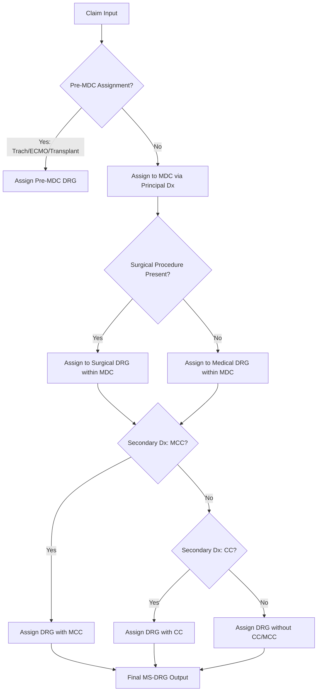

---
aliases:
  - MS-DRG v42
  - Medicare Severity DRG Manual
  - CMS GROUPER Logic v42
tags:
  - ms-drg
  - cms
  - inpatient-coding
  - grouper-logic
  - fy2025
  - reference
created: 2025-01-20
updated: 2025-01-20
source: "https://www.cms.gov/medicare/payment/prospective-payment-systems/acute-inpatient-pps/ms-drg-classifications-and-software"
version: "42.0"
effective_date: "2024-10-01"
expiration_date: "2025-09-30"
---

# CMS MS-DRG Definitions Manual v42.0 — FY 2025
*Medicare Severity Diagnosis Related Group Grouper Logic*

> [!INFO] Document Scope
> This manual defines the logic used by the CMS MS-DRG Grouper software to assign inpatient hospital claims to Medicare Severity Diagnosis Related Groups (MS-DRGs) for payment under the Inpatient Prospective Payment System (IPPS). 

---

## 🔑 Core Components

### 1. MS-DRG Structure Overview
```
Total MS-DRGs in v42.0: 775 [[1]]
├── Medical DRGs (designated "M")
├── Surgical DRGs (designated "P") 
└── Subdivisions by:
    ├── MCC (Major Complication/Comorbidity)
    ├── CC (Complication/Comorbidity)  
    └── Without CC/MCC
```

### 2. MDC (Major Diagnostic Category) Framework
| MDC | Body System/Condition | DRG Range |
|-----|----------------------|-----------|
| 01 | Diseases & Disorders of the Nervous System | 020-042 |
| 02 | Diseases & Disorders of the Eye | 113-125 |
| 03 | Diseases & Disorders of the Ear, Nose, Mouth & Throat | 126-159 |
| 04 | Diseases & Disorders of the Respiratory System | 163-208 |
| 05 | Diseases & Disorders of the Circulatory System | 209-317 |
| 06 | Diseases & Disorders of the Digestive System | 326-446 |
| 07 | Diseases & Disorders of the Hepatobiliary System & Pancreas | 447-456 |
| 08 | Diseases & Disorders of the Musculoskeletal System & Connective Tissue | 457-516 |
| 09 | Diseases & Disorders of the Skin, Subcutaneous Tissue & Breast | 517-535 |
| 10 | Endocrine, Nutritional & Metabolic Diseases & Disorders | 536-643 |
| 11 | Diseases & Disorders of the Kidney & Urinary Tract | 650-707 |
| 12 | Diseases & Disorders of the Male Reproductive System | 708-714 |
| 13 | Diseases & Disorders of the Female Reproductive System | 715-761 |
| 14 | Pregnancy, Childbirth & the Puerperium | 765-800 |
| 15 | Newborns & Other Neonates | 789-799 |
| 16 | Diseases & Disorders of Blood, Blood Forming Organs & Immunologic Disorders | 800-808 |
| 17 | Myeloproliferative Diseases & Disorders, Poorly Differentiated Neoplasms | 809-829 |
| 18 | Infectious & Parasitic Diseases | 830-849 |
| 19 | Mental Diseases & Disorders | 870-887 |
| 20 | Alcohol/Drug Use or Induced Mental Disorders | 888-897 |
| 21 | Injuries, Poisonings & Toxic Effects of Drugs | 898-909 |
| 22 | Burns | 910-923 |
| 23 | Factors Influencing Health Status & Other Contacts with Health Services | 927-947 |
| 24 | Multiple Significant Trauma | 948-951 |
| 25 | HIV Infections | 955-959 |
| PRE-MDC | Pre-MDC Assignments (e.g., tracheostomy, ECMO, transplant) | 001-019 |

---

## ⚙️ Grouper Logic Flow



---

## 📋 CC/MCC Designation Rules

### Definition Framework 
| Designation | Definition | Impact |
|-------------|-----------|--------|
| **MCC** | Major Complication/Comorbidity: Represents end-of-life, organ failure, advanced systemic decompensation, or conditions requiring ICU-level care | Highest payment weight; typically adds $8K-$20K reimbursement |
| **CC** | Complication/Comorbidity: Chronic illness with exacerbation risk, post-procedure impact, or conditions requiring increased nursing/monitoring | Moderate payment weight; typically adds $3K-$8K reimbursement |
| **Non-CC** | Conditions not meeting CC/MCC criteria or not present on admission | No additional payment adjustment |

### The Nine Guiding Principles for CC/MCC Analysis 
1. Represents end-of-life/near death or advanced systemic decompensation
2. Denotes organ system instability or failure
3. Involves chronic illness with susceptibility to exacerbations
4. Serves as marker for advanced disease across multiple comorbidities
5. Reflects systemic impact
6. Postoperative/post-procedure condition impacting recovery
7. Requires higher level of care (ICU, intensive monitoring, extended LOS)
8. Impedes patient cooperation or care management
9. Recent change in best practice affecting resource use

### FY 2025 CC/MCC List Updates 
```diff
+ ADDED TO MCC LIST (4 codes):
+ T36-T50 poisoning codes with specific intent + complication
+ Selected sepsis codes with organ dysfunction specificity

+ ADDED TO CC LIST (29 codes):
+ Expanded CKD staging codes
+ Additional malnutrition severity codes  
+ New respiratory failure subtypes
+ Selected post-procedural complication codes

- DELETED FROM CC/MCC LISTS:
- Codes merged into combination codes
- Obsolete terminology updates
```

> [!TIP] CC/MCC Query Trigger
> When documentation states a condition but lacks severity specificity (e.g., "malnutrition" without "severe/moderate"), query the provider. CC/MCC designation often hinges on explicit severity language.

---

## 🧩 Key Logic Tables (Reference)

### POA (Present on Admission) Indicator Rules
| POA Value | Meaning | CC/MCC Impact |
|-----------|---------|--------------|
| Y | Present at time of inpatient admission | Eligible for CC/MCC if meets criteria |
| N | Not present at admission (developed during stay) | May still qualify if impacts care, but flagged for HAC review |
| U | Documentation insufficient to determine | Treated as "N" for payment purposes |
| W | Clinically undetermined | Provider must clarify; may require query |
| 1 | Exempt from POA reporting | Unaffected by POA logic (e.g., external cause codes) |

### Procedure Code (ICD-10-PCS) OR vs. Non-OR Designation
```
Operating Room (OR) Procedures:
• Require specialized equipment, anesthesia, or surgical suite
• Typically drive assignment to surgical DRGs
• Examples: 0DTJ8ZZ (resection), 0YU64JZ (bypass)

Non-Operating Room (Non-OR) Procedures:
• Performed at bedside, clinic, or minor procedure room
• May still affect DRG if "significant procedure" per CMS logic
• Examples: 3E0U33Z (transfusion), 4A023N6 (dialysis)
```

### MCE (Medicare Code Editor) Edits Applied Pre-Grouper
1. **Diagnosis/Procedure Age/Sex Edits** - Reject biologically implausible codes
2. **POA Logic Edits** - Flag HACs (Hospital-Acquired Conditions) for payment adjustment
3. **Unacceptable Principal Diagnosis Edits** - Prevent symptom codes as principal dx
4. **Procedure/Diagnosis Inconsistency Edits** - Flag clinical mismatches
5. **Multiple Birth/Newborn Edits** - Special logic for obstetric/neonatal claims

> [!WARNING] MCE Edits Are Mandatory
> Claims failing MCE edits are rejected pre-payment. Always run claims through MCE logic before submission.

---

## 🔄 FY 2025 Notable DRG Changes 

### New DRGs Created
| DRG | Title | MDC | Clinical Rationale |
|-----|-------|-----|-------------------|
| 317 | Concomitant Left Atrial Appendage Closure and Cardiac Ablation | 05 | Recognize resource intensity of combined structural heart procedures |
| 426-428 | Multiple Level Significant Trauma with MCC/CC/without | PRE-MDC | Better stratify polytrauma cases previously grouped broadly |

### DRGs Deleted
| DRG | Title | Reason for Deletion |
|-----|-------|---------------------|
| 453 | Combined Anterior/Posterior Spinal Fusion w/ MCC | Merged into revised spinal fusion DRGs |
| 454 | Combined Anterior/Posterior Spinal Fusion w/ CC | Consolidated for clinical coherence |
| 455 | Combined Anterior/Posterior Spinal Fusion w/o CC/MCC | Streamlined spinal procedure logic |

### Title/Logic Modifications
- **DRG 276**: Renamed to *"Cardiac Defibrillator Implant with MCC or Carotid Sinus Neurostimulator"* to include BAROSTIM™ system cases 
- **Cardiac Ablation Codes**: Refined list of ICD-10-PCS codes mapping to ablation DRGs for precision
- **LAAC Procedure Codes**: Added 9 new ICD-10-PCS codes for left atrial appendage closure procedures

---

## 📥 Using the Manual: Practical Workflow

### Step 1: Verify Principal Diagnosis Assignment
```markdown
✅ Does the principal dx represent the condition established *after study* as chiefly responsible for admission? 
✅ Is it sequenced per UHDDS guidelines?
✅ Does it map to a valid MDC?
```

### Step 2: Identify Surgical Procedures
```markdown
✅ Are any ICD-10-PCS procedures reported?
✅ Are they designated OR or Non-OR per CMS logic?
✅ Do they trigger Pre-MDC assignment (e.g., tracheostomy, ECMO)?
```

### Step 3: Evaluate Secondary Diagnoses for CC/MCC
```markdown
✅ Does each secondary dx meet clinical significance criteria?
✅ Is severity explicitly documented (e.g., "acute," "severe," "with organ dysfunction")?
✅ Is POA status correctly assigned (Y/N/U/W)?
✅ Does the dx appear on the official CC/MCC list for FY 2025?
```

### Step 4: Run Through Grouper Logic
```markdown
✅ Input codes into MS-DRG Grouper v42.0 software or validated encoder
✅ Review MCE edit warnings and resolve before submission
✅ Confirm final DRG assignment aligns with clinical picture
```

---

## 🔗 Related Vault Notes
- [[ICD-10-CM Official Guidelines FY 2025]]
- [[CC-MCC Reference List FY2025]]
- [[POA Reporting Guidelines]]
- [[MCE Edit Resolution Checklist]]
- [[Query Writing Templates for Clinical Validation]]

---

## 📚 Official Resources
- [CMS MS-DRG Classifications Portal](https://www.cms.gov/medicare/payment/prospective-payment-systems/acute-inpatient-pps/ms-drg-classifications-and-software) [
- [ICD-10 MS-DRG v42.0 Definitions Manual (Full Text)](https://www.cms.gov/icd10m/FY2025-NPRM-Version42-fullcode-cms) 
- [FY 2025 IPPS Final Rule (CMS-1808-F)](https://www.federalregister.gov/documents/2024/08/16/2024-17780/medicare-program-hospital-inpatient-prospective-payment-systems)
- [CC/MCC Master Lists FY 2025](https://www.cms.gov/files/document/fy-2025-cc-mcc-lists.xlsx) 

> [!ABSTRACT] Bottom Line
> The MS-DRG Definitions Manual v42.0 is the *source of truth* for inpatient payment logic. Mastery requires understanding: (1) MDC assignment via principal diagnosis, (2) surgical vs. medical DRG branching, (3) CC/MCC stratification rules, and (4) MCE pre-processing edits. Always validate against the official CMS software or a CMS-certified encoder.

---
*Last synced: $(date)*  
*Next review: FY 2026 IPPS Proposed Rule (expected July 2025)*

