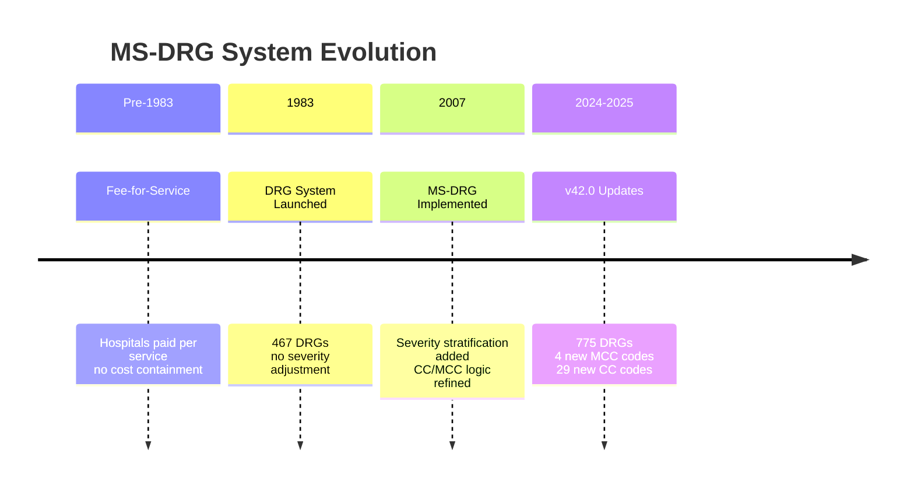
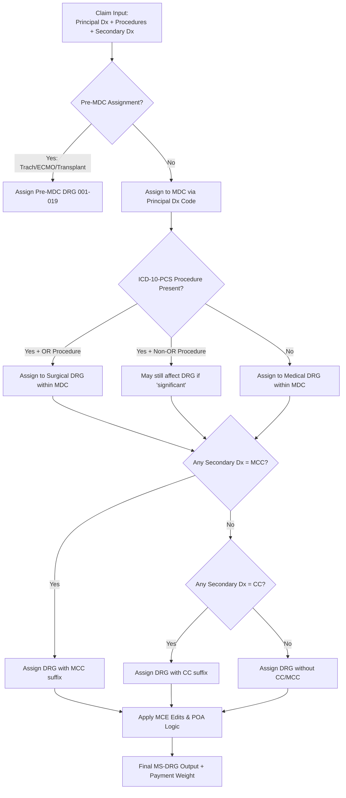
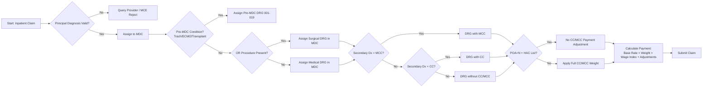

---
tags:
  - ms-drg
  - inpatient-coding
  - cms
  - ipps
  - payment-system
  - grouper-logic
  - fy2025
  - reference
aliases:
  - Medicare Severity DRG
  - MS-DRG Grouper Logic
  - Inpatient Payment System Overview
  - IPPS DRG Framework
created: 2025-01-20
updated: 2025-01-20
source: https://www.cms.gov/medicare/payment/prospective-payment-systems/acute-inpatient-pps
version: v42.0 (FY 2025)
effective_date: 2024-10-01
expiration_date: 2025-09-30
related_notes:
  - "CMS MS-DRG Definitions Manual v42.0"
  - "ICD-10-CM Official Guidelines FY 2025"
  - "ADL Data CC/MCC Checklist"
  - "POA Reporting Quick Reference"
---
# 🏥 MS-DRG System: Complete Overview — FY 2025
### MS-DRG System: Complete Overview
*Medicare Severity Diagnosis Related Groups — FY 2025 (v42.0)*

> [!INFO] Executive Summary
> The **Medicare Severity Diagnosis Related Group (MS-DRG)** system is the classification methodology used by CMS to determine payment for inpatient hospital services under the **Inpatient Prospective Payment System (IPPS)**.  
> • **Total MS-DRGs in v42.0**: 775 [1]  
> • **Payment basis**: Fixed rate per discharge, adjusted for severity (CC/MCC), geography, and hospital characteristics  
> • **Core logic**: Principal diagnosis → MDC → Surgical/Medical branch → CC/MCC stratification → Final DRG  
> • **Effective**: October 1, 2024 - September 30, 2025 [2]

---

## 📚 Historical Context: From DRG to MS-DRG

### Evolution Timeline


### Why MS-DRG Replaced Original DRGs
| Issue with Original DRGs | MS-DRG Solution |
|-------------------------|-----------------|
| No distinction between mild and severe cases | Stratifies each DRG into: **with MCC**, **with CC**, **without CC/MCC** |
| Underpayment for complex patients | Higher payment weights for MCCs reflect resource intensity |
| Overpayment for simple cases | Lower weights for "without CC/MCC" prevent windfalls |
| Limited clinical granularity | Expanded code set (74,044 ICD-10-CM codes in FY2025)  |

> [!TIP] Key Concept  
> **MS-DRG = Medicare Severity**. The "MS" prefix denotes that payment is adjusted for patient severity via CC/MCC designation—not just the principal diagnosis.

---

## 🔑 Core Components of the MS-DRG System

### 1. MDC (Major Diagnostic Category) Framework
```
25 Major Diagnostic Categories (MDCs) organize DRGs by body system or condition type:

PRE-MDC (001-019)  : Tracheostomy, ECMO, transplant, multiple significant trauma
MDC 01 (020-042)   : Nervous System
MDC 02 (113-125)   : Eye Disorders
MDC 03 (126-159)   : Ear, Nose, Mouth & Throat
MDC 04 (163-208)   : Respiratory System
MDC 05 (209-317)   : Circulatory System
MDC 06 (326-446)   : Digestive System
MDC 07 (447-456)   : Hepatobiliary System & Pancreas
MDC 08 (457-516)   : Musculoskeletal System & Connective Tissue
MDC 09 (517-535)   : Skin, Subcutaneous Tissue & Breast
MDC 10 (536-643)   : Endocrine, Nutritional & Metabolic
MDC 11 (650-707)   : Kidney & Urinary Tract
MDC 12 (708-714)   : Male Reproductive System
MDC 13 (715-761)   : Female Reproductive System
MDC 14 (765-800)   : Pregnancy, Childbirth & Puerperium
MDC 15 (789-799)   : Newborns & Other Neonates
MDC 16 (800-808)   : Blood, Blood Forming Organs & Immunologic Disorders
MDC 17 (809-829)   : Myeloproliferative Diseases & Poorly Differentiated Neoplasms
MDC 18 (830-849)   : Infectious & Parasitic Diseases
MDC 19 (870-887)   : Mental Diseases & Disorders
MDC 20 (888-897)   : Alcohol/Drug Use or Induced Mental Disorders
MDC 21 (898-909)   : Injuries, Poisonings & Toxic Effects of Drugs
MDC 22 (910-923)   : Burns
MDC 23 (927-947)   : Factors Influencing Health Status (Z codes)
MDC 24 (948-951)   : Multiple Significant Trauma
MDC 25 (955-959)   : HIV Infections
```

### 2. CC/MCC Severity Stratification
```
Each MS-DRG may have up to 3 severity levels:

┌─────────────────────────────────┐
│ DRG XXX: [Procedure/Condition]  │
├─────────────────────────────────┤
│ XXX-A: WITH MCC  ← Highest payment weight │
│ XXX-B: WITH CC   ← Moderate payment weight │
│ XXX-C: WITHOUT CC/MCC ← Base payment weight │
└─────────────────────────────────┘

• MCC = Major Complication/Comorbidity (end-of-life, organ failure, ICU-level care)
• CC = Complication/Comorbidity (chronic illness exacerbation, post-procedure impact)
• Non-CC = Conditions not meeting severity criteria or not POA
```

> [!WARNING] Critical Rule  
> A secondary diagnosis qualifies as CC/MCC **only if**:  
> 1. It is documented by the provider as a diagnosis (not just a symptom)  
> 2. It affects patient care (evaluation, treatment, diagnostics, LOS, nursing)  
> 3. It is present on admission (POA=Y) OR, if POA=N, is not on the HAC exclusion list [[6]]

### 3. Grouper Logic Workflow


---

## 💰 Payment Calculation Methodology

> [!info] ### Base Formula
>
> ```
> Payment = [Base Rate × DRG Weight × Wage Index] + Adjustments
> 
> Where:
> • Base Rate FY2025: $6,785.92 (national operating standard) [[42]]
> • DRG Weight: Relative resource intensity (e.g., DRG 291 w/ MCC = 3.8421)
> • Wage Index: Geographic labor cost adjustment (varies by hospital CBSA)
> • Adjustments: DSH, IME, new technology add-on, outlier payments
> ```
> 


> [!example] ### Example Calculation: DRG 291 (Heart Failure with MCC)
> 
> ```markdown
> Scenario: Urban teaching hospital in NYC (Wage Index = 1.3852)
> 
> Step 1: Base Payment
> $6,785.92 × 3.8421 (DRG weight) = $26,072.47
> 
> Step 2: Apply Wage Index
> $26,072.47 × 1.3852 = $36,115.58
> 
> Step 3: Add Adjustments
> • IME (Graduate Medical Education): +5.5% = +$1,986.36
> • DSH (Disproportionate Share): +8.2% = +$2,961.48
> • Outlier (if LOS > geometric mean): Variable
> 
> Step 4: Total Estimated Payment
> ≈ $41,063.42 + outlier (if applicable)
> 
> Compare to DRG 293 (Heart Failure WITHOUT CC/MCC):
> Weight = 0.8795 → Base payment ≈ $9,380 before adjustments
> → MCC adds ~$31,683 in this example
> ```

> [!TIP] Payment Impact Insight  
> Adding a single MCC can increase reimbursement by **$5,000-$20,000+** depending on the base DRG and hospital adjustments. This is why clinical validation and precise documentation are financially critical.

---

## 📋 Key Terminology & Definitions

| Term | Definition | Coding Implication |
|------|-----------|-------------------|
| **Principal Diagnosis** | Condition established *after study* as chiefly responsible for admission  | Must map to valid MDC; drives initial DRG branching |
| **Other Diagnoses** | Conditions coexisting at admission or developing subsequently that affect care  | Must meet clinical significance criteria to qualify as CC/MCC |
| **CC (Complication/Comorbidity)** | Secondary diagnosis that increases LOS by ≥1 day or requires additional resources  | Moderate payment weight increase |
| **MCC (Major CC)** | Secondary diagnosis representing organ failure, end-of-life, or ICU-level care  | Highest payment weight increase |
| **POA (Present on Admission)** | Indicator (Y/N/U/W/1) denoting whether condition existed at inpatient admission | POA=N + HAC list = no CC/MCC payment adjustment |
| **HAC (Hospital-Acquired Condition)** | Preventable complication CMS will not pay extra for if POA=N  | Stage 3/4 pressure ulcers, CAUTI, post-op PE/DVT, etc. |
| **OR vs. Non-OR Procedure** | CMS designation determining if procedure drives surgical DRG assignment  | Only OR procedures typically trigger surgical DRG branching |
| **MCE (Medicare Code Editor)** | Pre-grouper software that validates codes, POA, age/sex edits  | Claims failing MCE edits are rejected pre-payment |
| **Geometric Mean LOS** | Statistical midpoint of length of stay for each DRG  | Used to calculate outlier payments for exceptionally long stays |

---

> [!danger] ## 🔄 Practical Coding Workflow: Step-by-Step
> 
> 
> ### Phase 1: Pre-Admission & Admission
> ```markdown
> ✅ Verify principal diagnosis reflects reason for admission after study
> ✅ Document all comorbidities impacting care in H&P
> ✅ Assign POA indicators at time of documentation (Y/N/U/W)
> ✅ Query early if diagnosis lacks specificity (severity, laterality, relationship)
> ```
> 
> ### Phase 2: During Stay
> ```markdown
> ✅ Track new diagnoses/complications with clear POA=N documentation
> ✅ Link complications to procedures when clinically appropriate
> ✅ Document clinical criteria supporting CC/MCC designations:
>    • Labs/imaging for organ dysfunction
>    • Interventions requiring additional resources
>    • Extended monitoring or nursing care
> ✅ Update problem list with active vs. historical status
> ```
> 
> ### Phase 3: Discharge & Coding
> ```markdown
> ✅ Sequence diagnoses per UHDDS guidelines:
>    1. Principal diagnosis (reason for admission)
>    2. Secondary diagnoses affecting care (CC/MCC candidates first)
> ✅ Verify ICD-10-CM codes meet specificity requirements:
>    • Laterality digits (1=right, 2=left, 3=bilateral, 9=unspecified)
>    • 7th characters for injuries/procedures (A=initial, D=subsequent, S=sequela)
>    • Combination codes (e.g., diabetes + manifestation)
> ✅ Run claim through MCE logic or encoder software
> ✅ Confirm final MS-DRG aligns with clinical picture
> ✅ Submit with all required POA indicators
> ```
> 
> ### Phase 4: Post-Submission
> ```markdown
> ✅ Monitor for RAC/MAC audits focusing on:
>    • Clinical validation of CC/MCC diagnoses
>    • POA accuracy for HAC-listed conditions
>    • Principal diagnosis sequencing appropriateness
> ✅ Track query response rates and documentation improvement opportunities
> ✅ Update internal coding guidelines based on audit feedback
> ```
> 

> [!QUERY TEMPLATE] Clinical Validation Query
> ```
> Subject: Clinical Validation — [Condition] — [MRN]
> 
> Clinical Indicators:
> • [Relevant labs/imaging/assessments]
> • [Provider documentation excerpt]
> 
> Coding Guidance:
> • Per ICD-10-CM Official Guidelines Section I.B.19, code assignment requires provider diagnostic statement.
> • For [condition] to qualify as [CC/MCC], documentation must support [specific criteria].
> 
> Request:
> ☐ Is [condition] confirmed?
> ☐ If yes, is it [acute/chronic/severe/with organ dysfunction]?
> ☐ Is it present on admission (POA=Y) or developed during stay (POA=N)?
> ☐ Is it related to [other condition/procedure]?
> 
> Provider Response: _______________ Signature/Date: _______________
> ```

---

## ⚠️ Common Pitfalls & Best Practices

### Top 10 Coding Errors in MS-DRG Assignment
| Error | Consequence | Prevention Strategy |
|-------|-------------|-------------------|
| **Unspecified principal diagnosis** | MCE rejection or downcoded DRG | Query for specificity before final coding |
| **CC/MCC without clinical support** | Audit recoupment + penalties | Apply the "Nine Guiding Principles" for CC/MCC analysis [[6]] |
| **POA indicator errors** | HAC payment denials | Train clinicians to document "present on admission" explicitly |
| **Sequencing secondary diagnoses incorrectly** | Missed CC/MCC payment impact | Place qualifying CC/MCC diagnoses early in secondary list |
| **Using outdated ICD-10-CM codes** | Claim rejection | Update encoder software annually; verify against CMS code tables |
| **Ignoring MCE edits** | Pre-payment rejection | Run all claims through MCE logic before submission |
| **Coding ruled-out diagnoses as confirmed** | Overpayment risk | Only code uncertain diagnoses as confirmed for inpatient (per guidelines) |
| **Missing laterality/stage specificity** | Downcoded to unspecified | Query providers using specialty-specific templates |
| **Failing to link complications to procedures** | Missed T80-T88 codes | Review operative reports for post-procedural conditions |
| **Overlooking combination codes** | Unbundling denials | Use ICD-10-CM Index to identify required combination codes |

> [!caution] ### Best Practices Checklist
> 
> ```markdown
> ✅ DOCUMENTATION
> • Ensure provider statements are specific: "acute systolic heart failure" not just "HF"
> • Link related conditions: "sepsis due to E. coli UTI" not separate diagnoses
> • Specify severity: "severe malnutrition," "stage 4 CKD," "moderate COPD exacerbation"
> 
> ✅ CODING
> • Always verify Tabular List after Alphabetic Index lookup
> • Apply Excludes1 notes correctly (mutually exclusive conditions)
> • Use combination codes when required (e.g., diabetes + manifestation)
> 
> ✅ COMPLIANCE
> • Query when documentation is ambiguous—not for coder preference
> • Retain query responses in medical record for audit defense
> • Conduct internal audits focusing on high-dollar DRGs and HAC-prone conditions
> 
> ✅ EDUCATION
> • Train clinicians on documentation requirements for CC/MCC capture
> • Share DRG impact examples to illustrate financial/clinical alignment
> • Provide specialty-specific quick references (e.g., [[AAO ICD-10-CM for Ophthalmology]])
> ```

---

## 🆕 FY 2025 MS-DRG Updates (v42.0 Highlights)

### New DRGs Created
| DRG | Title | MDC | Clinical Rationale |
|-----|-------|-----|-------------------|
| 317 | Cardiac Defibrillator Implant with MCC or Carotid Sinus Neurostimulator | 05 | Recognize BAROSTIM™ system cases |
| 426-428 | Multiple Level Significant Trauma with MCC/CC/without | PRE-MDC | Better stratify polytrauma resource use |

### DRGs Deleted
| DRG | Title | Reason |
|-----|-------|--------|
| 453-455 | Combined Anterior/Posterior Spinal Fusion (all severities) | Consolidated into revised spinal fusion DRGs |

### CC/MCC List Changes 
```diff
+ ADDED TO MCC LIST (4 codes):
+ Selected poisoning codes with specific intent + complication
+ Sepsis codes with enhanced organ dysfunction specificity

+ ADDED TO CC LIST (29 codes):
+ Expanded CKD staging codes (N18.31-N18.33)
+ Additional malnutrition severity codes (E44.0 variants)
+ New respiratory failure subtypes (J96.01-J96.02)
+ Selected post-procedural complication codes

- DELETED/REVISED:
+ Codes merged into combination codes per ICD-10-CM updates
+ Obsolete terminology aligned with current clinical practice
```

### Payment Rate Updates 
```
• National Operating Base Rate: $6,785.92 (+2.8% from FY2024)
• Capital Base Rate: $475.93
• Outlier Fixed Loss Threshold: $28,976 (increases outlier eligibility)
• New Technology Add-On Payments: 75 applications approved for FY2025
```

> [!TIP] FY2025 Action Item  
> Update encoder software and internal CC/MCC reference lists by **September 15, 2024** to ensure seamless transition to v42.0 logic on October 1.
---

## 📚 Official Resources & References

| Resource | Link | Purpose |
|----------|------|---------|
| CMS MS-DRG Classifications Portal | [cms.gov/ms-drg](https://www.cms.gov/medicare/payment/prospective-payment-systems/acute-inpatient-pps/ms-drg-classifications-and-software) | Download grouper software, DRG definitions, change logs |
| FY 2025 IPPS Final Rule | [Federal Register](https://www.federalregister.gov/documents/2024/08/16/2024-17780) | Policy rationale, payment rate updates, regulatory changes |
| ICD-10-CM Code Tables FY 2025 | [cms.gov/icd10m](https://www.cms.gov/icd10m/FY2025-Version42-fullcode-cms) | Verify code validity, descriptors, and instructional notes |
| CC/MCC Master Lists (Excel) | [CMS Download](https://www.cms.gov/files/document/fy-2025-cc-mcc-lists.xlsx) | Official designation of every ICD-10-CM code as CC/MCC/Non-CC |
| Medicare Code Editor (MCE) Specifications | [CMS MCE Page](https://www.cms.gov/medicare/coding-billing/medicare-code-editor-mce) | Understand pre-grouper validation rules and edit logic |
| AHA Coding Clinic for ICD-10-CM/PCS | [ahacentraloffice.org](https://www.ahacentraloffice.org/) | Official coding advice for complex or ambiguous scenarios |

---
## 📚 Medical Coding Complications and Comorbidities for ENT, Ophthalmology, Urology, and PM&R

|                                           |                                                        |                                                                                 |                            |                                         |                                                                                               |                                                                                                          |
| ----------------------------------------- | ------------------------------------------------------ | ------------------------------------------------------------------------------- | -------------------------- | --------------------------------------- | --------------------------------------------------------------------------------------------- | -------------------------------------------------------------------------------------------------------- |
| **Medical Specialty**                     | **Procedure or Condition**                             | **Complication/Comorbidity Description**                                        | **ICD-10-PCS or CPT Code** | **Medical Decision Making (MDM) Level** | Morbidity/Mortality Risk Factors                                                              | Management Strategy                                                                                      |
| **Ear, Nose, and Throat (ENT)**               | Endoscopic Endonasal Surgery of the Skull Base (EESSB) | Extensive cavernous sinus invasion during skull base tumor resection.           | 62165-22 or 31299          | High                                    | Technical difficulty; potential for prolonged impairment of bodily function.                  | Intradural resection; dural repair; potential lumbar drain (62272).                                      |
| **Ear, Nose, and Throat (ENT)**               | Epiglottitis                                           | Potential threat to life or bodily function.                                    | Not in source              | High                                    | High risk of morbidity without treatment; threat to life.                                     | Extensive evaluation to identify or rule out highly morbid condition.                                    |
| **Ear, Nose, and Throat (ENT)**               | Malignant otitis externa                               | Osteomyelitis of the skull base; necrotizing infection.                         | H60.20, H60.2              | High                                    | High mortality risk in elderly or immunocompromised patients.                                 | Long-term systemic antibiotic drug therapy monitoring; debridement of necrotic tissue.                   |
| **Ear, Nose, and Throat (ENT)**               | Postprocedural infection/Sepsis                        | Sepsis following a procedure; surgical site infection.                          | T81.44                     | High                                    | Septic shock; acute organ dysfunction.                                                        | Identification of infectious agent (B95-B97); monitoring for acute organ dysfunction.                    |
| **Ear, Nose, and Throat (ENT)**               | Ventilator associated Pneumonia (VAP)                  | Complication from mechanical ventilation in respiratory cases.                  | J95.851                    | High                                    | Risk of respiratory failure (J96).                                                            | Identify infectious organism (e.g., Pseudomonas B96.5); monitoring of ventilator dependence (Z99.12).    |
| **Ear, Nose, and Throat (ENT)**               | Pediatric Adenotonsillectomy                           | Severe Obstructive Sleep Apnea (OSA), asthma, obesity.                          | Not in source              | High                                    | Respiratory depression; ultra-rapid metabolism of codeine (CYP2D6 genotype); post-op hypoxia. | Avoidance of codeine; around-the-clock acetaminophen/ibuprofen; overnight monitoring.                    |
| **Ear, Nose, and Throat (ENT)**               | Trauma Consultation / Facial bone repair               | Broken orbital bones, skull bones; threat to life or bodily function.           | 99223 or 99255             | High                                    | Multiple acute injuries from major trauma.                                                    | CT scans; emergency surgical planning; hospitalization.                                                  |
| **Ear, Nose, and Throat (ENT)**               | Acute mastoiditis                                      | Subperiosteal abscess; empyema of mastoid; intracranial extension.              | H70.09, H70.01, H70.093    | Moderate to High                        | Risk of meningitis, brain abscess, and hearing loss.                                          | Intravenous antimicrobial therapy; surgical drainage (mastoidectomy).                                    |
| **Ear, Nose, and Throat (ENT)**               | Foreign body in nose or respiratory tract              | Asphyxiation; inflammation; obstruction.                                        | T17.0, T17.1               | Moderate to High                        | Threat to life or bodily function due to airway restriction.                                  | Removal of foreign body; diagnostic imaging (CT Head/Neck if trauma suspected).                          |
| **Eye (Ophthalmology)**                       | Proliferative diabetic retinopathy                     | Traction retinal detachment involving the macula.                               | E11.352                    | High                                    | High risk of permanent visual loss or blindness.                                              | Vitreoretinal surgery; long-term glycemic control monitoring; intravitreal injections.                   |
| **Eye (Ophthalmology)**                       | Acute angle-closure glaucoma                           | Acute crisis; glaucomatous optic atrophy.                                       | H40.21                     | High                                    | Irreversible damage to optic nerve within hours.                                              | Emergency surgical intervention (iridotomy); intraocular pressure monitoring.                            |
| **Eye (Ophthalmology)**                       | Corneal transplant (keratoplasty)                      | Full thickness penetrating transplant.                                          | 65730                      | High                                    | Risk of graft rejection or secondary glaucoma.                                                | Penetrating keratoplasty; intensive post-op drug therapy monitoring.                                     |
| **Eye (Ophthalmology)**                       | Glaucoma surgery complications                         | Bleb endophthalmitis (stage 3).                                                 | H59.43                     | High                                    | Severe risk of permanent blindness.                                                           | Intravitreal antibiotic injections and potential vitrectomy.                                             |
| **Eye (Ophthalmology)**                       | Neovascular Age-Related Macular Degeneration (AMD)     | Macular edema; classic subfoveal choroidal neovascular (CNV) lesions.           | 67028                      | High                                    | High risk of morbidity from chronic blinding disease.                                         | Intravitreal injection (Vabysmo); Ocular Photodynamic Therapy (OPT) with verteporfin; FA/OCT monitoring. |
| **Eye (Ophthalmology)**                       | Stevens-Johnson Syndrome (SJS)                         | Symblepharon formation; limbal stem cell deficiency.                            | Not in source              | High                                    | High risk of permanent blindness; acute systemic threat.                                      | Systemic immunosuppressants; Amniotic Membrane Transplantation (AMT); drug therapy monitoring.           |
| **Eye (Ophthalmology)**                       | Retinal detachment                                     | Serous, traction, or rhegmatogenous detachment.                                 | 67101-67113                | High                                    | Potential for permanent loss of vision.                                                       | Surgical repair (cryotherapy, photocoagulation, or vitrectomy).                                          |
| **Eye (Ophthalmology)**                       | Ocular emergencies / Significant eye injury            | Acute illness or injury posing threat to bodily function.                       | Not in source              | High                                    | Significant risk of morbidity; threat to life or bodily function.                             | Extensive evaluation to rule out or treat highly morbid conditions.                                      |
| **Renal/Genitourinary (Urology)**             | Prostatectomy Hemorrhage                               | Postprocedural acute bleeding after prostate surgery.                           | 0V3                        | High                                    | Acute hemorrhage; hemodynamic instability.                                                    | Control: Stopping or attempting to stop postprocedural bleeding.                                         |
| **Renal/Genitourinary (Urology)**             | Renal Failure (End-stage)                              | Completely taking over physiological function via extracorporeal means.         | 5A1D, N18.6                | High                                    | Electrolyte imbalance; fluid overload; mortality risk without filtration.                     | Urinary Performance: Filtration (Hemodialysis); chronic dialysis (Z99.2).                                |
| **Renal/Genitourinary (Urology)**             | Candidal pyelonephritis                                | Candidal sepsis; systemic candidiasis.                                          | B37.49                     | High                                    | Risk of renal failure and life-threatening systemic fungal infection.                         | Systemic antifungal drug monitoring; renal function testing; surgical intervention.                      |
| **Renal/Genitourinary (Urology)**             | Sickle-cell disorder                                   | Priapism.                                                                       | N48.32                     | High                                    | Risk of permanent erectile dysfunction and tissue necrosis.                                   | Aspiration, irrigation, or surgical shunt.                                                               |
| **Renal/Genitourinary (Urology)**             | Radical Nephrectomy                                    | Malignant neoplasm of kidney; MCC impacting MS-DRG (e.g., acute renal failure). | 0TT00ZZ                    | High                                    | Threat to life or bodily function; major surgery with risk factors (advanced age, CAD, CKD).  | Surgical resection; removal of Gerota's fascia; management of comorbidities.                             |
| **Renal/Genitourinary (Urology)**             | Prostate Cancer                                        | Malignant neoplasm of prostate.                                                 | 55873                      | High                                    | High mortality without intervention.                                                          | Cryosurgical ablation of the prostate and PSA monitoring.                                                |
| **Renal/Genitourinary (Urology)**             | Bladder Cancer / Non-functional bladder                | Urinary incontinence unresponsive to treatment.                                 | 0DX80ZB                    | High                                    | Threat to bodily function; requirement for major elective surgery.                            | Neobladder reconstruction (Transfer of small intestine to bladder).                                      |
| **Renal/Genitourinary (Urology)**             | Prostate Biopsy / Benign Prostate Ablation             | Complex conditions requiring emerging technology.                               | 0950T                      | High                                    | Risk of morbidity from intervention.                                                          | High-Intensity Focused Ultrasound (HIFU).                                                                |
| **Renal/Genitourinary (Urology)**             | Testicular torsion                                     | Acute condition posing threat to bodily function.                               | Not in source              | High                                    | Significant risk of morbidity; threat to life or bodily function.                             | Extensive evaluation; surgical intervention.                                                             |
| **Renal/Genitourinary (Urology)**             | Kidney stone with potential complications              | Acute/chronic illness with exacerbation posing threat to life.                  | Not in source              | High                                    | High risk of morbidity without treatment.                                                     | Extensive diagnostic evaluation to rule out highly morbid condition.                                     |
| **Renal/Genitourinary (Urology)**             | Radical Cystectomy                                     | Malnutrition / Low nutrition.                                                   | Not in source              | High                                    | Weight loss > 10%; serum albumin < 30 g/L.                                                    | Nutritional Risk Screening; pre-operative nutritional supplements.                                       |
| **Renal/Genitourinary (Urology)**             | Acute Renal Failure                                    | Acute/chronic illnesses posing threat to life or bodily function.               | Not in source              | High                                    | High risk of morbidity from testing or treatment.                                             | Elective/Emergency major surgery; drug therapy requiring intensive monitoring.                           |
| **Physical Medicine & Rehabilitation (PM&R)** | Amyotrophic lateral sclerosis (ALS)                    | Pseudobulbar affect; respiratory failure.                                       | G12.21, F48.2              | Moderate to High                        | High mortality due to progressive muscle atrophy and respiratory paralysis.                   | Respiratory support; neuromodulatory pharmacotherapy monitoring; palliative care.                        |
| **Physical Medicine & Rehabilitation (PM&R)** | Autonomic dysreflexia                                  | Triggered by fecal impaction or pressure ulcer in spinal cord injury.           | G90.4                      | High                                    | Life-threatening hypertension and potential stroke.                                           | Emergency removal of stimulus and blood pressure management.                                             |
| **Physical Medicine & Rehabilitation (PM&R)** | Spastic quadriplegic cerebral palsy                    | Chronic pain; significant psychosocial dysfunction; joint contractures.         | G80.0                      | High                                    | Total loss of function; respiratory complications.                                            | Physical therapy; intensive care monitoring during exacerbations; multidisciplinary rehab.               |
| **Physical Medicine & Rehabilitation (PM&R)** | Chronic Pain Management / Bladder Dysfunction          | Severe exacerbation or threat to bodily function requiring neurostimulation.    | 0816T-0817T, G3002, G3003  | Moderate to High                        | Morbidity from chronic functional impairment; risk of drug toxicity (e.g., lithium).          | Insertion of integrated neurostimulation system; monthly CPM bundle; drug therapy monitoring.            |
| **Physical Medicine & Rehabilitation (PM&R)** | Spinal cord lesion                                     | Complete vs. incomplete spinal cord lesion.                                     | Not in source              | High                                    | Threat to life or bodily function; risk of permanent disability.                              | Parenteral controlled substances; drug therapy monitoring; rehabilitation therapy.                       |
| **Physical Medicine & Rehabilitation (PM&R)** | Progressive severe rheumatoid arthritis                | Chronic illness with severe exacerbation or progression.                        | Not in source              | High                                    | High risk of morbidity from testing or treatment.                                             | Drug therapy requiring intensive monitoring for toxicity; de-escalation of care.                         |
| **Ear, Nose, and Throat (ENT)**               | Epistaxis (Acute bleeding)                             | Acute bleeding of nasal mucosa and soft tissue; recurrence.                     | 093K, 30901                | Moderate                                | Hemorrhage; potential for airway obstruction.                                                 | Cauterization; packing; drug therapy monitoring.                                                         |
| **Ear, Nose, and Throat (ENT)**               | Cochlear Implant Treatment                             | Communication abilities/impairment; post-surgical rehabilitation needs.         | F0B                        | Moderate to High                        | Surgical recovery; sensory deficit.                                                           | Application of techniques to improve communication abilities.                                            |
| **Ear, Nose, and Throat (ENT)**               | Conductive Hearing Loss                                | Hearing impairment requiring bone conduction fitting.                           | 09HD                       | Moderate                                | Sensory deficit; social isolation.                                                            | Insertion of Hearing Device, Bone Conduction.                                                            |
| **Ear, Nose, and Throat (ENT)**               | Adverse effect of ENT drugs                            | Poisoning or underdosing of ENT-specific drugs.                                 | T49.6                      | Moderate                                | Otitic barotrauma; damage to eardrum.                                                         | Therapeutic drug level monitoring; surgical adjustment of myringotomy device.                            |
| **Ear, Nose, and Throat (ENT)**               | Sinus endoscopy with balloon dilation                  | Chronic rhinosinusitis with polyposis.                                          | 31295-31297                | Moderate                                | Persistent inflammation; structural obstruction.                                              | Surgical intervention (dilation); postoperative debridement (31237).                                     |
| **Ear, Nose, and Throat (ENT)**               | Cochlear Implantation                                  | Bacterial Meningitis risk (Streptococcus pneumoniae).                           | 69930                      | Moderate                                | Inner ear anatomic abnormalities.                                                             | Pneumococcal vaccination at least two weeks before surgery.                                              |
| **Ear, Nose, and Throat (ENT)**               | Polysomnography (PSG)                                  | Obstructive Sleep Apnea (OSA) in children.                                      | 95782, 95783               | Moderate                                | Neuromotor disease; Down's syndrome; obesity; young age (<6 years).                           | Sleep testing to determine surgical necessity for tonsillectomy.                                         |
| **Ear, Nose, and Throat (ENT)**               | Post-operative nasal endoscopy                         | Complications following nasal/sinus surgery.                                    | 31237                      | Moderate                                | Risk of surgical site adhesion or retained debris.                                            | Debridement (limited to 3 units within six weeks post-surgery).                                          |
| **Ear, Nose, and Throat (ENT)**               | Tympanostomy (In-office)                               | Requires innovative delivery device and anesthesia.                             | G0561, 69433               | Moderate                                | Identified patient or procedure risk factors.                                                 | In-office technology resource cost capture via add-on code.                                              |
| **Ear, Nose, and Throat (ENT)**               | Functional Endoscopic Sinus Surgery (FESS)             | Severe scarring; nasal polyps; fungal sinusitis.                                | 31254-31288                | Moderate                                | Failure to respond to medical management; risks of CSF leak.                                  | Ethmoidectomy; maxillary antrostomy; computer-assisted navigation.                                       |
| **Ear, Nose, and Throat (ENT)**               | Acute sialadenitis (Hospital Care)                     | Parotiditis in a diabetic patient.                                              | 99222-AI                   | Moderate                                | Type 1 diabetes mellitus with hyperglycemia.                                                  | Inpatient admission; IV antibiotics; endocrinology consultation.                                         |
| **Ear, Nose, and Throat (ENT)**               | Tympanoplasty with Mastoidectomy                       | Eardrum perforation and mastoid disease.                                        | 69644                      | Moderate                                | Ossicular chain reconstruction.                                                               | Surgical reconstruction with cartilage, bone, or synthetic materials.                                    |
| **Ear, Nose, and Throat (ENT)**               | Laryngoscopy, flexible; diagnostic                     | Persistent hoarseness in a recreational smoker.                                 | 31575                      | Moderate                                | Gag reflex preventing mirror exam.                                                            | Topical anesthesia/decongestant; referral to speech therapy.                                             |
| **Eye (Ophthalmology)**                       | Glaucoma (Anterior Chamber)                            | Aqueous drainage obstruction.                                                   | 08123, H40                 | Moderate to High                        | Increased intraocular pressure; vision loss.                                                  | Bypass: Altering route of contents; diagnostic stage monitoring.                                         |
| **Eye (Ophthalmology)**                       | Foreign body on external eye                           | Mechanical complication of lens; corneal transplant rejection.                  | T15.0, T15.1, T85.2        | Moderate                                | Rupture and destruction of eyeball.                                                           | Diagnostic testing; surgical replacement of lens; removal of device.                                     |
| **Eye (Ophthalmology)**                       | Diagnostic exam under anesthesia                       | Complete evaluation with risk factors.                                          | 92018                      | Moderate                                | Risks of general anesthesia.                                                                  | Comprehensive examination under anesthesia; ophthalmoscopy.                                              |
| **Eye (Ophthalmology)**                       | Intravitreal injection                                 | Macular edema; retinal detachment; wet AMD.                                     | 67028                      | Low to Moderate                         | Risk of endophthalmitis.                                                                      | Injection of medication; drug therapy monitoring.                                                        |
| **Eye (Ophthalmology)**                       | Cataract surgery with IOL insertion                    | Significant cataract with refractive errors.                                    | 66984                      | Moderate                                | Risk of capsular opacification or macular edema.                                              | Extracapsular lens removal and surgical lens replacement.                                                |
| **Eye (Ophthalmology)**                       | Retinal disease / Computer imaging                     | Progressive vision loss.                                                        | 92134                      | Moderate                                | Irreversible ocular damage.                                                                   | Scanning computerized ophthalmic diagnostic imaging; monitoring (limit 1/28 days).                       |
| **Eye (Ophthalmology)**                       | Localized lesion of choroids                           | Choroidal lesion.                                                               | 67221-67225                | Moderate                                | Irreversible damage.                                                                          | Diagnostic imaging; fluorescein angiography; Verteporfin monitoring.                                     |
| **Eye (Ophthalmology)**                       | B-scan Ultrasound                                      | Obscured view of posterior segment.                                             | 76512 or 76513             | Moderate                                | Intraocular mass; retinal detachment.                                                         | Standard Contact or Immersion B-scan.                                                                    |
| **Eye (Ophthalmology)**                       | Keratoconjunctivitis                                   | Inflammation; visual disturbances; Shield Ulcer.                                | H10.1-, H10.4-, B30.1      | Moderate to High                        | Potential for vision-threatening inflammation.                                                | Slit-lamp exam; fluorescein staining; topical corticosteroids; cyclosporine.                             |
| **Renal/Genitourinary (Urology)**             | Mechanical complication of urinary catheter            | Infection and inflammatory reaction; leakage; breakdown.                        | T83.0, T83.51              | Moderate                                | Sepsis; organ dysfunction.                                                                    | Replacement or removal of catheter; drug therapy for infection.                                          |
| **Renal/Genitourinary (Urology)**             | Gastrointestinal/Urology device complication           | Breakdown or displacement of penile prosthesis; urinary stents.                 | T83.1, T83.4, T83.6        | Moderate                                | Stenosis; hemorrhage; embolism.                                                               | Adjustment and management of implanted devices; drug therapy monitoring.                                 |
| **Renal/Genitourinary (Urology)**             | Cystourethroscopy with biopsy                          | Endoscopic procedure with tissue sampling.                                      | 52204                      | Moderate                                | Risk of bleeding; UTI; perforation.                                                           | Cystoscopic biopsy; post-procedural drug therapy monitoring.                                             |
| **Renal/Genitourinary (Urology)**             | Prostate biopsy (needle)                               | Transrectal diagnostic sampling.                                                | 55700                      | Moderate                                | Risk of sepsis or hematuria.                                                                  | Needle biopsy; prophylactic antibiotic therapy.                                                          |
| **Renal/Genitourinary (Urology)**             | Urologic Surgery risk factors                          | Obstructive Sleep Apnea (OSA); Diabetes Mellitus.                               | G47.33, E11.9              | Moderate to High                        | Obesity; cardiovascular disease; HbA1c > 8%.                                                  | Berlin Questionnaire; pre-operative CPAP; insulin dose management.                                       |
| **Renal/Genitourinary (Urology)**             | Interstitial cystitis                                  | Chronic inflammatory condition of the bladder.                                  | J1212                      | Moderate                                | Chronic pain; bladder wall scarring.                                                          | Bladder instillation (51720) using Dimethylsulfoxide (DMSO).                                             |
| **Renal/Genitourinary (Urology)**             | Chronic Kidney Disease (CKD)                           | CKD Stage 4 or 5; hypertensive kidney disease.                                  | N18.4, N18.5               | Moderate to High                        | Progression to kidney failure; comorbid diabetes.                                             | Drug therapy monitoring; possible hospitalization.                                                       |
| **Renal/Genitourinary (Urology)**             | Transurethral Resection of the Prostate (TURP)         | BPH; recurrent UTI; incomplete bladder emptying.                                | 52601, 52648, 99218-99220  | Moderate                                | Post-op abdominal pain; kidney stone; delirium (Age > 70).                                    | Observation admission; management of stone; geriatric assessment.                                        |
| **Renal/Genitourinary (Urology)**             | Urodynamic Studies (UDS)                               | Neurologic conditions (Multiple Sclerosis, SCI).                                | 51728, 51729               | Low to Moderate                         | Risk of recurrent UTIs.                                                                       | Complex cystometrograms; treatment of infection prior to testing.                                        |
| **Renal/Genitourinary (Urology)**             | Gross hematuria / Elevated PSA evaluation              | Undiagnosed new problem with uncertain prognosis.                               | 52000                      | Moderate                                | High risk of morbidity (underlying cancer).                                                   | Upper tract imaging; cystoscopy; antibiotic trial.                                                       |
| **Renal/Genitourinary (Urology)**             | Management of Kidney Stones                            | Upper urinary tract stones.                                                     | Not in source              | Moderate                                | Renal failure; chronic dehydration; infection.                                                | Extracorporeal Shock Wave Lithotripsy (ESWL); Percutaneous Lithotripsy.                                  |
| **Renal/Genitourinary (Urology)**             | Urinary Incontinence                                   | Stress and/or urge incontinence.                                                | Not in source              | Moderate                                | Failed trial of pelvic muscle exercise (PME).                                                 | Biofeedback-assisted PME training.                                                                       |
| **Physical Medicine & Rehabilitation (PM&R)** | Assessment of Motor/Nerve Function                     | Functional impairment requiring performance assessment.                         | F01                        | Moderate                                | Neurological or musculoskeletal deficits.                                                     | Measurement using orthosis or prosthesis fitting; rehabilitation assessment.                             |
| **Physical Medicine & Rehabilitation (PM&R)** | Motor Treatment/Exercise                               | Functional motor impairment.                                                    | F07, 97110                 | Moderate                                | Loss of joint mobility; muscle atrophy.                                                       | Therapeutic Exercise; balance training; drug therapy monitoring as needed.                               |
| **Physical Medicine & Rehabilitation (PM&R)** | Orthopedic joint prosthesis complication               | Broken prosthesis; dislocation; instability.                                    | T84.0, T84.5               | Moderate to High                        | Traumatic ischemia of muscle; fibrosis; thrombosis.                                           | Joint replacement surgery (aftercare); physical therapy.                                                 |
| **Physical Medicine & Rehabilitation (PM&R)** | Neuromuscular junction testing                         | Myoneural disorders.                                                            | 95937                      | Moderate                                | Progressive muscle weakness; respiratory failure risk.                                        | Drug therapy monitoring through nerve testing (limit 3 units/day).                                       |
| **Physical Medicine & Rehabilitation (PM&R)** | Rehabilitation following injury/illness                | Residual neurological deficits (hemiplegia/hemiparesis).                        | I69.351, 169.35            | Moderate                                | Impaired ADLs; risk of secondary complications (pressure ulcers).                             | Ongoing therapeutic treatment and monitoring for healing.                                                |
| **Physical Medicine & Rehabilitation (PM&R)** | Nontraumatic subarachnoid hemorrhage                   | Cognitive deficits (attention, memory) following hemorrhage.                    | 169.01                     | Moderate                                | Sequelae of cerebrovascular disease.                                                          | Management of cognitive functions and spatial neglect.                                                   |
| **Physical Medicine & Rehabilitation (PM&R)** | Walking in Spinal Cord Injury (SCI)                    | Disuse atrophy; paralysis.                                                      | Not in source              | Moderate                                | Requires intact lower motor unit; need balance/standing tolerance.                            | NMES or FES training; 32 PT sessions over 3 months.                                                      |
| **Physical Medicine & Rehabilitation (PM&R)** | Gait and mobility abnormalities                        | Repeated falls.                                                                 | R29.6                      | Moderate                                | Paralytic or spastic gait.                                                                    | Stroke Scale assessment (NIHSS) if post-infarction.                                                      |
| **Physical Medicine & Rehabilitation (PM&R)** | Rigid musculoskeletal immobilization                   | Compartment Syndrome, Pressure Ulcers, DVT.                                     | Not in source              | Moderate                                | Potentially disabling complications.                                                          | Stabilize limb; monitor for swelling; padded application.                                                |
| **Physical Medicine & Rehabilitation (PM&R)** | Laceration repair / Minor procedure                    | Lidocaine toxicity / injection side effects.                                    | Not in source              | Moderate                                | Intravascular injection; seizures; arrhythmia.                                                | Prescription drug management; direct physician order for lidocaine.                                      |
| **Physical Medicine & Rehabilitation (PM&R)** | Manual therapy techniques                              | 1 or more regions, each 15 minutes.                                             | 97140                      | Moderate                                | Low risk of morbidity from treatment.                                                         | Manual therapeutic manipulation.                                                                         |
| **Physical Medicine & Rehabilitation (PM&R)** | Percutaneous nephrolithotomy (PCNL)                    | Impairment in Activities of Daily Living (ADLs).                                | Not in source              | Moderate                                | Impaired baseline functional status.                                                          | Evaluation of ADLs; referral to PT and OT.                                                               |
| **Physical Medicine & Rehabilitation (PM&R)** | Prehabilitation for Urologic Surgery                   | Sarcopenia and poor aerobic reserve.                                            | Not in source              | Moderate                                | Frailty; low METs (< 4).                                                                      | Strength and cardiopulmonary exercise protocols.                                                         |
| **Eye (Ophthalmology)**                       | Glaucoma secondary to eye trauma                       | Mild stage.                                                                     | H40.30X1                   | Moderate                                | Age > 60; chronic lung disease; congestive heart failure.                                     | Intraoperative monitoring; assessment of cardiac/pulmonary risk.                                         |
| **Eye (Ophthalmology)**                       | Cataract Surgery preparation                           | Age-related nuclear cataract.                                                   | H25.10                     | Low to Moderate                         | MACE < 1% (Low risk category).                                                                | Standard H+P; ASA Physical Classification assessment.                                                    |
| **Ear, Nose, and Throat (ENT)**               | Drainage of external ear abscess or hematoma           | Simple drainage encounter.                                                      | 69000                      | Low                                     | Risk of minor surgical procedure.                                                             | Incision and drainage; monitoring for infection.                                                         |
| **Ear, Nose, and Throat (ENT)**               | Nasopharyngoscopy with endoscope                       | Diagnostic endoscopic encounter.                                                | 92511, 31231               | Low                                     | Minimal risk of mucosal irritation.                                                           | Endoscopic diagnostic evaluation.                                                                        |
| **Ear, Nose, and Throat (ENT)**               | Simple nasal cautery for epistaxis                     | Recurring nosebleeds with minor hemorrhage.                                     | 30901                      | Straightforward to Low                  | Risk of mucosal scarring.                                                                     | Chemical/electrical cauterization; drug therapy monitoring.                                              |
| **Ear, Nose, and Throat (ENT)**               | Removal of impacted cerumen                            | Impacted cerumen.                                                               | 69209, 69210 or G0268      | Low                                     | Auditory impairment; canal irritation.                                                        | Diagnostic audiological function testing.                                                                |
| **Eye (Ophthalmology)**                       | Annual comprehensive exam for Cataracts                | Glaucoma suspect (stable low-risk).                                             | 92014                      | Low                                     | Risk of progression; cataracts affecting acuity.                                              | OCT of optic nerve; follow-up visual field and IOP check.                                                |
| **Eye (Ophthalmology)**                       | Fine needle aspiration                                 | Without imaging guidance.                                                       | 10021, 65205               | Low                                     | Low risk of morbidity from procedure.                                                         | Diagnostic needle aspiration; superficial surgical removal.                                              |
| **Renal/Genitourinary (Urology)**             | Incision and drainage of abscess                       | Deep tissue infection or blood accumulation.                                    | 10061                      | Low to Moderate                         | Infection spread; delayed healing.                                                            | Surgical incision; drainage; follow-up wound management.                                                 |
| **Renal/Genitourinary (Urology)**             | Urinary Catheterization                                | Complication or abnormal reaction following procedure.                          | Y84.6                      | Low to Moderate                         | Misadventure during care; infection or trauma.                                                | Monitoring for reaction; sterile precautions.                                                            |
| **Renal/Genitourinary (Urology)**             | Change of ureter tube/stent                            | Ureteral obstruction or stent malfunction.                                      | 50688                      | Low                                     | Risk of infection or renal compromise.                                                        | Surgical exchange of stent/tube.                                                                         |
| **Renal/Genitourinary (Urology)**             | Benign Prostatic Hyperplasia (BPH)                     | Stable chronic illness; bladder outlet obstruction.                             | 52648                      | Low to Moderate                         | Risk of renal impairment without treatment.                                                   | Laser vaporization; prescription drug management.                                                        |
| **Renal/Genitourinary (Urology)**             | Vasectomy consultation                                 | Permanent change in health status.                                              | 55250                      | Low                                     | Moderate risk procedure; change to fertility status.                                          | Decision-making regarding surgical intervention.                                                         |
| **Physical Medicine & Rehabilitation (PM&R)** | Therapeutic exercises                                  | Strength and range of motion management.                                        | 97110                      | Straightforward to Low                  | Low risk; potential for physical strain or soreness.                                          | Direct one-on-one contact; functional testing.                                                           |
| **Physical Medicine & Rehabilitation (PM&R)** | Neuromuscular reeducation                              | Movement, balance, and coordination training.                                   | 97112                      | Low                                     | Potential for falls during training.                                                          | Proprioceptive training and coordination exercises.                                                      |
| **Physical Medicine & Rehabilitation (PM&R)** | Arthrocentesis / Injection                             | Acute joint effusion or severe osteoarthritis.                                  | 20610                      | Straightforward to Low                  | Risk of iatrogenic infection or steroid complications.                                        | Aspiration of fluid; therapeutic drug injection.                                                         |
| **Physical Medicine & Rehabilitation (PM&R)** | Diabetic Foot Ulcer / Wound Care                       | Congestive heart failure; bone exposure.                                        | 99221 or 99231             | Low to Straightforward                  | Minimal risk; no purulence.                                                                   | Offloading recommendations; C-reactive protein/MRI order.                                                |
| **Physical Medicine & Rehabilitation (PM&R)** | Musculoskeletal injury / Simple sprain                 | Stable acute illness.                                                           | 99213                      | Low                                     | Low risk of morbidity; full recovery expected.                                                | Physical or Occupational Therapy; prescription drug management.                                          |
| **Ear, Nose, and Throat (ENT)**               | Nasal packing removal                                  | Removal following treatment.                                                    | Not in source              | Minimal                                 | Minimal risk of morbidity.                                                                    | Aseptic technique; follow-up care.                                                                       |


## 🎯 Quick Reference: MS-DRG Decision Tree



---

> [!ABSTRACT] Bottom Line  
> The MS-DRG system rewards **accurate, specific, clinically validated documentation**. Mastery requires:  
> 1️⃣ Understanding grouper logic flow (MDC → surgical/medical → CC/MCC)  
> 2️⃣ Applying ICD-10-CM guidelines for diagnosis specificity  
> 3️⃣ Integrating POA/HAC logic for payment integrity  
> 4️⃣ Querying proactively when documentation lacks clinical support  
>  
> When documentation aligns with clinical reality and coding rules, MS-DRG assignment follows naturally—and reimbursement reflects the true complexity of care.

---
*Last synced: $(date)*  
*Next review: FY 2026 IPPS Proposed Rule (expected July 2025)*  
*Vault Status: ✅ Integrated with CMS MS-DRG Definitions Manual v42.0 and ADL Data CC/MCC Checklist*
