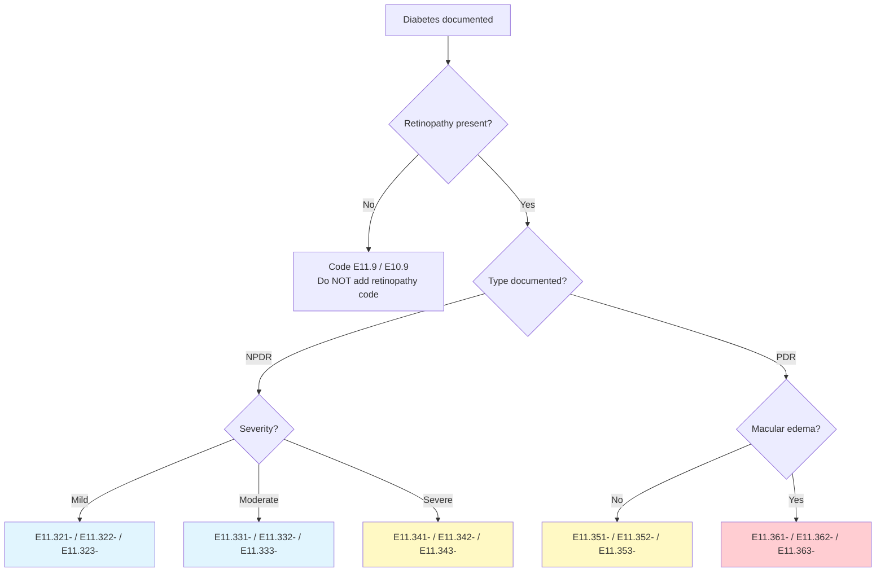

---
tags:
  - ophthalmology
  - icd-10-cm
  - aao
  - aaoe
  - laterality
  - diabetic-retinopathy
  - glaucoma
  - amd
aliases:
  - AAO ICD-10 Ophthalmology Guide
  - Ophthalmic Coding Reference
  - AAOE Coding Resources
created: 2025-01-20
updated: 2025-01-20
source: https://www.aao.org/practice-management/coding/icd-10-cm
version: 2026 Edition
effective_date: 2025-10-01
contact: coding@aao.org
---

# AAO ICD-10-CM for Ophthalmology: The Complete Reference
*American Academy of Ophthalmology / AAOE Coding Guidance*

> [!INFO] Document Scope  
> This resource provides ophthalmology-specific ICD-10-CM coding guidance, decision trees, and quick-reference materials developed by the American Academy of Ophthalmology's coding experts (AAOE). [[11]]  
> **Note**: True inpatient ophthalmology admissions are rare; most coding applies to outpatient/ASC settings. Focus here is on diagnosis code specificity, laterality, and linkage to procedures.

---

## 🔑 Core Ophthalmic Coding Principles

### Laterality Rules: The 7th Character System 
```icd10
// Standard laterality pattern for eye codes:
// Position 6 or 7 = laterality digit

1 = Right eye
2 = Left eye  
3 = Bilateral
9 = Unspecified eye

// Examples:
H40.1110  Primary open-angle glaucoma, right eye, stage unspecified
H40.1120  Primary open-angle glaucoma, left eye, stage unspecified  
H40.1130  Primary open-angle glaucoma, bilateral, stage unspecified
H40.1190  Primary open-angle glaucoma, unspecified eye, stage unspecified

// Oculofacial codes (eyelids) use different laterality:
H02.831   Dermatochalasis of right upper eyelid
H02.832   Dermatochalasis of right lower eyelid  
H02.834   Dermatochalasis of left upper eyelid
H02.835   Dermatochalasis of left lower eyelid
```

> [!WARNING] Laterality Pitfall  
> **Never default to "unspecified" (digit 9) if laterality is documented**. Payers increasingly deny claims with unspecified laterality when clinical documentation specifies right/left/bilateral. 

### Combination Codes: Diabetes + Eye Manifestations 
```icd10
// Diabetes with retinopathy uses combination codes:
E11.319   Type 2 diabetes with unspecified diabetic retinopathy
E11.3211  Type 2 diabetes with mild NPDR, right eye
E11.3212  Type 2 diabetes with mild NPDR, left eye  
E11.3213  Type 2 diabetes with mild NPDR, bilateral
E11.3311  Type 2 diabetes with moderate NPDR, right eye
E11.3411  Type 2 diabetes with severe NPDR, right eye
E11.3511  Type 2 diabetes with PDR, right eye
E11.3611  Type 2 diabetes with PDR with macular edema, right eye

// CRITICAL: Always code the MOST SPECIFIC combination code documented.
// Do NOT report E11.9 (unspecified DM) + separate retinopathy code.
```

### Excludes1 Notes in Ophthalmology: High-Risk Pairs 
| Excludes1 Pair | Clinical Guidance |
|----------------|------------------|
| H35.31- (Dry AMD) Excludes1: H35.32- (Wet AMD) | Document "non-exudative" vs. "exudative" AMD explicitly; cannot code both for same eye |
| H10.01- (Mucopurulent conjunctivitis) Excludes1: H10.02- (Other acute conjunctivitis) | Specify organism or etiology to avoid unspecified codes |
| H40.10- (POAG unspecified) Excludes1: H40.11- (POAG with stage) | Document glaucoma stage (0-4) to qualify for most specific code |

---

## 🌳 AAO Decision Trees: Clinical Pathway Coding

### Diabetic Retinopathy Decision Tree (Simplified) 


> [!TIP] Documentation Query Trigger  
> If provider documents "diabetic retinopathy" without severity or laterality:  
> *"Please specify: (1) NPDR vs. PDR, (2) severity if NPDR (mild/moderate/severe), (3) presence of macular edema, and (4) laterality (right/left/bilateral) to support accurate ICD-10-CM coding per AAO guidelines."*

### Age-Related Macular Degeneration (AMD) Coding Logic 
```markdown
DRY (Non-Exudative) AMD:
• H35.3110  Dry AMD, right eye, unspecified stage
• H35.3120  Dry AMD, left eye, unspecified stage  
• H35.3130  Dry AMD, bilateral, unspecified stage
• Add H35.314- codes for specific stages if documented (early, intermediate, advanced)

WET (Exudative) AMD:
• H35.3210  Wet AMD, right eye, unspecified stage
• H35.3220  Wet AMD, left eye, unspecified stage
• H35.3230  Wet AMD, bilateral, unspecified stage
• Add H35.324- codes for specific stages if documented

❗ Critical Rules:
1. DRY and WET AMD are mutually exclusive per Excludes1 — cannot code both for same eye
2. Always specify laterality; avoid H35.3190/H35.3290 (unspecified eye)
3. Stage documentation (early/intermediate/advanced) supports medical necessity for imaging/treatment
```

---

## 📋 High-Yield Ophthalmic ICD-10-CM Codes by Subspecialty

### Cornea & External Disease
| Condition | Specific Code Example | Documentation Requirement |
|-----------|----------------------|---------------------------|
| Bacterial keratitis | H16.011 (Right eye) | Specify organism if known (add B95-B96 code) |
| Recurrent corneal erosion | H18.811 (Right eye) | Document recurrence vs. initial episode |
| Pterygium | H11.011 (Right eye) | Specify if recurrent, bilateral, or with symblepharon |
| Dry eye syndrome | H04.121 (Right eye) | Document severity (mild/moderate/severe) if impacting treatment |

### Glaucoma
| Condition | Specific Code Example | Documentation Requirement |
|-----------|----------------------|---------------------------|
| POAG, mild stage | [[H40.1111]] (Right eye) | Document stage 1-4 per Hodapp-Parrish-Anderson criteria |
| Angle-closure suspect | [[H40.021]] (Right eye) | Document gonioscopy findings supporting "suspect" status |
| Glaucoma secondary to trauma | [[H40.31X4]] (Right eye) | Add external cause code ([[W51.0XXA]], etc.) and injury code |
| Normal tension glaucoma | [[H40.1211]] (Right eye) | Document IOP <21 mmHg with characteristic optic nerve damage |

### Retina & Vitreous
| Condition | Specific Code Example | Documentation Requirement |
|-----------|----------------------|---------------------------|
| Retinal tear without detachment | [[H33.011]] (Right eye) | Specify location (superior/inferior/temporal/nasal) if documented |
| Diabetic macular edema | [[E11.3611]] (Type 2, right eye) | Must link to diabetes; do not use H36.0- alone |
| Retinal vein occlusion | [[H34.811]] (Right eye, central) | Specify central vs. branch; add underlying condition if applicable |
| Age-related macular degeneration | [[H35.3110]] (Dry, right) or [[H35.3210]] (Wet, right) | Document exudative vs. non-exudative; stage if available |

### Oculoplastics & Neuro-Ophthalmology
| Condition | Specific Code Example | Documentation Requirement |
|-----------|----------------------|---------------------------|
| Blepharoptosis | [[H02.411]] (Right upper eyelid) | Specify congenital vs. acquired; myogenic vs. aponeurotic |
| Thyroid eye disease | [[H06.311]] (Right eye, active) | Document activity status (active/inactive) and severity |
| Optic neuritis | [[H46.011]] (Right eye) | Specify if associated with MS (add G35) or other etiology |
| Visual field defect | [[H53.411]] (Right eye) | Document pattern (homonymous, bitemporal, etc.) if known |

---

## ⚠️ Ophthalmology-Specific Coding Pitfalls

### Pitfall 1: Unspecified Laterality Overuse
```markdown
❌ Common Error:  
Documentation: "Glaucoma, right eye"  
Coded: H40.9 (Glaucoma, unspecified)  

✅ Correct Approach:  
Documentation: "Glaucoma, right eye"  
Coded: H40.1110 (POAG, right eye, stage unspecified)  
→ Then QUERY for stage documentation to support H40.1111-H40.1114

Impact: Unspecified codes may trigger payer audits or denials for "lack of medical necessity." 
```

### Pitfall 2: Diabetes Coding Without Ocular Linkage
```markdown
❌ Common Error:  
Documentation: "Type 2 diabetes; diabetic retinopathy"  
Coded: E11.9 + H36.019  

✅ Correct Approach:  
Documentation: "Type 2 diabetes; diabetic retinopathy"  
Coded: E11.319 (Combination code for Type 2 DM with unspecified diabetic retinopathy)  
→ Then QUERY for severity/laterality to support E11.3211-E11.3613 series

Impact: Reporting separate diabetes + retinopathy codes may be rejected as unbundling. 
```

### Pitfall 3: AMD Type Confusion (Dry vs. Wet)
```markdown
❌ Common Error:  
Documentation: "AMD with fluid on OCT"  
Coded: H35.3130 (Dry AMD, bilateral)  

✅ Correct Approach:  
Documentation: "AMD with fluid on OCT"  
Coded: H35.3230 (Wet/exudative AMD, bilateral)  
→ Fluid/subretinal fluid = exudative/wet AMD per AAO guidelines [[19]]

Impact: Incorrect AMD type coding may lead to denial of anti-VEGF injection claims.
```

### Pitfall 4: Glaucoma Stage Documentation Gaps
```markdown
❌ Common Error:  
Documentation: "POAG, right eye"  
Coded: H40.1110 (POAG, right eye, stage unspecified)  

✅ Correct Approach:  
Documentation: "POAG, right eye"  
→ QUERY: "Please document glaucoma stage (1=mild, 2=moderate, 3=advanced, 4=severe/end-stage) per visual field and optic nerve findings to support most specific ICD-10-CM code."  
If stage documented: H40.1111 (stage 1) through H40.1114 (stage 4)

Impact: Stage-specific codes support medical necessity for advanced testing/treatment. 
```

---

## 🔍 Inpatient Ophthalmology: Rare but Critical Scenarios

> [!WARNING] Context Reminder  
> >95% of ophthalmic care is outpatient. True inpatient admissions typically involve systemic complications or trauma. Focus CC/MCC capture on **systemic conditions**, not the eye condition itself. [[86]][[92]]

### Scenario 1: Orbital Cellulitis with Sepsis
```markdown
Clinical: 68yo admitted for orbital cellulitis with fever, leukocytosis, altered mental status.

Documentation:
• "Orbital cellulitis, right eye" (H05.011)
• "Sepsis due to Streptococcus" (A40.9)
• "Acute encephalopathy" (G93.40)

Coding Strategy:
• Principal diagnosis: A40.9 (Sepsis) — reason for admission
• Secondary: H05.011 (Orbital cellulitis) — source of infection
• Secondary: G93.40 (Encephalopathy) — organ dysfunction (MCC)
• Add B95.5 (Streptococcus as cause) if organism documented

CC/MCC Impact: 
• G93.40 (Encephalopathy) = MCC → DRG with MCC payment
• H05.011 alone would not drive inpatient admission; systemic complications do
```

### Scenario 2: Endophthalmitis Post-Cataract Surgery
```markdown
Clinical: Patient admitted 3 days post-cataract surgery with pain, hypopyon, vision loss.

Documentation:
• "Acute postoperative endophthalmitis, right eye" (H44.001)
• "Postprocedural infection" (T81.4XXA)
• "Acute kidney injury" (N17.9) from IV antibiotics

Coding Strategy:
• Principal diagnosis: T81.4XXA (Infection following procedure) — reason for admission
• Secondary: H44.001 (Endophthalmitis) — specific manifestation
• Secondary: N17.9 (Acute kidney injury) — complication of treatment (MCC)
• Add Y83.8 (Surgical procedure as cause) if needed for external cause

CC/MCC Impact:
• N17.9 (if with ATN) = MCC → significantly increases DRG weight
• T81.4XXA must have 7th character "A" for initial encounter
```

### Scenario 3: Giant Cell Arteritis with Vision Loss
```markdown
Clinical: 78yo admitted for suspected GCA with acute vision loss, jaw claudication, elevated ESR.

Documentation:
• "Giant cell arteritis with visual loss" (M31.6)
• "Anterior ischemic optic neuropathy, right eye" (H47.211)
• "Acute blood loss anemia" (D62) from temporal artery biopsy

Coding Strategy:
• Principal diagnosis: M31.6 (Giant cell arteritis) — systemic condition requiring admission
• Secondary: H47.211 (AION) — ocular manifestation
• Secondary: D62 (Acute posthemorrhagic anemia) — complication of diagnostic procedure (CC)

CC/MCC Impact:
• D62 = CC → moderate DRG adjustment
• M31.6 alone may not drive inpatient admission; document systemic symptoms (fever, weight loss, polymyalgia) to support medical necessity
```

---

## 📚 AAOE Resources & Contact Information

### Official AAO Coding Products 
| Resource | Description | Best For |
|----------|-------------|----------|
| **ICD-10-CM for Ophthalmology: The Complete Reference** | Annual book with full code set, guidelines, decision trees | Comprehensive reference; coding audits |
| **Subspecialty Decision Trees (PDF)** | Anterior uveitis, AMD, diabetes, etc. | Quick clinical coding guidance at point of care |
| **Quick Reference Guides (PDF)** | Cornea, Glaucoma, Retina, Uveitis, Oculofacial | Subspecialty-specific code lookup |
| **Codequest™ Virtual Training** | Live/recorded coding education with AAOE experts | Staff training; staying current on updates |

### Contact AAOE Coding Experts 
```markdown
📧 General Coding Questions: coding@aao.org  
📧 MIPS/Quality Questions: mips@aao.org  

👥 Key Contacts:
• Joy Woodke, COE, OCS, OCSR — Director, Coding & Reimbursement  
• Matthew Baugh, COT, OCS, OCSR — Manager, Coding & Clinical Teams  
• Heather H. Dunn, COA, OCS, OCSR — Manager, Coding & Reimbursement  

📍 Mailing Address:  
American Academy of Ophthalmology / AAOE  
655 Beach Street  
San Francisco, CA 94109
```

### Staying Current: Update Cadence
```markdown
🗓️ Annual Cycle:
• July: CMS proposes ICD-10-CM updates for next FY
• August: Final Rule published in Federal Register  
• September: AAO releases updated ICD-10-CM for Ophthalmology book
• October 1: New codes effective for all claims

🔔 Pro Tip: Subscribe to AAOE Coding News alerts at aao.org/practice-management/coding/icd-10-cm/news to receive change summaries and coding tips. [31]
```


---

## 📚 Official Resources
- [AAO ICD-10-CM Coding Portal](https://www.aao.org/practice-management/coding/icd-10-cm) [[11]][[35]]
- [AAO Store: ICD-10-CM for Ophthalmology Book](https://store.aao.org/2026-icd-10-cm-for-ophthalmology-the-complete-reference.html) [[33]]
- [AAOE Decision Trees & Quick Guides](https://www.aao.org/practice-management/coding/icd-10-cm#resources) [[11]]
- [CMS ICD-10-CM Code Tables FY 2025](https://www.cms.gov/icd10m/FY2025-Version42-fullcode-cms)
- [AAO Coding Clinic Archives](https://www.aao.org/eyenet/academy-live/detail/2025-coding-update) [[17]]

> [!ABSTRACT] Bottom Line  
> Ophthalmic ICD-10-CM coding demands precision in: (1) **laterality specification** (avoid "unspecified eye"), (2) **combination code usage** (especially diabetes + eye manifestations), (3) **Excludes1 navigation** (dry vs. wet AMD, conjunctivitis subtypes), and (4) **clinical documentation alignment** (stage, severity, activity status). For the rare inpatient case, focus CC/MCC capture on systemic complications—not the ocular diagnosis itself. Always leverage AAOE decision trees and query providers when documentation lacks coding specificity.

---
*Last synced: $(date)*  
*Next edition: 2027 ICD-10-CM for Ophthalmology (expected September 2026)*
