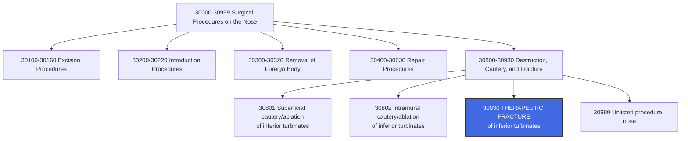

---
tags:
  - cpt
  - ent
  - turbinate
  - nasal-obstruction
  - rhinology
  - outpatient
  - surgery
  - fracture
  - outfracture
  - otolaryngology
cpt: 30930
descriptor: Fracture nasal inferior turbinate(s), therapeutic
category: Surgical Procedures on the Nose
specialty:
  - Otolaryngology (ENT)
  - Rhinology
  - Head and Neck Surgery
  - Allergy and Immunology
  - Facial Plastic Surgery
type: Procedure
approach: Endoscopic or Transnasal
anesthesia: Local with Sedation or General
global_days: 90
effective_date: 2006-01-01 (descriptor updated)
last_updated: 2026-01-01
parent_category: Surgical Procedures on the Nose (30000-30999)
aliases:
  - Inferior turbinate outfracture
  - Turbinate fracture
  - Nasal turbinate lateralization
  - Turbinate outfracture
  - Therapeutic turbinate fracture
sections:
  - Surgical Procedures on the Nose (30000-30999)
  - Turbinate Procedures
cpt_guidelines: Therapeutic fracture of inferior turbinate(s) to improve nasal airflow
work_rvu_2026: Check CMS MPFS for current value
---

# CPT Code [[30930]]: Fracture Nasal Inferior Turbinate(s), Therapeutic

## 📋 Code Information

| Field | Value |
| :--- | :--- |
| **CPT Code** | [[30930]] |
| **Descriptor** | Fracture nasal inferior turbinate(s), therapeutic |
| **Section** | Surgical Procedures on the Nose ([[30000]]-[[30999]]) |
| **Approach** | Endoscopic or Transnasal |
| **Global Period** | 90 days |
| **Effective Date** | 2006-01-01 (descriptor updated from "any turbinate" to "inferior turbinate") |
| **Last Updated** | 2026-01-01 (no change from 2025) |

## 📖 Clinical Description

**CPT [[30930]]** describes a therapeutic procedure involving the intentional fracture of the nasal inferior turbinate(s) to improve airflow or treat nasal obstruction. The procedure involves intentionally fracturing the turbinate bone to reposition or reduce it, thereby enhancing nasal breathing by widening the nasal airway.[1]

### Procedure Steps[1]

1.  **Visualization**: The surgeon visualizes the inferior turbinate using a nasal speculum or endoscope.
2.  **Instrumentation**: A blunt instrument (such as a Boies elevator or Freer elevator) is placed along the medial surface of the inferior turbinate.
3.  **Fracture**: Controlled pressure is applied to fracture the turbinate bone at its base, allowing it to be displaced laterally (outfracture) or medially (infracture).
4.  **Repositioning**: The turbinate is repositioned to a more favorable position that improves nasal airflow.
5.  **Packing (optional)**: Nasal packing may be placed temporarily to maintain position and control bleeding.

### Indications[1]

- Chronic nasal obstruction due to inferior turbinate hypertrophy
- Compensatory turbinate hypertrophy secondary to septal deviation
- Allergic rhinitis with turbinate enlargement
- Vasomotor rhinitis with turbinate congestion
- Failed medical management (steroid sprays, antihistamines)

### Terminology Note

The term "outfracture" refers to lateral displacement of the turbinate away from the nasal septum, while "infracture" refers to medial displacement. Both are reported with [[30930]].

## 🔍 Includes and Inclusions

- **Therapeutic Fracture**: Intentional fracture of the inferior turbinate bone to improve nasal breathing[1]
- **Unilateral or Bilateral**: Code describes one or both sides (use modifier [[50]] for bilateral when payer requires)[1]
- **Inferior Turbinate Only**: Code is specific to the **inferior** turbinate; middle and superior turbinate procedures are reported with different codes[3]

## 🚫 Excludes and Differentiating Codes

### Do Not Report [[30930]] With

| Code | Description | Rationale |
| :--- | :--- | :--- |
| [[30801]] | Cautery and/or ablation, mucosa of inferior turbinates; superficial | NCCI edit bundles ablation with fracture[5][8] |
| [[30802]] | Cautery and/or ablation, mucosa of inferior turbinates; intramural | NCCI edit bundles ablation with fracture[5][8] |
| [[30140]] | Submucous resection inferior turbinate | Different, more extensive procedure |
| [[30130]] | Excision inferior turbinate, partial or complete | Different procedure |

### Important Distinction: Inferior vs. Other Turbinates[3]

- **Prior to 2006**: [[30930]] was used for "any turbinate"
- **After 2006**: Code is specific to **inferior turbinate only**
- Middle or superior turbinate fracture should be reported with unlisted code [[30999]]

### Related Codes

| Code | Description |
| :--- | :--- |
| [[50 Medical Coding/CPT Codes/30520]] | Septoplasty or submucous resection |
| [[30140]] | Submucous resection inferior turbinate |
| [[30802]] | Cautery and/or ablation, mucosa of inferior turbinates; intramural |
| [[31237]] | Nasal/sinus endoscopy with biopsy or polypectomy |
| [[30999]] | Unlisted procedure, nose |

## 📊 Code Tree and Hierarchy

## 🔄 Modifiers and Billing Nuances[1]

| Modifier | Description | Application to 30930 |
| :--- | :--- | :--- |
| [[50]] | Bilateral Procedure | Use when procedure is performed on both inferior turbinates during same session. Some payers require this modifier; others consider the code inherently bilateral.[1][8] |
| [[51]] | Multiple Procedures | Apply when multiple procedures are performed during same surgical session (e.g., septoplasty + turbinate fracture)[1] |
| [[59]] | Distinct Procedural Service | Use to indicate procedure is distinct from other services; may be needed when unbundling from ablation on opposite side[1][3][8] |
| [[LT]] | Left side | Used with unilateral procedures to specify left side |
| [[RT]] | Right side | Used with unilateral procedures to specify right side |
| [[22]] | Increased Procedural Services | Use when work required is substantially greater than typical (requires documentation) |

## 🔗 Relationship with Septoplasty ([[50 Medical Coding/CPT Codes/30520]])[3]

### Historical Bundling Issue

Prior to 2006, [[30930]] was considered incidental to septoplasty because it applied to "any turbinate," and middle turbinate fracture was considered part of the septoplasty procedure.[3]

### Current Coding Guidance

- **2006 Update**: Code descriptor changed to specify **inferior turbinate only**[3]
- **Current Rule**: Inferior turbinate fracture is **not** incidental to septoplasty and may be reported separately
- **No Modifier Needed**: Generally, no modifier is required when reporting [[30930]] with [[50 Medical Coding/CPT Codes/30520]][3]
- **Last Resort**: If payer continues to deny, add modifier [[59]] as a last resort[3]

## 🔄 Relationship with Turbinate Ablation ([[30801]]/[[30802]])[5][8]

### NCCI Edit Status

- **Bundled**: NCCI edits bundle [[30801]] and [[30802]] with [[30930]][5][8]
- **Comprehensive Code**: [[30930]] is the comprehensive code even though it has fewer RVUs than [[30802]][8]
- **Same-Side Bundling**: CCI bundles only the same-sided cautery and fracture[8]

### Bilateral Scenario Examples[8]

| Scenario | Coding Approach |
| :--- | :--- |
| Bilateral outfracture + bilateral cautery | Report only [[30930-50]] (cautery bundled) |
| Bilateral outfracture + left-sided cautery | Report [[30930-RT]] + [[30802-59-LT]] |
| Bilateral outfracture + right-sided cautery | Report [[30930-LT]] + [[30802-59-RT]] |

## 👨‍⚕️ Assistant Surgeon (Modifier [[80]]) Payability

### Assistant Surgeon Information

- **Assistant Surgeon Status**: Not typically payable; procedure is generally performed by a single surgeon
- **Medicare Payment Indicator**: Check MPFSDB "Asst Surg" indicator for current status
- **Documentation Requirements**: If assistant is medically necessary (rare), documentation must support:
  - Patient factors (morbid obesity, complex anatomy)
  - Unusual circumstances (excessive bleeding, concurrent complex procedures)
  - Medical necessity for two surgeons

### Modifiers for Assistants (Rarely Used for 30930)

| Modifier | Description |
| :--- | :--- |
| [[80]] | Assistant at Surgery |
| [[81]] | Minimal Assistant at Surgery |
| [[82]] | Assistant when Qualified Resident Not Available |
| [[AS]] | Non-Physician Assistant at Surgery |

## 💰 Work RVU (wRVU) and Reimbursement

### Work RVU Information

The Work Relative Value Units (wRVU) for [[30930]] are updated annually by CMS. For current values:

- **2026 Reference**: Consult the most recent CMS Physician Fee Schedule (PFS) Final Rule or the AMA RBRVS DataManager
- **Historical RVU Reference**: According to historical data, [[30930]] was assigned **2.93 RVUs** compared to [[30802]] at **4.53 RVUs** (showing that the comprehensive code may have lower RVUs than bundled components)[8]
- **Reimbursement Factors**: Final payment determined by:
  - Total RVUs (Work + Practice Expense + Malpractice)
  - Geographic Practice Cost Index (GPCI) for your area
  - National conversion factor

### Medicare Administrative Contractor (MAC) Considerations[1]

Reimbursement may vary based on:
- Local Coverage Determinations (LCDs) in your region
- Specific MAC policies regarding medical necessity for turbinate procedures
- Documentation requirements for nasal obstruction

## 📋 Documentation Requirements

To support billing of [[30930]], the operative report should clearly document:[1][3]

- **Preoperative Diagnosis**: Specific indication (e.g., "inferior turbinate hypertrophy causing nasal obstruction")
- **Procedure Performed**: "Therapeutic fracture of inferior turbinate(s)" or "outfracture of inferior turbinates"
- **Laterality**: Right, left, or bilateral
- **Turbinate Specificity**: Must specify **inferior** turbinate (critical distinction from pre-2006 coding)[3]
- **Technique**: Instruments used and method of fracture
- **Findings**: Degree of hypertrophy, appearance of mucosa
- **Concurrent Procedures**: If performed with septoplasty or other procedures, document each separately

## 📊 ICD-10 Crosswalk and HCC Information

### Common ICD-10 Diagnoses for [[30930]]

| ICD-10 Code | Description | HCC Applicability |
| :--- | :--- | :--- |
| [[J34.89]] | Other specified disorders of nose and nasal sinuses (includes turbinate hypertrophy) | No (0) |
| [[J34.3]] | Hypertrophy of nasal turbinates | No (0) |
| [[J31.0]] | Chronic rhinitis | No (0) |
| [[J30.9]] | Allergic rhinitis, unspecified | No (0) |
| [[J30.1]] | Allergic rhinitis due to pollen | No (0) |
| [[J30.89]] | Other allergic rhinitis | No (0) |
| [[J30.5]] | Allergic rhinitis due to food | No (0) |
| [[J32.9]] | Chronic sinusitis, unspecified (when associated with turbinate hypertrophy) | No (0) |
| [[G47.32]] | Primary central sleep apnea (when turbinate surgery is for OSA) | Varies |

### HCC Note

Most turbinate and rhinitis diagnoses are **not** hierarchical condition categories (HCCs) that affect risk adjustment payments. Sleep apnea diagnoses may have HCC implications depending on the specific code and model year.

## 🏥 MS-DRG Assignment

When performed in an inpatient setting (rare; typically outpatient), [[30930]] may map to:

| MS-DRG | Description |
| :--- | :--- |
| **129** | Major head and neck procedures with CC/MCC |
| **130** | Major head and neck procedures without CC/MCC |
| **152** | Otitis media and URI with MCC |
| **153** | Otitis media and URI without MCC |

**Note**: [[30930]] is typically performed in **outpatient/ambulatory surgical center (ASC)** or office settings and is not usually assigned to inpatient MS-DRGs.

## 📝 Coding Examples and Scenarios

### Example 1: Isolated Bilateral Inferior Turbinate Outfracture
**Scenario**: A 35-year-old with chronic nasal obstruction due to bilateral inferior turbinate hypertrophy refractory to medical management undergoes bilateral inferior turbinate outfracture. No other procedures performed.
**Coding**:
- [[30930]] - [[50]] (Fracture nasal inferior turbinate(s), therapeutic, bilateral)
- [[J34.3]] (Hypertrophy of nasal turbinates)
- *Note: Some payers consider 30930 inherently bilateral and may not require modifier 50; check payer preference.*[1]

### Example 2: Septoplasty with Bilateral Inferior Turbinate Outfracture
**Scenario**: A 45-year-old with deviated nasal septum and bilateral inferior turbinate hypertrophy undergoes septoplasty and bilateral inferior turbinate outfracture.
**Coding**:
- [[50 Medical Coding/CPT Codes/30520]] (Septoplasty or submucous resection)
- [[30930]] - [[50]] (Fracture nasal inferior turbinate(s), therapeutic, bilateral)
- [[J34.2]] (Deviated nasal septum)
- [[J34.3]] (Hypertrophy of nasal turbinates)
- *Rationale: Since the 2006 descriptor update, inferior turbinate fracture is not incidental to septoplasty and may be reported separately. No modifier 51 is needed for Medicare (automatically applied).*[3]

### Example 3: Bilateral Outfracture with Unilateral Cautery
**Scenario**: A 50-year-old undergoes bilateral inferior turbinate outfracture and left-sided intramural cautery.
**Coding**:
- [[30930]] - [[RT]] (Fracture nasal inferior turbinate, right side)
- [[30802]] - [[59]] - [[LT]] (Cautery and/or ablation, mucosa of inferior turbinates; intramural, left side, distinct procedural service)
- [[J34.3]] (Hypertrophy of nasal turbinates)
- *Rationale: CCI bundles same-sided cautery with fracture. The right-sided fracture is reported with 30930-RT. The left-sided cautery is distinct (different side) and may be reported with modifier 59.*[8]

### Example 4: Appeal Scenario - Payer Denies 30930 with Septoplasty
**Scenario**: Payer denies [[30930]] when billed with [[50 Medical Coding/CPT Codes/30520]], citing 2002 CPT Assistant guideline that fracture is incidental.
**Coding Appeal**:
- **Appeal Argument**: Explain that the descriptor for [[30930]] was updated in 2006 to specify **inferior turbinate only**. Prior to 2006, the code applied to "any turbinate," and middle turbinate fracture was considered incidental. Inferior turbinates are not incidental to septoplasty and are in a separate anatomic location.[3]
- **Alternative**: If payer remains unmoved, add modifier [[59]] as a last resort.[3]

### Example 5: Bilateral Outfracture with Bilateral Cautery - Correct Coding
**Scenario**: Surgeon performs bilateral inferior turbinate outfracture and bilateral intramural cautery.
**Coding**:
- **Correct**: [[30930]] - [[50]] only
- **Incorrect**: [[30930]] - [[50]] + [[30802]] - [[50]]
- *Rationale: CCI bundles cautery with fracture. When both are performed bilaterally, report only the fracture code.*[8]

### Example 6: Inferior Turbinate Outfracture with Middle Turbinate Procedure
**Scenario**: Patient undergoes bilateral inferior turbinate outfracture and right middle turbinate resection (for concha bullosa).
**Coding**:
- [[30930]] - [[50]] (Fracture nasal inferior turbinate, bilateral)
- [[30999]] - [[RT]] (Unlisted procedure, nose - for middle turbinate resection)
- *Rationale: 30930 is specific to inferior turbinate only. Middle turbinate procedures require unlisted code or different specific code depending on procedure.*[3]

## ⚠️ Important Coding Notes

### 2006 Descriptor Change Significance[3]

The 2006 descriptor change from "any turbinate" to "inferior turbinate" has significant coding implications:

| Aspect | Pre-2006 | Post-2006 |
| :--- | :--- | :--- |
| **Code Descriptor** | "any turbinate" | "inferior turbinate" |
| **Bundling with Septoplasty** | Middle turbinate fracture considered incidental | Inferior turbinate fracture **not** incidental |
| **Separate Reporting** | Often bundled | May be reported separately |

### NCCI Edit Strategies[5][8]

- **Ablation + Fracture**: When both are performed on same side, report only [[30930]]
- **Different Sides**: May use modifier [[59]] to report ablation on opposite side from fracture
- **Documentation**: Always document laterality clearly to support separate site reporting

### Bilateral Coding Considerations[1][8]

- Some payers consider [[30930]] inherently bilateral and do not require modifier [[50]]
- Other payers require modifier [[50]] for bilateral procedures
- Check specific payer policies to determine correct billing approach

### RVU Paradox[8]

- [[30930]] is the comprehensive code for fracture + cautery but may have **lower RVUs** than [[30802]] alone
- This reflects the different work components and should not affect code selection based on procedure performed

## References

1 MD Clarity. "CPT Code 30930: What It Is, Modifiers, Reimbursement." (2026)
2 Bristol Healthcare Services. "CPT® 2026 Overhaul: Thoracic Endovascular Aortic Repair Coding Changes." (2026)
3 AAPC. "Unbundle Inferior Turbinates From Septoplasty : READER QUESTIONS." (2010)
4 ICD-10 Coded. "ICD-10-PCS - Ear, Nose, Sinus, Drainage, Nasal Turbinate." (2025)
5 AAO-HNS. "Reporting Radiofrequency Ablation and Out-fracturing of Inferior Turbinates." (2023)
6 ISASS. "2026 CPT® Code Updates for Spine Surgery." (2026)
7 ICD-10 Coded. "09TL8ZZ - Resection of Nasal Turbinate, Endo." (2025)
8 AAPC. "4 Turbinate Procedures--How Many CPT Codes? : You Be the Coder." (2007)
9 MedLearn Publishing. "Peripheral & Cardiology Coder - 2026 Edition." (2026)
10 ICD10ALL. "2024 ICD-10 PCS Code 095L3ZZ - Destruction of Nasal Turbinate, Percutaneous Approach." (2024)