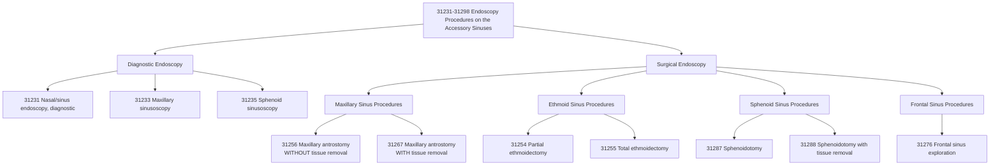

---
tags:
  - cpt
  - ent
  - sinus-surgery
  - fess
  - endoscopic
  - maxillary-antrostomy
  - rhinology
  - outpatient
  - surgery
  - otolaryngology
cpt: 31256
descriptor: Nasal/sinus endoscopy, surgical, with maxillary antrostomy
category: Surgical Procedures on the Accessory Sinuses
specialty:
  - Otolaryngology (ENT)
  - Rhinology
  - Head and Neck Surgery
  - Allergy and Immunology
type: Procedure
approach: Endoscopic
anesthesia: General or Local with Sedation
global_days: 90
effective_date: 1994-01-01
last_updated: 2026-01-01
parent_category: Endoscopy Procedures on the Accessory Sinuses (31231-31298)
aliases:
  - Maxillary antrostomy
  - Sinus ostium enlargement
  - Middle meatal antrostomy
  - Surgical sinus endoscopy with maxillary sinus opening
sections:
  - Surgical Procedures on the Accessory Sinuses (31231-31298)
  - Endoscopy Procedures on the Accessory Sinuses
cpt_guidelines: Surgical endoscopy includes diagnostic endoscopy
work_rvu_2026: Check CMS MPFS for current value
---

# CPT Code [[31256]]: Nasal/Sinus Endoscopy, Surgical, with Maxillary Antrostomy

## 📋 Code Information

| Field | Value |
| :--- | :--- |
| **CPT Code** | [[31256]] |
| **Descriptor** | Nasal/sinus endoscopy, surgical, with maxillary antrostomy |
| **Section** | Surgical Procedures on the Accessory Sinuses ([[31231]]-[[31298]]) |
| **Approach** | Endoscopic |
| **Global Period** | 90 days |
| **Effective Date** | 1994-01-01 |
| **Last Updated** | 2026-01-01 (no change from 2025) |

## 📖 Clinical Description

**CPT Code [[31256]]** describes a surgical endoscopic procedure to create or enlarge an opening (antrostomy) in the maxillary sinus. The surgeon inserts an endoscope into the nasal cavity, gains access to the maxillary sinus through a cut in the uncinate process, and opens the maxillary sinus ostium to improve drainage and ventilation.[4][8]

### Procedure Steps[4][8]

1.  **Endoscope Insertion**: The surgeon inserts a nasal endoscope to visualize the nasal cavity and sinus anatomy.
2.  **Access to Maxillary Sinus**: The uncinate process is incised to expose the natural ostium of the maxillary sinus.
3.  **Antrostomy Creation**: The sinus opening is enlarged using surgical instruments such as through-cutting forceps, microdebriders, or balloon dilation devices.
4.  **Inspection**: The maxillary sinus may be inspected through the newly created opening to assess for pathology.
5.  **Closure**: There are typically no external incisions; the procedure is performed entirely through the nostrils.

### Indications

- Chronic maxillary sinusitis refractory to medical management[5]
- Recurrent acute sinusitis
- Sinus ostial obstruction
- Access for biopsy or culture of sinus contents
- Part of comprehensive functional endoscopic sinus surgery (FESS)[5]

## 🔍 Includes and Inclusions

- **Surgical Endoscopy**: Includes diagnostic endoscopy of the nasal cavity and sinuses (do not report [[31231]] separately)[6]
- **Maxillary Antrostomy**: Creation or enlargement of the maxillary sinus ostium
- **Unilateral Procedure**: Code describes one side (use modifier [[50]] for bilateral)[8]
- **Instrumentation**: Use of endoscopic instruments to perform the antrostomy

## 🚫 Excludes and Differentiating Codes

### Do Not Report [[31256]] With

| Code          | Description                                                       | Rationale                                               |
| :------------ | :---------------------------------------------------------------- | :------------------------------------------------------ |
| **[[31231]]** | **Diagnostic nasal endoscopy**                                    | Bundled into surgical endoscopy[6]           |
| **[[31267]]** | **Maxillary antrostomy with tissue removal**                      | More comprehensive; 31256 is component[6][9] |
| **[[31233]]** | **Nasal/sinus endoscopy, diagnostic, with maxillary sinusoscopy** | Diagnostic version                                      |
| **[[31237]]** | **Nasal/sinus endoscopy with biopsy or polypectomy**              | Different procedure                                     |
|               |                                                                   |                                                         |

### Code When Tissue Is Removed

**[[31267]] (with removal of tissue from maxillary sinus)** should be used instead of [[31256]] when the surgeon removes polyps, cysts, mucopus, or other tissue from the maxillary sinus.[6][9]

### Related Codes

| Code      | Description                                |
| :-------- | :----------------------------------------- |
| **[[31254]]** | Partial ethmoidectomy                      |
| **[[31255]]** | Total ethmoidectomy                        |
| **[[31276]]** | Frontal sinus exploration                  |
| **[[31287]]** | Sphenoidotomy                              |
| **[[31295]]** | Balloon dilation of maxillary sinus ostium |

## 📊 Code Tree and Hierarchy

## 🔄 Modifiers and Billing Nuances[8]

| Modifier    | Description                               | Application to 31256                                                                                 |
| :---------- | :---------------------------------------- | :--------------------------------------------------------------------------------------------------- |
| **[[-50]]** | **Bilateral Procedure**                   | Use when procedure is performed on both right and left maxillary sinuses during same session         |
| **[[-51]]** | **Multiple Procedures**                   | Apply when multiple sinus procedures are performed (e.g., ethmoidectomy + maxillary antrostomy)      |
| **[[-59]]** | **Distinct Procedural Service**           | Use to indicate procedure is distinct from other services performed on same day                      |
| **[[-22]]** | **Increased Procedural Services**         | Use when work required is substantially greater than typical (requires documentation)                |
| **[[-76]]** | **Repeat Procedure by Same Physician**    | Applied when same procedure is repeated on same day                                                  |
| **[[-77]]** | **Repeat Procedure by Another Physician** | Used when procedure is repeated by different physician on same day                                   |
| **[[-79]]** | **Unrelated Procedure**                   | Use when performed during postoperative period of another, unrelated surgery                         |
| **[[-62]]** | **Two Surgeons**                          | Used when two surgeons work as primary surgeons performing distinct parts of procedure[3] |

## 👨‍⚕️ Assistant Surgeon (Modifier [[80]]) Payability

### Assistant Surgeon Information

- **Assistant Surgeon Status**: Generally not payable as assistant surgeon for routine cases
- **Medicare Payment Indicator**: Check MPFSDB "Asst Surg" indicator for current status
- **Documentation Requirements**: If assistant is medically necessary, documentation must support:
  - Patient factors (**morbid obesity, complex anatomy**)
  - Unusual circumstances (**excessive bleeding, extensive disease**)
  - Need for two surgeons performing distinct procedures[3]

### Billing Scenarios Involving Assistants[3]

If two surgeons of different specialties perform distinct procedures during the same operative session:

- **Physician A** (**e.g., Oral Surgeon**) performs primary procedure (**e.g., Caldwell-Luc**)
- **Physician B** (**e.g., ENT**) performs nasal antrostomy ([[31256]])

Both physicians should:
- Bill their respective procedures as **primary surgeons**
- Each dictate their own operative report documenting their distinct procedure
- Do not use assistant modifiers if performing distinct, separately identifiable procedures[3]

### Co-Surgery (Modifier [[62]])[3]

If both surgeons work together as **co-surgeons** performing the **same procedure**:
- Both report the same CPT code with modifier [[62]]
- Reimbursement is typically 125% of the fee schedule amount, split equally

## 💰 Work RVU (wRVU) and Reimbursement

### Work RVU Information

The Work Relative Value Units (**wRVU**) for [[31256]] are updated annually by CMS. For current values:

- **2026 Reference**: Consult the most recent CMS Physician Fee Schedule (PFS) Final Rule or the AMA RBRVS DataManager[7]
- **Reimbursement Factors**: Final payment determined by:
  - Total RVUs (Work + Practice Expense + Malpractice)
  - Geographic Practice Cost Index (**GPCI**) for your area
  - National conversion factor ($33.40 for 2026 non-APM participants)[7]

### Medicare Administrative Contractor (MAC) Considerations[8]

Reimbursement may vary based on:
- Local Coverage Determinations (**LCDs**) in your region
- Specific MAC policies and documentation requirements
- Medical necessity criteria for sinus surgery

## 📋 Documentation Requirements

To support billing of [[31256]], the operative report should clearly document:[1][6][9]

- **Preoperative Diagnosis**: Specific sinus pathology requiring antrostomy
- **Procedure Performed**: "Maxillary [[antrostomy]]" or "maxillary sinus ostium enlargement"
- **Laterality**: Right, left, or bilateral
- **Findings**: Description of sinus mucosa, presence of pus, polyps, or other pathology
- **Tissue Removal**: Explicitly state if **no tissue was removed** from the maxillary sinus
- **Extent of Procedure**: Whether other sinuses were addressed
- **Technique**: Instruments used (forceps, microdebrider, balloon)

## 📊 ICD-10 Crosswalk and HCC Information

### Common ICD-10 Diagnoses for [[31256]][5]

| ICD-10 Code | Description                                                       | HCC Applicability |
| :---------- | :---------------------------------------------------------------- | :---------------- |
| **[[J32.0]]**   | **Chronic maxillary sinusitis**                                       | No (0)            |
| **[[J32.9]]**   | **Chronic sinusitis, unspecified**                                    | No (0)            |
| **[[J33.8]]**   | **Other polyp of sinus**                                              | No (0)            |
| **[[J33.9]]**   | **Nasal polyp, unspecified**                                          | No (0)            |
| **[[J34.89]]**  | **Other specified disorders of nose and nasal sinuses**               | No (0)            |
| **[[J01.00]]**  | **Acute maxillary sinusitis, unspecified**                            | No (0)            |
| **[[C31.0]]**   | **Malignant neoplasm of maxillary sinus**                             | Yes (HCC 8 or 10) |
| **[[D14.0]]**   | **Benign neoplasm of middle ear, nasal cavity and accessory sinuses** | No (0)            |

### HCC Note
Most sinusitis and polyp diagnoses are **not** hierarchical condition categories (HCCs) that affect risk adjustment payments. Malignant neoplasms of the sinus ([[C31.0]]) do map to HCCs and impact risk scores.

## 🏥 MS-DRG Assignment

When performed in an inpatient setting (rare; typically outpatient), [[31256]] may map to:

| MS-DRG | Description |
| :--- | :--- |
| **129** | Major head and neck procedures with CC/MCC |
| **130** | Major head and neck procedures without CC/MCC |
| **152** | Otitis media and URI with MCC |
| **153** | Otitis media and URI without MCC |

**Note**: [[31256]] is typically performed in **outpatient/ambulatory surgical center (ASC)** settings and is not usually assigned to inpatient MS-DRGs.

## 📝 Coding Examples and Scenarios

### Example 1: Simple Maxillary Antrostomy
**Scenario**: A 45-year-old with chronic maxillary sinusitis refractory to antibiotics undergoes endoscopic sinus surgery. The surgeon performs a right maxillary antrostomy, enlarging the natural ostium. No polyps or tissue are removed from the sinus.
**Coding**:
- [[31256]] - [[-RT]] (Nasal/sinus endoscopy, surgical, with maxillary antrostomy, right side)
- [[J32.0]] (Chronic maxillary sinusitis)

### Example 2: Bilateral Maxillary Antrostomy
**Scenario**: A 52-year-old with bilateral chronic maxillary sinusitis undergoes endoscopic sinus surgery. The surgeon performs maxillary antrostomy on both sides. No tissue is removed from either sinus.
**Coding**:
- [[31256]] - [[-50]] (Nasal/sinus endoscopy, surgical, with maxillary antrostomy, bilateral)
- [[J32.9]] (Chronic sinusitis, unspecified)

### Example 3: Multiple Sinus Procedures
**Scenario**: A patient undergoes endoscopic sinus surgery including bilateral total ethmoidectomies and bilateral maxillary antrostomies without tissue removal.
**Coding**:
- [[31255]] - [[-50]] (Total ethmoidectomy, bilateral)
- [[31256]] - [[-51]] - [[-50]] (Maxillary antrostomy, bilateral, multiple procedures)
- *Note: Modifier -51 indicates multiple procedures; Medicare carriers apply multiple procedure payment reduction automatically*[6]

### Example 4: Maxillary Antrostomy WITH Tissue Removal
**Scenario**: A patient undergoes endoscopic sinus surgery. The surgeon performs bilateral maxillary antrostomies and removes polyps from both maxillary sinuses.
**Coding**:
- **Correct**: [[31267]] - [[50]] (Maxillary antrostomy with tissue removal, bilateral)
- **Incorrect**: [[31256]] - [[50]] + [[31267]] - [[50]]
- *Rationale: 31256 is a component of 31267; when tissue is removed, report only 31267*[6][9]

### Example 5: Two Surgeons, Different Procedures
**Scenario**: Oral surgeon performs Caldwell-Luc procedure. ENT performs endoscopic maxillary antrostomy during same operative session.
**Coding**:
- **Oral Surgeon**: Appropriate Caldwell-Luc code (e.g., [[21345]]) as primary surgeon
- **ENT**: [[31256]] as primary surgeon (no modifier)[3]
- *Rationale: Each physician bills their distinct procedure as primary surgeon with own op note*

### Example 6: Co-Surgery Scenario
**Scenario**: Two ENT surgeons work together as co-surgeons to perform a complex bilateral maxillary antrostomy due to difficult anatomy and extensive disease.
**Coding**:
- Both surgeons: [[31256]] - [[-62]] - [[-50]]
- *Rationale: Modifier 62 indicates co-surgery; both report same code with modifier*

### Example 7: Incorrect Reporting of Diagnostic Endoscopy
**Scenario**: Surgeon performs diagnostic nasal endoscopy followed by maxillary antrostomy. Coder reports [[31231]] and [[31256]].
**Coding**:
- **Correct**: [[31256]] only
- **Incorrect**: [[31231]] + [[31256]]
- *Rationale: Surgical endoscopy includes diagnostic endoscopy; do not report separately*[6]

## ⚠️ Important Coding Notes

### 31256 vs. 31267 Distinction[6][9]

The critical factor in choosing between [[31256]] and [[31267]] is **whether tissue was removed from the maxillary sinus**:

| Factor | 31256 | 31267 |
| :--- | :--- | :--- |
| **Antrostomy** | ✓ Yes | ✓ Yes |
| **Tissue Removal** | ✗ No | ✓ Yes |
| **Polypectomy** | ✗ No | ✓ Yes |
| **Mucosal Stripping** | ✗ No | ✓ Yes |
| **Cyst Removal** | ✗ No | ✓ Yes |

### NCCI Edits[6][9]

- [[31256]] is a component of [[31267]] and should **not** be reported together
- Surgical endoscopy codes bundle the associated diagnostic endoscopy ([[31231]])
- Multiple sinus procedures may be reported together with modifier [[-51]]

### Bilateral Surgery[6][8]

- Use modifier [[-50]] for bilateral procedures
- Medicare typically pays 150% of the unilateral fee for bilateral procedures (**75% per side**)

## References

1 Haugen Consulting Group. "Webinar Q&A: Procedure Coding for Sinus Surgery." (2025)
2 Bristol Healthcare Services. "CPT® 2026 Overhaul: Thoracic Endovascular Aortic Repair Coding Changes." (2026)
3 AAPC Forum. "Assistant Surgery billing as Primary surgeon." (2012)
4 AAPC. "CPT® Code 31256 - Endoscopy Procedures on the Accessory Sinuses." (2026)
5 NIH/NCBI. "Table 1. Diagnosis and Procedure Codes for Sinus Surgery." (2024)
6 AAPC. "You Be the Coder: Septoplasty With FESS, Turbinoplasties." (2008)
7 ISASS. "2026 CPT® Code Updates for Spine Surgery." (2026)
8 MD Clarity. "CPT Code 31256: What It Is, Modifiers, Reimbursement." (2026)
9 AAPC. "Reader Questions: Know Criteria for 31256 to 31267 Conversion." (2021)
10 MedLearn Publishing. "Peripheral & Cardiology Coder - 2026 Edition." (2026)