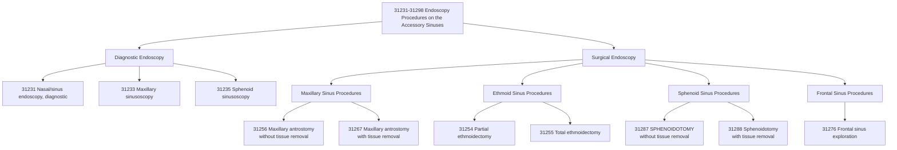

---
tags:
  - cpt
  - ent
  - sinus-surgery
  - fess
  - endoscopic
  - sphenoidotomy
  - sphenoid-sinus
  - rhinology
  - outpatient
  - surgery
  - otolaryngology
cpt: 31287
status: Active ✅
descriptor: Nasal/sinus endoscopy, surgical; with sphenoidotomy
category: Surgical Procedures on the Accessory Sinuses
specialty:
  - Otolaryngology (ENT)
  - Rhinology
  - Head and Neck Surgery
  - Allergy and Immunology
type: Procedure
approach: Endoscopic
anesthesia: General or Local with Sedation
global_days: 90
effective_date: 1994-01-01
last_updated: 2026-01-01
parent_category: Endoscopy Procedures on the Accessory Sinuses (31231-31298)
aliases:
  - Sphenoidotomy
  - Endoscopic sphenoid sinus opening
  - Sphenoid sinus ostium enlargement
  - Surgical sinus endoscopy with sphenoid sinus exploration
sections:
  - Surgical Procedures on the Accessory Sinuses (31231-31298)
  - Endoscopy Procedures on the Accessory Sinuses
cpt_guidelines: Surgical endoscopy includes diagnostic endoscopy
work_rvu_2026: Check CMS MPFS for current value
---

# 🧬CPT Code 31287: Nasal/Sinus Endoscopy, Surgical, with Sphenoidotomy

## 📋 Code Information

| Field | Value |
| :--- | :--- |
| **CPT Code** | [[31287]] |
| **Descriptor** | Nasal/sinus endoscopy, surgical; with sphenoidotomy |
| **Section** | Surgical Procedures on the Accessory Sinuses ([[31231]]-[[31298]]) |
| **Approach** | Endoscopic |
| **Global Period** | **90 days** |
| **Effective Date** | 1994-01-01 |
| **Last Updated** | 2026-01-01 (no change from 2025) |

## 📖 Clinical Description

**CPT [[31287]]** describes a surgical endoscopic procedure to create or enlarge an opening ([[sphenoidotomy]]) in the sphenoid sinus. The surgeon inserts an endoscope into the nasal cavity, gains access to the sphenoid sinus (**located deep in the skull behind the nose**), and opens the sphenoid sinus ostium to improve drainage and ventilation.[1][4]

### Procedure Steps

1.  **Endoscope Insertion**: The surgeon inserts a nasal endoscope to visualize the nasal cavity and identify the sphenoid sinus ostium.
2.  **Access to Sphenoid Sinus**: The natural ostium of the sphenoid sinus is identified, typically medial to the superior turbinate.
3.  **Sphenoidotomy Creation**: The sinus opening is enlarged using surgical instruments such as through-cutting forceps, microdebriders, or curettes.
4.  **Inspection**: The sphenoid sinus may be inspected through the newly created opening to assess for pathology.
5.  **Closure**: There are typically no external incisions; the procedure is performed entirely through the nostrils.

### Indications

- Chronic sphenoid sinusitis refractory to medical management[1]
- Sphenoid sinus **mucocele**
- Fungal sinusitis involving the sphenoid sinus
- Cerebrospinal fluid (**CSF**) leak repair
- Pituitary tumor access (**transsphenoidal approach**)
- Biopsy of sphenoid sinus lesions[4]

## 🔍 Includes and Inclusions

- **Surgical Endoscopy**: Includes diagnostic endoscopy of the nasal cavity and sinuses (do not report [[31231]] separately)
- **Sphenoidotomy**: Creation or enlargement of the sphenoid sinus ostium
- **Unilateral Procedure**: Code describes one side (use modifier [[-50]] for bilateral)
- **Instrumentation**: Use of endoscopic instruments to perform the sphenoidotomy

## 🚫 Excludes and Differentiating Codes

### Do Not Report [[31287]] With

| Code      | Description                                      | Rationale                                               |
| :-------- | :----------------------------------------------- | :------------------------------------------------------ |
| **[[31231]]** | **Diagnostic nasal endoscopy**                       | Bundled into surgical endoscopy                         |
| **[[31288]]** | **Sphenoidotomy with tissue removal**                | More comprehensive; 31287 is component[1][9] |
| **[[31235]]** | **Diagnostic sphenoid sinusoscopy**                  | Diagnostic version                                      |
| **[[31237]]** | **Nasal/sinus endoscopy with biopsy or polypectomy** | Different procedure                                     |

### Code When Tissue Is Removed

**[[31288]] (with removal of tissue from sphenoid sinus)** should be used instead of [[31287]] when the surgeon removes polyps, mucopus, fungal debris, or other tissue from the sphenoid sinus.[1][9]

### Related Codes

| Code      | Description                               |
| :-------- | :---------------------------------------- |
| **[[31254]]** | Partial ethmoidectomy                     |
| **[[31255]]** | Total ethmoidectomy                       |
| **[[31256]]** | Maxillary antrostomy                      |
| **[[31267]]** | Maxillary antrostomy with tissue removal  |
| **[[31276]]** | Frontal sinus exploration                 |
| **[[31295]]** | Balloon dilation of sphenoid sinus ostium |

## 📊 Code Tree and Hierarchy

## 🔄 Modifiers and Billing Nuances

| Modifier | Description                   | Application to 31287                                                                                    |
| :------- | :---------------------------- | :------------------------------------------------------------------------------------------------------ |
| **[[-50]]**  | **Bilateral Procedure**           | Use when procedure is performed on both right and left sphenoid sinuses during same session             |
| **[[-51]]**  | **Multiple Procedures**           | Apply when multiple sinus procedures are performed (e.g., ethmoidectomy + sphenoidotomy)                |
| **[[-59]]**  | **Distinct Procedural Service**   | Use to indicate procedure is distinct from other services performed on same day                         |
| **[[-LT]]**  | **Left side**                     | Used with unilateral procedures to specify left side[6]                                      |
| **[[-RT]]**  | **Right side**                    | Used with unilateral procedures to specify right side[6]                                     |
| **[[-22]]**  | **Increased Procedural Services** | Use when work required is substantially greater than typical (requires documentation)                   |
| **[[-62]]**  | **Two Surgeons**                  | Used when two surgeons work as primary surgeons performing distinct parts of procedure[3][7] |

## 👨‍⚕️ Assistant Surgeon (Modifier [[-80]]) Payability

### Assistant Surgeon Information

- **Assistant Surgeon Status**: Generally not payable as assistant surgeon for routine sinus surgery cases
- **Medicare Payment Indicator**: Check MPFSDB "Asst Surg" indicator for current status:
  - **Indicator 0**: Payment restriction applies; supporting documentation describing medical necessity must be submitted[3]
  - **Indicator 1**: Statutory payment restriction; assistants at surgery will **not** be paid[3]
  - **Indicator 2**: Payment restriction does not apply; assistants at surgery may be paid[3]
  - **Indicator 9**: Concept does not apply (procedure is not a surgery)[3]

### Assistant Surgeon Modifiers[3][7]

| Modifier | Description                                     | Who Uses It                                                        |
| :------- | :---------------------------------------------- | :----------------------------------------------------------------- |
| **[[-80]]**  | **Assistant at Surgery**                            | Physician (MD, DO, DPM) providing full assistance                  |
| **[[-81]]**  | **Minimal Assistant at Surgery**                    | Physician providing minimal assistance during portion of surgery   |
| **[[-82]]**  | **Assistant when Qualified Resident Not Available** | Physician assistant in teaching hospital when resident unavailable |
| **[[-AS]]**  | **Non-Physician Assistant at Surgery**              | PA, NP, RNFA, CNS, surgical technician                             |

### Documentation Requirements for Teaching Hospitals[3]

When the surgery is performed in a teaching hospital, documentation must support one of the following for assistant surgeon reimbursement:
- A statement that **no qualified resident was available** to perform the service
- A statement indicating that **exceptional medical circumstances** exist
- A statement indicating the primary surgeon has an **across-the-board policy** of never involving residents in patient care

## 💰 Work RVU (wRVU) and Reimbursement

### Work RVU Information

The Work Relative Value Units (wRVU) for [[31287]] are updated annually by CMS. For current values:

- **2026 Reference**: Consult the most recent CMS Physician Fee Schedule (**PFS**) Final Rule or the AMA RBRVS DataManager[2]
- **Historical RVU Comparison**: According to historical data, [[31287]] was assigned **9.11 RVUs** compared to [[31288]] at **10.66 RVUs** (a 17% difference)[9]
- **Reimbursement Factors**: Final payment determined by:
  - Total RVUs (**Work + Practice Expense + Malpractice**)
  - Geographic Practice Cost Index (**GPCI**) for your area
  - National conversion factor ($33.40 for 2026 non-APM participants)[2]

### Efficiency Adjustment for 2026[2][10]

CMS has implemented an **efficiency adjustment of -2.5%** to work RVUs for nearly all non-time-based services on the MPFS, including surgical procedures like [[31287]]. This means 2026 wRVU values will be lower than 2025 values for the same work.

### Sample Reimbursement Rates[6]

Private payer rates for [[31287]] vary significantly by geographic location and facility type. Examples from actual claims data show rates ranging from **$650 to $5,213** depending on the ambulatory surgical center and region.[6]

| Facility Location | Rate |
| :--- | :--- |
| Mississippi ASC | $650.00 |
| Georgia ASC | $861.00 |
| Missouri ASC | $890.00 |
| Pennsylvania ASC | $1,650.00 |
| Maryland ASC | $3,623.00 |
| California ASC | $4,498.00 |

## 📋 Documentation Requirements

To support billing of [[31287]], the operative report should clearly document:[9]

- **Preoperative Diagnosis**: Specific sphenoid sinus pathology requiring sphenoidotomy
- **Procedure Performed**: "[[sphenoidotomy]]" or "**sphenoid sinus ostium enlargement**"
- **Laterality**: Right, left, or bilateral
- **Findings**: Description of sinus mucosa, presence of pus, polyps, or other pathology
- **Tissue Removal**: Explicitly state if **no tissue was removed** from the sphenoid sinus (critical distinction between [[31287]] and [[31288]])[9]
- **Extent of Procedure**: Whether other sinuses were addressed
- **Technique**: Instruments used (**forceps, microdebrider, curette, balloon**)

### Critical Documentation Tip[9]

If tissue is removed from the sphenoid sinus, the operative report must clearly document this fact—ideally both in the procedure description at the top and in the body of the report. Without explicit documentation of tissue removal, only [[31287]] (**without tissue removal**) can be billed, resulting in significantly lower reimbursement.

## 📊 ICD-10 Crosswalk and HCC Information

### Common ICD-10 Diagnoses for [[31287]][1][4]

| ICD-10 Code | Description                                                       | HCC Applicability |
| :---------- | :---------------------------------------------------------------- | :---------------- |
| **[[J32.3]]**   | Chronic sphenoidal sinusitis                                      | No (0)            |
| **[[J32.4]]**   | Chronic pansinusitis                                              | No (0)            |
| **[[J32.8]]**   | Other chronic sinusitis                                           | No (0)            |
| **[[J32.9]]**   | Chronic sinusitis, unspecified                                    | No (0)            |
| **[[J33.8]]**   | Other polyp of sinus                                              | No (0)            |
| **[[J34.89]]**  | Other specified disorders of nose and nasal sinuses               | No (0)            |
| **[[J01.3]]**   | Acute sphenoidal sinusitis                                        | No (0)            |
| **[[C31.1]]**   | Malignant neoplasm of ethmoidal sinus                             | Yes (HCC 8 or 10) |
| **[[C31.3]]**   | Malignant neoplasm of sphenoidal sinus                            | Yes (HCC 8 or 10) |
| **[[D14.0]]**   | Benign neoplasm of middle ear, nasal cavity and accessory sinuses | No (0)            |
| **[[D33.3]]**   | Benign neoplasm of cranial nerves (for transsphenoidal approach)  | No (0)            |

### HCC Note

Most [[sinusitis]] and polyp diagnoses are **not** hierarchical condition categories (HCCs) that affect risk adjustment payments. Malignant neoplasms of the sinuses ([[C31.1]], [[C31.3]]) do map to HCCs and impact risk scores.

## 🏥 MS-DRG Assignment

When performed in an inpatient setting (**rare; typically outpatient**), [[31287]] may map to:[5]

| MS-DRG | Description |
| :--- | :--- |
| **135** | Sinus and Mastoid Procedures with MCC |
| **136** | Sinus and Mastoid Procedures without MCC |
| **152** | Otitis media and URI with MCC |
| **153** | Otitis media and URI without MCC |

**Note**: [[31287]] is typically performed in **outpatient/ambulatory surgical center (ASC)** settings and is not usually assigned to inpatient MS-DRGs.[5][6]

## 📝 Coding Examples and Scenarios

### Example 1: Simple Sphenoidotomy
**Scenario**: A 45-year-old with chronic sphenoid sinusitis refractory to antibiotics undergoes endoscopic sinus surgery. The surgeon performs a right sphenoidotomy, enlarging the natural ostium. No polyps or tissue are removed from the sinus.
**Coding**:
- [[31287]] - [[-RT]] (Nasal/sinus endoscopy, surgical, with sphenoidotomy, right side)
- [[J32.3]] (Chronic sphenoidal sinusitis)

### Example 2: Bilateral Sphenoidotomy
**Scenario**: A 52-year-old with bilateral chronic sphenoid sinusitis undergoes endoscopic sinus surgery. The surgeon performs sphenoidotomy on both sides. No tissue is removed from either sinus.
**Coding**:
- [[31287]] - [[-50]] (Nasal/sinus endoscopy, surgical, with sphenoidotomy, bilateral)
- [[J32.8]] (Other chronic sinusitis)

### Example 3: Multiple Sinus Procedures
**Scenario**: A patient undergoes endoscopic sinus surgery including bilateral total ethmoidectomies and bilateral sphenoidotomies without tissue removal.
**Coding**:
- [[31255]] - [[-50]] (Total ethmoidectomy, bilateral)
- [[31287]] - [[-51]] - [[-50]] (Sphenoidotomy, bilateral, multiple procedures)
- *Note: Modifier 51 indicates multiple procedures; Medicare carriers apply multiple procedure payment reduction automatically*

### Example 4: Sphenoidotomy WITH Tissue Removal
**Scenario**: A patient undergoes endoscopic sinus surgery. The surgeon performs bilateral sphenoidotomies and removes polyps from both sphenoid sinuses.
**Coding**:
- **Correct**: [[31288]] - [[-50]] (Sphenoidotomy with tissue removal, bilateral)
- **Incorrect**: [[31287]] - [[-50]] + [[31288]] - [[-50]]
- *Rationale: 31287 is a component of 31288; when tissue is removed, report only 31288*[1][9]

### Example 5: Transsphenoidal Approach for Pituitary Tumor
**Scenario**: A neurosurgeon and an ENT surgeon work together. The ENT surgeon performs an endoscopic sphenoidotomy to provide access to the sella turcica. The neurosurgeon then resects a pituitary tumor through the same approach.
**Coding**:
- **ENT Surgeon**: [[31287]] as primary surgeon (performs distinct procedure)
- **Neurosurgeon**: Appropriate pituitary tumor resection code (e.g., [[61548]]) as primary surgeon[3]
- *Rationale: Each physician bills their distinct procedure as primary surgeon with own operative report documenting their specific contribution*

### Example 6: Incorrect Reporting of Diagnostic Endoscopy
**Scenario**: Surgeon performs diagnostic sphenoid sinusoscopy followed by sphenoidotomy. Coder reports [[31235]] and [[31287]].
**Coding**:
- **Correct**: [[31287]] only
- **Incorrect**: [[31235]] + [[31287]]
- *Rationale: Surgical endoscopy includes diagnostic endoscopy; do not report separately*

## ⚠️ Important Coding Notes

### 31287 vs. 31288 Distinction

The critical factor in choosing between [[31287]] and [[31288]] is **whether tissue was removed from the sphenoid sinus**:

| Factor | 31287 | 31288 |
| :--- | :--- | :--- |
| **Sphenoidotomy** | ✓ Yes | ✓ Yes |
| **Tissue Removal** | ✗ No | ✓ Yes |
| **Polypectomy** | ✗ No | ✓ Yes |
| **Mucosal Stripping** | ✗ No | ✓ Yes |
| **Fungal Debris Removal** | ✗ No | ✓ Yes |
| **Biopsy** | ✗ No | ✓ Yes |

### RVU Impact of Tissue Removal

The difference in reimbursement between the two procedures is significant:
- [[31287]]: **9.11 RVUs** (historical reference)
- [[31288]]: **10.66 RVUs** (historical reference)
- **Difference**: 17% higher reimbursement when tissue removal is documented

### NCCI Edits

- [[31287]] is a component of [[31288]] and should **not** be reported together
- Surgical endoscopy codes bundle the associated diagnostic endoscopy ([[31231]], [[31235]])
- Multiple sinus procedures may be reported together with modifier [[-51]]

### Bilateral Surgery

- Use modifier [[-50]] for bilateral procedures
- Medicare typically pays 150% of the unilateral fee for bilateral procedures (75% per side)

### Place of Service

Common places of service for [[31287]] include:
- **24** - Ambulatory Surgical Center
- **22** - On Campus Outpatient Hospital

## References

1 NIH/NCBI. "Table 1. Inclusion Diagnostic ICD-9 Codes for Chronic Rhinosinusitis and CPT Codes for Endoscopic and Open Sinus Surgery." (PMC3624614)
2 American Urological Association. "Final Rule: CY 2026 Medicare Physician Fee Schedule Summary." (2025)
3 DEX Diagnostics Exchange. "CPT Modifier 80." (2025)
4 MD Clarity. "ICD Code J32.8: What It Is & When to Use." (2026)
5 CMS. "ICD-10-CM/PCS MS-DRG v35.0 Definitions Manual." (2017)
6 PayerPrice. "CPT 31287 Fee Schedule." (2026)
7 Priority Health. "Modifiers 80, 81, 82, assistant at surgery." (2025)
8 Brainly. "Patient underwent endoscopic right maxillary antrostomy. report code _____." (2023)
9 AAPC. "Correctly Documenting Endoscopic Tissue Removal can Increase Pay Up." (2000)
10 Gallagher. "Revised CMS Efficiency Credit May Reduce Payment for Some Specialty Procedures." (2026)