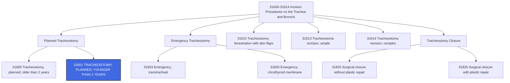

---
tags:
  - cpt
  - ent
  - tracheostomy
  - pediatric
  - airway
  - ventilation
  - infant
  - neonate
  - surgery
  - critical-care
  - otolaryngology
cpt: 31601
descriptor: Tracheostomy, planned (separate procedure); younger than 2 years
category: Surgical Procedures on the Trachea and Bronchi
specialty:
  - Otolaryngology (ENT)
  - Pediatric Otolaryngology
  - Pediatric Surgery
  - Critical Care
  - Pulmonology
type: Procedure
approach: Open
anesthesia: General
global_days: 0 (Medicare) / 15 (many private payers)
effective_date: 2006-01-01
last_updated: 2026-01-01
parent_category: Incision Procedures on the Trachea and Bronchi (31600-31614)
aliases:
  - Pediatric tracheostomy
  - Infant tracheostomy
  - Planned tracheostomy under 2 years
  - Tracheostomy in children under 2
sections:
  - Incision Procedures on the Trachea and Bronchi (31600-31614)
  - Tracheostomy Procedures
cpt_guidelines: Planned tracheostomy performed as a separate procedure on patients younger than two years
work_rvu_2026: Consult CMS MPFS for current value; historical reference- 7.78 RVUs (2001 data)
---
# CPT Code 31601: Tracheostomy, Planned (Separate Procedure); Younger Than 2 Years

## 📋 Code Information

| Field | Value |
| :--- | :--- |
| **CPT Code** | [[31601]] |
| **Descriptor** | Tracheostomy, planned (separate procedure); younger than 2 years |
| **Section** | Incision Procedures on the Trachea and Bronchi ([[31600]]-[[31614]]) |
| **Approach** | Open surgical |
| **Global Period** | **0 days** (Medicare), **15 days** (many private payers)[10] |
| **Effective Date** | 2006-01-01 (current descriptor) |
| **Last Updated** | 2026-01-01 (no change from 2025) |

## 📖 Clinical Description

**Cpt [[31601]]** represents a planned (non-emergency) tracheostomy procedure performed on a patient younger than two years old. A tracheostomy is a surgical procedure in which the provider exposes the trachea (windpipe) and creates an opening to establish an alternative airway. This procedure is critical for pediatric patients with obstructed airways or those requiring long-term ventilatory support.[4][8]

### Procedure Steps[8]

1.  **Patient Preparation**: The patient is appropriately prepped and anesthetized in a controlled operating room setting.
2.  **Incision**: The provider makes a neck incision and carefully divides the overlying muscles to expose the trachea.
3.  **Thyroid Management**: If necessary, the provider may excise or divide the thyroid isthmus to gain better access to the trachea.
4.  **Tracheal Opening**: An opening is created in the trachea, typically between the second and third tracheal rings.
5.  **Tube Insertion**: A tracheostomy tube is inserted to facilitate breathing and maintain the airway.
6.  **Securing**: The provider sutures the skin to the adjacent tissues to secure the opening and ensure the tracheostomy site is stable.
7.  **Closure**: The incision is closed around the tracheostomy tube.

### Indications for Pediatric Tracheostomy[8]

- Prolonged intubation requiring long-term ventilatory support
- Congenital airway anomalies (e.g., subglottic stenosis, laryngeal webs)
- Severe respiratory distress or obstruction
- Neuromuscular disorders affecting ventilation
- Tracheal stenosis or malacia
- Bilateral vocal cord paralysis
- Craniofacial abnormalities affecting airway patency

## 🔍 Includes and Inclusions

- **Planned Procedure**: Performed in a controlled, non-emergency setting[6][8]
- **Pediatric Population**: Specifically for patients **younger than two years**[4][6][8]
- **Separate Procedure**: Can be reported alone or with unrelated procedures using modifier [[59]][6][10]
- **Airway Access**: Creation of a stoma for ventilation and secretion management

## 🚫 Excludes and Differentiating Codes

### Emergency Tracheostomy Codes

| Code      | Description                                              | When to Use                                                            |
| :-------- | :------------------------------------------------------- | :--------------------------------------------------------------------- |
| **[[31603]]** | **Tracheostomy, emergency procedure; transtracheal**         | True emergency when airway is immediately threatened[6][10] |
| **[[31605]]** | **Tracheostomy, emergency procedure; cricothyroid membrane** | Emergency access through cricothyroid membrane[6][10]       |

### Other Tracheostomy Codes

| Code      | Description                                          | Differentiating Factor                                      |
| :-------- | :--------------------------------------------------- | :---------------------------------------------------------- |
| **[[31600]]** | **Tracheostomy, planned; older than 2 years**            | For patients **2 years and older**[6]            |
| **[[31610]]** | **Tracheostomy, fenestration procedure with skin flaps** | Permanent stoma creation[6][10]                  |
| **[[31500]]** | **Intubation, endotracheal, emergency procedure**        | Not a tracheostomy; temporary tube placement[10] |

### Procedures Not Reported with [[31601]]

| Situation | Rationale |
| :--- | :--- |
| Tracheostomy as part of laryngectomy ([[31360]]-[[31390]]) | Tracheostomy is integral to the larger procedure[6][10] |
| Tracheostomy with large glossectomy ([[41140]]-[[41145]]) | Tracheostomy is integral to the procedure[6] |
| Diagnostic endoscopy alone | Use appropriate endoscopy codes |

## 📊 Code Tree and Hierarchy

## 🔄 Modifiers and Billing Nuances

### Applicable Modifiers for [[31601]][1][6][7]

| Modifier | Description                                   | Application                                                                                                                                               |
| :------- | :-------------------------------------------- | :-------------------------------------------------------------------------------------------------------------------------------------------------------- |
| **[[59]]**   | **Distinct Procedural Service**                   | Use when tracheostomy is performed for a different reason than the primary procedure (e.g., airway management during unrelated surgery)[6][10] |
| **[[63]]**   | **Procedure Performed on Infants less than 4 kg** | May be appended when procedure is performed on extremely low-birth-weight infants to indicate increased complexity[6]                          |
| **[[22]]**   | **Increased Procedural Services**                 | Use when work required is substantially greater than typical (requires documentation)[1]                                                       |
| **[[51]]**   | **Multiple Procedures**                           | Applied when multiple procedures performed during same session; Medicare applies automatically[1]                                              |
| **[[50]]**   | **Bilateral Procedure**                           | Not applicable to tracheostomy (midline procedure)                                                                                                        |
| **[[52]]**   | **Reduced Services**                              | Use when service is partially reduced or eliminated[1]                                                                                         |
| **[[53]]**   | **Discontinued Procedure**                        | Use if procedure started but discontinued due to extenuating circumstances[1]                                                                  |
| **[[76]]**   | **Repeat Procedure by Same Physician**            | Use if procedure repeated on same day[1]                                                                                                       |
| **[[77]]**   | **Repeat Procedure by Another Physician**         | Use if procedure repeated by different physician on same day[1]                                                                                |
| **[[78]]**   | **Unplanned Return to OR**                        | Use for related procedure during postoperative period[1]                                                                                       |
| **[[79]]**   | **Unrelated Procedure**                           | Use for unrelated procedure during postoperative period[1]                                                                                     |

### Important Modifier Notes

- **Modifier [[59]] with Tracheostomy**: When a planned tracheostomy is performed during the same session as another procedure but for a different reason, append modifier [[59]] to [[31601]] to indicate it is a distinct service[6][10]
- **Infant Weight Consideration**: Modifier [[63]] may be appropriate for neonates under 4 kg to capture the increased complexity of surgery on extremely small patients[6]

## 👨‍⚕️ Assistant Surgeon (Modifier [[80]]) Payability

### Assistant Surgeon Status for Tracheostomy Codes[6]

| Code      | Assistant Surgeon Indicator | Payability                                                   |
| :-------- | :-------------------------- | :----------------------------------------------------------- |
| **[[31600]]** | **1**                       | Payment restrictions apply; assistant not typically paid     |
| **[[31601]]** | **2**                       | **Payment restrictions do NOT apply**; assistant may be paid |
| **[[31603]]** | **1**                       | Payment restrictions apply                                   |
| **[[31605]]** | **1**                       | Payment restrictions apply                                   |
| **[[31610]]** | **1**                       | Payment restrictions apply                                   |

### Assistant Surgeon Modifiers[7]

| Modifier | Description                                               |
| :------- | :-------------------------------------------------------- |
| **[[80]]**   | Assistant Surgeon (physician)                             |
| **[[81]]**   | Minimum Assistant Surgeon                                 |
| **[[82]]**   | Assistant Surgeon (when qualified resident not available) |
| **[[AS]]**   | Non-Physician Assistant at Surgery (PA, NP, RNFA)         |

### Clinical Justification for Assistant[6]

Because [[31601]] has an indicator **2**, payers may reimburse for an assistant surgeon when extenuating circumstances justify the need. Good documentation should support:

- Patient's small size or young age
- Anatomical challenges or congenital anomalies
- Complexity of the procedure
- Medical necessity for two surgeons

**Documentation Tip**: Include a brief statement in the operative report explaining why an assistant surgeon was necessary (e.g., "Due to the patient's extremely small size and complex airway anatomy, an assistant surgeon was required to ensure safe and efficient completion of the procedure.")

## 💰 Work RVU (wRVU) and Reimbursement

### Work RVU Information

The Work Relative Value Units (wRVU) for [[31601]] are updated annually by CMS. For current values:

- **2026 Reference**: Consult the most recent CMS Physician Fee Schedule (PFS) Final Rule or the AMA RBRVS DataManager[1][2]
- **Historical RVU Reference**: According to historical data (2001), [[31601]] was valued at **7.78 RVUs** compared to [[31600]] at **6.26 RVUs**, reflecting the increased complexity of pediatric tracheostomy[10]
- **Reimbursement Factors**: Final payment determined by:
  - Total RVUs (Work + Practice Expense + Malpractice)
  - Geographic Practice Cost Index (GPCI) for your area
  - National conversion factor ($33.40 for 2026 non-APM participants)[2]

### Medicare Administrative Contractor (MAC) Considerations[1]

Reimbursement may vary based on:
- Local Coverage Determinations (LCDs) in your region
- Specific MAC policies regarding medical necessity
- Documentation requirements for pediatric tracheostomy

## 📋 Documentation Requirements

To support billing of [[31601]], the operative report should clearly document:[8]

- **Preoperative Diagnosis**: Specific indication for tracheostomy (e.g., "subglottic stenosis," "prolonged ventilatory dependence")
- **Procedure Performed**: "Planned tracheostomy" or "tracheostomy with tube placement"
- **Patient Age**: Explicitly state patient's age (must be **younger than 2 years**)
- **Timing**: Documentation that procedure was **planned**, not emergent
- **Technique**: Description of incision, thyroid management, tracheal opening, and tube placement
- **Tube Type**: Size and type of tracheostomy tube inserted
- **Findings**: Description of airway anatomy and any unexpected findings
- **Separate Procedure Justification**: If performed with other procedures, document the distinct reason for tracheostomy

### Critical Documentation Elements[6]

| Element | Why It Matters |
| :--- | :--- |
| **Patient Age** | Justifies use of 31601 vs. 31600 |
| **Planned vs. Emergency** | Distinguishes from 31603/31605 |
| **Separate Procedure Status** | Supports separate reporting if performed with other surgeries |

## 📊 ICD-10 Crosswalk and HCC Information

### Common ICD-10 Diagnoses for Pediatric Tracheostomy[8]

| ICD-10 Code | Description                                                                  | HCC Applicability |
| :---------- | :--------------------------------------------------------------------------- | :---------------- |
| **[[J38.6]]**   | **Stenosis of larynx**                                                           | Varies            |
| **[[J38.00]]**  | **Paralysis of vocal cords and larynx, unspecified**                             | Varies            |
| **[[J39.8]]**   | **Other specified diseases of upper respiratory tract**                          | No (0)            |
| **[[J96.10]]**  | **Chronic respiratory failure, unspecified whether with hypoxia or hypercapnia** | Varies            |
| **[[J96.11]]**  | **Chronic respiratory failure with hypoxia**                                     | Varies            |
| **[[J96.12]]**  | **Chronic respiratory failure with hypercapnia**                                 | Varies            |
| **[[P27.1]]**   | **Bronchopulmonary dysplasia originating in the perinatal period**               | Varies            |
| **[[Q31.2]]**   | **Laryngeal hypoplasia**                                                         | No (0)            |
| **[[Q31.5]]**   | **Congenital laryngomalacia**                                                    | No (0)            |
| **[[Q31.8]]**   | **Other congenital malformations of larynx**                                     | No (0)            |
| **[[Q32.1]]**   | **Other congenital malformations of trachea**                                    | No (0)            |
| **[[Q32.4]]**   | **Congenital tracheomalacia**                                                    | No (0)            |
| **[[Q67.1]]**   | **Congenital compression facies**                                                | No (0)            |
| **[[G70.00]]**  | **Myasthenia gravis**                                                            | Varies            |
| **[[G70.2]]**   | **Congenital and developmental myasthenia**                                      | Varies            |
| **[[G12.9]]**   | **Spinal muscular atrophy, unspecified**                                         | Varies            |
| **[[G12.1]]**   | **Other inherited spinal muscular atrophy**                                      | Varies            |
| **[[Z99.11]]**  | **Dependence on respirator**                                                     | No (0)            |

### HCC Note

HCC (Hierarchical Condition Category) applicability varies based on the specific diagnosis. Chronic respiratory failure and neuromuscular disorders may impact risk adjustment scores in Medicare Advantage populations, though many pediatric tracheostomy patients are not in Medicare risk models. The tracheostomy code itself is a procedure code and does not contribute to HCC risk scores.

## 🏥 MS-DRG Assignment

When performed in an inpatient setting, tracheostomy procedures map to the following Medicare Severity-Diagnosis Related Groups (MS-DRGs):[3]

| MS-DRG | Description |
| :--- | :--- |
| **003** | ECMO OR TRACHEOSTOMY WITH MV >96 HOURS OR PDX EXCEPT FACE, MOUTH AND NECK WITH MAJOR O.R. PROCEDURE |
| **004** | TRACHEOSTOMY WITH MV >96 HOURS OR PDX EXCEPT FACE, MOUTH AND NECK WITHOUT MAJOR O.R. PROCEDURE |

### ICD-10-PCS Procedure Codes for Tracheostomy[3]

For hospital inpatient coding, tracheostomy procedures are reported with ICD-10-PCS codes:

| Approach                | ICD-10-PCS Code | Description                                                                            |
| :---------------------- | :-------------- | :------------------------------------------------------------------------------------- |
| **Open**                    | **[[0B110F4]]**     | Bypass Trachea to Cutaneous with Tracheostomy Device, Open Approach                    |
| **Open**                    | **[[0B110Z4]]**     | Bypass Trachea to Cutaneous, Open Approach                                             |
| **Percutaneous Endoscopic** | **[[0B114F4]]**     | Bypass Trachea to Cutaneous with Tracheostomy Device, Percutaneous Endoscopic Approach |
| **Percutaneous Endoscopic** | **[[0B114Z4]]**     | Bypass Trachea to Cutaneous, Percutaneous Endoscopic Approach                          |

## 📝 Coding Examples and Scenarios

### Example 1: Planned Tracheostomy for Prolonged Ventilation
**Scenario**: A 10-month-old infant with bronchopulmonary dysplasia has been intubated for 6 weeks. The attending physician requests a tracheostomy for long-term ventilatory support. The otolaryngologist performs a planned tracheostomy.
**Coding**:
- [[31601]] (Tracheostomy, planned; younger than 2 years)
- [[P27.1]] (Bronchopulmonary dysplasia originating in the perinatal period)
- [[Z99.11]] (Dependence on respirator)

### Example 2: Tracheostomy with Laryngoscopy - Different Reasons
**Scenario**: A 15-month-old child with suspected laryngeal tumor requires direct laryngoscopy with biopsy. Because of concern about potential airway edema post-biopsy, the otolaryngologist performs a planned tracheostomy at the same time to secure the airway. The tracheostomy is performed for airway protection, not as part of the biopsy procedure.
**Coding**:
- [[31535]] (Laryngoscopy, direct, operative, with biopsy)
- [[31601]] - [[59]] (Tracheostomy, planned; younger than 2 years, distinct procedural service)
- *Rationale: Tracheostomy is performed for a different reason (airway protection) than the primary procedure (biopsy) and qualifies for separate reporting with modifier 59.*[6][10]

### Example 3: Neonatal Tracheostomy with Modifier 63
**Scenario**: A 3-week-old neonate weighing 3.2 kg with congenital subglottic stenosis undergoes a planned tracheostomy. The procedure is technically challenging due to the patient's small size.
**Coding**:
- [[31601]] - [[63]] (Tracheostomy, planned; younger than 2 years, procedure performed on infant less than 4 kg)
- [[Q31.8]] (Other congenital malformations of larynx)
- *Rationale: Modifier 63 indicates the increased complexity of performing this procedure on an extremely small infant.*[6]

### Example 4: Planned Tracheostomy with Assistant Surgeon
**Scenario**: A 6-month-old with complex congenital heart disease and prolonged intubation requires a tracheostomy. Due to the patient's tenuous cardiac status and small size, an assistant surgeon is necessary to complete the procedure safely.
**Coding**:
- [[31601]] (Tracheostomy, planned; younger than 2 years) [primary surgeon]
- [[31601]] - [[80]] (Tracheostomy, planned; younger than 2 years) [assistant surgeon]
- *Rationale: 31601 has an assistant surgeon indicator of 2, meaning payment restrictions do not apply. Documentation should support the medical necessity for an assistant.*[6]

### Example 5: Tracheostomy as Integral Part of Laryngectomy - Do Not Report Separately
**Scenario**: A 22-month-old undergoes total laryngectomy for extensive laryngeal malignancy. A tracheostomy is performed as part of the procedure.
**Coding**:
- **Correct**: [[31360]] (Laryngectomy, total, without radical neck dissection)
- **Incorrect**: [[31360]] + [[31601]]
- *Rationale: Tracheostomy is considered integral to laryngectomy and should not be reported separately.*[6][10]

### Example 6: Emergency vs. Planned Distinction
**Scenario**: An 18-month-old presents to the emergency department with acute upper airway obstruction and stridor. The patient is rushed to the operating room for immediate tracheostomy.
**Coding**:
- **Correct**: [[31603]] (Tracheostomy, emergency procedure; transtracheal)
- **Incorrect**: [[31601]]
- *Rationale: Even though the patient is under 2 years, the emergent nature of the procedure requires an emergency tracheostomy code.*[6][8]

## ⚠️ Important Coding Notes

### "Separate Procedure" Designation[6][10]

[[31601]] is designated as a "separate procedure." This means:

- It should **not** be reported when performed as an integral part of another procedure (e.g., laryngectomy)
- It **may** be reported when performed:
  - **Alone**
  - **For a different reason** than the primary procedure (requires modifier [[59]])

### Planned vs. Emergency Distinction[6]

| Factor | Planned (31600-31601) | Emergency (31603-31605) |
| :--- | :--- | :--- |
| **Timing** | Scheduled, controlled setting | Immediate, unscheduled |
| **Setting** | Typically OR | Can be ED, bedside, OR |
| **Patient Status** | Often intubated, stable | Acute airway compromise |
| **Examples** | Long-term vent, elective | Acute obstruction, failed intubation |

### Age Distinction: 31600 vs. 31601[4][6][8]

- **[[31600]]**: For patients **2 years and older** (including adults)
- **[[31601]]**: For patients **younger than 2 years**

### Tracheostomy Tube Changes[10]

- **[[31502]]**: Tracheotomy tube change prior to establishment of fistula tract (typically within first week)
- **After fistula established**: Tube change is included in E/M service; no separate code

### Global Period Variations[10]

| Payer | Global Period for 31601 |
| :--- | :--- |
| **Medicare** | **0 days** |
| **Many Private Payers** | **15 days** |

**Billing Strategy**: Assume 0-day global per Medicare guidelines when billing commercial carriers. If denied due to 15-day global, write off at that time.[10]

### Post-Operative Visits[10]

- With **0-day global**, E/M visits are separately payable the day after surgery
- Document medical necessity for all post-operative visits

## 🔗 Related Procedures

### Tracheostoma Revision

| Code      | Description                                          |
| :-------- | :--------------------------------------------------- |
| **[[31613]]** | Tracheostoma revision; simple, without flap rotation |
| **[[31614]]** | Tracheostoma revision; complex, with flap rotation   |

### Tracheostomy Closure

| Code      | Description                                                      |
| :-------- | :--------------------------------------------------------------- |
| **[[31820]]** | Surgical closure tracheostomy or fistula; without plastic repair |
| **[[31825]]** | Surgical closure tracheostomy or fistula; with plastic repair    |

## References

1 MD Clarity. "CPT Code 31601: What It Is, Modifiers, Reimbursement." (2026)
2 Find-A-Code. "News You Can Use: Use Updated Guidelines to Allow for Multiple Unlisted Procedures." (2024)
3 CMS. "ICD-10-CM/PCS MS-DRG v37.0 Definitions Manual." (2019)
4 AAPC. "CPT® Code 31601 - Incision Procedures on the Trachea and Bronchi." (2026)
5 Wellpoint. "Professional system updates for 2026." (2025)
6 AAPC. "Answer Five Questions to Determine the Appropriate Trach Code." (2003, reviewed 2015)
7 Find-A-Code. "CPT® Modifier - Medical Codes." (2026)
8 Coding Ahead. "How To Use CPT Code 31601." (2025)
9 MedLearn Publishing. "Peripheral & Cardiology Coder – 2026 Edition." (2026)
10 AAPC. "Visits After Trach Are Often Payable, but Trach Changes Usually Aren't." (2001)