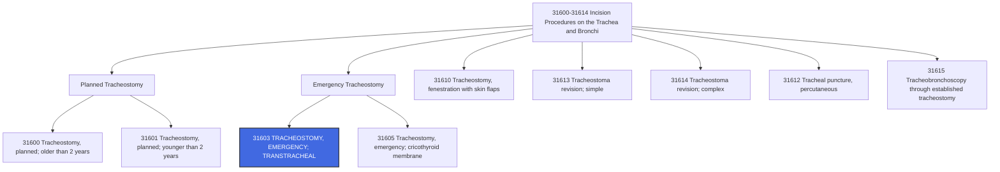

# 🧬 CPT Code 31603: Tracheostomy, Emergency Procedure; Transtracheal

## 📋 Code Information

| Field | Value |
| :--- | :--- |
| **CPT Code** | [[31603]] |
| **Descriptor** | Tracheostomy, emergency procedure; transtracheal |
| **Section** | Incision Procedures on the Trachea and Bronchi ([[31600]]-[[31614]]) |
| **Approach** | Open surgical (emergency) |
| **Global Period** | 0 days |
| **Effective Date** | 1990 (approx.) |
| **Last Updated** | 2026-01-01 (no change from 2025) |

## 📖 Clinical Description

**[[31603]]** describes an emergency surgical procedure to create an opening into the trachea (windpipe) when a patient's airway is immediately compromised and there is no time for a planned, elective tracheostomy. This is a life-saving intervention performed when the patient is in acute respiratory distress or obstruction and cannot be intubated or ventilated by other means.[1][4][7]

### Procedure Steps[1][7]

1.  **Emergency Assessment**: The patient presents with acute airway obstruction, stridor, or respiratory failure requiring immediate intervention.
2.  **Incision**: The surgeon makes an incision directly into the trachea, typically between the second and third tracheal rings.
3.  **Airway Establishment**: An opening is created to allow air to enter the trachea, bypassing any upper airway obstruction.
4.  **Tube Insertion**: A tracheostomy tube is inserted to maintain the airway and facilitate ventilation.
5.  **Securing**: The tube is secured in place, and the patient is stabilized.

### Indications[1][7][10]

- Acute upper airway obstruction (foreign body, trauma, edema, tumor)
- Failed endotracheal intubation with inability to ventilate
- Severe facial or neck trauma compromising the airway
- Anaphylaxis with life-threatening laryngeal edema
- Epiglottitis with impending airway compromise
- Bilateral vocal cord paralysis with acute obstruction

### Emergency vs. Planned Distinction[1][7][10]

The critical distinction between [[31603]] and planned tracheostomy codes ([[31600]]-[[31601]]) is the **urgency and immediacy** of the procedure:

| Factor | Emergency (31603) | Planned (31600-31601) |
| :--- | :--- | :--- |
| **Timing** | Immediate, life-threatening | Scheduled, controlled setting |
| **Patient Status** | Acute airway compromise | Often intubated, stable |
| **Setting** | ED, bedside, ICU, OR | Typically OR |
| **Definition** | "Patient is immediately imperiled if physician doesn't perform the procedure"[10] | "Patient may obstruct sometime and physician schedules the procedure"[1] |

## 🔍 Includes and Inclusions

- **Emergency Tracheostomy**: Performed under emergent conditions for acute airway rescue[1][4][7]
- **Transtracheal Approach**: Incision made directly into the trachea (between second and third rings)[1][7]
- **All Ages**: Code applies to patients of any age (unlike [[31601]] which is age-specific)[7]
- **Life-Saving Intervention**: Procedure performed to prevent imminent death from airway obstruction

## 🚫 Excludes and Differentiating Codes

### Emergency Tracheostomy Codes

| Code | Description | Differentiating Factor |
| :--- | :--- | :--- |
| [[31603]] | Tracheostomy, emergency procedure; **transtracheal** | Incision into trachea (between 2nd-3rd rings) – more common[1][7][10] |
| [[31605]] | Tracheostomy, emergency procedure; **cricothyroid membrane** | Incision into cricothyroid membrane – easier but risks vocal cords[1][7][10] |

### Planned Tracheostomy Codes

| Code | Description | Differentiating Factor |
| :--- | :--- | :--- |
| [[31600]] | Tracheostomy, planned; older than 2 years | Scheduled, non-emergency |
| [[31601]] | Tracheostomy, planned; younger than 2 years | Scheduled, pediatric |
| [[31610]] | Tracheostomy, fenestration with skin flaps | Permanent stoma creation |

### Related Emergency Airway Codes

| Code | Description | Notes |
| :--- | :--- | :--- |
| [[31500]] | Intubation, endotracheal, emergency procedure | Temporary tube, not tracheostomy[3] |
| [[31612]] | Tracheal puncture, percutaneous with transtracheal aspiration and/or injection | Different procedure[3] |

### Procedures Not Reported with [[31603]]

| Situation | Rationale |
| :--- | :--- |
| Planned tracheostomy (same session) | Mutually exclusive – cannot be both planned and emergent |
| Endotracheal intubation only | Different procedure (use [[31500]]) |

## 📊 Code Tree and Hierarchy

## 🔄 Modifiers and Billing Nuances

### Applicable Modifiers for [[31603]][1]

| Modifier | Description | Application |
| :--- | :--- | :--- |
| [[22]] | Increased Procedural Services | Use when work required is substantially greater than typical (e.g., difficult anatomy, excessive bleeding) |
| [[51]] | Multiple Procedures | Apply when multiple procedures performed during same session; Medicare applies automatically |
| [[52]] | Reduced Services | Rare for emergency procedure |
| [[53]] | Discontinued Procedure | Use if procedure started but discontinued due to patient instability |
| [[59]] | Distinct Procedural Service | Use when performed with other procedures for different reasons |
| [[63]] | Procedure on Infants less than 4 kg | May be appended to indicate increased complexity in neonates[1] |
| [[76]] | Repeat Procedure by Same Physician | Use if procedure repeated on same day |
| [[77]] | Repeat Procedure by Another Physician | Use if repeated by different physician |
| [[78]] | Unplanned Return to OR | Use for related procedure during postoperative period |
| [[79]] | Unrelated Procedure | Use for unrelated procedure during postoperative period |

### Important Modifier Notes

- **Modifier [[59]] with Emergency Tracheostomy**: If performed during same session as other procedures for distinct reasons, modifier [[59]] may be appropriate[1]
- **Modifier [[63]] for Neonates**: For infants under 4 kg, modifier [[63]] indicates increased complexity[1]

## 👨‍⚕️ Assistant Surgeon (Modifier [[80]]) Payability

### Assistant Surgeon Status for Tracheostomy Codes[1]

| Code | Assistant Surgeon Indicator | Payability |
| :--- | :--- | :--- |
| [[31600]] | **1** | Payment restrictions apply; assistant not typically paid |
| [[31601]] | **2** | **Payment restrictions do NOT apply**; assistant may be paid |
| [[31603]] | **1** | **Payment restrictions apply**; assistant not typically paid |
| [[31605]] | **1** | Payment restrictions apply |
| [[31610]] | **1** | Payment restrictions apply |

### Assistant Surgeon Modifiers

| Modifier | Description |
| :--- | :--- |
| [[80]] | Assistant Surgeon (physician) |
| [[81]] | Minimum Assistant Surgeon |
| [[82]] | Assistant Surgeon (when qualified resident not available) |
| [[AS]] | Non-Physician Assistant at Surgery (PA, NP, RNFA) |

### Documentation Requirements for Teaching Hospitals

When the surgery is performed in a teaching hospital, documentation must support one of the following for assistant surgeon reimbursement:
- A statement that **no qualified resident was available** to perform the service
- A statement indicating that **exceptional medical circumstances** exist
- A statement indicating the primary surgeon has an **across-the-board policy** of never involving residents in patient care

### Clinical Justification for Assistant

Because [[31603]] has an indicator **1**, payers generally will **not** reimburse for an assistant surgeon. In rare extenuating circumstances, documentation would need to clearly support medical necessity.

## 💰 Work RVU (wRVU) and Reimbursement

### Work RVU Information

The Work Relative Value Units (wRVU) for [[31603]] are updated annually by CMS. For current values:

- **2026 Reference**: Consult the most recent CMS Physician Fee Schedule (PFS) Final Rule or the AMA RBRVS DataManager[2][5]
- **Reimbursement Factors**: Final payment determined by:
  - Total RVUs (Work + Practice Expense + Malpractice)
  - Geographic Practice Cost Index (GPCI) for your area
  - National conversion factor

### 2026 Medicare Payment Updates[2][5]

| Factor | Value |
| :--- | :--- |
| **Conversion Factor (non-QP)** | $33.4009 |
| **Conversion Factor (QP)** | $33.5675 |
| **Efficiency Adjustment** | -2.5% applied to work RVUs for non-time-based codes, including [[31603]][2][5][8] |

**Important Note**: CMS has finalized a -2.5% productivity/efficiency adjustment applied to work RVUs for approximately 7,700 non-time-based codes, including emergency tracheostomy. This will affect the 2026 wRVU values compared to prior years.[2][8]

### Medicare Administrative Contractor (MAC) Considerations

Reimbursement may vary based on:
- Local Coverage Determinations (LCDs) in your region
- Specific MAC policies regarding medical necessity
- Documentation requirements for emergency procedures

## 📋 Documentation Requirements

To support billing of [[31603]], the operative report should clearly document:[1][7][10]

- **Emergency Nature**: Explicit documentation that the procedure was emergent and life-saving
- **Indication**: Specific reason for emergency airway intervention (e.g., "acute airway obstruction," "failed intubation," "impending respiratory arrest")
- **Timing**: Description of the urgent/emergent circumstances
- **Incision Site**: Documentation that incision was **transtracheal** (between 2nd-3rd tracheal rings) – critical for differentiating from [[31605]][7][10]
- **Findings**: Description of airway anatomy and any obstruction encountered
- **Tube Type**: Size and type of tracheostomy tube inserted
- **Patient Stability**: Description of patient's condition before and after procedure

### Critical Documentation Elements[1][7]

| Element | Why It Matters |
| :--- | :--- |
| **Emergency Justification** | Supports use of 31603 vs. planned codes |
| **Incision Location** | Distinguishes 31603 (transtracheal) from 31605 (cricothyroid) |
| **Timing Description** | Documents emergent nature |
| **Patient Condition** | Supports medical necessity |

## 📊 ICD-10 Crosswalk and HCC Information

### Common ICD-10 Diagnoses for Emergency Tracheostomy[3][9]

| ICD-10 Code | Description | HCC Applicability |
| :--- | :--- | :--- |
| [[J38.6]] | Stenosis of larynx | Varies |
| [[J38.00]] | Paralysis of vocal cords and larynx, unspecified | Varies |
| [[J04.11]] | Acute tracheitis with obstruction[3] | No (0) |
| [[J95.04]] | Tracheo-esophageal fistula following tracheostomy[3] | No (0) |
| [[J95.00]] | Unspecified tracheostomy complication[3][9] | No (0) |
| [[J95.09]] | Other tracheostomy complication[9] | No (0) |
| [[S11.022A]] | Laceration with foreign body of trachea, initial encounter[3] | No (0) |
| [[S11.029A]] | Unspecified open wound of trachea, initial encounter[3] | No (0) |
| [[S19.82XA]] | Other specified injuries of cervical trachea, initial encounter[3][9] | No (0) |
| [[S27.53XA]] | Laceration of thoracic trachea, initial encounter[3] | No (0) |
| [[T17.8]] | Foreign body in other parts of respiratory tract | No (0) |
| [[T17.9]] | Foreign body in respiratory tract, part unspecified | No (0) |
| [[R06.0]] | Dyspnea | No (0) |
| [[R06.3]] | Periodic breathing | No (0) |
| [[R09.2]] | Respiratory arrest | No (0) |

### Status Codes for Post-Tracheostomy Care[3][9]

| ICD-10 Code | Description | HCC Applicability |
| :--- | :--- | :--- |
| [[Z43.0]] | Encounter for attention to tracheostomy[3][9] | No (0) |
| [[Z93.0]] | Tracheostomy status[3][9] | No (0) |

### HCC Note

Most tracheostomy and airway diagnoses are **not** hierarchical condition categories (HCCs) that affect risk adjustment payments. They are captured for coding completeness but do not typically impact risk scores.

## 🏥 MS-DRG Assignment

When performed in an inpatient setting, emergency tracheostomy maps to the following Medicare Severity-Diagnosis Related Groups (MS-DRGs):

| MS-DRG | Description |
| :--- | :--- |
| **003** | ECMO OR TRACHEOSTOMY WITH MV >96 HOURS OR PDX EXCEPT FACE, MOUTH AND NECK WITH MAJOR O.R. PROCEDURE |
| **004** | TRACHEOSTOMY WITH MV >96 HOURS OR PDX EXCEPT FACE, MOUTH AND NECK WITHOUT MAJOR O.R. PROCEDURE |
| **011** | Tracheostomy for face, mouth and neck diagnoses with MCC |
| **012** | Tracheostomy for face, mouth and neck diagnoses with CC |
| **013** | Tracheostomy for face, mouth and neck diagnoses without CC/MCC |

### ICD-10-PCS Procedure Codes[6]

For hospital inpatient coding, tracheostomy procedures are reported with ICD-10-PCS codes:

| Approach | ICD-10-PCS Code | Description |
| :--- | :--- | :--- |
| Open | [[0B110F4]] | Bypass Trachea to Cutaneous with Tracheostomy Device, Open Approach[6] |
| Open | [[0B110Z4]] | Bypass Trachea to Cutaneous, Open Approach[6] |
| Percutaneous Endoscopic | [[0B114F4]] | Bypass Trachea to Cutaneous with Tracheostomy Device, Percutaneous Endoscopic Approach[6] |
| Percutaneous Endoscopic | [[0B114Z4]] | Bypass Trachea to Cutaneous, Percutaneous Endoscopic Approach[6] |

## 📝 Coding Examples and Scenarios

### Example 1: Emergency Tracheostomy for Acute Airway Obstruction
**Scenario**: A 65-year-old patient presents to the emergency department with sudden onset of stridor and respiratory distress due to a large laryngeal tumor. Attempts at intubation fail. The otolaryngologist performs an emergency transtracheal tracheostomy at the bedside.
**Coding**:
- [[31603]] (Tracheostomy, emergency procedure; transtracheal)
- [[J38.6]] (Stenosis of larynx) or appropriate tumor diagnosis
- *Rationale: The procedure was emergent, life-saving, and performed transtracheally.*[1][4][7]

### Example 2: Emergency Tracheostomy in Infant
**Scenario**: A 6-month-old infant with severe epiglottitis presents with impending airway obstruction. Emergency tracheostomy is performed in the operating room.
**Coding**:
- **Correct**: [[31603]] (Tracheostomy, emergency procedure; transtracheal)
- **Incorrect**: [[31601]] (Planned tracheostomy, under 2 years)
- *Rationale: Even though the patient is under 2 years, the emergent nature requires 31603, not the planned pediatric code.*[7]

### Example 3: Emergency Tracheostomy with Modifier 63 for Neonate
**Scenario**: A 3-week-old neonate weighing 3.1 kg with congenital airway anomaly develops acute respiratory distress requiring emergency tracheostomy.
**Coding**:
- [[31603]] - [[63]] (Tracheostomy, emergency procedure; transtracheal, procedure on infant less than 4 kg)
- Appropriate congenital anomaly diagnosis
- *Rationale: Modifier 63 indicates the increased complexity of performing this emergency procedure on an extremely small infant.*[1]

### Example 4: Emergency Tracheostomy with Foreign Body Removal
**Scenario**: A patient aspirates a foreign body causing complete airway obstruction. The surgeon performs emergency tracheostomy and removes the foreign body through the tracheostomy incision.
**Coding**:
- [[31603]] (Tracheostomy, emergency procedure; transtracheal)
- [[31635]] (Bronchoscopy with removal of foreign body) - with appropriate modifier
- *Rationale: Both procedures performed; check payer policy for bundling and modifier requirements.*

### Example 5: Emergency vs. Planned Distinction - Same-Day Decision
**Scenario**: An ENT evaluates a patient with a neck abscess and mild stridor. The patient is scheduled for planned tracheostomy the next day. Overnight, the patient's condition deteriorates with severe stridor, and the ENT performs an emergency tracheostomy that evening.
**Coding**:
- **Correct**: [[31603]] (Emergency tracheostomy)
- *Rationale: Even though originally planned, the procedure became emergent when the patient's condition acutely deteriorated.*[1]

### Example 6: Emergency Tracheostomy with Assistant Surgeon - Not Payable
**Scenario**: During an emergency tracheostomy, an assistant surgeon assists. The primary surgeon bills 31603, and the assistant bills 31603-80.
**Coding**:
- Primary Surgeon: [[31603]]
- Assistant Surgeon: [[31603]] - [[80]] (likely denied or subject to medical necessity review)
- *Rationale: 31603 has assistant surgeon indicator 1, meaning payment restrictions apply. Assistant surgeon is not typically reimbursed for this code.*[1]

### Example 7: Incorrect Coding - Cricothyroid Membrane Approach
**Scenario**: Emergency tracheostomy is performed through the cricothyroid membrane. Coder reports [[31603]].
**Coding**:
- **Correct**: [[31605]] (Tracheostomy, emergency procedure; cricothyroid membrane)
- **Incorrect**: [[31603]]
- *Rationale: 31603 is for transtracheal approach (tracheal incision); 31605 is for cricothyroid membrane approach. Review op note to determine correct code.*[1][7][10]

## ⚠️ Important Coding Notes

### Emergency vs. Planned Distinction[1][7][10]

The single most important factor in selecting [[31603]] is **documentation of emergent, life-threatening circumstances**:

| Scenario | Emergency? | Code |
| :--- | :--- | :--- |
| Patient in acute respiratory distress, cannot intubate | ✅ Yes | 31603 |
| Patient with stable airway, scheduled for next day | ❌ No | 31600/31601 |
| Patient scheduled for tracheostomy, deteriorates overnight requiring immediate procedure | ✅ Yes | 31603 |
| Patient with abscess and stridor but stable, added to OR schedule | ❌ No | 31600/31601 |

### Location and Setting[1]

- **Operating Room**: Usually planned, but can be emergency
- **Emergency Department**: Usually emergency
- **Bedside/ICU**: Can be emergency or planned (in some cases)

### Age Considerations[7]

- [[31603]] applies to **patients of any age** for emergency procedures
- [[31601]] is specifically for **planned** procedures on patients **under 2 years**

### Global Period[10]

- [[31603]] has a **0-day global period** (like most tracheostomy codes except [[31610]] which has 90 days)
- Post-operative visits are separately payable the day after surgery
- Document medical necessity for all post-operative visits

### Documentation of Incision Site[1][7][10]

The operative note must clearly document **where the incision was made**:
- **Transtracheal** (31603): Incision into trachea, usually between 2nd and 3rd rings
- **Cricothyroid membrane** (31605): Incision into cricothyroid membrane

### Separate Procedure Status Not Applicable[1][10]

The "separate procedure" designation applies to **planned** tracheostomy codes ([[31600]]-[[31601]]), not to emergency codes. Emergency tracheostomy is always a distinct, primary procedure.

### Related HCPCS Codes for Supplies[9]

| HCPCS Code | Description |
| :--- | :--- |
| [[A4623]] | Tracheostomy, inner cannula[9] |
| [[A4625]] | Tracheostomy care kit for new tracheostomy[9] |
| [[A4629]] | Tracheostomy care kit for established tracheostomy[9] |
| [[A7522]] | Tracheostomy/laryngectomy tube, stainless steel[9] |
| [[S8189]] | Tracheostomy supply, not otherwise classified[9] |

## 🔗 Related Codes

### Emergency Airway Codes

| Code | Description |
| :--- | :--- |
| [[31500]] | Intubation, endotracheal, emergency procedure |
| [[31605]] | Tracheostomy, emergency; cricothyroid membrane |
| [[31612]] | Tracheal puncture, percutaneous with transtracheal aspiration and/or injection |

### Planned Tracheostomy Codes

| Code | Description |
| :--- | :--- |
| [[31600]] | Tracheostomy, planned; older than 2 years |
| [[31601]] | Tracheostomy, planned; younger than 2 years |
| [[31610]] | Tracheostomy, fenestration with skin flaps |

### Post-Tracheostomy Care

| Code | Description |
| :--- | :--- |
| [[31615]] | Tracheobronchoscopy through established tracheostomy incision |
| [[31613]] | Tracheostoma revision; simple |
| [[31614]] | Tracheostoma revision; complex |
| [[31820]] | Surgical closure tracheostomy or fistula; without plastic repair |
| [[31825]] | Surgical closure tracheostomy or fistula; with plastic repair |
| [[31830]] | Revision of tracheostomy scar |

## References

1 AAPC. "Answer Five Questions to Determine the Appropriate Trach Code." (2003, reviewed 2015)
2 American Urological Association. "Final Rule: CY 2026 Medicare Physician Fee Schedule Summary." (2025)
3 GenHealth.ai. "31603 - Tracheostomy, emergency procedure; transtracheal." (2026)
4 AAPC. "You Be the Coder: Tracheostomy." (2012)
5 American College of Cardiology. "Dive Into the 2026 Medicare Physician Fee Schedule Final Rule." (2025)
6 NIH/NCBI. "Table E1: CPT, ICD-9, and ICD-10 Codes." (2024)
7 AAPC. "Confused About Trach Coding? Check These 3 FAQs." (2022)
8 ECG Management Consultants. "Analysis of the Finalized 2026 Medicare Physician Fee Schedule." (2025)
9 GenHealth.ai. "S8189 - Tracheostomy supply, not otherwise classified." (2026)
10 AAPC. "Bust 4 Myths to Breathe Easy When Submitting Tracheotomy Claims." (2012)