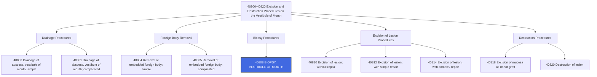

---
tags:
  - cpt
  - biopsy
  - oral-cavity
  - vestibule
  - ent
  - oral-surgery
  - diagnostic
  - pathology
  - lesion
  - mouth
cpt: 40808
descriptor: Biopsy, vestibule of mouth
category: Surgical Procedures on the Vestibule of Mouth
specialty:
  - Otolaryngology (ENT)
  - Oral and Maxillofacial Surgery
  - General Surgery
  - Dermatology
  - Dentistry/Oral Medicine
type: Procedure
status: Active ✅
approach: Open
anesthesia: Local or General
global_days: 0
effective_date: 1990-01-01 (approx.)
last_updated: 2026-01-01
parent_category: Excision and Destruction Procedures on the Vestibule of Mouth (40800-40820)
aliases:
  - Oral vestibule biopsy
  - Mouth lesion biopsy
  - Vestibule of mouth tissue sampling
  - Oral mucosal biopsy
sections:
  - Excision and Destruction Procedures on the Vestibule of Mouth (40800-40820)
cpt_guidelines: Diagnostic procedure to obtain tissue sample from oral vestibule for pathological examination
work_rvu_2026: Consult CMS MPFS for current value; subject to 2.5% efficiency adjustment
---

# 🧬 CPT  40808: Biopsy, Vestibule of Mouth

## 📋 Code Information

| Field | Value |
| :--- | :--- |
| **CPT Code** | **[[40808]]** |
| **Descriptor** | Biopsy, vestibule of mouth |
| **Section** | Excision and Destruction Procedures on the Vestibule of Mouth ([[40800]]-[[40820]]) |
| **Approach** | Open surgical |
| **Global Period** | 0 days |
| **Effective Date** | 1990 (approx.) |
| **Last Updated** | 2026-01-01 (no change from 2025) |

## 📖 Clinical Description

**CPT [[40808]]** describes a biopsy procedure performed on the vestibule of the mouth. The provider excises a sample of tissue from the vestibule (**the mucosal and submucosal tissue of the lips and cheeks within the oral cavity**) for diagnostic examination. This procedure is commonly performed to diagnose abnormal conditions of the mouth, determine whether a lesion is benign or malignant, and guide appropriate treatment planning.[1][7][10]

### Anatomical Definition

The **vestibule of the mouth** consists of:
- The mucosal and submucosal tissue of the **lips** within the oral cavity
- The mucosal and submucosal tissue of the **cheeks** within the oral cavity
- The space between the lips/cheeks and the gums/teeth

**Important Distinction**: The vestibule does **not** include the dentoalveolar structures (gums, alveolar ridge, or teeth themselves). Biopsies of gum tissue would be reported with different codes.[6]

### Procedure Steps

1.  **Site Identification**: The provider identifies the abnormal lesion or area requiring biopsy within the oral vestibule.
2.  **Anesthesia**: Local anesthesia is typically administered to numb the area.
3.  **Tissue Sampling**: A small sample of tissue is excised from the lesion using a scalpel, punch biopsy instrument, or scissors.
4.  **Hemostasis**: Bleeding is controlled, typically with pressure, cautery, or sutures if needed.
5.  **Specimen Handling**: The tissue sample is placed in appropriate preservative and sent to pathology for examination.

### Indications

- Suspicious oral lesions (leukoplakia, erythroplakia)
- Oral ulcers that fail to heal
- Mucosal masses or growths
- Suspicion of malignancy
- Chronic inflammatory conditions requiring diagnosis
- Evaluation of oral manifestations of systemic disease

## 🔍 Includes and Inclusions

- **Biopsy of Oral Vestibule**: Tissue sampling from the mucosal lining of the lips and cheeks[1][6][7]
- **Diagnostic Procedure**: Performed to obtain tissue for pathological examination[7]
- **Unilateral or Bilateral**: Code describes one site; use modifier [[-50]] for bilateral procedures[1]

## 🚫 Excludes and Differentiating Codes

### Anatomical Distinctions

| Code | Description | Anatomical Site |
| :--- | :--- | :--- |
| [[40808]] | Biopsy, vestibule of mouth | Lips/cheeks mucosa (vestibule) |
| [[41108]] | Biopsy of floor of mouth | Floor of mouth under tongue[10] |
| [[42100]] | Biopsy of palate, uvula | Hard/soft palate[10] |
| [[40490]] | Biopsy of lip | Vermilion border/lip itself[10] |
| [[41899]] | Unlisted procedure, dentoalveolar | Gums, alveolar structures[6] |

### Important Distinction: Vestibule vs. Gums

| Location | Code | Rationale |
| :--- | :--- | :--- |
| **Vestibule** (lip/cheek mucosa) | [[40808]] | Correct anatomical site |
| **Gums** (gingiva) | [[41825]]-[[41827]] or [[41899]] | Excision of dentoalveolar structures[6] |

### Procedures Not Reported with [[40808]]

| Code | Description | Rationale |
| :--- | :--- | :--- |
| [[40810]] | Excision of lesion, vestibule of mouth; without repair | Therapeutic excision, not diagnostic biopsy[10] |
| [[40812]] | Excision of lesion, with simple repair | More extensive procedure[10] |
| [[40814]] | Excision of lesion, with complex repair | More extensive procedure[10] |

## 📊 Code Tree and Hierarchy

## 🔄 Modifiers and Billing Nuances

### Applicable Modifiers for [[40808]]

| Modifier | Description | Application |
| :--- | :--- | :--- |
| [[-22]] | Increased Procedural Services | Use when work required is substantially greater than typical (e.g., extensive lesion, difficult access, excessive bleeding) |
| [[-25]] | Significant, Separately Identifiable E/M Service | Use when a significant, separately identifiable E/M service is performed on the same day as the procedure[1] |
| [[-50]] | Bilateral Procedure | Use if biopsy is performed on both sides of the mouth (bilateral vestibule)[1] |
| [[-51]] | Multiple Procedures | Use when multiple procedures are performed during the same session; Medicare applies automatically[1] |
| [[-52]] | Reduced Services | Use when service is partially reduced or eliminated |
| [[-59]] | Distinct Procedural Service | Use to indicate procedure is distinct from other services performed on same day[1] |
| [[-76]] | Repeat Procedure by Same Physician | Use if procedure repeated on same day[1] |
| [[-77]] | Repeat Procedure by Another Physician | Use if repeated by different physician on same day[1] |
| [[-78]] | Unplanned Return to OR | Use for related procedure during postoperative period[1] |
| [[-79]] | Unrelated Procedure | Use for unrelated procedure during postoperative period[1] |

### Assistant Surgeon Modifiers for [[40808]]

| Modifier | Description | Application |
| :--- | :--- | :--- |
| [[-80]] | Assistant Surgeon | Physician assistant at surgery[1][3][9] |
| [[-81]] | Minimum Assistant Surgeon | Minimal assistance during portion of surgery[1][9] |
| [[-82]] | Assistant Surgeon (resident not available) | Teaching hospital when resident unavailable[1][3][9] |
| [[-AS]] | Non-Physician Assistant at Surgery | PA, NP, RNFA, CNS assisting[1][9] |

### Important Modifier Notes

- **Modifier [[-25]] with Biopsy**: If the patient presents for evaluation of an oral lesion and the physician performs a significant and separately identifiable E/M service (e.g., comprehensive oral exam, medical history) **in addition to** the biopsy, modifier [[-25]] may be appended to the E/M code. Documentation must support both services.[1]
- **Modifier [[-59]] for Distinct Sites**: If multiple biopsies are performed in distinctly different anatomical sites (e.g., vestibule AND floor of mouth), modifier [[-59]] may be appropriate for the second biopsy code.

## 👨‍⚕️ Assistant Surgeon (Modifier [[-80]]) Payability

### Assistant Surgeon Information

For a biopsy procedure like [[40808]], an assistant surgeon is **rarely medically necessary**. This is a minor procedure typically performed by a single surgeon.

### Medicare Payment Indicators

To determine whether assistant surgeon services are payable for [[40808]], you must check the Medicare Physician Fee Schedule Database (MPFSDB) "Asst Surg" indicator:

| Indicator | Meaning | Likely Status for 40808 |
| :--- | :--- | :--- |
| **0** | Payment restriction applies; supporting documentation required | **Likely** (minor procedure) |
| **1** | Statutory payment restriction; assistants **not** paid | Possible |
| **2** | Payment restriction does NOT apply; assistants may be paid | Unlikely for biopsy |
| **9** | Concept does not apply (procedure is not a surgery) | No |

### Documentation Requirements for Teaching Hospitals

If an assistant surgeon is used and the indicator is 0 or 1, documentation must support one of the following when the surgery is performed in a teaching hospital:
- A statement that **no qualified resident was available** to perform the service
- A statement indicating that **exceptional medical circumstances** exist
- A statement indicating the primary surgeon has an **across-the-board policy** of never involving residents in patient care

### Clinical Reality

For [[40808]], assistant surgeon services are **not typically billed or reimbursed**. The procedure is straightforward and does not generally require an assistant. Billing with assistant modifiers would likely trigger medical necessity review and potential denial.

## 💰 Work RVU (wRVU) and Reimbursement

### Work RVU Information

The Work Relative Value Units (wRVU) for [[40808]] are updated annually by CMS. For current values:

- **2026 Reference**: Consult the most recent CMS Physician Fee Schedule (PFS) Final Rule or the AMA RBRVS DataManager[2]
- **Reimbursement Factors**: Final payment determined by:
  - Total RVUs (Work + Practice Expense + Malpractice)
  - Geographic Practice Cost Index (GPCI) for your area
  - National conversion factor

### 2026 Medicare Payment Updates<

| Factor | Value |
| :--- | :--- |
| **Conversion Factor (non-QP)** | $33.4009 |
| **Conversion Factor (QP)** | $33.5675 |
| **Efficiency Adjustment** | -2.5% applied to work RVUs for non-time-based codes, including [[40808]][2][8] |

**Important Note**: CMS has finalized a -2.5% productivity/efficiency adjustment applied to work RVUs for approximately 7,700 non-time-based codes, including biopsy procedures. This will affect the 2026 wRVU values compared to prior years.[2][8]

### Medicare Coverage

- [[40808]] is reimbursed by Medicare
- Code is listed on the Medicare Physician Fee Schedule (MPFS), indicating it is a covered service
- Coverage and reimbursement may vary depending on the specific Medicare Administrative Contractor (MAC) in your region[1]

## 📋 Documentation Requirements

To support billing of [[40808]], the operative report or procedure note should clearly document:[1][6][7]

- **Preoperative Diagnosis**: Specific indication for biopsy (e.g., "leukoplakia of left buccal mucosa," "suspicious lesion, right oral vestibule")
- **Anatomical Location**: Precise site within the vestibule (e.g., "left upper labial vestibule," "right buccal mucosa")
- **Procedure Performed**: "Biopsy of vestibule of mouth"
- **Lesion Description**: Size, appearance, color, and characteristics of the lesion
- **Biopsy Technique**: Method used (punch, shave, excisional)
- **Specimen Handling**: Number of specimens and how they were preserved
- **Hemostasis**: Method used to control bleeding
- **Complications**: Any intraoperative issues

### Critical Documentation Elements

| Element | Why It Matters |
| :--- | :--- |
| **Exact Anatomical Site** | Distinguishes vestibule (40808) from gums (41899) or floor of mouth (41108) |
| **Lesion Description** | Supports medical necessity |
| **Biopsy Technique** | May support use of modifiers if applicable |

## 📊 ICD-10 Crosswalk and HCC Information

### Primary ICD-10 Diagnoses for [[40808]]

| ICD-10 Code | Description | HCC Applicability |
| :--- | :--- | :--- |
| [[C06.1]] | **Malignant neoplasm of vestibule of mouth** | **Yes** (HCC 8 or 10)[4] |
| [[C06.0]] | Malignant neoplasm of cheek mucosa | Yes (HCC 8 or 10) |
| [[C04.1]] | Malignant neoplasm of lateral floor of mouth[10] | Yes (HCC 8 or 10) |
| [[C04.0]] | Malignant neoplasm of anterior floor of mouth[10] | Yes (HCC 8 or 10) |
| [[C04.8]] | Malignant neoplasm of overlapping sites of floor of mouth[10] | Yes (HCC 8 or 10) |
| [[D00.06]] | Carcinoma in situ of floor of mouth[10] | Varies |
| [[D00.04]] | Carcinoma in situ of soft palate[10] | Varies |
| [[D00.02]] | Carcinoma in situ of buccal mucosa[10] | Varies |
| [[D10.30]] | Benign neoplasm of unspecified part of mouth[10] | No (0) |
| [[D10.39]] | Benign neoplasm of other parts of mouth | No (0) |
| [[K13.0]] | Diseases of lips | No (0) |
| [[K13.1]] | Cheek and lip biting | No (0) |
| [[K13.2]] | Leukoplakia and other disturbances of oral epithelium | No (0) |
| [[K13.21]] | Leukoplakia of oral mucosa | No (0) |
| [[K13.29]] | Other disturbances of oral epithelium | No (0) |
| [[K13.3]] | Hairy leukoplakia | No (0) |
| [[K13.4]] | Granuloma and granuloma-like lesions of oral mucosa | No (0) |
| [[K13.5]] | Oral submucous fibrosis | No (0) |
| [[K13.6]] | Irritative hyperplasia of oral mucosa | No (0) |
| [[K13.7]] | Other and unspecified lesions of oral mucosa | No (0) |
| [[K13.70]] | Unspecified lesions of oral mucosa | No (0) |
| [[K13.79]] | Other lesions of oral mucosa | No (0) |
| [[Z85.819]] | Personal history of malignant neoplasm of oral cavity | No (0) |

### HCC Note

- **Malignant neoplasms** of the oral cavity (C06.1, C06.0, etc.) are significant risk adjusters in HCC models, typically mapping to HCC 8 or 10 depending on the specific CMS-HCC model version
- **Benign neoplasms** and **non-neoplastic conditions** (K13 codes) do **not** contribute to HCC risk scores
- The biopsy procedure code itself (40808) is a CPT code and does not contribute to HCC risk adjustment

## 🏥 MS-DRG Assignment

When performed in an inpatient setting (rare; typically outpatient), biopsies of the oral cavity map to the following Medicare Severity-Diagnosis Related Groups (MS-DRGs):[4][5]

### For Malignant Diagnoses (e.g., C06.1)

| MS-DRG | Description |
| :--- | :--- |
| **146** | Ear, nose, mouth and throat malignancy with MCC |
| **147** | Ear, nose, mouth and throat malignancy with CC |
| **148** | Ear, nose, mouth and throat malignancy without CC/MCC |

### For Mouth Procedures

| MS-DRG | Description |
| :--- | :--- |
| **137** | Mouth procedures with CC/MCC |
| **138** | Mouth procedures without CC/MCC |

### For Unrelated Procedures

| MS-DRG | Description |
| :--- | :--- |
| **987** | Non-extensive O.R. procedure unrelated to principal diagnosis with MCC |
| **988** | Non-extensive O.R. procedure unrelated to principal diagnosis with CC |
| **989** | Non-extensive O.R. procedure unrelated to principal diagnosis without CC/MCC |

### ICD-10-PCS Procedure Codes

For hospital inpatient coding, biopsy procedures are reported with ICD-10-PCS codes:

| Approach | ICD-10-PCS Code | Description |
| :--- | :--- | :--- |
| External | 0WB3XZX | Excision of Oral Cavity and Throat, External Approach, Diagnostic |
| External | 0WB3XZZ | Excision of Oral Cavity and Throat, External Approach[5] |
| Open | 0WB30ZX | Excision of Oral Cavity and Throat, Open Approach, Diagnostic |

## 📝 Coding Examples and Scenarios

### Example 1: Simple Biopsy of Vestibule Lesion
**Scenario**: A 55-year-old patient presents with a white lesion (leukoplakia) on the left buccal mucosa (vestibule). The oral surgeon performs a punch biopsy of the lesion. No other procedures performed.
**Coding**:
- [[40808]] - [[-59]] (Biopsy, vestibule of mouth, left side - note: laterality modifiers like LT/RT are not standard for CPT but may be used by some payers)
- [[K13.21]] (Leukoplakia of oral mucosa)
- *Rationale: Simple diagnostic biopsy of vestibule lesion.*[1][7]

### Example 2: Biopsy with Significant E/M Service
**Scenario**: A new patient presents for evaluation of an oral lesion. The physician performs a comprehensive history and physical examination, reviews the patient's risk factors (tobacco use), and discusses the findings and need for biopsy. A biopsy of the right buccal vestibule is then performed.
**Coding**:
- Appropriate E/M code (e.g., [[99203]] for new patient office visit) - [[-25]]
- [[40808]] (Biopsy, vestibule of mouth)
- *Rationale: Modifier 25 indicates a significant, separately identifiable E/M service was performed on the same day as the procedure. Documentation must support both services.*[1]

### Example 3: Bilateral Vestibule Biopsies
**Scenario**: A patient with suspected oral lichen planus has lesions on both the left and right buccal mucosa. The surgeon performs biopsies from both sides.
**Coding**:
- [[40808]] - [[-50]] (Biopsy, vestibule of mouth, bilateral)
- Appropriate diagnosis (e.g., [[L43.9]] for lichen planus)
- *Rationale: Modifier 50 indicates bilateral procedure. Some payers may prefer separate line items with modifiers LT and RT.*[1]

### Example 4: Biopsy of Vestibule and Floor of Mouth
**Scenario**: A patient presents with suspicious lesions in two distinct oral locations: the right buccal vestibule and the left floor of mouth. The surgeon performs biopsies of both sites.
**Coding**:
- [[40808]] (Biopsy, vestibule of mouth, right side)
- [[41108]] - [[-59]] (Biopsy of floor of mouth, left side, distinct procedural service)
- Appropriate diagnoses for each site
- *Rationale: Two distinct anatomical sites require two different codes. Modifier 59 indicates the second procedure is distinct and independent.*[1][10]

### Example 5: Biopsy of Gum Tissue - Incorrect Coding
**Scenario**: A patient has a lesion on the upper gingiva (gum). The surgeon performs a biopsy. The coder reports [[40808]].
**Coding**:
- **Correct**: [[41825]] (Excision of dentoalveolar structure, without repair) or [[41899]] (Unlisted procedure, dentoalveolar)
- **Incorrect**: [[40808]]
- *Rationale: The vestibule does not include gums/dentoalveolar structures. Gum biopsies require different codes.*[6]

### Example 6: Biopsy with Simple Repair - Different Code Required
**Scenario**: The surgeon performs a biopsy of a lesion but also removes additional tissue and performs simple closure.
**Coding**:
- **Correct**: [[40812]] (Excision of lesion of mucosa and submucosa, vestibule of mouth; with simple repair)
- **Incorrect**: [[40808]]
- *Rationale: When the procedure goes beyond simple biopsy to include therapeutic excision and repair, a different code is required.*[10]

### Example 7: Multiple Biopsies from Same Vestibule Site
**Scenario**: The surgeon takes three separate tissue samples from a single large lesion in the left buccal vestibule.
**Coding**:
- [[40808]] (Biopsy, vestibule of mouth)
- *Rationale: Multiple samples from the same lesion/same anatomical site are considered part of a single procedure and not reported separately. Do not use modifier 59 for multiple samples from the same site.*

## ⚠️ Important Coding Notes

### Anatomical Accuracy is Critical

The most common coding error with [[40808]] is using it for gum/dentoalveolar biopsies:

| Documented Site              | Correct Code         |
| :--------------------------- | :------------------- |
| Lip/cheek mucosa (vestibule) | **40808**                |
| Gum (gingiva)                | **41825-41827 or 41899** |
| Floor of mouth               | **41108**                |
| Palate                       | **42100**                |
| Lip (vermilion)              | **40490**                |

### Global Period[1]

- [[40808]] has a **0-day global period**
- Post-operative visits are separately payable if medically necessary
- Routine follow-up for biopsy results is typically included in E/M services

### Medicare Coverage Considerations

- Verify with your local Medicare Administrative Contractor (MAC) for any specific coverage guidelines or documentation requirements
- Medical necessity must be clearly documented (e.g., suspicious lesion, unexplained ulcer, etc.)

### HCPCS Crosswalk[10]

| HCPCS Code | Description                                                    |
| :--------- | :------------------------------------------------------------- |
| **D7286**  | BIOPSY OF ORAL TISSUE - SOFT (dental code)                     |
| **D7288**  | BRUSH BIOPSY - TRANSEPITHELIAL SAMPLE COLLECTION (dental code) |

### Efficiency Adjustment Impact

The 2.5% efficiency adjustment applied to [[40808]] for 2026 reflects CMS's position that providers become more efficient at performing procedures over time. This may result in slightly lower reimbursement compared to 2025.

## 🔗 Related Codes

### Excision Codes for Vestibule of Mouth

| Code      | Description                                                                         |
| :-------- | :---------------------------------------------------------------------------------- |
| **[[40810]]** | Excision of lesion of mucosa and submucosa, vestibule of mouth; without repair      |
| **[[40812]]** | Excision of lesion of mucosa and submucosa, vestibule of mouth; with simple repair  |
| **[[40814]]** | Excision of lesion of mucosa and submucosa, vestibule of mouth; with complex repair |

### Biopsy Codes for Other Oral Sites

| Code      | Description              |
| :-------- | :----------------------- |
| **[[40490]]** | Biopsy of lip            |
| **[[41108]]** | Biopsy of floor of mouth |
| **[[42100]]** | Biopsy of palate, uvula  |
| **[[42800]]** | Biopsy; oropharynx       |

### Destruction Codes[10]

| Code      | Description                                             |
| :-------- | :------------------------------------------------------ |
| **[[40818]]** | Excision of mucosa of vestibule of mouth as donor graft |
| **[[40820]]** | Destruction of lesion, vestibule of mouth               |

## References

1 MD Clarity. "CPT Code 40808: What It Is, Modifiers, Reimbursement." (2026)
2 American Urological Association. "Final Rule: CY 2026 Medicare Physician Fee Schedule Summary." (2025)
3 DEX Diagnostics Exchange. "CPT Modifier 80." (2025)
4 ICD10Data.com. "2026 ICD-10-CM Diagnosis Code C06.1 - Malignant neoplasm of vestibule of mouth." (2026)
5 ICD-10 Coded. "0WB3XZZ - Excision of Oral Cavity and Throat, External Approach." (2025)
6 AAPC Forum. "Biopsy of gum tissue--HELP! What CPT code." (2010)
7 AAPC. "CPT® Code 40808 - Excision and Destruction Procedures on the Vestibule of Mouth." (2026)
8 Gallagher. "Revised CMS Efficiency Credit May Reduce Payment for Some Specialty Procedures." (2026)
9 Priority Health. "Modifiers 80, 81, 82, assistant at surgery." (2025)
10 GenHealth.ai. "40808 Biopsy, vestibule of mouth - CPT4 code." (2026)