---
tags:
  - cpt
  - glossectomy
  - hemiglossectomy
  - tongue
  - oral-surgery
  - ent
  - head-and-neck
  - oncology
  - surgical
  - otolaryngology
cpt: 41130
descriptor: Glossectomy; hemiglossectomy
category: Excision Procedures on the Tongue and Floor of Mouth
specialty:
  - Otolaryngology (ENT)
  - Head and Neck Surgery
  - Oral and Maxillofacial Surgery
  - General Surgery
type: Procedure
status: Active ✅
approach: Open
anesthesia: General
global_days: 90
effective_date: Pre-1990 (legacy code)
last_updated: 2026-01-01
parent_category: Excision Procedures on the Tongue and Floor of Mouth (41100-41155)
aliases:
  - Hemiglossectomy
  - Partial tongue removal
  - Lateral tongue resection
  - Half tongue excision
sections:
  - Excision Procedures on the Tongue and Floor of Mouth (41100-41155)
cpt_guidelines: Surgical removal of one lateral half (hemi) of the tongue; requires documentation of extent of resection — use 41120 for less than half, 41130 for half (hemi), and 41135 when combined with unilateral radical neck dissection
work_rvu_2026: Consult CMS MPFS RVU26A for current value; subject to 2.5% efficiency adjustment
---

# 🧬 CPT   41130: Glossectomy; Hemiglossectomy

## 📋 Code Information

| Field | Value |
| :--- | :--- |
| **CPT Code** | **[[41130]]** |
| **Descriptor** | [[Glossectomy]]; [[hemiglossectomy]] |
| **Section** | Excision Procedures on the Tongue and Floor of Mouth ([[41100]]-[[41155]]) |
| **Approach** | Open surgical |
| **Global Period** | **90 days (Major Surgery)** |
| **Effective Date** | Pre-1990 (legacy code) |
| **Last Updated** | 2026-01-01 (no change from 2025) |

## 📖 Clinical Description

**CPT [[41130]]** describes a **[[hemiglossectomy]]** — **the surgical removal of one lateral half of the tongue**. The surgeon excises approximately half of the tongue, typically including the lateral border, the dorsal and ventral surfaces of the affected hemi-tongue, and extends to the midline. This is most commonly performed for malignant neoplasms of the tongue (**squamous cell [[carcinoma]]**), though it may also be indicated for severe benign conditions or trauma.[1][7][10]

### Anatomical Definition

The **mobile tongue** (**anterior two-thirds**) consists of:
- **Dorsal surface** — top of the tongue with taste buds
- **Ventral surface** — undersurface of the tongue
- **Lateral borders** — sides of the tongue, the most common site for **squamous cell carcinoma**
- **Tip (apex)** — the most anterior point

The **base of tongue** (**posterior one-third**) is a fixed structure; tumors here may require additional procedures beyond **[[41130]]**.

**Critical Distinction**: [[41130]] specifically denotes removal of **one lateral half (hemi)** of the tongue. Removal of **less than one-half** is coded [[41120]]. When [[hemiglossectomy]] is combined with a **unilateral radical neck dissection**, use [[41135]] instead.[8][9]

### Procedure Steps

1. **Anesthesia**: General anesthesia is administered; often with nasal or oral intubation or [[tracheostomy]] depending on tumor extent.
2. **Access**: Intraoral approach for smaller resections; may require mandibulotomy or transcervical approach for larger tumors.
3. **Resection**: The surgeon marks the midline and lateral margins with appropriate oncologic margins (**typically ≥1 cm**). The hemi-tongue is excised through the tongue musculature to the midline.
4. **[[Hemostasis]]**: Achieved with electrocautery, suture ligation, or vessel clips.
5. **Reconstruction**: Primary closure for smaller defects; local flaps, regional flaps (e.g., submental island flap), or free flaps (**e.g., radial forearm free flap**) may be utilized for larger defects.
6. **Closure**: Multilayer closure with absorbable sutures.

### Indications

- Squamous cell carcinoma of the lateral tongue (**most common**)
- Other malignant neoplasms of the tongue (**[[adenocarcinoma]], mucoepidermoid carcinoma**)
- Severe benign tumors not amenable to lesser resection
- Severe chronic infection or [[necrosis]] of the tongue
- Significant traumatic injury requiring partial tongue [[amputation]]

## 🔍 Includes and Inclusions

- **Surgical removal of one lateral half of the tongue**[1][7]
- **[[Hemostasis]] and wound closure** (primary or flap)[1]
- All pre-operative and post-operative care within the **90-day global period**[3]
- One pre-operative day included in the global period[3]

## 🚫 Excludes and Differentiating Codes

### Glossectomy Code Selection

| Code | Description | When to Use |
| :--- | :--- | :--- |
| [[41120]] | Glossectomy; less than one-half tongue | When less than half the tongue is removed |
| [[41130]] | Glossectomy; **hemiglossectomy** | When **exactly/approximately half** (one lateral half) is removed — **THIS CODE** |
| [[41135]] | Glossectomy; partial, with **unilateral radical neck dissection** | Hemiglossectomy **combined** with radical neck dissection |
| [[41140]] | Glossectomy; complete or total, without radical neck dissection | Total tongue removal without neck dissection |
| [[41145]] | Glossectomy; complete or total, with unilateral radical neck dissection | Total tongue removal with neck dissection |
| [[41150]] | Composite: glossectomy + floor of mouth resection + mandibular resection, without RND | Complex composite resection |
| [[41153]] | Composite: glossectomy + floor of mouth + suprahyoid neck dissection | Extended composite procedure |
| [[41155]] | Composite: glossectomy + floor of mouth + mandibular resection + radical neck dissection | Most extensive composite |

### Lesion Excision vs. Glossectomy

> ⚠️ **Critical Coding Rule**: Glossectomy codes (**[[41120]]-[[41155]]**) require **removal of a portion of the tongue itself**, not just a lesion. If only a lesion is excised, use [[41110]]-[[41114]].

| Scenario | Correct Code |
| :--- | :--- |
| Excision of tongue lesion, no closure | [[41110]] |
| Excision of tongue lesion with closure, anterior 2/3 | [[41112]] |
| Excision of tongue lesion with closure, posterior 1/3 | [[41113]] |
| Excision of tongue lesion with local tongue flap | [[41114]] |
| Removal of **less than half** of tongue tissue | [[41120]] |
| Removal of **one lateral half** of tongue | [[41130]] |

### Procedures Not Reported Separately with 41130

| Code | Description | Rationale |
| :--- | :--- | :--- |
| [[41135]] | [[Glossectomy]] with radical neck dissection | If neck dissection is performed, upgrade to [[41135]] — do not report 41130 + neck dissection separately |
| Routine [[hemostasis]] | Included | Part of the surgical package |
| Post-op visits within 90 days | Included | Part of 90-day global period |

## 📊 Code Tree and Hierarchy

```mermaid
flowchart TD
    A["41100-41155 Excision Procedures on the Tongue and Floor of Mouth"] --> B["Lesion Excision Codes"]
    B --> C["41110 Excision of lesion; without closure"]
    B --> D["41112 Excision of lesion; with closure, anterior 2/3"]
    B --> E["41113 Excision of lesion; posterior 1/3"]
    B --> F["41114 Excision of lesion; with local tongue flap"]

    A --> G["Glossectomy — Partial"]
    G --> H["41120 Glossectomy; less than one-half tongue"]
    G --> I["41130 GLOSSECTOMY; HEMIGLOSSECTOMY"]
    G --> J["41135 Partial, with unilateral radical neck dissection"]

    A --> K["Glossectomy — Complete"]
    K --> L["41140 Complete or total; without RND"]
    K --> M["41145 Complete or total; with unilateral RND"]

    A --> N["Composite Procedures"]
    N --> O["41150 + floor of mouth + mandible; without RND"]
    N --> P["41153 + floor of mouth; with suprahyoid neck dissection"]
    N --> Q["41155 + floor of mouth + mandible + RND"]

    style I fill:#4169E1,stroke:#333,stroke-width:2px,color:white
```

## 🔄 Modifiers and Billing Nuances

### Applicable Modifiers for 41130

| Modifier | Description | Application |
| :--- | :--- | :--- |
| [[-22]] | Increased Procedural Services | Use when work is substantially greater than typical (e.g., extensive reconstruction, significant bleeding, re-operative field) |
| [[-51]] | Multiple Procedures | Use when multiple procedures are performed in same session; Medicare applies automatically |
| [[-52]] | Reduced Services | Use when procedure is partially reduced at the physician's discretion |
| [[-54]] | Surgical Care Only | Use when surgeon provides surgical care but transfers post-op care to another provider |
| [[-55]] | Postoperative Management Only | Use when provider accepts post-op care from surgeon who used modifier 54 |
| [[-56]] | Preoperative Management Only | Use when pre-op care only is provided |
| [[-57]] | Decision for Surgery | Append to the E/M code on the day of or day before major surgery when E/M results in decision for surgery |
| [[-58]] | Staged or Related Procedure | Use for staged procedures, more extensive than original, or therapy following diagnostic procedure during post-op period |
| [[-59]] | Distinct Procedural Service | Use to indicate a procedure is distinct/independent from other services performed same day |
| [[-76]] | Repeat Procedure, Same Physician | Use if procedure is repeated on the same day by the same physician |
| [[-77]] | Repeat Procedure, Another Physician | Use if repeated by a different physician on the same day |
| [[-78]] | Unplanned Return to OR — Related Procedure | Use for related procedure performed during the post-op period |
| [[-79]] | Unrelated Procedure During Post-op Period | Use for unrelated procedure during the 90-day global period |

### Assistant Surgeon Modifiers for 41130

| Modifier | Description | Application |
| :--- | :--- | :--- |
| [[-80]] | Assistant Surgeon | Physician assistant at surgery — **generally payable** for this major procedure |
| [[-81]] | Minimum Assistant Surgeon | Minimal assistance during a portion of surgery |
| [[-82]] | Assistant Surgeon (resident not available) | Teaching hospital setting when qualified resident is unavailable |
| [-[AS]] | Non-Physician Assistant at Surgery | PA, NP, RNFA, CNS assisting |

### Important Modifier Notes

- **Modifier [[-57]] with E/M**: Because [[41130]] has a **90-day global period**, an E/M performed on the day of or the day before surgery that results in the initial decision to perform surgery should be appended with modifier [[-57]].[3]
- **Modifier [[-22]] for reconstruction**: If the hemiglossectomy requires a complex free flap reconstruction (**e.g., radial forearm free flap — see [[15757]]/[[15758]]**), document the significantly increased work; however, the free flap codes may be separately reportable — do not double-dip with modifier [[-22]] and a separate flap code.[1]
- **Neck Dissection Bundling**: If a radical neck dissection is performed simultaneously, **do not** report [[41130]] + a neck dissection code. Instead, report [[41135]] (**which includes the neck dissection**). If a **modified** radical neck dissection is performed, check NCCI edits — [[38724]] may be separately reportable with modifier [[-59]].[8][9]

## 👨‍⚕️ Assistant Surgeon (Modifier -80) Payability

### Assistant Surgeon Information

For a major procedure like [[41130]], an assistant surgeon is **commonly medically necessary**, particularly when reconstruction is performed or when the operative field is complex.

### Medicare Payment Indicators

To confirm assistant surgeon payability for [[41130]], check the **Medicare Physician Fee Schedule Database (MPFSDB)** "Asst Surg" indicator:

| Indicator | Meaning |
| :--- | :--- |
| **0** | Payment restriction; supporting documentation required |
| **1** | Statutory payment restriction; assistants not paid |
| **2** | Payment restriction does NOT apply; assistants may be paid |
| **9** | Concept does not apply |

> ✅ **Clinical Reality**: Given the complexity of hemiglossectomy — especially with reconstruction — assistant surgeon services are **commonly billed and reimbursed** for [[41130]]. Always verify current MPFSDB indicator and consult your MAC LCD.

### Documentation for Teaching Hospitals

If the indicator is 0 or 1, documentation must reflect:
- No qualified resident was available, OR
- Exceptional medical circumstances existed, OR
- Primary surgeon has an across-the-board policy of not involving residents

## 💰 Work RVU (wRVU) and Reimbursement

### Work RVU Information

The Work Relative Value Units (wRVU) for [[41130]] are updated annually by CMS. For current 2026 values:

- **2026 Reference**: Consult the CMS MPFS RVU26A file or the AMA RBRVS DataManager[2][4]
- **2026 Efficiency Adjustment**: CMS finalized a **-2.5% efficiency adjustment** to wRVUs and intra-service times for nearly all non-time-based codes, including surgical procedures like [[41130]][4][5]

### 2026 Medicare Payment Updates

| Factor | Value |
| :--- | :--- |
| **Conversion Factor (non-QP/non-APM)** | $33.4009 |
| **Conversion Factor (QP/APM)** | $33.5675 |
| **Efficiency Adjustment** | -2.5% applied to wRVUs for non-time-based surgical codes including [[41130]] |
| **Global Period** | 90 days (Major Surgery) — one pre-op day + surgery day + 90 post-op days included |

> **Note**: The 2026 wRVU for [[41130]] will be slightly lower than 2025 due to the CMS efficiency adjustment. Always pull the current value directly from **CMS RVU26A** or your contracting system before finalizing compensation calculations.[4][5]

### National Average Reimbursement

National average reimbursement for **CPT [[41130]]** ranges approximately **$1,564-$2,150** depending on payer, though this varies significantly by MAC region, payer contract, and setting (**facility vs. non-facility**). Consult payer-specific fee schedules for accurate values.

## 📋 Documentation Requirements

To support billing of [[41130]], the operative report must clearly document:[1][7][8]

- **Preoperative Diagnosis**: Specific indication (**e.g., "squamous cell carcinoma, right lateral tongue, T2N0M0"**)
- **Extent of Resection**: Explicit statement that **one lateral half** of the tongue was removed (distinguishes from [[41120]])
- **Margins**: Intraoperative margin documentation (**e.g., "all margins negative at frozen section"**)
- **Reconstruction Method**: Primary closure vs. flap type if applicable
- **Anatomical Boundaries**: Medial extent (**midline**), anterior/posterior extent, and depth
- **Laterality**: Specify right or left hemiglossectomy
- **Pathology Submission**: Specimen sent to pathology for permanent section

### Critical Documentation Elements

| Element | Why It Matters |
| :--- | :--- |
| **"Hemiglossectomy" or "lateral half"** | Distinguishes [[41130]] from [[41120]] (less than half) |
| **Absence of neck dissection** | Confirms [[41130]] is correct; if RND present, use [[41135]] |
| **Reconstruction documentation** | If free flap used, separate CPT codes may be additionally reportable |
| **Laterality** | Right vs. left; required for complete coding and clinical record |

## 📊 ICD-10 Crosswalk and HCC Information

### Primary ICD-10 Diagnoses for 41130

| ICD-10 Code | Description | HCC Applicability |
| :--- | :--- | :--- |
| [[C02.1]] | **Malignant neoplasm of border of tongue** | **Yes** (HCC 8 or 10) |
| [[C02.0]] | Malignant neoplasm of dorsal surface of tongue | Yes (HCC 8 or 10) |
| [[C02.2]] | Malignant neoplasm of ventral surface of tongue | Yes (HCC 8 or 10) |
| [[C02.3]] | Malignant neoplasm of anterior 2/3 of tongue, NOS | Yes (HCC 8 or 10) |
| [[C02.8]] | Malignant neoplasm of overlapping sites of tongue | Yes (HCC 8 or 10) |
| [[C02.9]] | Malignant neoplasm of tongue, unspecified | Yes (HCC 8 or 10) |
| [[C01]] | Malignant neoplasm of base of tongue | Yes (HCC 8 or 10) |
| [[C06.9]] | Malignant neoplasm of mouth, unspecified | Yes (HCC 8 or 10) |
| [[D10.1]] | Benign neoplasm of tongue | No (0) |
| [[K14.0]] | Glossitis | No (0) |
| [[K14.8]] | Other specified conditions of tongue | No (0) |
| [[S09.93XA]] | Unspecified injury of face, initial encounter (trauma indication) | No (0) |
| [[Z85.818]] | Personal history of malignant neoplasm of other digestive organs | No (0) |

### HCC Note

- **Malignant neoplasms** of the tongue (C01, C02.x) are significant risk adjusters, mapping to **HCC 8 or 10** depending on the CMS-HCC model version used
- **Benign and inflammatory** conditions (D10.1, K14.x) do **not** contribute to HCC risk scores
- The CPT procedure code [[41130]] itself is not an HCC contributor — diagnosis codes drive risk adjustment

## 🏥 MS-DRG Assignment

When [[41130]] is performed in an inpatient setting, it typically maps to the following MS-DRGs:[6]

### For Malignant Tongue Diagnoses (e.g., C02.1)

| MS-DRG | Description |
| :--- | :--- |
| **146** | Ear, nose, mouth and throat malignancy with MCC |
| **147** | Ear, nose, mouth and throat malignancy with CC |
| **148** | Ear, nose, mouth and throat malignancy without CC/MCC |

### For Mouth/Tongue Surgical Procedures

| MS-DRG | Description |
| :--- | :--- |
| **137** | Mouth procedures with CC/MCC |
| **138** | Mouth procedures without CC/MCC |

### ICD-10-PCS Procedure Codes

For hospital **inpatient** coding, hemiglossectomy is reported with ICD-10-PCS codes:

| Approach | ICD-10-PCS Code | Description |
| :--- | :--- | :--- |
| Open | **0CB70ZZ** | Excision of Tongue, Open Approach |
| Open, Diagnostic | **0CB70ZX** | Excision of Tongue, Open Approach, Diagnostic |
| Endoscopic (via natural orifice) | **0CB78ZZ** | Excision of Tongue, Via Natural or Artificial Opening Endoscopic |

> ⚠️ For inpatient profee coding, the **CPT code [[41130]]** is used on the professional claim; **ICD-10-PCS** is used on the facility (**UB-04**) claim only.

## 📝 Coding Examples and Scenarios

### Example 1: Standard Hemiglossectomy for SCC
**Scenario**: A 62-year-old male with biopsy-proven squamous cell carcinoma of the right lateral tongue, clinical T2N0M0. The head and neck surgeon performs a right hemiglossectomy via an intraoral approach with primary closure. No neck dissection performed.
**Coding**:
- [[41130]] — Glossectomy; hemiglossectomy
- [[C02.1]] — Malignant neoplasm of border of tongue
- *Rationale: Removal of the right lateral half of the tongue without neck dissection = 41130. Document "hemiglossectomy" explicitly in the operative report.*[1][8]

### Example 2: Hemiglossectomy WITH Radical Neck Dissection — Wrong Code Trap
**Scenario**: Same patient as above, but intraoperative findings reveal a suspicious lymph node; surgeon performs a right hemiglossectomy AND a right radical neck dissection.
**Coding**:
- **Correct**: [[41135]] — Glossectomy; partial, with unilateral radical neck dissection
- **Incorrect**: [[41130]] + [[38720]] or [[38724]]
- *Rationale: When a hemiglossectomy (or partial glossectomy) is combined with a radical neck dissection, the combined procedure is captured entirely by [[41135]]. Do NOT separately report [[41130]] and a neck dissection code.*[8][9]

### Example 3: Hemiglossectomy with Free Flap Reconstruction
**Scenario**: A 55-year-old female undergoes right hemiglossectomy with immediate reconstruction using a radial forearm free flap.
**Coding**:
- [[41130]] — Glossectomy; hemiglossectomy
- [[15757]] or [[15758]] — Free skin flap with microvascular anastomosis (depending on flap type)
- [[C02.1]] — Malignant neoplasm of border of tongue
- *Rationale: The free flap reconstruction is separately reportable from the glossectomy. Check NCCI edits and verify payability with your specific payer.*[1]

### Example 4: Less Than Half — Wrong Code Trap
**Scenario**: A surgeon removes a 2 cm wedge of the lateral tongue that does not extend to the midline. The op report states "partial glossectomy."
**Coding**:
- **Correct**: [[41120]] — Glossectomy; less than one-half tongue
- **Incorrect**: [[41130]]
- *Rationale: If the resection does not extend to and include one full lateral half (hemi), use [[41120]]. The distinction hinges on extent of resection documented in the op note.*[8][9]

### Example 5: Decision for Surgery E/M on Same Day
**Scenario**: A new patient presents to the head and neck surgeon for evaluation of a tongue mass. The surgeon performs a detailed history and physical, reviews imaging, and determines the patient requires a hemiglossectomy scheduled the same day as an urgent procedure.
**Coding**:
- Appropriate E/M code (e.g., [[99205]] or [[99243]]) — [[-57]]
- [[41130]] — Glossectomy; hemiglossectomy
- *Rationale: Modifier [[-57]] appended to the E/M indicates it was the decision for a major surgery (90-day global). Without modifier [[-57]], the E/M on the day of a major surgery is bundled into the global package.*[3]

## ⚠️ Important Coding Notes

### The Key Distinction: 41120 vs. 41130

| Code      | Amount Removed            | Documentation Needed                                      |
| :-------- | :------------------------ | :-------------------------------------------------------- |
| **[[41120]]** | Less than one-half tongue | "Partial glossectomy," "wedge resection," extent < 50%    |
| **[[41130]]** | One lateral half (hemi)   | "Hemiglossectomy," "right/left hemi-tongue," extent ≈ 50% |

### Neck Dissection Bundling Alert

> ⚠️ Do **NOT** unbundle [[41130]] + a neck dissection code. The neck dissection "upgrades" the code to [[41135]], [[41145]], [[41153]], or [[41155]] depending on the composite procedure performed.

### Global Period — 90 Days

- [[41130]] carries a **90-day global period**
- **Includes**: 1 pre-op day, day of surgery, 90 post-op days
- Separately reportable during the global period: unrelated procedures (modifier [[-79]]), staged procedures (**modifier [[-58]]**), return to OR for complications (modifier [[-78]])
- E/M on day of surgery: NOT separately payable unless modifier [[-57]] (**decision for surgery**) applies

### 2026 Efficiency Adjustment Impact

The **-2.5% CMS** efficiency adjustment reduces the wRVU for [[41130]] compared to 2025. Organizations using wRVU-based physician compensation should audit their compensation models to account for this structural change.

## 🔗 Related Codes

### Glossectomy Family

| Code      | Description                                                                              |
| :-------- | :--------------------------------------------------------------------------------------- |
| **[[41120]]** | Glossectomy; less than one-half tongue                                                   |
| **[[41135]]** | Glossectomy; partial, with unilateral radical neck dissection                            |
| **[[41140]]** | Glossectomy; complete or total, without radical neck dissection                          |
| **[[41145]]** | Glossectomy; complete or total, with unilateral radical neck dissection                  |
| **[[41150]]** | Composite; glossectomy + floor of mouth + mandibular resection, without RND              |
| **[[41153]]** | Composite; glossectomy + floor of mouth, with suprahyoid neck dissection                 |
| **[[41155]]** | Composite; glossectomy + floor of mouth + mandibular resection + radical neck dissection |

### Tongue Lesion Excision Codes

| Code      | Description                                                       |
| :-------- | :---------------------------------------------------------------- |
| **[[41110]]** | Excision of lesion of tongue without closure                      |
| **[[41112]]** | Excision of lesion of tongue with closure; anterior two-thirds    |
| **[[41113]]** | Excision of lesion of tongue with closure; posterior one-third    |
| **[[41114]]** | Excision of lesion of tongue with closure; with local tongue flap |

### Related Neck Dissection Codes

| Code | Description |
| :--- | :--- |
| **[[38700]]** | Suprahyoid lymphadenectomy |
| **[[38720]]** | Cervical lymphadenectomy (complete) |
| **[[38724]]** | Cervical lymphadenectomy (modified radical neck dissection) |

### Reconstruction Codes

| Code      | Description                                         |
| :-------- | :-------------------------------------------------- |
| **[[15757]]** | Free skin flap with microvascular anastomosis       |
| **[[15758]]** | Free fascial flap with microvascular anastomosis    |
| **[[15731]]** | Forehead flap with preservation of vascular pedicle |

## References

<small> [1 MD Clarity. "CPT Code 41130: What It Is, Modifiers, Reimbursement." (2024). https://www.mdclarity.com/cpt-code/41130
2 CMS. "Calendar Year 2026 Medicare Physician Fee Schedule Final Rule (CMS-1832-F)." (2025). https://www.cms.gov/newsroom/fact-sheets/calendar-year-cy-2026-medicare-physician-fee-schedule-final-rule-cms-1832-f
3 CMS. "MLN907166 - Global Surgery Booklet." https://www.cms.gov/files/document/mln907166-global-surgery-booklet.pdf
4 PYA. "2026 wRVU Changes and Physician Compensation Planning." (2026). https://www.pyapc.com/insights/2026-wrvu-changes-are-here-what-organizations-need-to-know-for-physician-compensation-planning/
5 MedAxiom. "CMS Releases 2026 Final Physician Fee Schedule Rule." (2025). https://www.medaxiom.com/news/2025/11/05/news/cms-releases-2026-final-physician-fee-schedule-rule/
6 CodingBillingSolutions. "Oral Cancer ICD-10 Codes." (2024). https://codingbillingsolutions.com/blogs/oral-cancer-icd-10-codes/
7 GenHealth.ai. "41130 - Glossectomy; hemiglossectomy." (2026). https://genhealth.ai/code/cpt4/41130-glossectomy-hemiglossectomy
8 AAPC Otolaryngology Coding Alert. "CPT Coding Strategies for Glossectomy Reporting." https://www.aapc.com/codes/scc_articles/article_pdf/94/cpt-coding-strategies-perfect-glossectomy-reporting-using-this-expert-adv
9 KZA Coding Coaches. "Glossectomy Coding Help." (2023). https://www.kzanow.com/coding-coaches/glossectomy-coding-help
10 AAPC. "CPT Code 41130 - Excision Procedures on the Tongue and Floor of Mouth." (2026). https://www.aapc.com/codes/cpt-codes/41130
11 PayerPrice. "CPT Code 41130 - Description and Fee Schedule 2026." (2025). https://payerprice.com/rates/41130-CPT-fee-schedule]