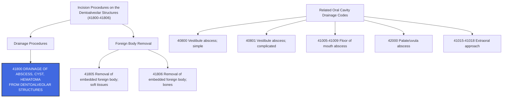

---
tags:
  - cpt
  - drainage
  - abscess
  - cyst
  - hematoma
  - dentoalveolar
  - oral-surgery
  - ent
  - incision-and-drainage
  - oral-cavity
  - otolaryngology
cpt: 41800
descriptor: Drainage of abscess, cyst, hematoma from dentoalveolar structures
category: Incision Procedures on the Dentoalveolar Structures
specialty:
  - Otolaryngology (ENT)
  - Oral and Maxillofacial Surgery
  - General Surgery
  - Emergency Medicine
  - Dentistry/Oral Medicine
type: Procedure
status: Active ✅
approach: Open (intraoral)
anesthesia: Local or General
global_days: 10
effective_date: Pre-1990 (legacy code)
last_updated: 2026-01-01
parent_category: Incision Procedures on the Dentoalveolar Structures (41800-41806)
aliases:
  - Dental abscess drainage
  - I&D dentoalveolar abscess
  - Gum abscess incision and drainage
  - Periapical abscess drainage
  - Dentoalveolar cyst drainage
sections:
  - Incision Procedures on the Dentoalveolar Structures (41800-41806)
cpt_guidelines: Drainage of pus, fluid, or blood from tooth-supporting structures (alveolar bone and surrounding soft tissue); includes simple incision, drainage, and hemostasis; separate from vestibule of mouth drainage codes (40800-40801)
work_rvu_2026: Consult CMS MPFS RVU26A for current value; subject to 2.5% efficiency adjustment
---

# 🧬 CPT   41800: Drainage of Abscess, Cyst, Hematoma from Dentoalveolar Structures

## 📋 Code Information

| Field | Value |
| :--- | :--- |
| **CPT Code** | **[[41800]]** |
| **Descriptor** | **Drainage of abscess, cyst, hematoma from dentoalveolar structure**s |
| **Section** | Incision Procedures on the Dentoalveolar Structures ([[41800]]-[[41806]]) |
| **Approach** | Open (intraoral) |
| **Global Period** | **10 days (Minor Surgery)** |
| **Effective Date** | Pre-1990 (legacy code) |
| **Last Updated** | 2026-01-01 (no change from 2025) |

## 📖 Clinical Description

**CPT [[41800]]** describes the incision and drainage (I&D) of an [[abscess]], cyst, or [[hematoma]] arising from the **dentoalveolar structures** — the tooth-supporting structures including the alveolar bone, periodontal ligament, periapical tissue, and surrounding gingiva directly associated with the teeth and sockets.[1][7][10]

The provider makes an incision into the fluctuant swelling, evacuates pus, fluid, or blood, irrigates the site, and achieves hemostasis. This is distinct from drainage of a vestibule of mouth abscess (**[[40800]]-[[40801]]**) or floor of mouth [[abscess]] (**[[41005]]-[[41009]]**), both of which involve different anatomical compartments.[6][8]

### Anatomical Definition

**Dentoalveolar structures** include:
- **Alveolar bone** — the bony socket housing the tooth roots
- **Periodontal ligament** — fibrous tissue connecting tooth root to alveolar bone
- **Periapical tissues** — tissues at the apex (tip) of the tooth root
- **Directly associated gingiva** — gum tissue immediately surrounding the tooth

**Important Distinction**: The **vestibule of the mouth** (**lip and cheek mucosa**) is a separate anatomical region — abscesses there are coded [[40800]] (**simple**) or [[40801]] (**complicated**). The **floor of mouth** has its own drainage codes (**[[41005]]-[[41009]]**). The **palate** uses [[42000]]. Dentoalveolar structures are specifically the tooth-socket complex.[6][8]

### Procedure Steps

1. **Patient Preparation**: The patient is positioned and the oral cavity is assessed. Local anesthesia (**commonly a block or infiltration**) is administered over the abscess site.
2. **Site Identification**: The provider palpates for fluctuance, identifies the point of maximal swelling, and confirms the dentoalveolar origin.
3. **Incision**: A scalpel or hemostat is used to make a stab incision into the fluctuant area overlying the **[[abscess]]**.
4. **Drainage**: Pus, fluid, or blood is evacuated by gentle pressure. A hemostat may be used to break up loculations in a simple [[abscess]].
5. **Irrigation**: The cavity is irrigated with saline or antiseptic solution.
6. **[[Hemostasis]]**: Achieved with pressure or gauze packing; a Penrose drain or iodoform gauze wick may be placed to maintain drainage.
7. **Discharge**: Patient is typically discharged with antibiotics, analgesics, and follow-up instructions.

### Indications

- Periapical [[abscess]] (**most common indication**)
- Periodontal abscess (**localized to the dentoalveolar complex**)
- Dentoalveolar cyst with infection or expansion
- Post-extraction [[hematoma]] of the alveolar socket
- Ludwig's angina (**early stage — though advanced floor-of-mouth involvement requires additional codes**)
- Pericoronal abscess (**pericoronitis with abscess formation around an erupting tooth**)

## 🔍 Includes and Inclusions

- **Incision** into the abscess, cyst, or [[hematoma]] cavity[1][7]
- **Drainage/evacuation** of purulent, cystic, or hemorrhagic contents[1]
- **Irrigation** of the cavity[7]
- **Simple drain placement** (e.g., Penrose drain, iodoform gauze wick) when performed at the same session[1]
- **[[Hemostasis]]**[1]
- All routine post-operative care within the **10-day global period**[3]

## 🚫 Excludes and Differentiating Codes

### Anatomical Distinctions — Oral Cavity Drainage Code Selection

| Code      | Description                                                           | Anatomical Site                                                            |
| :-------- | :-------------------------------------------------------------------- | :------------------------------------------------------------------------- |
| **[[40800]]** | Drainage of abscess, cyst, hematoma, vestibule of mouth; simple       | Lips/cheeks mucosa (vestibule)                                             |
| **[[40801]]** | Drainage of abscess, cyst, hematoma, vestibule of mouth; complicated  | Vestibule — complex                                                        |
| **[[41800]]** | Drainage of abscess, cyst, hematoma from **dentoalveolar** structures | **Tooth-socket complex (alveolar bone/periapical tissue)** — **THIS CODE** |
| **[[41005]]** | Intraoral I&D of abscess, cyst, or hematoma; lingual                  | Floor of mouth — lingual space                                             |
| **[[41006]]** | Intraoral I&D; sublingual in floor of mouth                           | Floor of mouth — sublingual                                                |
| **[[41007]]** | Intraoral I&D; submental space                                        | Floor of mouth — submental                                                 |
| **[[41008]]** | Intraoral I&D; submandibular space                                    | Floor of mouth — submandibular                                             |
| **[[41009]]** | Intraoral I&D; masticator space                                       | Masticator space                                                           |
| **[[42000]]** | Drainage of abscess of palate, uvula                                  | Palate/uvula                                                               |
| **[[42310]]** | Drainage of abscess; submaxillary or sublingual, intraoral            | Submaxillary/sublingual                                                    |

> ⚠️ **Critical Coding Rule**: The site of origin determines the code, **NOT** just the approach (**intraoral**). A dentoalveolar abscess drained intraorally = **[[41800]]**. A floor of mouth abscess drained intraorally = **[[41005]]-[[41009]]**. Do **NOT** default to **[[41800]]** for all intraoral oral drainage procedures.[6][8]

### Complexity Distinctions

| Scenario                                                     | Code                |
| :----------------------------------------------------------- | :------------------ |
| Simple dentoalveolar abscess drainage                        | **[[41800]]**           |
| Complicated vestibule abscess (involving deep tissue planes) | **[[40801]]**           |
| Extraoral approach for deep space abscess                    | **[[41015]]-[[41018]]** |

### Procedures Not Reported Separately with 41800

| Item                                        | Rationale                                |
| :------------------------------------------ | :--------------------------------------- |
| **Routine drain placement (Penrose, wick)** | Bundled into [[41800]]                   |
| **Local anesthesia**                        | Included in the procedure                |
| **Routine irrigation of abscess cavity**    | Included in [[41800]]                    |
| **Post-op visits within 10-day global**     | Part of the minor surgery global package |

## 📊 Code Tree and Hierarchy

## 🔄 Modifiers and Billing Nuances

### Applicable Modifiers for 41800

| Modifier    | Description                                      | Application                                                                                                                                                                         |
| :---------- | :----------------------------------------------- | :---------------------------------------------------------------------------------------------------------------------------------------------------------------------------------- |
| **[[-22]]** | Increased Procedural Services                    | Use when work required is substantially greater than typical (e.g., extensive loculation breakdown, severely difficult access, aggressive infection requiring prolonged irrigation) |
| **[[-25]]** | Significant, Separately Identifiable E/M Service | Append to the E/M code when a significant, separately identifiable E/M is performed on the same day; documentation must support both services[1]                         |
| **[[-50]]** | Bilateral Procedure                              | Use if drainage is performed on bilateral dentoalveolar sites in the same session                                                                                                   |
| **[[-51]]** | Multiple Procedures                              | Use when multiple procedures are performed during the same session; Medicare applies automatically                                                                                  |
| **[[-52]]** | Reduced Services                                 | Use when the procedure is partially reduced at the provider's discretion                                                                                                            |
| **[[-59]]** | Distinct Procedural Service                      | Use to indicate this procedure is distinct and independent from other services performed the same day                                                                               |
| **[[-76]]** | Repeat Procedure, Same Physician                 | Use when the same I&D is repeated same day by the same provider (e.g., re-drainage of inadequately drained abscess)                                                                 |
| **[[-77]]** | Repeat Procedure, Another Physician              | Use when a different provider repeats the procedure same day                                                                                                                        |
| **[[-78]]** | Unplanned Return to OR — Related Procedure       | Use if patient requires return to OR for a related procedure during the 10-day global period                                                                                        |
| **[[-79]]** | Unrelated Procedure During Post-op Period        | Use for an unrelated procedure during the 10-day global period                                                                                                                      |

### Assistant Surgeon Modifiers for 41800

| Modifier | Description                                | Application                                            |
| :------- | :----------------------------------------- | :----------------------------------------------------- |
| **[[-80]]**  | Assistant Surgeon                          | Typically **not payable** for this minor I&D procedure |
| **[[-81]]**  | Minimum Assistant Surgeon                  | Rarely applicable                                      |
| **[[-82]]**  | Assistant Surgeon (resident not available) | Teaching hospital exception                            |
| **[[-AS]]**  | Non-Physician Assistant at Surgery         | PA, NP, RNFA assisting — verify payer policy           |

### Important Modifier Notes

- **Modifier [[-25]] with I&D**: When a patient presents for evaluation of a dental/oral complaint and the provider performs a significant, separately identifiable E/M service (history, exam, MDM) **in addition to** the I&D, append modifier [[-25]] to the E/M code. Documentation must clearly support both the E/M and the procedure as distinct services.[1][3]
- **Global Period is 10 days**: [[41800]] has a **10-day minor surgery global period**. E/M visits for routine post-op follow-up within 10 days are bundled. However, E/M visits for an unrelated condition are separately payable with modifier [[-24]].[3]
- **Multiple sites same session**: If multiple distinct dentoalveolar sites are drained at the same session (**e.g., abscess at two separate teeth**), report [[41800]] for the first, and [[41800]]-[[-59]] for the second to indicate a distinct procedural service. Some payers may bundle — verify your payer's policy.[1]

## 👨‍⚕️ Assistant Surgeon (Modifier [[-80]]) Payability

### Assistant Surgeon Information

For a minor, straightforward procedure like [[41800]], an assistant surgeon is **generally not medically necessary** and is typically **not reimbursed**.

### Medicare Payment Indicators

Check the **Medicare Physician Fee Schedule Database (MPFSDB)** "Asst Surg" indicator for [[41800]]:

| Indicator | Meaning |
| :--- | :--- |
| **0** | Payment restriction; supporting documentation required |
| **1** | Statutory payment restriction; assistants not paid |
| **2** | Payment restriction does NOT apply; assistants may be paid |
| **9** | Concept does not apply |

> ⚠️ **Clinical Reality**: Assistant surgeon services are **not typically billed or reimbursed** for [[41800]]. Billing with assistant modifiers would likely trigger medical necessity review and denial. Check Medi-Cal and other state Medicaid fee schedules, which explicitly note "assistant surgeon services not payable" for this code range.[9]

## 💰 Work RVU (wRVU) and Reimbursement

### Work RVU Information

The wRVU for [[41800]] is updated annually by CMS. For current 2026 values:

- **2026 Reference**: Consult the **CMS MPFS RVU26A** file or AMA RBRVS DataManager[2][4]
- **2026 Efficiency Adjustment**: CMS finalized a **-2.5% efficiency adjustment** to wRVUs for non-time-based codes, including minor surgical procedures like [[41800]][4][5]

### 2026 Medicare Payment Updates

| Factor | Value |
| :--- | :--- |
| **Conversion Factor (non-QP)** | $33.4009 |
| **Conversion Factor (QP/APM)** | $33.5675 |
| **Efficiency Adjustment** | -2.5% applied to wRVUs for non-time-based surgical codes including [[41800]] |
| **Global Period** | 10 days (Minor Surgery) — day of surgery + 10 post-op days included |

### National Average Reimbursement

National average reimbursement for **CPT [[41800]]** is relatively low, consistent with a minor office-based I&D procedure. Consult payer-specific fee schedules for accurate values, as reimbursement varies significantly between payers, geographic regions, and facility vs. non-facility settings.

### Common Places of Service<

| POS | Description |
| :--- | :--- |
| **11** | Office |
| **23** | Emergency Room - Hospital |
| **22** | Outpatient Hospital |
| **49** | Independent Clinic |

## 📋 Documentation Requirements

To support billing of [[41800]], the procedure note or operative report must clearly document:[1][7][8]

- **Presenting Complaint**: Dental pain, swelling, facial [[cellulitis]], etc.
- **Preoperative Diagnosis**: Specific indication (**e.g., "periapical abscess, tooth #19," "periodontal abscess, upper right quadrant"**)
- **Anatomical Location**: Precise dentoalveolar site including tooth number(s) or region
- **Confirmation of Dentoalveolar Origin**: Distinguishes from vestibule, floor of mouth, or palate — confirms [[41800]] is appropriate
- **Anesthesia Used**: Type and location of local anesthetic block
- **Procedure Performed**: "Incision and drainage of dentoalveolar abscess"
- **Character of Drainage**: Amount and quality of material evacuated (e.g., "copious purulent drainage obtained")
- **Irrigation**: Solution used
- **Drain Placement**: If a drain or wick was placed, document type and plan for removal
- **Hemostasis**: Method used
- **Postoperative Instructions**: Antibiotics, analgesics, return precautions

### Critical Documentation Elements

| Element                            | Why It Matters                                                                                                                |
| :--------------------------------- | :---------------------------------------------------------------------------------------------------------------------------- |
| **"Dentoalveolar" site specified** | Distinguishes [[41800]] from [[40800]] (**vestibule**), [[41005]]-[[41009]] (**floor of mouth**), [[42000]] (**palate**)      |
| **Fluctuance documented**          | Supports medical necessity for incision rather than aspiration alone                                                          |
| **Tooth number or region**         | Establishes dentoalveolar origin; aligns with ICD-10 diagnosis                                                                |
| **Modifier 25 E/M documentation**  | If E/M is also billed, the note must clearly reflect a separately identifiable evaluation beyond the pre-procedure assessment |

## 📊 ICD-10 Crosswalk and HCC Information

### Primary ICD-10 Diagnoses for 41800

| ICD-10 Code      | Description                                                           | HCC Applicability |     |
| :--------------- | :-------------------------------------------------------------------- | :---------------- | --- |
| **[[K04.7]]**    | **Periapical abscess without sinus**                                  | No (0)            |     |
| **[[K04.6]]**    | Periapical abscess with sinus                                         | No (0)            |     |
| **[[K04.5]]**    | Chronic apical periodontitis                                          | No (0)            |     |
| **[[K04.4]]**    | Acute apical periodontitis of pulpal origin                           | No (0)            |     |
| **[[K04.8]]**    | Radicular cyst                                                        | No (0)            |     |
| **[[K04.99]]**   | Other diseases of pulp and periapical tissue                          | No (0)            |     |
| **[[K05.20]]**   | Aggressive periodontitis, unspecified                                 | No (0)            |     |
| **[[K05.21]]**   | Localized aggressive periodontitis (periodontal abscess)              | No (0)            |     |
| **[[K05.211]]**  | Periodontitis, localized, slight                                      | No (0)            |     |
| **[[K05.212]]**  | Periodontitis, localized, moderate                                    | No (0)            |     |
| **[[K05.213]]**  | Periodontitis, localized, severe                                      | No (0)            |     |
| **[[K05.219]]**  | Periodontitis, localized, unspecified severity                        | No (0)            |     |
| **[[K05.30]]**   | Chronic periodontitis, unspecified                                    | No (0)            |     |
| **[[K10.2]]**    | Inflammatory conditions of jaws                                       | No (0)            |     |
| **[[K10.3]]**    | Alveolitis of jaws (dry socket context)                               | No (0)            |     |
| **[[M27.3]]**    | Periradicular pathology associated with previous endodontic treatment | No (0)            |     |
| **[[S02.5XXA]]** | Fracture of tooth, initial encounter (trauma-related hematoma)        | No (0)            |     |

### HCC Note

- Dentoalveolar conditions (**K04.x, K05.x**) are **not HCC risk adjustors** — they do not map to any HCC category and carry no risk score impact
- The CPT procedure code [[41800]] itself does not contribute to HCC risk adjustment
- For profee inpatient billing, document any **complicating systemic conditions** (**e.g., uncontrolled diabetes, [[immunosuppression]]**) as secondary diagnoses — these *may* carry HCC weight and affect MS-DRG assignment

## 🏥 MS-DRG Assignment

**CPT [[41800]]** is almost always performed in an **outpatient or office setting**. Inpatient admission for a simple dentoalveolar I&D is uncommon and would require significant complicating factors (e.g., spreading deep-space infection, sepsis, airway compromise). When performed inpatient, MS-DRG assignment would depend on the principal diagnosis and comorbidities:[6]

### For Oral Infections Requiring Inpatient Admission

| MS-DRG | Description |
| :--- | :--- |
| **137** | Mouth procedures with CC/MCC |
| **138** | Mouth procedures without CC/MCC |
| **866** | Infection, fever, and other unspecified NEC diagnoses with MCC |
| **867** | Infection, fever, and other unspecified NEC diagnoses with CC |
| **868** | Infection, fever, and other unspecified NEC diagnoses without CC/MCC |

### ICD-10-PCS Procedure Codes

For hospital **inpatient** coding, dentoalveolar drainage is reported with **ICD-10-PCS** codes:

| Approach | ICD-10-PCS Code | Description |
| :--- | :--- | :--- |
| Open | **0C9W0ZZ** | Drainage of Upper Jaw, Open Approach |
| Open, Diagnostic | **0C9W0ZX** | Drainage of Upper Jaw, Open Approach, Diagnostic |
| Open | **0C9X0ZZ** | Drainage of Lower Jaw, Open Approach |

> ⚠️ For inpatient profee coding, [[41800]] is used on the professional (**CMS-1500**) claim; **ICD-10-PCS** codes are used on the facility (**UB-04**) claim only.

## 📝 Coding Examples and Scenarios

### Example 1: Simple Periapical Abscess Drainage in Office
**Scenario**: A 35-year-old patient presents with severe toothache and facial swelling. Exam reveals a fluctuant periapical abscess at tooth #30. The oral surgeon infiltrates local anesthesia and drains the abscess intraorally over the alveolar bone with copious purulent drainage. A Penrose drain is placed. No other procedures performed.
**Coding**:
- [[41800]] — Drainage of abscess, cyst, hematoma from dentoalveolar structures
- [[K04.7]] — Periapical abscess without sinus
- *Rationale: Straightforward dentoalveolar abscess I&D with drain placement, all included in [[41800]].*[1][7]

### Example 2: I&D with Significant E/M Same Day
**Scenario**: A new patient presents to the emergency department. The physician takes a full history, examines the patient, reviews imaging, addresses medication allergies, and then performs an intraoral I&D of a periapical abscess at tooth #14.
**Coding**:
- Appropriate E/M code (e.g., [[99283]] ED) — [[-25]]
- [[41800]] — Drainage of abscess, cyst, hematoma from dentoalveolar structures
- [[K04.7]] — Periapical abscess without sinus
- *Rationale: Modifier [[-25]] on the E/M indicates a significant, separately identifiable service. Documentation must support that the E/M went beyond routine pre-procedure assessment.*[1][3]

### Example 3: Dentoalveolar Abscess vs. Vestibule — Correct Site Differentiation
**Scenario**: A patient has a swelling on the cheek (buccal vestibule) that is NOT clearly attached to a tooth structure. The provider drains it.
**Coding**:
- **Correct**: [[40800]] (simple) or [[40801]] (complicated) — Drainage of abscess, vestibule of mouth
- **Incorrect**: [[41800]]
- *Rationale: The vestibule is lip/cheek mucosa — anatomically distinct from dentoalveolar structures. Site documentation determines the correct code.*[6][8]

### Example 4: Multiple Separate Dentoalveolar Sites
**Scenario**: A patient with poorly controlled diabetes presents with two separate periapical abscesses at teeth #3 and #14. Both are drained intraorally at the same visit.
**Coding**:
- [[41800]] — First site (tooth #3)
- [[41800]]-[[-59]] — Second site (tooth #14), distinct procedural service
- [[K04.7]] — Periapical abscess without sinus
- [[E11.9]] — Type 2 diabetes mellitus without complications (comorbidity)
- *Rationale: Two distinct anatomical sites = two separate reportable procedures. Modifier [[-59]] indicates independent/distinct service for the second site. Verify payer policy, as some may bundle.*[1]

### Example 5: Drainage During Same Session as Extraction — Bundling Trap
**Scenario**: The surgeon drains a periapical abscess and immediately performs an extraction of the offending tooth at the same visit.
**Coding**:
- Appropriate extraction code (e.g., [[41899]] unlisted or dental CDT code, or surgical extraction CPT if applicable)
- **Check NCCI**: The I&D may be **bundled** with the extraction at the same site. If the drainage is incidental to and integral to the extraction, do NOT separately report [[41800]]. If the I&D was a distinct, necessary procedure prior to or separate from the extraction, modifier [[-59]] may apply — but this requires strong documentation.[8][10]

### Example 6: Post-op Follow-Up Within 10-Day Global Period
**Scenario**: Three days after I&D with drain placement, the patient returns for a drain check. No new complaints.
**Coding**:
- **Not separately billable** — included in the 10-day global period of [[41800]]
- *Rationale: Routine post-operative visits within the global period are bundled. Only separately billable if the visit is for an unrelated condition (with modifier [[-24]]) or for a new/complicating problem.*[3]

## ⚠️ Important Coding Notes

### Site Specificity is Everything

The most common coding error with **[[41800]]** is using it for non-dentoalveolar oral drainage:

| Documented Site                                         | Correct Code |
| :------------------------------------------------------ | :----------- |
| Dentoalveolar (tooth socket, periapical, alveolar bone) | **[[41800]]**    |
| Vestibule (lip/cheek mucosa) — simple                   | **[[40800]]**    |
| Vestibule — complicated                                 | **[[40801]]**    |
| Floor of mouth — lingual                                | **[[41005]]**    |
| Floor of mouth — sublingual                             | **[[41006]]**    |
| Floor of mouth — submental                              | **[[41007]]**    |
| Floor of mouth — submandibular                          | **[[41008]]**    |
| Palate/uvula                                            | **[[42000]]**    |

### Global Period — 10 Days

- **CPT [[41800]]** carries a **10-day minor surgery global period**
- Includes: day of surgery + 10 post-op days
- **Separately reportable** during the global period: unrelated E/M (**modifier [[-24]**]), unrelated procedure (**modifier [[-79]]**), return to OR for complications (**modifier [[-78]]**), staged procedures (**modifier [[-58]]**)
- Routine drain removal within **10 day**s: included — do **NOT** report separately

### HCPCS/CDT Dental Code Crosswalk

When the same service is performed in a dental vs. medical context, different coding systems apply:

| System        | Code      | Description                                                       |
| :------------ | :-------- | :---------------------------------------------------------------- |
| CPT (Medical) | **[[41800]]** | Drainage of abscess, cyst, hematoma from dentoalveolar structures |
| CDT (Dental)  | **D7510**     | Incision and drainage of abscess — intraoral soft tissue          |
| CDT (Dental)  | **D7520**     | Incision and drainage of abscess — extraoral soft tissue          |

> ⚠️ Payer type matters: medical insurance uses **CPT [[41800]]**; dental insurance uses D7510/D7520. Confirm with your payer and avoid duplicate billing across both systems for the same service.[7]

### 2026 Efficiency Adjustment Impact

The -2.5% CMS efficiency adjustment applies to **[[41800]]** for 2026. Given this is already a low-reimbursement minor procedure, the practical dollar impact will be small but should be reflected in any wRVU-based compensation calculations.

## 🔗 Related Codes

### Oral Cavity Drainage Codes

| Code      | Description                                                          |
| :-------- | :------------------------------------------------------------------- |
| **[[40800]]** | Drainage of abscess, cyst, hematoma, vestibule of mouth; simple      |
| **[[40801]]** | Drainage of abscess, cyst, hematoma, vestibule of mouth; complicated |
| **[[41005]]** | Intraoral I&D; lingual (floor of mouth)                              |
| **[[41006]]** | Intraoral I&D; sublingual in floor of mouth                          |
| **[[41007]]** | Intraoral I&D; submental space                                       |
| **[[41008]]** | Intraoral I&D; submandibular space                                   |
| **[[41009]]** | Intraoral I&D; masticator space                                      |
| **[[42000]]** | Drainage of abscess of palate, uvula                                 |
| **[[42310]]** | Drainage of abscess; submaxillary or sublingual, intraoral           |

### Extraoral Approach Drainage Codes

| Code      | Description                     |
| :-------- | :------------------------------ |
| **[[41015]]** | Extraoral I&D; sublingual       |
| **[[41016]]** | Extraoral I&D; submental        |
| **[[41017]]** | Extraoral I&D; submandibular    |
| **[[41018]]** | Extraoral I&D; masticator space |

### Dentoalveolar Foreign Body Removal

| Code      | Description                                                                  |
| :-------- | :--------------------------------------------------------------------------- |
| **[[41805]]** | Removal of embedded foreign body from dentoalveolar structures; soft tissues |
| **[[41806]]** | Removal of embedded foreign body from dentoalveolar structures; bones        |

## References

<small>
1 MD Clarity. "CPT Code 41800: What It Is, Modifiers, Reimbursement." (2024). https://www.mdclarity.com/cpt-code/41800
2 CMS. "Calendar Year 2026 Medicare Physician Fee Schedule Final Rule (CMS-1832-F)." (2025). https://www.cms.gov/newsroom/fact-sheets/calendar-year-cy-2026-medicare-physician-fee-schedule-final-rule-cms-1832-f
3 CMS. "MLN907166 - Global Surgery Booklet." https://www.cms.gov/files/document/mln907166-global-surgery-booklet.pdf
4 PYA. "2026 wRVU Changes and Physician Compensation Planning." (2026). https://www.pyapc.com/insights/2026-wrvu-changes-are-here-what-organizations-need-to-know-for-physician-compensation-planning/
5 MedAxiom. "CMS Releases 2026 Final Physician Fee Schedule Rule." (2025). https://www.medaxiom.com/news/2025/11/05/news/cms-releases-2026-final-physician-fee-schedule-rule/
6 IHS. "ICD-10 Codes Relevant to ED Diagnosis of Dental Conditions." https://www.ihs.gov/doh/documents/ICD-10%20Codes%20relevant%20to%20ED%20dx%20of%20dental%20conditions.pdf
7 GenHealth.ai. "41800 - Drainage of abscess, cyst, hematoma from dentoalveolar structures." (2026). https://genhealth.ai/code/cpt4/41800-drainage-of-abscess-cyst-hematoma-from-dentoalveolar-structures
8 AAOMS. "Coding for Dentoalveolar Procedures in Conjunction with Extractions." (2024). https://aaoms.org/wp-content/uploads/2024/04/DentoalveolarExtractions_CodingPaper.pdf
9 Medi-Cal. "Physician Surgery Procedure Codes — Codes 40000-49999." https://mcweb.apps.prd.cammis.medi-cal.ca.gov/file/manual?fn=tarandnoncd4.pdf
10 AAPC. "CPT® Code 41800 - Incision Procedures on the Dentoalveolar Structures." (2024). https://www.aapc.com/codes/cpt-codes/41800
11 PayerPrice. "CPT Code 41800 - Description and Fee Schedule 2026." (2025). https://payerprice.com/rates/41800-CPT-fee-schedule
</small>