---
tags:
  - cpt
  - palatopharyngoplasty
  - uppp
  - uvulopalatopharyngoplasty
  - uvulopharyngoplasty
  - soft-palate
  - pharynx
  - uvula
  - ent
  - sleep-apnea
  - oral-surgery
  - head-and-neck
  - otolaryngology
cpt: 42145
descriptor: Palatopharyngoplasty (eg, uvulopalatopharyngoplasty, uvulopharyngoplasty)
category: Excision and Destruction Procedures on the Palate and Uvula
specialty:
  - Otolaryngology (ENT)
  - Head and Neck Surgery
  - Oral and Maxillofacial Surgery
  - Sleep Medicine (surgical arm)
type: Procedure
status: Active ✅
approach: Open (intraoral/transoral)
anesthesia: General
global_days: 90
effective_date: Pre-1990 (legacy code)
last_updated: 2026-01-01
parent_category: Excision and Destruction Procedures on the Palate and Uvula (42100–42145)
aliases:
  - UPPP
  - UP3
  - Uvulopalatopharyngoplasty
  - Uvulopharyngoplasty
  - Palate pharynx repair for OSA
sections:
  - Excision and Destruction Procedures on the Palate and Uvula (42100–42145)
cpt_guidelines: Surgical widening of the oropharyngeal airway via removal or restructuring of the uvula, soft palate, and/or pharyngeal wall tissues; most commonly performed for OSA; tonsillectomy (42826) is NCCI-bundled into 42145 — do NOT separately report; LAUP must NOT be billed as 42145 per CMS LCD
work_rvu_2026: Consult CMS MPFS RVU26A for current value; subject to 2.5% efficiency adjustment
---

# 🧬 CPT Code 42145: Palatopharyngoplasty (UPPP/Uvulopharyngoplasty)

## 📋 Code Information

| Field | Value |
| :--- | :--- |
| **CPT Code** | **[[42145]]** |
| **Descriptor** | **Palatopharyngoplasty (eg, uvulopalatopharyngoplasty, uvulopharyngoplasty)** |
| **Section** | Excision and Destruction Procedures on the Palate and Uvula ([[42100]]–[[42145]]) |
| **Approach** | Open (intraoral/transoral) |
| **Global Period** | **90 days (Major Surgery)** |
| **Effective Date** | Pre-1990 (legacy code) |
| **Last Updated** | 2026-01-01 (no change from 2025) |

## 📖 Clinical Description

> [!NOTE]
> **CPT [[42145]]** describes a **[[palatopharyngoplasty]]** — a surgical procedure designed to widen the oropharyngeal airway by removing or restructuring tissues of the soft palate, uvula, and/or posterior pharyngeal walls. The most common variant is the **[[uvulopalatopharyngoplasty]] (UPPP)**, which is the most frequently performed surgical treatment for obstructive sleep apnea (OSA) in adults.[1][7][10]

The procedure is performed transorally under general anesthesia. The surgeon excises the uvula, the posterior portion of the soft palate, redundant pharyngeal mucosa, and — depending on the technique — the tonsils (**though tonsillectomy is NCCI-bundled into [[42145]] and cannot be reported separately)**. The goal is to increase the retro-palatal and retroglossal airway dimensions to reduce upper airway collapse during sleep.[4][7][8]

### Anatomical Structures Addressed

The **oropharynx** structures involved in [[42145]] include:
- **Uvula** — the posterior hanging projection of the soft palate; typically excised or shortened
- **Soft palate** — the posterior muscular portion of the palate; tissue is trimmed and the mucosa is closed to stiffen/shorten the palate
- **Anterior and posterior tonsillar pillars** — the faucial pillars are trimmed and sutured to advance the palatal complex anteriorly
- **Pharyngeal lateral walls** — redundant mucosa may be excised to widen the lateral pharyngeal dimension
- **Tonsils** (**if present**) — removed as part of the operative field; bundled under NCCI into [[42145]]

### Procedure Steps

1. **Anesthesia**: General anesthesia is administered; nasal intubation is often preferred to improve visualization.
2. **Positioning**: Patient is placed supine with a shoulder roll; a Crowe-Davis or Dingman mouth gag is placed to provide exposure.
3. **[[Tonsillectomy]]** (if tonsils present): Tonsils are removed; this is **included/bundled** in [[42145]] per NCCI — do not report separately.
4. **Uvula and Palate Resection**: The uvula is amputated or trimmed. The posterior edge of the soft palate mucosa is incised, and the appropriate amount of mucosa and submucosa is excised.
5. **Tonsillar Pillar Advancement**: The anterior and posterior tonsillar pillars are sutured together, creating a wider airway lumen and advancing the palate anteriorly.
6. **Closure**: Mucosa is closed with absorbable sutures in a running or interrupted fashion.
7. **Hemostasis**: Achieved with electrocautery and suture ligation.
8. **Airway Assessment**: The oropharyngeal airway diameter is assessed prior to emergence from anesthesia.

### Indications

- **Obstructive sleep apnea (OSA)** — primary indication (**[[G47.33]]**)
- OSA that has failed or is intolerant of CPAP therapy
- Retropalatal or oropharyngeal level obstruction confirmed on sleep endoscopy or imaging
- Chronic, clinically significant snoring (**[[G47.33]] must be documented for most payers**)
- Combined multilevel sleep surgery (**e.g., UPPP + nasal surgery**)
- Oropharyngeal redundancy/webbing causing airway obstruction from other causes

## 🔍 Includes and Inclusions

- **[[Palatoplasty]]**: Resection and/or reshaping of the soft palate and uvula[1][7]
- **[[Pharyngoplasty]]**: Resection of redundant pharyngeal mucosa and pillar advancement[1][7]
- **[[Tonsillectomy]]** (**if performed**): **NCCI-bundled** — do NOT separately report [[42826]] with [[42145]][4][8]
- **[[Hemostasis]]** and wound closure[1]
- All routine pre- and post-operative care within the **90-day global period**[3]
- One pre-operative day included in the **90-day global**[3]

## 🚫 Excludes and Differentiating Codes

### NCCI Bundling — Critical Alert

> ⚠️ **The most important coding rule for [[42145]]**: **CPT [[42826]]** (**Tonsillectomy, primary or secondary; age 12 or over**) has been **NCCI-bundled into [[42145]] since January 1, 2002**. This bundle has **no modifier indicator** for the Medicare NCCI (i.e., it **cannot be bypassed** with modifier [[-59]] for Medicare). For commercial payers following NCCI, the same restriction applies.
>
> When UPPP is performed with tonsillectomy, the extra complexity of the tonsillectomy (**additional ~12–15 minutes of operative time and increased hemorrhage risk**) may justify reporting [[42145]]-[[-22]] (Increased Procedural Services).[8][9]

### Code Selection — Palate/Pharynx/Uvula Procedures

| Code | Description | When to Use |
| :--- | :--- | :--- |
| [[42140]] | Uvulectomy, excision of uvula | Uvula only removed; NO palatal or pharyngeal work |
| [[42145]] | **Palatopharyngoplasty (UPPP/UP)** | Uvula + soft palate + pharyngeal wall resection/restructuring — **THIS CODE** |
| [[42950]] | [[Pharyngoplasty]] (plastic or reconstructive operation on pharynx) | Reconstructive pharyngeal procedure NOT fitting 42145 descriptor |
| [[42225]] | Palatoplasty for cleft palate; attachment pharyngeal flap | Cleft palate repair with pharyngeal flap — different indication |
| [[42200]] | Palatoplasty for cleft palate, soft and/or hard palate only | Cleft palate repair — congenital defect |

### What CANNOT Be Reported Separately with [[42145]]

| Code                          | Description                                   | Rationale                                                    |
| :---------------------------- | :-------------------------------------------- | :----------------------------------------------------------- |
| **[[42826]]**                     | [[Tonsillectomy]]; age 12 or over                 | **NCCI-bundled** since 2002; cannot be bypassed for Medicare |
| **[[42820]]**                     | Tonsillectomy and [[adenoidectomy]]; under age 12 | Check NCCI edits; similar bundling logic                     |
| **[[42140]]**                     | [[Uvulectomy]]                                    | Uvulectomy is a component of UPPP                            |
| **Routine [[hemostasis]]**            | Included                                      | Part of the surgical package                                 |
| **Post-op visits within 90 days** | Included                                      | 90-day global period                                         |

### Procedures That MAY Be Separately Reportable[4][8][10]

| Code      | Description                                      | Notes                                                                                                |
| :-------- | :----------------------------------------------- | :--------------------------------------------------------------------------------------------------- |
| **[[30130]]** | Excision inferior turbinate, partial or complete | Nasal turbinate reduction for concurrent nasal obstruction — check NCCI; may require modifier [[59]] |
| **[[30140]]** | Submucous resection inferior turbinate           | Same as above                                                                                        |
| **[[30520]]** | Septoplasty or submucous resection               | Nasal septal work; different anatomical site — generally separately reportable                       |
| **[[42830]]** | Adenoidectomy; primary, under age 12             | May be separately reportable depending on NCCI edit status; verify                                   |
| **[[42831]]** | Adenoidectomy; primary, age 12 or over           | Verify NCCI edit with [[42145]]                                                                      |

> ⚠️ **CMS LCD Alert**: Laser-assisted **uvulopalatoplasty** (LAUP) is **NOT covered** by Medicare for OSA and **must NOT be billed as [[42145]]**. LAUP is a distinct, less extensive procedure. Misrepresenting LAUP as UPPP ([[42145]]) constitutes fraudulent billing.[6]

## 📊 Code Tree and Hierarchy

```mermaid
flowchart TD
    A["42100–42145 Excision and Destruction Procedures\non the Palate and Uvula"] --> B["Biopsy"]
    B --> C["42100 Biopsy of palate, uvula"]

    A --> D["Excision of Lesion"]
    D --> E["42104 Excision, lesion of palate/uvula; without closure"]
    D --> F["42106 Excision, lesion; with simple primary closure"]
    D --> G["42107 Excision, lesion; with local flap closure"]

    A --> H["Uvula and Palate Excision"]
    H --> I["42120 Resection of palate or extensive resection\nof lesion"]
    H --> J["42140 Uvulectomy, excision of uvula"]
    H --> K["42145 PALATOPHARYNGOPLASTY\n(UPPP/Uvulopharyngoplasty)"]

    A --> L["Palatoplasty — Cleft Repair"]
    L --> M["42200 Palatoplasty; soft/hard palate only"]
    L --> N["42205 Palatoplasty; with bone graft"]
    L --> O["42210 Palatoplasty; with closure of alveolar ridge"]
    L --> P["42215 Palatoplasty; major revision"]
    L --> Q["42225 Palatoplasty; with pharyngeal flap"]

    style K fill:#4169E1,stroke:#333,stroke-width:2px,color:white
```

## 🔄 Modifiers and Billing Nuances

### Applicable Modifiers for 42145

| Modifier | Description | Application |
| :--- | :--- | :--- |
| [[-22]] | Increased Procedural Services | **Key modifier for [[42145]]**: Use when tonsillectomy is performed simultaneously (bundled per NCCI) and significantly increases work (+30–40% time and hemorrhage risk); must document additional operative time and complexity in the operative report[9] |
| [[-51]] | Multiple Procedures | Use when [[42145]] is performed with other separately reportable procedures (e.g., septoplasty) in same session; Medicare applies automatically |
| [[-52]] | Reduced Services | Use when procedure is partially reduced (e.g., palate work only, pharyngeal component omitted) |
| [[-53]] | Discontinued Procedure | Use when procedure is started but discontinued due to patient safety concerns |
| [[-54]] | Surgical Care Only | Use when surgeon performs surgery but another provider will manage all post-op care; written transfer required; required by CMS for 90-day globals when surgeon does not intend to provide post-op care[3] |
| [[-55]] | Postoperative Management Only | Use by the receiving provider who accepts post-op care from the surgeon who used modifier [[54]] |
| [[-56]] | Preoperative Management Only | Use when pre-op management only is provided |
| [[-57]] | Decision for Surgery | Append to E/M on the day of or day before major surgery when that visit constitutes the decision for surgery; required for 90-day global procedures |
| [[-58]] | Staged or Related Procedure | Use for a staged or more extensive procedure during the 90-day global period |
| [[-59]] | Distinct Procedural Service | Use for separately reportable procedures performed same day (e.g., nasal procedures at a distinct anatomical site) |
| [[-76]] | Repeat Procedure, Same Physician | Repeat of same procedure same day by same provider |
| [[-77]] | Repeat Procedure, Another Physician | Repeat by a different provider same day |
| [[-78]] | Unplanned Return to OR — Related Procedure | Unplanned return for post-op hemorrhage or airway complication during the 90-day global |
| [[-79]] | Unrelated Procedure During Post-op Period | Unrelated procedure during the 90-day global period |

### Assistant Surgeon Modifiers for 42145

| Modifier | Description | Application |
| :--- | :--- | :--- |
| [[-80]] | Assistant Surgeon | **Generally payable** for this major procedure, especially when combined with complex reconstruction |
| [[-81]] | Minimum Assistant Surgeon | Minimal assistance during a portion of the surgery |
| [[-82]] | Assistant Surgeon (resident not available) | Teaching hospital when qualified resident is unavailable |
| [[-AS]] | Non-Physician Assistant at Surgery | PA, NP, RNFA, CNS assisting — verify payer policy |

### Key Billing Nuances

- **UPPP + Tonsillectomy = Modifier [[-22]]**: Because [[42826]] is NCCI-bundled into [[42145]] with no bypass for Medicare, when tonsillectomy is performed simultaneously, the only recourse to capture the additional work is modifier [[-22]] on [[42145]]. This requires thorough documentation of the added operative time and risk in the op note.[8][9]
- **Modifier [[-57]] with Decision for Surgery E/M**: Because [[42145]] carries a **90-day global period**, an E/M on the day of or day before surgery that results in the decision to perform surgery must be appended with modifier [[-57]] to be separately payable.[3]
- **Multilevel Sleep Surgery Billing**: When UPPP is performed as part of a multilevel sleep surgery (e.g., simultaneously with nasal septoplasty [[30520]] or turbinectomy [[30130]]), the nasal codes are at a **distinct anatomical site** and may be separately reportable. Modifier [[-51]] applies for the additional procedures. Verify each pairing against NCCI edits.[8]
- **CMS 90-Day Global Transfer Requirements (2025 update)**: As of CY 2025, CMS requires modifier [[-54]] even when no formal written transfer is executed, if the surgeon does not intend to provide post-op care. This change affects UPPP coding in programs where surgeons do not provide their own follow-up.[3]

## 👨‍⚕️ Assistant Surgeon (Modifier [[-80]]) Payability

### Assistant Surgeon Information

For a major procedure like [[42145]], an assistant surgeon is **commonly medically necessary**, particularly in complex cases involving multilevel resection, difficult anatomy, or concurrent procedures.

### Medicare Payment Indicators
Check the MPFSDB "Asst Surg" indicator for [[42145]]:

| Indicator | Meaning |
| :--- | :--- |
| **0** | Payment restriction; supporting documentation required |
| **1** | Statutory payment restriction; assistants not paid |
| **2** | Payment restriction does NOT apply; assistants may be paid |
| **9** | Concept does not apply |

> ✅ **Clinical Reality**: Assistant surgeon services are **generally payable** for [[42145]] given its 90-day major surgery global designation. Always verify current MPFSDB indicator and consult your MAC LCD.

### Documentation for Teaching Hospitals

If the indicator is 0 or 1:
- No qualified resident was available, OR
- Exceptional medical circumstances existed, OR
- Primary surgeon has an across-the-board policy of not involving residents

## 💰 Work RVU (wRVU) and Reimbursement

### Work RVU Information

The wRVU for [[42145]] is updated annually by CMS. For current 2026 values:

- **2026 Reference**: Consult the CMS MPFS RVU26A file or AMA RBRVS DataManager[2][5]
- **2026 Efficiency Adjustment**: CMS finalized a **-2.5% efficiency adjustment** to wRVUs for non–time-based codes, including surgical procedures like [[42145]][5][11]

### 2026 Medicare Payment Updates
| Factor | Value |
| :--- | :--- |
| **Conversion Factor (non-QP)** | $33.4009 |
| **Conversion Factor (QP/APM)** | $33.5675 |
| **Efficiency Adjustment** | -2.5% applied to wRVUs for non-time-based surgical codes including [[42145]] |
| **Global Period** | 90 days (Major Surgery) — 1 pre-op day + day of surgery + 90 post-op days |

### National Average Reimbursement

National average Medicare reimbursement for **CPT [[42145]**] ranges approximately **$845–$1,155** depending on payer and geographic region. Commercial payer rates are typically higher. Consult payer-specific fee schedules and your MAC for accurate current values.

### Common Places of Service

| POS | Description |
| :--- | :--- |
| **22** | On-Campus Outpatient Hospital |
| **24** | Ambulatory Surgical Center (ASC) |
| **21** | Inpatient Hospital (if overnight observation required) |

## 📋 Documentation Requirements

To support billing of [[42145]], the operative report must clearly document:[1][6][7][8]

- **Preoperative Diagnosis**: Confirmed OSA with AHI/RDI, CPAP failure/intolerance, and sleep study results
- **Indication for Surgery**: OSA that failed conservative/non-surgical treatment (**mandatory for most payers**)
- **Anatomy Addressed**: Explicit documentation of uvula resection, soft palate trimming, tonsillar pillar advancement, and any pharyngeal wall work
- **Extent of Resection**: Distinguishes [[42145]] (**palate + pharynx**) from [[42140]] (**uvula only**)
- **[[Tonsillectomy]] Note**: If tonsils were present and removed, document this; note it is included in [[42145]] for billing purposes
- **If Modifier [[-22]] Used**: Document additional operative time, complexity, and hemorrhage risk from the tonsillectomy component
- **Laterality of Pillar Advancement**: Right and left tonsillar pillar sutured to widen airway
- **[[Hemostasis]]**: Method used
- **Estimated Blood Loss (EBL)**
- **Complications**: Any intraoperative events

### Critical Documentation Elements
| Element | Why It Matters |
| :--- | :--- |
| **Sleep study confirming OSA ([[G47.33]])** | Most payers require documented AHI ≥15 or AHI ≥5 with symptoms for surgical coverage |
| **CPAP failure/intolerance documentation** | Required by most payers as step therapy prior to authorizing UPPP |
| **"[[Palatopharyngoplasty]]" in procedure title** | Distinguishes from [[42140]] (uvulectomy only) |
| **Tonsil status documented** | Clarifies why tonsillectomy is bundled; supports modifier [[-22]] if appropriate |
| **No mention of "LAUP"** | LAUP billed as [[42145]] = fraudulent per CMS LCD |

### Prior Authorization Note

> ⚠️ **Prior authorization is almost universally required** for [[42145]] by commercial and government payers. Required documentation typically includes: documented AHI from sleep study, evidence of PAP therapy trial and intolerance/failure, BMI, and imaging or sleep endoscopy findings. **Verify PA requirements before scheduling**.

## 📊 ICD-10 Crosswalk and HCC Information

### Primary ICD-10 Diagnoses for [[42145]]

| ICD-10 Code | Description                                                    | HCC Applicability                                                            |
| :---------- | :------------------------------------------------------------- | :--------------------------------------------------------------------------- |
| **[[G47.33]]**  | **Obstructive sleep apnea (adult) (pediatric)**                | **No** (not an HCC in CMS-HCC model, but significant for RAF in some models) |
| **[[G47.30]]**  | Sleep apnea, unspecified                                       | No (0)                                                                       |
| **[[G47.39]]**  | Other sleep apnea                                              | No (0)                                                                       |
| **[[J35.1]]**   | Hypertrophy of tonsils                                         | No (0)                                                                       |
| **[[J35.3]]**   | Hypertrophy of tonsils with hypertrophy of adenoids            | No (0)                                                                       |
| **[[J35.9]]**   | Chronic disease of tonsils and adenoids, unspecified           | No (0)                                                                       |
| **[[R06.83]]**  | Snoring                                                        | No (0)                                                                       |
| **[[E66.01]]**  | Morbid (severe) obesity due to excess calories (comorbidity)   | **Yes** (HCC 22)                                                             |
| **[[E66.09]]**  | Other obesity due to excess calories (comorbidity)             | No (0)                                                                       |
| **[[I10]]**     | Essential (primary) hypertension (common comorbidity with OSA) | No (0)                                                                       |
| **[[I27.20]]**  | Pulmonary hypertension, unspecified (OSA complication)         | **Yes** (HCC 85)                                                             |
| **[[J96.00]]**  | Acute respiratory failure, unspecified (post-op complication)  | **Yes** (HCC 84)                                                             |

### HCC Note

- **[[G47.33]] (OSA)** is **not an HCC risk adjustor** in the CMS-HCC model — it does not independently generate a risk score
- However, OSA is frequently associated with **high-HCC comorbidities** (**obesity, pulmonary hypertension, heart failure**) that must be captured and coded separately to reflect the patient's true complexity
- For profee inpatient coding, document and code all active comorbidities — these drive the MS-DRG assignment via CC/MCC status

## 🏥 MS-DRG Assignment

**CPT [[42145]]** is most commonly performed in an outpatient hospital or ASC setting. When performed as an inpatient (**e.g., morbid obesity, airway management concerns, significant comorbidities**), it maps to:[6]

### For Pharyngeal/Palate Surgery

| MS-DRG | Description |
| :--- | :--- |
| **137** | Mouth procedures with CC/MCC |
| **138** | Mouth procedures without CC/MCC |

### For Sleep Apnea Diagnoses with Comorbidities

| MS-DRG | Description |
| :--- | :--- |
| **204** | Respiratory signs and symptoms |
| **146** | Ear, nose, mouth and throat malignancy with MCC (if malignancy is principal Dx) |
| **152** | Otitis media and URI with MCC |

### ICD-10-PCS Procedure Codes

For hospital **inpatient** coding:

| Approach | ICD-10-PCS Code | Description |
| :--- | :--- | :--- |
| Open | **0CBN0ZZ** | Excision of Nasopharynx, Open Approach |
| Open | **0CBS0ZZ** | Reposition Soft Palate, Open Approach |
| Open | **0CBP0ZZ** | Excision of Oropharynx, Open Approach |

> ⚠️ For inpatient profee coding, **[[42145]]** is used on the professional (**CMS-1500**) claim; **ICD-10-PCS** codes are used on the facility (**UB-04**) claim only.

## 📝 Coding Examples and Scenarios

### Example 1: Standard UPPP Without Tonsils (Tonsils Previously Removed)
**Scenario**: A 48-year-old male with confirmed OSA (AHI 32, CPAP intolerant) and prior tonsillectomy undergoes UPPP. Surgeon removes the uvula, trims the soft palate, advances the anterior and posterior pillars bilaterally.
**Coding**:
- [[42145]] — Palatopharyngoplasty
- [[G47.33]] — Obstructive sleep apnea
- *Rationale: Standard UPPP without tonsils present. No modifier [[22]] needed since tonsillectomy bundling issue does not apply.*[1][7]

### Example 2: UPPP WITH Tonsillectomy — Modifier [[-22]] Trap
**Scenario**: Same patient but tonsils are present. Surgeon performs UPPP AND tonsillectomy. Total operative time is 95 minutes vs. typical 60 minutes.
**Coding**:
- [[42145]]-[[22]] — Palatopharyngoplasty; increased procedural services (tonsillectomy bundled per NCCI; additional 35 minutes, increased hemorrhage risk documented)
- **Do NOT report**: [[42826]] separately — NCCI-bundled, no modifier bypass for Medicare
- [[G47.33]] — Obstructive sleep apnea
- *Rationale: NCCI bundles [[42826]] into [[42145]] since 2002. Modifier [[22]] on [[42145]] captures the significantly increased work. Op note must document additional operative time and complexity.*[4][8][9]

### Example 3: UPPP + Septoplasty Same Session (Multilevel Sleep Surgery)
**Scenario**: Patient undergoes UPPP for oropharyngeal obstruction AND septoplasty for nasal obstruction, both confirmed on drug-induced sleep endoscopy.
**Coding**:
- [[42145]] — Palatopharyngoplasty (primary procedure)
- [[30520]]-[[51]] — Septoplasty or submucous resection; multiple procedures
- [[G47.33]] — Obstructive sleep apnea
- *Rationale: Septoplasty is at a distinct anatomical site (nasal cavity vs. oropharynx) and is separately reportable. Modifier [[51]] indicates multiple procedures same session. Verify NCCI edit pairing before submission.*[8]

### Example 4: Decision for Surgery E/M Same Day
**Scenario**: A new patient consult with the ENT surgeon who reviews sleep study, examines the patient, discusses surgical options, obtains informed consent, and performs the UPPP the same day as an urgent case.
**Coding**:
- E/M code (e.g., [[99244]] or [[99205]]) — [[57]]
- [[42145]] — Palatopharyngoplasty
- [[G47.33]] — Obstructive sleep apnea
- *Rationale: Modifier [[57]] on the E/M indicates the visit resulted in the decision for major surgery (90-day global). Without [[57]], the E/M is bundled into the global surgical package.*[3]

### Example 5: Return to OR for Post-op Hemorrhage
**Scenario**: Five days after UPPP, the patient returns to the OR for control of pharyngeal hemorrhage.
**Coding**:
- [[42145]]-[[78]] (or appropriate control of hemorrhage code with [[78]]) — Unplanned return to OR for related procedure during the post-op period
- *Rationale: Post-tonsillectomy/UPPP hemorrhage requiring return to the OR during the 90-day global is reported with modifier [[78]]. Do not bill the full [[42145]] again — use modifier [[78]] with appropriate hemorrhage control code.*[3]

### Example 6: LAUP Billed as UPPP — Fraudulent Billing Scenario
**Scenario**: Surgeon performs a laser-assisted uvulopalatoplasty (LAUP) and bills [[42145]].
**Coding**:
- **This is fraudulent billing per CMS LCD**
- LAUP is a distinct, less invasive procedure and is **not Medicare-covered for OSA**
- LAUP must NOT be billed as [[42145]]
- *Rationale: CMS has explicitly stated LAUP is not covered for OSA and cannot be reported as [[42145]]. Doing so constitutes upcoding and exposes the provider to significant compliance risk.*[6]

## ⚠️ Important Coding Notes

### The Three Critical Coding Rules for [[42145]]

| Rule | Detail |
| :--- | :--- |
| **1. Tonsillectomy is bundled** | [[42826]] is NCCI-bundled into [[42145]] since 2002 — no bypass for Medicare; use modifier [[22]] to capture added complexity |
| **2. LAUP ≠ UPPP** | LAUP cannot be billed as [[42145]] per CMS LCD — constitutes fraudulent upcoding |
| **3. PA almost always required** | Prior authorization is required by most payers; need documented AHI + CPAP trial failure |

### Global Period — 90 Days

- [[42145]] carries a **90-day global period**
- All routine post-op visits within 90 days are bundled
- Separately payable during global: unrelated E/M (modifier [[-24]]), staged procedure (modifier [[-58]]), return to OR for complications (modifier [[-78]]), unrelated procedure (modifier [[-79]])

### Payer Medical Policy Coverage Variability

Coverage criteria for [[42145]] vary significantly by payer. Most require:
- Confirmed OSA with AHI ≥ 15 events/hour (**or ≥5 with symptoms**)
- Documented CPAP trial and failure/intolerance
- BMI below a defined threshold (**some payers cap at BMI <35 or <40**)
- Evidence that the level of obstruction is at the palate/oropharynx

### 2026 Efficiency Adjustment

The -2.5% CMS efficiency adjustment applies to **[[42145]]** for 2026. Organizations using wRVU-based physician compensation should review their contracting to account for this change.

## 🔗 Related Codes

### Palate and Uvula Procedures

| Code      | Description                                                     |
| :-------- | :-------------------------------------------------------------- |
| **[[42100]]** | Biopsy of palate, uvula                                         |
| **[[42104]]** | Excision, lesion of palate, uvula; without closure              |
| **[[42106]]** | Excision, lesion of palate, uvula; with simple primary closure  |
| **[[42107]]** | Excision, lesion of palate, uvula; with local flap closure      |
| **[[42120]]** | Resection of palate or extensive resection of lesion            |
| **[[42140]]** | Uvulectomy, excision of uvula                                   |
| **[[42950]]** | Pharyngoplasty (plastic or reconstructive operation on pharynx) |

### Tonsil/Adenoid Codes — NCCI Context

| Code      | Description                                   | NCCI Status with [[42145]]                 |
| :-------- | :-------------------------------------------- | :----------------------------------------- |
| **[[42826]]** | Tonsillectomy; age 12 or over                 | **Bundled** — cannot unbundle for Medicare |
| **[[42820]]** | Tonsillectomy and adenoidectomy; under age 12 | Verify NCCI edit                           |
| **[[42830]]** | Adenoidectomy; primary, under age 12          | Verify NCCI edit                           |
| **[[42831]]** | Adenoidectomy; primary, age 12 or over        | Verify NCCI edit                           |

### Nasal Surgery (Often Performed Concurrently)

| Code      | Description                                      |
| :-------- | :----------------------------------------------- |
| **[[30130]]** | Excision inferior turbinate, partial or complete |
| **[[30140]]** | Submucous resection inferior turbinate           |
| **[[30520]]** | Septoplasty or submucous resection               |
| **[[30300]]** | Removal of foreign body from nasal cavity        |

### Sleep Study Codes (Diagnostic)

| Code      | Description                                        |
| :-------- | :------------------------------------------------- |
| **[[95800]]** | Sleep study, unattended, minimum 4 channels        |
| **[[95801]]** | Sleep study, unattended, minimum 7 channels (HSAT) |
| **[[95810]]** | Polysomnography; age 6+, attended facility         |
| **[[95811]]** | Polysomnography with CPAP titration                |

## References

<small>
1 MD Clarity. "CPT Code 42145: What It Is, Modifiers, Reimbursement." (2024). https://www.mdclarity.com/cpt-code/42145
2 CMS. "Calendar Year 2026 Medicare Physician Fee Schedule Final Rule (CMS-1832-F)." (2025). https://www.cms.gov/newsroom/fact-sheets/calendar-year-cy-2026-medicare-physician-fee-schedule-final-rule-cms-1832-f
3 CMS. "MLN907166 – Global Surgery Booklet." https://www.cms.gov/files/document/mln907166-global-surgery-booklet.pdf; STS. "What Surgeons Need to Know About 90-Day Surgical Globals and Modifier 54." (2024). https://www.sts.org/blog/what-surgeons-need-know-about-90-day-surgical-globals-and-modifier-54
4 AAO-HNS / AAPC. "CPT for ENT: Bundling Issue – Uvulopalatopharyngoplasty and Tonsillectomy." (2023). https://www.entnet.org/resource/cpt-for-ent-bundling-issue-uvulopalatopharyngoplasty-and-tonsillectomy-2/
5 PYA. "2026 wRVU Changes and Physician Compensation Planning." (2026). https://www.pyapc.com/insights/2026-wrvu-changes-are-here-what-organizations-need-to-know-for-physician-compensation-planning/
6 CMS. "Surgical Treatment of Obstructive Sleep Apnea (A56905) — Medicare Coverage Database." (2024). https://www.cms.gov/medicare-coverage-database/view/article.aspx?articleid=56905
7 GenHealth.ai. "42145 – Palatopharyngoplasty (UPPP/Uvulopharyngoplasty)." (2026). https://genhealth.ai/code/cpt4/42145-palatopharyngoplasty-eg-uvulopalatopharyngoplasty-uvulopharyngoplasty
8 AAPC Otolaryngology Coding Alert. "Use Modifier for Cases Involving UPPP and Tonsillectomy." (2002). https://www.aapc.com/codes/coding-newsletters/my-otolaryngology-coding-alert/use-modifier-for-cases-involving-uppp-and-tonsillectomy
9 AAPC Otolaryngology Coding Alert. "Reader Questions: Medicare Won't Pay 42145 With 42828." (2006). https://www.aapc.com/codes/coding-newsletters/my-otolaryngology-coding-alert/reader-questions-medicare-wont-pay-42145-with-42828
10 AAPC. "CPT® Code 42145 – Excision and Destruction Procedures on the Palate and Uvula." (2025). https://www.aapc.com/codes/cpt-codes/42145
11 MedAxiom. "CMS Releases 2026 Final Physician Fee Schedule Rule." (2025). https://www.medaxiom.com/news/2025/11/05/news/cms-releases-2026-final-physician-fee-schedule-rule/
12 PayerPrice. "CPT Code 42145 – Description and Fee Schedule 2026." (2025). https://payerprice.com/rates/42145-CPT-fee-schedule
</small>