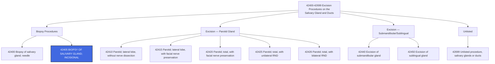

---
tags:
  - cpt
  - biopsy
  - salivary-gland
  - incisional-biopsy
  - parotid
  - submandibular
  - sublingual
  - ent
  - oral-surgery
  - head-and-neck
  - diagnostic
  - pathology
  - otolaryngology
cpt: 42405
descriptor: Biopsy of salivary gland; incisional
category: Excision Procedures on the Salivary Gland and Ducts
specialty:
  - Otolaryngology (ENT)
  - Head and Neck Surgery
  - Oral and Maxillofacial Surgery
  - Rheumatology (Sjögren's workup)
  - General Surgery
type: Procedure
status: Active ✅
approach: Open (external/transcutaneous incision)
anesthesia: Local or General
global_days: 10
effective_date: Pre-1990 (legacy code)
last_updated: 2026-01-01
parent_category: Excision Procedures on the Salivary Gland and Ducts (42400-42699)
aliases:
  - Incisional salivary gland biopsy
  - Open salivary gland biopsy
  - Parotid biopsy incisional
  - Submandibular gland biopsy open
sections:
  - Excision Procedures on the Salivary Gland and Ducts (42400-42699)
cpt_guidelines: Open incisional biopsy of a major salivary gland (parotid, submandibular, or sublingual) via skin incision; distinguishes from needle biopsy (42400); tissue sent to pathology; facial nerve identification and preservation documentation strongly recommended when performing parotid biopsy
work_rvu_2026: Consult CMS MPFS RVU26A for current value; subject to 2.5% efficiency adjustment
---

# 🧬 CPT Code 42405: Biopsy of Salivary Gland; Incisional

## 📋 Code Information

| Field | Value |
| :--- | :--- |
| **CPT Code** | [[42405]] |
| **Descriptor** | Biopsy of salivary gland; incisional |
| **Section** | Excision Procedures on the Salivary Gland and Ducts ([[42400]]-[[42699]]) |
| **Approach** | Open (external/transcutaneous incision) |
| **Global Period** | 10 days (Minor Surgery) |
| **Effective Date** | Pre-1990 (legacy code) |
| **Last Updated** | 2026-01-01 (no change from 2025) |

## 📖 Clinical Description

**CPT [[42405]]** describes an **open incisional biopsy** of a major salivary gland — the parotid, submandibular (**submaxillary**), or sublingual gland — performed via a skin incision. The surgeon makes an external incision over the affected gland, dissects through subcutaneous tissue, removes a representative tissue sample from within the gland, and closes the incision. The specimen is submitted to pathology for histological examination.[1][7][10]

This procedure is distinct from **needle biopsy** (**[[42400]]**), which uses percutaneous fine-needle aspiration or core needle techniques without an open incision. **[[42405]]** is the appropriate code when an **open surgical approach** with formal incision and tissue excision is performed for diagnostic purposes — not for therapeutic excision of the entire gland or a tumor.[6][8]

### Anatomical Definition — Major Salivary Glands

The three paired **major salivary glands** are the targets of **[[42405]]**:

- **Parotid gland** — the largest salivary gland, located anterior to and below the ear in the preauricular/parotid region; the facial nerve (CN VII) passes through the substance of the parotid and must be identified and protected during open procedures
- **Submandibular (submaxillary) gland** — located in the floor of the mouth/[[submandibular]] triangle; closely related to the marginal mandibular nerve, lingual nerve, and hypoglossal nerve
- **Sublingual gland** — the smallest major salivary gland, located in the floor of mouth beneath the oral mucosa; infrequently biopsied via open incisional approach

> ⚠️ **Minor salivary glands** (**scattered throughout the oral mucosa, palate, lips**) are biopsied via **intraoral mucosal incision**, not an external skin incision; those biopsies are reported with different codes depending on the site (**e.g., [[40808]] for vestibule of mouth, [[42100]] for palate**).[6]

### Procedure Steps

1. **Patient Preparation**: Positioned supine; local anesthetic (**with or without IV sedation**) or general anesthesia administered.
2. **Incision**: A skin incision is made over the affected major salivary gland — commonly a preauricular/submandibular crease incision for parotid or submandibular gland access.
3. **Dissection**: [[Subcutaneous]] tissue and superficial musculoaponeurotic system (SMAS) or platysma are dissected to expose the gland.
4. **Facial Nerve Identification** (**for parotid**): The facial nerve trunk or its branches are identified and carefully preserved.
5. **Tissue Sampling**: A representative wedge or core of glandular tissue is excised from the gland.
6. **Hemostasis**: Achieved with electrocautery, suture ligation, or packing.
7. **Closure**: Deep and superficial layers are closed in standard fashion; drain may be placed at surgeon's discretion.
8. **Specimen Handling**: Tissue is submitted for permanent pathological analysis; intraoperative frozen section may be used if malignancy is suspected.

### Indications

- Salivary gland mass or swelling — indeterminate on imaging or needle biopsy
- Suspected primary salivary gland neoplasm (**benign or malignant**)
- Suspected [[lymphoma]] involving a salivary gland
- Sarcoidosis with salivary gland involvement
- Sjögren's syndrome evaluation via major gland (**note: labial/minor salivary gland biopsy is more commonly used diagnostically for Sjögren's**)
- Chronic sclerosing sialadenitis (**Küttner tumor**)
- Inconclusive or non-diagnostic fine-needle aspiration cytology (FNAC)
- IgG4-related disease with salivary involvement

## 🔍 Includes and Inclusions

- **Open skin incision** over the major salivary gland[1][7]
- **Surgical tissue excision** from within the gland[1]
- **Hemostasis** and wound closure[1]
- **Specimen submission** to pathology[7]
- **Simple drain placement** if performed at the same session[1]
- All routine post-operative care within the **10-day global period**[3]

## 🚫 Excludes and Differentiating Codes

### Biopsy Approach: Needle vs. Incisional

| Code      | Description                              | Approach                                          | When to Use                                    |
| :-------- | :--------------------------------------- | :------------------------------------------------ | :--------------------------------------------- |
| **[[42400]]** | Biopsy of salivary gland; **needle**     | Percutaneous FNA or core needle; no skin incision | FNA or core needle biopsy — no open incision   |
| **[[42405]]** | Biopsy of salivary gland; **incisional** | Open skin incision; surgical tissue excision      | Open biopsy with skin incision — **THIS CODE** |

### Biopsy vs. Excision — Critical Distinction

> ⚠️ **[[42405]] is diagnostic only.** If the operative intent is to **remove a tumor or the entire gland**, use the appropriate excision code, **NOT** [[42405]].

| Code      | Description                                                                                                | Intent                              |
| :-------- | :--------------------------------------------------------------------------------------------------------- | :---------------------------------- |
| **[[42405]]** | Biopsy of salivary gland; incisional                                                                       | **Diagnostic** — tissue sample only |
| **[[42410]]** | Excision of parotid tumor or parotid gland; lateral lobe, without nerve dissection                         | Therapeutic excision                |
| **[[42415]]** | Excision of parotid tumor or parotid gland; lateral lobe, with dissection and preservation of facial nerve | Superficial parotidectomy           |
| **[[42420]]** | Excision of parotid tumor; total, with dissection and preservation of facial nerve                         | Total parotidectomy                 |
| **[[42425]]** | Excision of parotid tumor; total, with unilateral radical neck dissection                                  | Total parotidectomy + RND           |
| **[[42426]]** | Excision of parotid gland; total, with bilateral radical neck dissection                                   | Extensive resection                 |
| **[[42440]]** | Excision of submandibular (submaxillary) gland                                                             | Submandibular gland excision        |
| **[[42450]]** | Excision of sublingual gland                                                                               | Sublingual gland excision           |

### Minor Salivary Gland Biopsy — Different Codes

| Code | Description | Site |
| :--- | :--- | :--- |
| [[40808]] | Biopsy, vestibule of mouth | Lips/cheeks mucosa (minor salivary glands in vestibule) |
| [[42100]] | Biopsy of palate, uvula | Palatal minor salivary glands |
| [[41108]] | Biopsy of floor of mouth | Floor of mouth minor glands |

> Minor salivary gland biopsies for Sjögren's syndrome diagnosis are most commonly performed **intraorally** (labial gland biopsy) and coded based on the intraoral site, NOT with [[42405]].[6][8]

### Procedures Not Reported Separately with 42405

| Item | Rationale |
| :--- | :--- |
| Simple drain placement at same session | Included in [[42405]] |
| Routine hemostasis | Bundled into the procedure |
| Post-op visits within 10-day global | Minor surgery global package |
| Pathology specimen handling | Clinical component included; pathology codes ([[88305]], [[88307]]) billed separately by the pathologist |

## 📊 Code Tree and Hierarchy

## 🔄 Modifiers and Billing Nuances

### Applicable Modifiers for 42405

| Modifier | Description | Application |
| :--- | :--- | :--- |
| [[-22]] | Increased Procedural Services | Use when work is substantially greater than typical (e.g., previously operated field, severe scarring, unusually difficult anatomy requiring extended facial nerve dissection) |
| [[-25]] | Significant, Separately Identifiable E/M Service | Append to the E/M code when a significant, separately identifiable E/M is performed same day as the biopsy; both services must be documented independently |
| [[-50]] | Bilateral Procedure | Use if bilateral salivary gland biopsies (both sides) are performed in the same session (e.g., bilateral parotid biopsies for Sjögren's or sarcoidosis workup) |
| [[-51]] | Multiple Procedures | Use when multiple procedures are performed in the same session; Medicare applies automatically |
| [[-52]] | Reduced Services | Use when procedure is partially reduced at physician's discretion |
| [[-59]] | Distinct Procedural Service | Use to indicate a procedure is distinct and independent from other services performed same day |
| [[-76]] | Repeat Procedure, Same Physician | Repeat of same procedure same day by same provider |
| [[-77]] | Repeat Procedure, Another Physician | Repeated by a different provider same day |
| [[-78]] | Unplanned Return to OR — Related Procedure | Use for related unplanned return to OR during the 10-day global period (e.g., post-op hematoma drainage) |
| [[-79]] | Unrelated Procedure During Post-op Period | Use for unrelated procedure performed during the 10-day global period |

### Assistant Surgeon Modifiers for [[42405]]

| Modifier | Description | Application |
| :--- | :--- | :--- |
| [[-80]] | Assistant Surgeon | Typically **not routinely payable** for this minor diagnostic biopsy; verify MPFSDB indicator |
| [[-81]] | Minimum Assistant Surgeon | Rarely applicable |
| [[-82]] | Assistant Surgeon (resident not available) | Teaching hospital exception |
| [[-AS]] | Non-Physician Assistant at Surgery | PA, NP, CNS assisting — verify payer policy |

### Important Modifier Notes

- **Modifier [[-25]] with E/M**: If the patient presents for initial evaluation of a salivary gland mass and the provider performs a comprehensive history and physical (**beyond routine pre-procedure assessment**) AND then performs the biopsy, modifier [[-25]] must be appended to the E/M code. Documentation must clearly support both a distinct evaluation and management service AND the biopsy as separate, independently justifiable services.[1][3]
- **Modifier [[-50]] Bilateral**: When biopsies of both right and left parotid or submandibular glands are performed (**common in systemic disease workup such as sarcoidosis or Sjögren's**), modifier [[-50]] is appropriate. Some payers prefer two line items with modifiers [[-LT]] and [[-RT]] instead — verify with individual payer.[1]
- **Facial Nerve Dissection Complexity — Modifier [[-22]]**: If the parotid biopsy requires identification and dissection of the facial nerve (CN VII) due to difficult anatomy, prior surgery, or radiation changes, and this substantially increases the operative time and risk, modifier [[-22]] may be appended. Detailed documentation of the added complexity is required.[1]
- **Intraoperative Frozen Section**: If a frozen section is requested, the pathologist bills [[88331]] separately. The surgeon does not add a separate code for requesting the frozen section — it is not a separate CPT service for the operating surgeon.[7]

## 👨‍⚕️ Assistant Surgeon (Modifier [[80]]) Payability

### Assistant Surgeon Information

For a **10-day minor surgery** like [[42405]], an assistant surgeon is generally **not medically necessary** and is typically **not reimbursed** by Medicare or most commercial payers.

### Medicare Payment Indicators

Check the MPFSDB "Asst Surg" indicator for [[42405]]:

| Indicator | Meaning |
| :--- | :--- |
| **0** | Payment restriction; supporting documentation required |
| **1** | Statutory payment restriction; assistants not paid |
| **2** | Payment restriction does NOT apply; assistants may be paid |
| **9** | Concept does not apply |

> ⚠️ **Clinical Reality**: For a minor incisional biopsy like [[42405]], assistant surgeon services are **not typically billed or reimbursed**. If an assistant is used in a complex case (**e.g., re-operative field with difficult anatomy**), documentation must clearly support medical necessity. Medicare reimburses physician assistant at surgery at **16% of the MPFS amount** when payable; non-physician assistants at **13.6% of the MPFS amount**.[11]

## 💰 Work RVU (wRVU) and Reimbursement

### Work RVU Information

The wRVU for [[42405]] is updated annually by CMS. For current 2026 values:

- **2026 Reference**: Consult the CMS MPFS RVU26A file or AMA RBRVS DataManager[2][4]
- **2026 Efficiency Adjustment**: CMS finalized a **-2.5% efficiency adjustment** to wRVUs for non-time-based codes including minor surgical procedures like [[42405]][4][5]

### 2026 Medicare Payment Updates

| Factor | Value |
| :--- | :--- |
| **Conversion Factor (non-QP)** | $33.4009 |
| **Conversion Factor (QP/APM)** | $33.5675 |
| **Efficiency Adjustment** | -2.5% applied to wRVUs for non-time-based surgical codes including [[42405]] |
| **Global Period** | 10 days (Minor Surgery) — day of surgery + 10 post-op days included |

### National Average Reimbursement

National average reimbursement for **CPT [[42405]]** is consistent with a minor open biopsy procedure. Reimbursement varies by MAC geographic region, payer contract, and facility vs. non-facility setting. Always consult your payer-specific fee schedule for accurate current values.

### Common Places of Service

| POS | Description |
| :--- | :--- |
| **11** | Office |
| **22** | On-Campus Outpatient Hospital |
| **24** | Ambulatory Surgical Center (ASC) |
| **23** | Emergency Room - Hospital (uncommon for this procedure) |

## 📋 Documentation Requirements

To support billing of **[[42405]]**, the operative report or procedure note must clearly document:[1][6][7][8]

- **Preoperative Diagnosis**: Specific indication (**e.g., "right parotid gland mass, indeterminate by FNA," "bilateral parotid enlargement, rule out [[sarcoidosis]]"**)
- **Gland Identified**: Specify which major salivary gland was biopsied (**parotid, submandibular, sublingual**) and laterality (**right or left**)
- **Approach**: External skin incision (**confirms incisional approach — distinguishes from [[42400]] needle biopsy**)
- **Procedure Performed**: "Open incisional biopsy of [right/left] [parotid/submandibular] gland"
- **Facial Nerve Status** (**parotid biopsies**): Document identification and preservation of the facial nerve or its branches; this is a critical medicolegal and coding element
- **Size and Character of Tissue Sample**: Description of excised specimen
- **Hemostasis**: Method used
- **Closure**: Layer-by-layer closure description
- **Specimen Handling**: Tissue sent for permanent section; frozen section if requested
- **No Therapeutic Intent Documented**: Confirms biopsy is diagnostic, not excisional (**distinguishes from [[42410]]-[[42450]]**)

### Critical Documentation Elements[6][8]

| Element | Why It Matters |
| :--- | :--- |
| **"Incisional" / skin incision documented** | Distinguishes [[42405]] from [[42400]] (needle) |
| **Specific gland identified** | Required for ICD-10 accuracy and laterality |
| **"Biopsy" not "excision"** | Confirms diagnostic intent; prevents upcoding to [[42415]] or [[42440]] |
| **Facial nerve identification (parotid)** | Critical for medicolegal record; may support modifier [[-22]] if complex dissection required |
| **Pathology submission confirmed** | Required to support the diagnostic purpose of the procedure |

## 📊 ICD-10 Crosswalk and HCC Information

### Primary ICD-10 Diagnoses for [[42405]]

| ICD-10 Code | Description | HCC Applicability |
| :--- | :--- | :--- |
| [[C07]] | **Malignant neoplasm of parotid gland** | **Yes** (HCC 8 or 10) |
| [[C08.0]] | Malignant neoplasm of submandibular gland | Yes (HCC 8 or 10) |
| [[C08.1]] | Malignant neoplasm of sublingual gland | Yes (HCC 8 or 10) |
| [[C08.9]] | Malignant neoplasm of major salivary gland, unspecified | Yes (HCC 8 or 10) |
| [[D11.0]] | Benign neoplasm of parotid gland | No (0) |
| [[D11.7]] | Benign neoplasm of other major salivary glands | No (0) |
| [[D11.9]] | Benign neoplasm of major salivary gland, unspecified | No (0) |
| [[K11.0]] | Atrophy of salivary gland | No (0) |
| [[K11.1]] | Hypertrophy of salivary gland | No (0) |
| [[K11.20]] | Sialadenitis, unspecified | No (0) |
| [[K11.21]] | Acute sialadenitis | No (0) |
| [[K11.22]] | Acute recurrent sialadenitis | No (0) |
| [[K11.23]] | Chronic sialadenitis | No (0) |
| [[K11.3]] | Abscess of salivary gland | No (0) |
| [[K11.5]] | Sialolithiasis | No (0) |
| [[K11.8]] | Other diseases of salivary glands (benign lymphoepithelial lesion, Mikulicz disease, necrotizing sialometaplasia) | No (0) |
| [[K11.9]] | Disease of salivary gland, unspecified | No (0) |
| [[M35.00]] | Sjögren syndrome, unspecified | No (0) |
| [[M35.01]] | Sjögren syndrome with keratoconjunctivitis sicca | No (0) |
| [[M35.02]] | Sjögren syndrome with lung involvement | **Varies** — lung involvement may carry HCC weight |
| [[M35.09]] | Sjögren syndrome with other organ involvement | No (0) |
| [[D86.0]] | Sarcoidosis of lung | **Yes** (HCC 84) |
| [[D86.3]] | Sarcoidosis of skin | No (0) |
| [[D86.89]] | Sarcoidosis of other sites (includes parotid) | No (0) |
| [[M35.8]] | IgG4-related disease | No (0) |

### HCC Note

- **Malignant neoplasms** of the salivary glands (C07, C08.x) are significant HCC risk adjustors, typically mapping to **HCC 8 or 10**
- **Benign and inflammatory** salivary gland conditions (K11.x, D11.x, M35.x) are **not HCC contributors** in the standard CMS-HCC model
- **Sarcoidosis with pulmonary involvement** (**[[D86.0]]**) may carry HCC weight depending on model version — document and code all active comorbidities
- The CPT code [[42405]] itself does not contribute to HCC risk adjustment

## 🏥 MS-DRG Assignment

[[42405]] is almost always performed in an **outpatient or ASC setting**. Inpatient admission is uncommon unless performed as part of a larger head and neck procedure or when significant comorbidities require overnight monitoring. When performed inpatient:[6]

### For Salivary Gland Malignancy (e.g., C07)

| MS-DRG | Description |
| :--- | :--- |
| **146** | Ear, nose, mouth and throat malignancy with MCC |
| **147** | Ear, nose, mouth and throat malignancy with CC |
| **148** | Ear, nose, mouth and throat malignancy without CC/MCC |

### For Other Salivary/Mouth Procedures

| MS-DRG | Description |
| :--- | :--- |
| **137** | Mouth procedures with CC/MCC |
| **138** | Mouth procedures without CC/MCC |

### ICD-10-PCS Procedure Codes

For hospital **inpatient** coding:

| Approach | ICD-10-PCS Code | Description |
| :--- | :--- | :--- |
| Open | 0CB80ZX | Excision of Parotid Gland, Right, Open Approach, Diagnostic |
| Open | 0CB90ZX | Excision of Parotid Gland, Left, Open Approach, Diagnostic |
| Open | 0CBF0ZX | Excision of Submandibular Gland, Right, Open Approach, Diagnostic |
| Open | 0CBG0ZX | Excision of Submandibular Gland, Left, Open Approach, Diagnostic |

> ⚠️ For inpatient profee coding, **[[42405]]** is used on the professional (**CMS-1500**) claim; **ICD-10-PCS** codes are used on the facility (**UB-04**) claim only.

## 📝 Coding Examples and Scenarios

### Example 1: Open Parotid Biopsy for Indeterminate Mass
**Scenario**: A 58-year-old presents with a right parotid mass. FNA was non-diagnostic. The head and neck surgeon performs an open incisional biopsy of the right parotid gland through a preauricular incision; facial nerve branches are identified and preserved. Specimen sent to pathology; frozen section negative for malignancy on gross assessment.
**Coding**:
- [[42405]] — Biopsy of salivary gland; incisional
- [[D11.0]] — Benign neoplasm of parotid gland (pre-biopsy working diagnosis; update to final pathological diagnosis after results)
- *Rationale: Open incisional biopsy of major salivary gland with skin incision = [[42405]]. Pathology coding ([[88305]]/[[88307]]) is separately billed by the pathologist.*[1][7]

### Example 2: Needle Biopsy vs. Open Biopsy — Code Selection
**Scenario**: Same presentation, but the radiologist performs an ultrasound-guided fine-needle aspiration (FNA) of the parotid mass.
**Coding**:
- **Correct**: [[42400]] — Biopsy of salivary gland; needle
- **Incorrect**: [[42405]]
- *Rationale: [[42405]] is specifically the incisional (open, skin incision) approach. Needle aspiration without a skin incision = [[42400]].*[6][8]

### Example 3: Bilateral Parotid Biopsies for Sarcoidosis
**Scenario**: A 45-year-old with suspected systemic sarcoidosis presents with bilateral parotid enlargement. The surgeon performs open incisional biopsies of both the right and left parotid glands during the same operative session.
**Coding**:
- [[42405]]-[[50]] — Biopsy of salivary gland; incisional; bilateral
- [[D86.89]] — Sarcoidosis of other sites (parotid glands)
- *Rationale: Modifier [[50]] indicates bilateral procedure performed in same session. Some payers prefer separate line items with LT and RT modifiers — verify payer policy.*[1]

### Example 4: Biopsy with Significant E/M Same Day
**Scenario**: A new patient presents for evaluation of a submandibular gland swelling. The surgeon takes a comprehensive history, reviews imaging, discusses differential diagnosis including Sjögren's and lymphoma, and then performs an open incisional biopsy of the submandibular gland in the same visit.
**Coding**:
- E/M code (e.g., [[99205]] or [[99244]]) — [[25]]
- [[42405]] — Biopsy of salivary gland; incisional
- [[K11.9]] — Disease of salivary gland, unspecified (pending biopsy results)
- *Rationale: Modifier [[25]] indicates a significant, separately identifiable E/M was performed the same day as the procedure. Documentation must support both services independently.*[1][3]

### Example 5: Biopsy Upgrades to Excision Intraoperatively — Coding Change
**Scenario**: The surgeon begins an incisional biopsy of the left parotid gland, but frozen section reveals mucoepidermoid carcinoma. The surgeon proceeds to total parotidectomy with facial nerve preservation in the same session.
**Coding**:
- **Correct**: [[42420]] — Excision of parotid tumor or parotid gland; total, with dissection and preservation of facial nerve
- **Do NOT report**: [[42405]] separately — the incisional biopsy is considered a component of the definitive excision procedure when performed in the same session
- *Rationale: When the procedure is upgraded intraoperatively from biopsy to excision in the same operative session, report only the most definitive procedure.*[8]

### Example 6: Return to OR for Post-op Hematoma — 10-Day Global
**Scenario**: Three days after an open parotid biopsy, the patient returns to the OR for drainage of a post-operative hematoma.
**Coding**:
- Appropriate hematoma drainage code — [[78]] (Unplanned return to OR, related procedure, during post-op period)
- *Rationale: Within the 10-day global period of [[42405]], a related return to the OR is reported with modifier [[78]] on the hematoma drainage code, not by re-billing [[42405]].*[3]

## ⚠️ Important Coding Notes

### Needle vs. Incisional — The Most Common Error

> ⚠️ Verify the operative approach before coding. The chart may say "biopsy of parotid" without specifying the method. An external skin incision = [[42405]]; percutaneous needle (FNA or core) = [[42400]]. Do not assume — query the op report.

### Biopsy vs. Excision — Intent Determines the Code

| Scenario | Code |
| :--- | :--- |
| Diagnostic tissue sample only; gland or mass left in place | **[[42405]]** |
| Complete removal of a parotid tumor or gland (any type) | **[[42410]]-[[42426]]** |
| Complete removal of submandibular gland | **[[42440]]** |
| Biopsy that converts to excision intraoperatively | Only the excision code |

### Pathology Billing

The operating surgeon bills [[42405]] for the surgical procedure. The **pathologist** separately bills for tissue analysis:
- [[88305]] — Level IV Surgical pathology, gross and microscopic examination (commonly used for salivary gland biopsies)
- [[88307]] — Level V Surgical pathology (for complex or malignant specimens)
- [[88331]] — Intraoperative consultation, initial frozen section (if intraoperative frozen section requested)

### Global Period — 10 Days

- [[42405]] carries a **10-day minor surgery global period**
- Routine post-op drain removal, suture removal, and wound checks within 10 days are **bundled**
- Separately payable: unrelated E/M (**modifier [[-24]]**), unrelated procedure (**modifier [[-79]]**), unplanned return for complication (**modifier [[-78]]**)

### 2026 Efficiency Adjustment

The -2.5% CMS efficiency adjustment applies to **[[42405]]** for 2026. Given this is a relatively low-value minor procedure, the practical dollar impact is small but should be reflected in any wRVU-based compensation tracking.

## 🔗 Related Codes

### Salivary Gland Biopsy Codes

| Code      | Description                                          |
| :-------- | :--------------------------------------------------- |
| **[[42400]]** | Biopsy of salivary gland; needle                     |
| **[[42405]]** | Biopsy of salivary gland; incisional — **THIS CODE** |

### Parotid Gland Excision Codes[10]

| Code      | Description                                                                               |
| :-------- | :---------------------------------------------------------------------------------------- |
| **[[42410]]** | Excision of parotid tumor or parotid gland; lateral lobe, without nerve dissection        |
| **[[42415]]** | Excision of parotid tumor; lateral lobe, with dissection and preservation of facial nerve |
| **[[42420]]** | Excision of parotid tumor; total, with dissection and preservation of facial nerve        |
| **[[42425]]** | Excision of parotid tumor; total, with unilateral radical neck dissection                 |
| **[[42426]]** | Excision of parotid gland; total, with bilateral radical neck dissection                  |

### Other Major Salivary Gland Excision Codes

| Code      | Description                                    |
| :-------- | :--------------------------------------------- |
| **[[42440]]** | Excision of submandibular (submaxillary) gland |
| **[[42450]]** | Excision of sublingual gland                   |

### Salivary Gland Drainage Codes

| Code      | Description                                                |
| :-------- | :--------------------------------------------------------- |
| **[[42300]]** | Drainage of abscess; parotid, simple                       |
| **[[42305]]** | Drainage of abscess; parotid, complicated                  |
| **[[42310]]** | Drainage of abscess; submaxillary or sublingual, intraoral |
| **[[42320]]** | Drainage of abscess; submaxillary, external                |

### Unlisted Code

| Code          | Description                                  |
| :------------ | :------------------------------------------- |
| **[[42699]]** | Unlisted procedure, salivary glands or ducts |

## References

<small>
1 MD Clarity. "CPT Code 42405: What It Is, Modifiers, Reimbursement." (2024). https://www.mdclarity.com/cpt-code/42405
2 CMS. "Calendar Year 2026 Medicare Physician Fee Schedule Final Rule (CMS-1832-F)." (2025). https://www.cms.gov/newsroom/fact-sheets/calendar-year-cy-2026-medicare-physician-fee-schedule-final-rule-cms-1832-f
3 CMS. "MLN907166 - Global Surgery Booklet." https://www.cms.gov/files/document/mln907166-global-surgery-booklet.pdf
4 PYA. "2026 wRVU Changes and Physician Compensation Planning." (2026). https://www.pyapc.com/insights/2026-wrvu-changes-are-here-what-organizations-need-to-know-for-physician-compensation-planning/
5 MedAxiom. "CMS Releases 2026 Final Physician Fee Schedule Rule." (2025). https://www.medaxiom.com/news/2025/11/05/news/cms-releases-2026-final-physician-fee-schedule-rule/
6 AAOMS. "Coding for Oral and Maxillofacial Pathology." (2024). https://aaoms.org/wp-content/uploads/2024/04/Pathology_CodingPaper.pdf
7 GenHealth.ai. "42405 - Biopsy of Salivary Gland; Incisional." (2026). https://genhealth.ai/code/cpt4/42405-biopsy-of-salivary-gland-incisional
8 AAO-HNS / EntNet. "Parotidectomy Coding Guidance." https://www.entnet.org/wp-content/uploads/files/Parotidectomy-CI.docx
9 Medica. "Global Days Assignment Code List — Effective 01/01/2026." https://partner.medica.com/~/media/Documents/Provider/Global-Days-Assignments-Code-List.pdf
10 AAPC. "CPT® Code 42405 - Excision Procedures on the Salivary Gland and Ducts." (2024). https://www.aapc.com/codes/cpt-codes/42405
11 FCSO Medicare. "Appropriate Use of Assistant at Surgery Modifiers and Payment Indicators." (2025). https://medicare.fcso.com/coding/appropriate-use-assistant-surgery-modifiers-and-payment-indicators
12 PayerPrice. "CPT Code 42405 - Description and Fee Schedule 2026." (2026). https://payerprice.com/rates/42405-CPT-fee-schedule
</small>