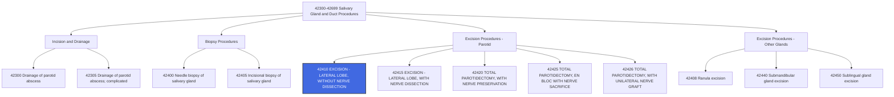

---
tags:
  - cpt
  - ent
  - parotid
  - salivary-gland
  - tumor
  - head-neck
  - oncology
  - facial-nerve
  - surgery
  - major-procedure
cpt: 42410
descriptor: Excision of parotid tumor or parotid gland; lateral lobe, without nerve dissection
category: Surgical Procedures on the Salivary Glands and Ducts
specialty:
  - Otolaryngology (ENT)
  - Head and Neck Surgery
  - Surgical Oncology
  - Oral and Maxillofacial Surgery
type: Procedure
status: Active ✅
approach: Open Surgical
anesthesia: General
global_days: 90
effective_date: 1990-01-01 (approx.)
last_updated: 2026-01-01
parent_category: Salivary Gland and Duct Procedures (42300-42699)
aliases:
  - Superficial parotidectomy
  - Lateral lobectomy of parotid
  - Parotid tumor excision
  - Partial parotidectomy
  - Parotid gland resection
sections:
  - Excision Procedures on Salivary Glands and Ducts (42400-42450)
cpt_guidelines: Specific code for removal of the lateral (superficial) lobe of the parotid gland without facial nerve dissection
work_rvu_2026: Consult CMS MPFS for current value; subject to 2.5% efficiency adjustment
---

# 🧬CPT Code 42410: Excision of Parotid Tumor or Parotid Gland; Lateral Lobe, Without Nerve Dissection

## 📋 Code Information

| Field | Value |
| :--- | :--- |
| **CPT Code** | [[42410]] |
| **Descriptor** | Excision of parotid tumor or parotid gland; lateral lobe, without nerve dissection |
| **Section** | Salivary Gland and Duct Procedures ([[42300]]-[[42699]]) |
| **Approach** | Open surgical |
| **Global Period** | 90 days |
| **Effective Date** | 1990 (approx.) |
| **Last Updated** | 2026-01-01 (no change from 2025) |

## 📖 Clinical Description

**[[42410]]** describes a surgical procedure to remove a tumor from the lateral (superficial) lobe of the parotid gland or to excise the lateral lobe itself, specifically **without dissection of the facial nerve**. The parotid gland is the largest of the three major paired salivary glands, located beneath and in front of the ear. It plays a crucial role in saliva production, which aids in digestion and oral health.[1][2][4]

### Anatomical Context[2][7]

The parotid gland has two main lobes:
- **Lateral (Superficial) Lobe**: The larger, more superficial portion that lies over the masseter muscle
- **Medial (Deep) Lobe**: The portion that extends into the parapharyngeal space

The facial nerve (cranial nerve VII) courses through the parotid gland, dividing it into superficial and deep lobes. Preservation of this nerve is critical to maintain facial muscle function.

### Procedure Steps[2]

1.  **Incision**: The surgeon makes an incision just anterior to the auricle of the ear, extending around the ear lobe and along the mandible.
2.  **Skin Flap Elevation**: A skin flap is elevated to expose the parotid gland.
3.  **Gland Dissection**: The inferior aspect of the parotid gland is carefully dissected off the sternocleidomastoid muscle, continuing until the digastric muscle is reached.
4.  **Facial Nerve Identification**: The tissue anterior to the tip and superior to the tragus is meticulously dissected to expose the trunk of the facial nerve. **Note for 42410**: While the nerve is identified and preserved, this code specifies "without nerve dissection," meaning the surgeon does not perform extensive dissection of the nerve branches beyond identification.[7]
5.  **Lobe Excision**: The lateral lobe of the parotid gland or the tumor within it is excised. If deeper dissection is necessary, a nerve stimulator may be utilized to identify and protect the facial nerve branches.
6.  **Hemostasis**: Bleeding is controlled using electrocautery.
7.  **Drain Placement**: A drain is typically placed through a separate incision behind the ear to facilitate postoperative drainage.
8.  **Closure**: The platysma muscle, subcutaneous tissue, and skin are closed in layers.

### Indications[2][4]

- Benign parotid tumors (e.g., pleomorphic adenoma, Warthin's tumor)
- Malignant parotid tumors (e.g., mucoepidermoid carcinoma, adenoid cystic carcinoma)[4]
- Chronic sialadenitis of the parotid gland
- Parotid gland obstruction or dysfunction
- Suspicious parotid mass requiring excision for diagnosis and treatment

## 🔍 Includes and Inclusions

- **Lateral Lobe Excision**: Removal of the superficial portion of the parotid gland[2][7]
- **Tumor Excision**: Removal of a mass from the lateral lobe[2]
- **Without Nerve Dissection**: Code is specific to procedures where the facial nerve is not extensively dissected[2][7]

## 🚫 Excludes and Differentiating Codes

### Critical Distinction: Nerve Dissection[2][7]

The presence or absence of facial nerve dissection is the key factor in code selection:

| Code | Description | When to Use |
| :--- | :--- | :--- |
| [[42410]] | Lateral lobe, without nerve dissection | Minimal nerve identification only; no extensive branch dissection[2][7] |
| [[42415]] | Lateral lobe, with dissection and preservation of facial nerve | Extensive nerve dissection required to remove tumor while preserving nerve[2][7] |
| [[42420]] | Total parotidectomy, with dissection and preservation of facial nerve | Complete gland removal with nerve preservation |
| [[42425]] | Total parotidectomy, en bloc removal with sacrifice of facial nerve | Complete removal including nerve sacrifice (malignancy) |

### Other Salivary Gland Excision Codes

| Code | Description | Differentiating Factor |
| :--- | :--- | :--- |
| [[42408]] | Excision of sublingual salivary cyst (ranula) | Sublingual gland, not parotid |
| [[42440]] | Excision of submandibular (submaxillary) gland | Submandibular gland, not parotid |
| [[42450]] | Excision of sublingual gland | Sublingual gland, not parotid |

### Procedures Not Reported with [[42410]]

| Situation | Rationale |
| :--- | :--- |
| Biopsy only | Use 42400 (needle) or 42405 (incisional) |
| Simple cyst removal (pre-auricular area) | Not parotid; use appropriate skin/soft tissue codes (21011, 11400-11646)[1] |
| Intraoperative nerve monitoring (when performed by another provider) | Report separately with 95940 if performed by different individual[7] |

## 📊 Code Tree and Hierarchy

## 🔄 Modifiers and Billing Nuances

### Applicable Modifiers for [[42410]][2]

| Modifier | Description | Application |
| :--- | :--- | :--- |
| [[-22]] | Increased Procedural Services | Use when work required is substantially greater than typical (e.g., extensive adhesions, large tumor, difficult anatomy). Documentation must support the additional work.[2] |
| [[-50]] | Bilateral Procedure | Use if bilateral parotid procedures are performed during the same operative session. Note: 150% payment adjustment applies.[2] |
| [[-51]] | Multiple Procedures | Use when multiple procedures are performed during the same session; standard payment adjustment rules apply. Medicare applies automatically.[2] |
| [[-52]] | Reduced Services | Use when service is partially reduced or eliminated.[2] |
| [[-53]] | Discontinued Procedure | Use if procedure started but discontinued due to patient instability or unforeseen circumstances.[2] |
| [[-58]] | Staged or Related Procedure | Use for planned staged procedure during postoperative period.[2] |
| [[-59]] | Distinct Procedural Service | Use to indicate procedure is distinct from other services performed on same day.[2] |
| [[-62]] | Two Surgeons | Use when two surgeons work as co-surgeons performing distinct parts of procedure. Documentation required.[2] |
| [[-78]] | Unplanned Return to OR | Use for related procedure during postoperative period (e.g., evacuation of hematoma).[2] |
| [[-79]] | Unrelated Procedure | Use for unrelated procedure during postoperative period.[2] |
| [[-LT]]/[[-RT]] | Left/Right side | Use to specify laterality when needed. |

### Assistant Surgeon Modifiers for 42410[2]

| Modifier | Description | Payment Status |
| :--- | :--- | :--- |
| [[-80]] | Assistant Surgeon | **Payment restriction does NOT apply** - assistant may be paid[2] |
| [[-81]] | Minimum Assistant Surgeon | Minimal assistance during portion of surgery[2] |
| [[-82]] | Assistant Surgeon (resident not available) | Teaching hospital when resident unavailable[2] |
| [[-AS]] | Non-Physician Assistant at Surgery | PA, NP, RNFA, CNS assisting |

### Important Modifier Notes

- **Modifier [[-22]] Documentation**: When billing for increased complexity, the operative report must clearly document the unusual circumstances (e.g., "tumor adherent to facial nerve requiring meticulous dissection," "significant scarring from prior surgery")[2]
- **Modifier [[-50]] for Bilateral**: If bilateral procedures are performed, append modifier [[-50]] to a single line item, or use two line items with modifiers [-LT]] and [[-RT]] depending on payer preference[2]

## 👨‍⚕️ Assistant Surgeon (Modifier [[80]]) Payability

### Assistant Surgeon Status for [[42410]][2]

For [[42410]], the **Assistant Surgeon indicator is 2**, meaning **payment restriction for assistants at surgery does NOT apply**. This indicates that assistant surgeon services may be payable when medically necessary.

| Indicator | Meaning | Application to 42410 |
| :--- | :--- | :--- |
| **0** | Payment restriction applies; supporting documentation required | — |
| **1** | Statutory payment restriction; assistants **not** paid | — |
| **2** | **Payment restriction does NOT apply; assistants may be paid** | ✅ **Applicable**[2] |
| **9** | Concept does not apply | — |

### Co-Surgeon Status[2]

For [[42410]], the **Co-Surgeon indicator is 1**, meaning co-surgeons **could be paid**, though supporting documentation is required.[2] This may apply in complex cases where two surgeons (e.g., ENT and neurotologist) work together.

### Team Surgery Status[2]

For [[42410]], the **Team Surgery indicator is 0**, meaning team surgeons are **not permitted** for this procedure.[2]

### Documentation Requirements for Teaching Hospitals

If an assistant surgeon is used, documentation must support one of the following when the surgery is performed in a teaching hospital:
- A statement that **no qualified resident was available** to perform the service
- A statement indicating that **exceptional medical circumstances** exist
- A statement indicating the primary surgeon has an **across-the-board policy** of never involving residents in patient care

### Clinical Justification for Assistant

Given the complexity of parotid surgery and the proximity to the facial nerve, assistant surgeon services are **frequently medically necessary**. Documentation should clearly explain why an assistant was required (e.g., "due to the tumor's proximity to the facial nerve and need for meticulous hemostasis, an assistant surgeon was necessary to ensure safe completion of the procedure").

## 💰 Work RVU (wRVU) and Reimbursement

### Work RVU Information

The Work Relative Value Units (wRVU) for [[42410]] are updated annually by CMS. For current values:

- **2026 Reference**: Consult the most recent CMS Physician Fee Schedule (PFS) Final Rule or the AMA RBRVS DataManager
- **Reimbursement Factors**: Final payment determined by:
  - Total RVUs (Work + Practice Expense + Malpractice)
  - Geographic Practice Cost Index (GPCI) for your area
  - National conversion factor

### 2026 Medicare Payment Updates

| Factor | Value |
| :--- | :--- |
| **Conversion Factor (non-QP)** | $33.4009 |
| **Conversion Factor (QP)** | $33.5675 |
| **Efficiency Adjustment** | -2.5% applied to work RVUs for non-time-based codes, including [[42410]] |

**Important Note**: CMS has finalized a -2.5% productivity/efficiency adjustment applied to work RVUs for approximately 7,700 non-time-based codes, including surgical procedures. This will affect the 2026 wRVU values compared to prior years.

### Medicare Coverage[1]

- [[42410]] is reimbursed by Medicare
- Code is listed on the Medicare Physician Fee Schedule (MPFS), indicating it is a covered service
- Coverage and reimbursement may vary depending on the specific Medicare Administrative Contractor (MAC) in your region

### Facility vs. Non-Facility Payment

- **Facility setting** (hospital inpatient/outpatient): Lower practice expense RVUs
- **Non-facility setting** (office/ASC): Higher practice expense RVUs

## 📋 Documentation Requirements

To support billing of [[42410]], the operative report should clearly document:[2][4][7]

- **Preoperative Diagnosis**: Specific indication for surgery (e.g., "pleomorphic adenoma of left parotid," "parotid mass")
- **Procedure Performed**: "Excision of lateral lobe of parotid gland" or "superficial parotidectomy"
- **Laterality**: Right, left, or bilateral
- **Tumor Description**: Size, location within gland, and characteristics
- **Facial Nerve Status**: Explicit statement that **nerve dissection was NOT performed** (or that only minimal identification occurred, not extensive branch dissection)[7]
- **Findings**: Description of intraoperative findings and any unexpected issues
- **Nerve Monitoring**: Whether a nerve stimulator was used (if applicable)
- **Drain Placement**: Whether a drain was placed
- **Complications**: Any intraoperative issues
- **Specimen Handling**: Description of specimens sent to pathology[4]

### Critical Documentation Elements[4][7]

| Element | Why It Matters |
| :--- | :--- |
| **Nerve Dissection Status** | Critical for distinguishing 42410 from 42415[7] |
| **Laterality** | Supports correct coding |
| **Tumor Location (Lateral vs. Deep)** | Confirms appropriateness of lateral lobe code |
| **Pathology Results** | Supports diagnosis coding (wait for final path if possible)[4] |

### Timing of Diagnosis Coding[4]

- **Initial coding**: May use "parotid mass" or suspected diagnosis
- **Final coding**: **Wait for pathology report** to assign definitive diagnosis (e.g., "mucoepidermoid carcinoma" -> [[C07]])[4]
- **Tip**: Never assign "uncertain behavior" for a confirmed malignancy[4]

## 📊 ICD-10 Crosswalk and HCC Information

### Primary ICD-10 Diagnoses for [[42410]][3][4][5][8][9][10]

| ICD-10 Code     | Description                                           | HCC Applicability                               |
| :-------------- | :---------------------------------------------------- | :---------------------------------------------- |
| **[[C07]]**     | **Malignant neoplasm of parotid gland**               | **Yes** (HCC 8 or 10)[3][4][5][8][9] |
| **[[D11.0]]**   | Benign neoplasm of parotid gland                      | No (0)                                          |
| **[[D11.7]]**   | Benign neoplasm of other major salivary glands        | No (0)                                          |
| **[[D11.9]]**   | Benign neoplasm of major salivary gland, unspecified  | No (0)                                          |
| **[[K11.8]]**   | Other diseases of salivary glands                     | No (0)                                          |
| **[[K11.9]]**   | Disease of salivary gland, unspecified                | No (0)                                          |
| **[[K11.20]]**  | Sialoadenitis, unspecified                            | No (0)                                          |
| **[[K11.21]]**  | Acute sialoadenitis                                   | No (0)                                          |
| **[[K11.22]]**  | Chronic sialoadenitis                                 | No (0)                                          |
| **[[K11.23]]**  | Parotitis                                             | No (0)                                          |
| **[[K11.3]]**   | Abscess of salivary gland                             | No (0)                                          |
| **[[K11.4]]**   | Fistula of salivary gland                             | No (0)                                          |
| **[[K11.5]]**   | Sialolithiasis                                        | No (0)                                          |
| **[[K11.6]]**   | Mucocele of salivary gland                            | No (0)                                          |
| **[[R22.1]]**   | Localized swelling, mass and lump, neck               | No (0)                                          |
| **[[Z85.819]]** | Personal history of malignant neoplasm of oral cavity | No (0)                                          |

### Other Salivary Gland Malignancy Codes[6][8]

| ICD-10 Code | Description                                             | HCC Applicability                   |
| :---------- | :------------------------------------------------------ | :---------------------------------- |
| **[[C08.0]]**   | Malignant neoplasm of submandibular gland               | **Yes** (HCC 8 or 10)[6] |
| **[[C08.1]]**   | Malignant neoplasm of sublingual gland                  | **Yes** (HCC 8 or 10)[6] |
| **[[C08.9]]**   | Malignant neoplasm of major salivary gland, unspecified | **Yes** (HCC 8 or 10)[6] |

### HCC Note[3][4][5][8][9]

- **Malignant neoplasms** of the salivary glands ([[C07]], [[C08.0]], [[C08.1]]) are significant risk adjusters in HCC models, typically mapping to HCC 8 or 10 depending on the specific CMS-HCC model version[3][8][9]
- **Benign neoplasms** and **non-neoplastic conditions** ([[D11.0]], [[K11.8]], etc.) do **not** contribute to HCC risk scores
- The excision procedure code itself ([[42410]]) is a CPT code and does not contribute to HCC risk adjustment

### ICD-9 Crosswalk

| ICD-9-CM Code | Description | Mapping Type |
| :--- | :--- | :--- |
| **142.0** | Malignant neoplasm of parotid gland | Approximate/GEM |
| **210.2** | Benign neoplasm of major salivary glands | Approximate/GEM |
| **527.8** | Other specified diseases of the salivary glands | Approximate/GEM |

## 🏥 MS-DRG Assignment

When performed in an inpatient setting, parotidectomy procedures map to the following Medicare Severity-Diagnosis Related Groups (MS-DRGs):[3]

### For Salivary Gland Procedures

| MS-DRG | Description |
| :--- | :--- |
| **139** | Salivary gland procedures |

### For Malignant Diagnoses (e.g., C07)[3]

| MS-DRG | Description |
| :--- | :--- |
| **146** | Ear, nose, mouth and throat malignancy with MCC |
| **147** | Ear, nose, mouth and throat malignancy with CC |
| **148** | Ear, nose, mouth and throat malignancy without CC/MCC |

### For Other Mouth Procedures[3]

| MS-DRG | Description |
| :--- | :--- |
| **137** | Mouth procedures with CC/MCC |
| **138** | Mouth procedures without CC/MCC |

### ICD-10-PCS Procedure Codes

For hospital inpatient coding, parotidectomy procedures are reported with ICD-10-PCS codes:

| Approach | ICD-10-PCS Code | Description                                     |
| :------- | :-------------- | :---------------------------------------------- |
| Open     | **0GTC0ZZ**     | Resection of Right Parotid Gland, Open Approach |
| Open     | **0GTD0ZZ**     | Resection of Left Parotid Gland, Open Approach  |
| Open     | **0GB30ZZ**     | Excision of Right Parotid Gland, Open Approach  |
| Open     | **0GB40ZZ**     | Excision of Left Parotid Gland, Open Approach   |

## 📝 Coding Examples and Scenarios

### Example 1: Superficial Parotidectomy for Benign Tumor
**Scenario**: A 45-year-old patient presents with a 2 cm mass in the left parotid gland. Fine needle aspiration suggests pleomorphic adenoma. The surgeon performs a superficial parotidectomy, removing the lateral lobe without extensive facial nerve dissection. The facial nerve is identified and preserved but not dissected into branches.
**Coding**:
- [[42410]] - [[-LT]] (Excision of parotid tumor or parotid gland; lateral lobe, without nerve dissection, left side)
- [[D11.0]] (Benign neoplasm of parotid gland) - after pathology confirms
- *Rationale: Classic superficial parotidectomy with nerve preservation but without extensive dissection.*[2][7]

### Example 2: Superficial Parotidectomy with Increased Complexity
**Scenario**: A 60-year-old patient with a recurrent pleomorphic adenoma undergoes superficial parotidectomy. There is extensive scarring from prior surgery, making dissection difficult. The procedure takes significantly longer than usual.
**Coding**:
- [[42410]] - [[-22]] - [[-LT]] (Excision of parotid tumor or parotid gland; lateral lobe, without nerve dissection, increased procedural services, left side)
- [[D11.0]] (Benign neoplasm of parotid gland)
- *Rationale: Modifier 22 is appropriate when the work required is substantially greater than typical. Documentation must support the increased complexity (scarring, adhesions, prolonged operative time).*[2]

### Example 3: Superficial Parotidectomy with Assistant Surgeon
**Scenario**: A 70-year-old patient with a large benign tumor undergoes superficial parotidectomy. Due to the tumor size and proximity to the facial nerve, an assistant surgeon is necessary to ensure safe completion.
**Coding**:
- Primary Surgeon: [[42410]] - [[-LT]] (Excision of parotid tumor or parotid gland; lateral lobe, without nerve dissection, left side)
- Assistant Surgeon: [[42410]] - [[-80]] - [[-LT]] (Excision of parotid tumor or parotid gland; lateral lobe, without nerve dissection, with assistant surgeon, left side)
- Diagnosis: [[D11.0]] (Benign neoplasm of parotid gland)
- *Rationale: 42410 has assistant surgeon indicator 2, meaning payment restrictions do NOT apply. Documentation should support the medical necessity for an assistant.*[2]

### Example 4: Mucoepidermoid Carcinoma - Wait for Pathology
**Scenario**: A 55-year-old patient undergoes superficial parotidectomy for a parotid mass. The surgeon suspects benign tumor but pathology returns as "mucoepidermoid carcinoma."
**Coding**:
- **Procedure**: [[42410]] - [[-RT]] (Excision of parotid tumor or parotid gland; lateral lobe, without nerve dissection, right side)
- **Diagnosis**: [[C07]] (Malignant neoplasm of parotid gland) - based on final pathology
- *Rationale: Always wait for the pathology report to assign the most specific diagnosis. "Mucoepidermoid carcinoma" of the parotid maps to C07.*[4]

### Example 5: Bilateral Superficial Parotidectomy
**Scenario**: A patient with bilateral benign parotid tumors undergoes excision of both lateral lobes during the same operative session.
**Coding**:
- [[42410]] - [[-50]] (Excision of parotid tumor or parotid gland; lateral lobe, without nerve dissection, bilateral)
- [[D11.0]] (Benign neoplasm of parotid gland)
- *Rationale: Modifier 50 indicates bilateral procedure. 150% payment adjustment applies.*[2]

### Example 6: Superficial Parotidectomy with Intraoperative Nerve Monitoring
**Scenario**: The surgeon performs superficial parotidectomy. A neurologist provides continuous intraoperative nerve monitoring during the procedure.
**Coding**:
- **Surgeon**: [[42410]] - [[-RT]] (Excision of parotid tumor or parotid gland; lateral lobe, without nerve dissection)
- **Neurologist**: [[95940]] (Continuous intraoperative neurophysiology monitoring, each 15 minutes) for the monitoring time
- *Rationale: When performed by a different provider, intraoperative nerve monitoring may be reported separately with 95940.*[7]

### Example 7: Superficial Parotidectomy with Skin Substitute Graft
**Scenario**: The surgeon performs superficial parotidectomy and closes the defect with a skin substitute graft (acellular dermal matrix).
**Coding**:
- [[42410]] - [[-RT]] (Excision of parotid tumor or parotid gland; lateral lobe, without nerve dissection)
- [[15275]]-[[15278]] (Application of skin substitute graft to face, scalp, eyelids, mouth, neck, ears, orbits...) depending on area size
- *Rationale: For grafts on the face/neck area, use 15275-15278, not 15777 (which is for breast/trunk).*[7]

### Example 8: Incorrect Coding - Superficial Parotidectomy with Nerve Dissection
**Scenario**: The surgeon performs superficial parotidectomy with extensive dissection of the facial nerve branches to remove a tumor intimately involved with the nerve.
**Coding**:
- **Correct**: [[42415]] (Excision of parotid tumor or parotid gland; lateral lobe, with dissection and preservation of facial nerve)
- **Incorrect**: [[42410]]
- *Rationale: When extensive nerve dissection is performed, 42415 is the appropriate code, not 42410.*[7]

## ⚠️ Important Coding Notes

### Code Selection Algorithm for Parotidectomy

When selecting the appropriate parotidectomy code, consider:

1.  **Extent of Gland Removed**:
    - Lateral lobe only → [[42410]] or [[42415]]
    - Total parotidectomy → [[42420]], [[42425]], or [[42426]]

2.  **Nerve Management**:
    - Without nerve dissection (minimal identification only) → **42410**[7]
    - With dissection and preservation → **42415** (lateral) or **42420** (total)[7]
    - With sacrifice of nerve → **42425** (total, en bloc)
    - With nerve graft → **42426** (total, with graft)

### Global Period

- [[42410]] has a **90-day global period**
- All routine post-operative care is included in the global period
- Complications requiring return to OR may be billed with modifier [[-78]]
- Unrelated procedures during the global period may be billed with modifier [[-79]]

### Intraoperative Nerve Monitoring

- When performed by the **surgeon**: Included in the procedure (not separately billable)
- When performed by **another provider** (e.g., neurologist, neurophysiologist): May be reported separately with [[95940]] for each 15 minutes of one-on-one monitoring[7]
- The monitoring provider must bill under their own NPI

### Skin Grafts and Flaps

- For **skin substitute grafts** on face/neck: Use 15275-15278, not 15777[7]
- For **autologous skin grafts**: Use appropriate graft codes
- For **local flaps**: Use appropriate flap codes (e.g., 14040-14350)

### Frozen Section

Intraoperative frozen section pathology is included in the surgical package for the pathologist, not the surgeon. Surgeons should not bill separately for obtaining frozen sections.

### Lymph Node Dissection

If neck dissection is performed concurrently with parotidectomy (e.g., for malignancy), appropriate neck dissection codes (38500-38542, 38700-38724) may be reported separately with modifier [[-51]].

## 🔗 Related Codes

### Parotidectomy Codes

| Code | Description |
| :--- | :--- |
| [[42410]] | Excision of parotid tumor or parotid gland; lateral lobe, without nerve dissection |
| [[42415]] | Excision of parotid tumor or parotid gland; lateral lobe, with dissection and preservation of facial nerve |
| [[42420]] | Excision of parotid tumor or parotid gland; total, with dissection and preservation of facial nerve |
| [[42425]] | Excision of parotid tumor or parotid gland; total, en bloc removal with sacrifice of facial nerve |
| [[42426]] | Excision of parotid tumor or parotid gland; total, en bloc removal with sacrifice of facial nerve and graft |

### Biopsy Codes

| Code | Description |
| :--- | :--- |
| [[42400]] | Biopsy of salivary gland; needle |
| [[42405]] | Biopsy of salivary gland; incisional |

### Neck Dissection Codes (for concurrent malignancy)

| Code | Description |
| :--- | :--- |
| [[38700]] | Suprahyoid lymphadenectomy |
| [[38720]] | Cervical lymphadenectomy (complete) |
| [[38724]] | Cervical lymphadenectomy (modified radical) |

### Intraoperative Nerve Monitoring

| Code | Description |
| :--- | :--- |
| [[95940]] | Continuous intraoperative neurophysiology monitoring in the operating room, one on one monitoring requiring personal attendance, each 15 minutes[7] |

### Skin Graft Codes (for closure)

| Code | Description |
| :--- | :--- |
| [[15275]]-[[15278]] | Application of skin substitute graft to face, scalp, eyelids, mouth, neck, ears, orbits[7] |
| [[15115]]-[[15116]] | Epidermal autograft |

### Unlisted Codes

| Code | Description |
| :--- | :--- |
| [[42699]] | Unlisted procedure, salivary glands and ducts |
| [[17999]] | Unlisted procedure, skin, mucous membrane and subcutaneous tissue[7] |

## References

1 AAPC. "Reader Question: Hemostasis and Reporting Excision Code." (2014)
2 Coding Ahead. "CPT® Code 42410." (2026)
3 Find-A-Code. "ICD-10-CM Diagnosis Codes - C07." (2026)
4 AAPC. "Follow Documentation, Definition, Deduction for Diagnosis Code." (2018)
5 emedcodes.com. "ICD 10 Diagnosis Codes related to Malignant neoplasm of parotid gland." (2026)
6 Medcode.ch. "ICD-10-CM 2018: C08 Malignant neoplasm of other and unspecified major salivary glands." (2018)
7 AAPC. "Base Parotidectomy Code Selection on Lobes Removed and Facial Nerve Dissection." (2016)
8 Cancer Therapy Advisor. "Oncology ICD-10 Codes." (2024)
9 The Cardiovascular. "C07 - Malignant neoplasm of parotid gland." (2024)
10 vrb.gov.au. "Malignant Neoplasm of the Salivary Gland B040." (2023)