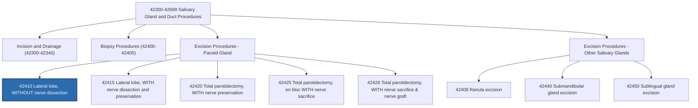

---
tags:
  - CPT
  - surgery
  - parotid-gland
  - parotid-tumor
  - parotidectomy
  - otolaryngology
  - digestive-system
  - inpatient-coding
  - outpatient-coding
code: "42410"
code_type: CPT
code_title: Excision of parotid tumor or parotid gland; lateral lobe, without nerve dissection
description: Surgical excision of a parotid tumor or the lateral (superficial) lobe of the parotid gland without formal dissection of the facial nerve.
category: Surgery
subcategory: Digestive System — Salivary Gland and Ducts
specialty:
  - Otolaryngology (ENT) / Head and Neck Surgery
  - General Surgery / Surgical Oncology
  - Oral and Maxillofacial Surgery
body_system: Digestive System — Salivary Glands / Head and Neck
body_region: Parotid Gland / Lateral Facial Region
global_period: "090"
wRVU: 9.33
assistant_surgeon_indicator: "2"
co_surgeon_indicator: "1"
place_of_service:
  - POS 21 - Inpatient Hospital
  - POS 22 - Outpatient Hospital
  - POS 24 - ASC
ms_drg_note: When performed during an inpatient stay, CPT 42410 groups to MDC 03 (Ear, Nose, Mouth, and Throat), mapping to MS-DRG 139 (Salivary Gland Procedures) or MS-DRGs 146-148 (Ear, Nose, Mouth & Throat Malignancy with MCC, with CC, without CC/MCC).
common_icd10_pairings:
  - D11.0 - Benign neoplasm of parotid gland
  - C07 - Malignant neoplasm of parotid gland
  - K11.22 - Chronic sialoadenitis
  - K11.23 - Parotitis
  - K11.5 - Sialolithiasis (parotid)
  - D00.02 - Carcinoma in situ of parotid gland
common_modifiers:
  - -RT
  - -LT
  - "-51"
  - "-52"
  - "-53"
  - "-58"
  - "-59"
  - "-78"
  - "-79"
  - "-80"
  - "-81"
  - "-82"
  - -AS
created: 2026-03-16
last_reviewed: 2026-08-29
status: Active ✅
note_type: code-reference
---

# 🧬 CPT 42410 — Excision of Parotid Tumor or Parotid Gland; Lateral Lobe, Without Nerve Dissection

## 📋 Code Information

| Field | Value |
| :--- | :--- |
| **CPT Code** | **[[42410]]** |
| **Descriptor** | Excision of parotid tumor or parotid gland; lateral lobe, without nerve dissection |
| **Section** | Salivary Gland and Duct Procedures (**[[42300]]-[[42699]]**) |
| **Approach** | Open surgical |
| **Global Period** | **090** days (Major Surgical Package) |
| **Global Breakdown** | Pre-op: 9% \| Intra-op: 81% \| Post-op: 10% |
| **Bilateral Indicator** | **0** (150% bilateral adjustment does **not** apply) |
| **Assistant Surgeon** | **Indicator 2** (Payment restriction does **not** apply; assistant allowed) |
| **Co-Surgeon** | **Indicator 1** (Co-surgeons allowed with medical necessity documentation) |
| **Team Surgery** | **Indicator 0** (Team surgery not permitted) |
| **Effective Date** | 1990 (approx.) |
| **Status / Year** | Active ✅ (2026 CMS PFS) |

---

## 📖 Clinical Description

**CPT [[42410]]** describes a surgical procedure to remove a tumor from the lateral (superficial) lobe of the parotid gland or to excise the lateral lobe itself, specifically **without dissection of the facial nerve (cranial nerve VII)**. The parotid gland is the largest of the major paired salivary glands, situated anteroinferior to the external auditory canal and extending over the masseter muscle.

### Anatomical Context

The parotid gland is anatomically divided into two portions by the branching path of the facial nerve:
- **Lateral (Superficial) Lobe**: The larger superficial portion overlying the masseter muscle and ascending ramus of the mandible.
- **Medial (Deep) Lobe**: The deeper portion extending medial to the facial nerve into the parapharyngeal space.

The main trunk of the facial nerve exits the stylomastoid foramen and enters the posterior substance of the parotid gland, branching into the temporofacial and cervicofacial trunks and ultimately five terminal branches ([[temporal]], [[zygomatic]], [[buccal]], [[marginal mandibular]], and [[cervical]]).

### Surgical Procedure Steps

1. **Incision**: A modified Blair or standard preauricular/cervical parotidectomy incision is made anterior to the auricle, curving around the ear lobule and extending into a natural cervical skin crease.
2. **Flap Elevation**: A superficial musculoaponeurotic system (SMAS) / skin flap is elevated anteriorly to expose the lateral parotid capsule.
3. **Mobilization**: The anterior and inferior margins of the lateral lobe are freed from the sternocleidomastoid muscle and posterior belly of the digastric muscle.
4. **Facial Nerve Identification**: The main trunk or landmark of the facial nerve is identified for protection. **Key for [[42410]]**: While the main trunk may be identified to avoid injury, this code specifies **"without nerve dissection"**—meaning the operating surgeon does not formally dissect, trace, or skeletonize the individual branches of the facial nerve.
5. **Lobe/Tumor Excision**: The lateral lobe or tumor within the superficial gland is excised with appropriate margins.
6. **Hemostasis & Drainage**: Hemostasis is achieved with bipolar [[electrocautery]] or suture ligatures. A closed suction drain is placed through a separate stab incision.
7. **Closure**: Layered anatomical closure of the parotid bed, [[subcutaneous]] tissues, and skin.

---

## 🔍 Clinical Indications & Medical Necessity

- **Benign parotid neoplasms** (e.g., pleomorphic [[adenoma]], Warthin tumor) located strictly within the superficial substance.
- **Low-grade malignant neoplasms** (e.g., low-grade mucoepidermoid [[carcinoma]]) when peripheral and superficial.
- **Chronic recurrent sialadenitis** or parotitis unresponsive to conservative medical therapy or sialendoscopy.
- **Sialolithiasis** of the intraglandular parotid duct system not amenable to endoscopic or transoral extraction.
- **Parotid cysts / lymphoepithelial lesions** requiring definitive surgical [[excision]].

---

## 🔍 Includes vs. Excludes

### Includes (Bundled Services)
- Incision, local tissue elevation, and lateral lobe tumor resection.
- Identification and basic preservation of the main facial nerve trunk without branch tracing.
- Routine intraoperative nerve stimulation / monitoring performed by the operating surgeon.
- Hemostasis, drain placement, and layered wound closure.
- Pre-operative workup on the day before/day of surgery and 90 days of routine post-operative care.

### Excludes & Differentiating Codes

| Code | Description | Clinical Distinction |
| :--- | :--- | :--- |
| **[[42410]]** | Lateral lobe, **without nerve dissection** | Minimal nerve identification only; no branch dissection |
| **[[42415]]** | Lateral lobe, **with dissection and preservation of facial nerve** | Formal dissection and skeletonization of CN VII branches |
| **[[42420]]** | Total parotidectomy, **with nerve preservation** | Resection of superficial AND deep lobes with nerve preservation |
| **[[42425]]** | Total parotidectomy, **en bloc with nerve sacrifice** | Complete gland removal with sacrifice of facial nerve (malignancy) |
| **[[42426]]** | Total parotidectomy, **with nerve sacrifice and nerve graft** | Total parotidectomy with sacrifice of CN VII + immediate nerve grafting |
| **[[42400]]** | Biopsy of salivary gland, needle | Diagnostic needle biopsy (not open excision) |
| **[[42405]]** | Biopsy of salivary gland, incisional | Diagnostic tissue wedge removal without therapeutic lobectomy |
| **[[42440]]** | Excision of submandibular gland | Submandibular gland resection (different anatomical organ) |
| **[[42450]]** | Excision of sublingual gland | Sublingual gland resection (different anatomical organ) |

---

## 📊 Code Hierarchy

---

## 💰 2026 CMS Reimbursement & RVU Breakdown

Under the 2026 Medicare Physician Fee Schedule (PFS PPR RVU 2026):

| RVU / Payment Component | Facility Value | Non-Facility Value | Notes / CMS Regulation |
| :--- | :--- | :--- | :--- |
| **Work RVU (wRVU)** | **9.33** | **9.33** | Physician intra-service work |
| **Practice Expense (PE) RVU** | **5.90** | NA | Facility overhead expense |
| **Malpractice (MP) RVU** | **1.45** | **1.45** | Professional liability component |
| **Total RVU** | **16.68** | NA | Standard facility total |
| **2026 Non-QPP Conversion Factor** | **$33.4009** | **$33.4009** | Base Medicare payment factor |
| **Estimated National Medicare Base** | **~$557.13** | NA | Geographic GPCI adjustments apply |

> [!info] 2026 Fee Schedule Note
> CMS implemented a 2.5% productivity/efficiency adjustment across non-time-based surgical codes in the 2026 PFS. Payment amounts shown reflect the 2026 unadjusted national rate.

---

## 🔄 Modifiers and Billing Guidelines

### Common Modifiers for CPT 42410

| Modifier | Description | Practical Application & Guidelines |
| :---: | :--- | :--- |
| **[[-LT]] / [[-RT]]** | Left / Right Laterality | Report to specify laterality of the affected parotid gland. |
| **[[-22]]** | Increased Procedural Services | Used when work required is substantially greater than typical (e.g., severe scarring from prior surgery, extreme tumor adhesion). Operative report must detail specific reasons and extra time/effort (>50%). |
| **[[-50]]** | Bilateral Procedure | **CMS Bilateral Indicator 0**: 150% bilateral adjustment does **not** apply under Medicare. If bilateral parotidectomy is performed, bill two separate lines with modifiers `-RT` and `-LT` (or check specific commercial payer contracts). |
| **[[-51]]** | Multiple Procedures | Append to secondary procedures performed during the same operative session (e.g., neck dissection [[38720]] or [[38724]]). |
| **[[-52]]** | Reduced Services | Append if lateral lobectomy is partially reduced at the physician's discretion. |
| **[[-53]]** | Discontinued Procedure | Append if procedure is terminated after anesthesia induction due to extenuating circumstances or patient instability. |
| **[[-58]]** | Staged / Related Procedure | Append if a planned or staged re-excision is performed during the 90-day global period. |
| **[[-59]]** / **-X{EPSU}** | Distinct Procedural Service | Used to unbundle independent, non-overlapping surgical procedures performed in a distinct anatomical area. |
| **[[-78]]** | Unplanned Return to OR | Append for complications requiring return to the operating room during the 90-day global period (e.g., post-operative hematoma evacuation). |
| **[[-79]]** | Unrelated Procedure in Global | Append for unrelated procedures performed by the same surgeon during the 90-day global period. |
| **[[-80]] / [[-82]] / [[-AS]]** | Assistant at Surgery | **Assistant Indicator 2**: Payment restriction does **not** apply; assistant surgeon (-80), non-available resident (-82), or PA/NP assistant (-AS) is payable when documentation supports medical necessity. |
| **[[-62]]** | Two Surgeons (Co-Surgery) | **Co-Surgeon Indicator 1**: Allowed when two distinct surgical specialists (e.g., ENT and Neurotologist) act as co-surgeons; documentation of distinct operative roles is required. |

---

## ⚡ Intraoperative Neurophysiology Monitoring (IONM) Rules

- **Surgeon-Performed Monitoring**: When the primary surgeon operates the nerve stimulator or monitors the facial nerve, the service is **integral** to CPT [[42410]] and cannot be billed separately.
- **Independent Monitoring Professional (Neurologist / PhD Neurophysiologist)**:
  - **In-Person Attendance in OR**: May bill add-on code **+95940** (Continuous intraoperative neurophysiology monitoring in the OR, per 15 min) in conjunction with primary baseline testing codes (e.g., [[95867]]-[[95868]] or [[95925]]-[[95937]]).
  - **Remote / Outside the OR (Medicare Policy)**: Under CMS rules, monitoring from outside the OR must be billed with HCPCS code **G0453** (Intraoperative neurophysiology monitoring from outside the OR, per patient, per 15 minutes), capped at allowable concurrent cases.

---

## 📋 Critical Documentation Elements

To ensure audit-proof documentation and prevent downcoding or claim denials:

1. **Specific Anatomic Site**: Explicitly specify the parotid gland and designate laterality (right vs. left).
2. **Extent of Resection**: Clearly state **lateral (superficial) lobe** excision.
3. **Nerve Management Statement**: Explicitly document facial nerve handling. For [[42410]], documentation should state that the facial nerve was identified and protected, but **no formal branch dissection or skeletonization** was required.
4. **Pathology Correlation**: Correlate pre-op findings with final histopathologic examination for definitive diagnosis coding.
5. **Wound Closure & Drains**: Document layered closure and placement of suction drains.

---

## 📊 ICD-10-CM & HCC Risk Adjustment Crosswalk

### Common Primary Diagnoses

| ICD-10-CM Code | Description | CMS-HCC V24 | CMS-HCC V28 (2026) |
| :---: | :--- | :---: | :---: |
| **[[C07]]** | **Malignant neoplasm of parotid gland** | **HCC 10** | **HCC 21** |
| **[[D11.0]]** | **Benign neoplasm of parotid gland** | Non-HCC | Non-HCC |
| **[[D11.7]]** | Benign neoplasm of other major salivary glands | Non-HCC | Non-HCC |
| **[[D11.9]]** | Benign neoplasm of major salivary gland, unspecified | Non-HCC | Non-HCC |
| **[[D00.02]]** | Carcinoma in situ of parotid gland | Non-HCC | Non-HCC |
| **[[K11.20]]** | Sialoadenitis, unspecified | Non-HCC | Non-HCC |
| **[[K11.22]]** | Chronic sialoadenitis | Non-HCC | Non-HCC |
| **[[K11.23]]** | Parotitis | Non-HCC | Non-HCC |
| **[[K11.5]]** | Sialolithiasis | Non-HCC | Non-HCC |
| **[[R22.1]]** | Localized swelling, mass and lump, neck | Non-HCC | Non-HCC |
| **[[Z85.819]]** | Personal history of malignant neoplasm of oral cavity and pharynx | Non-HCC | Non-HCC |

---

## 🏥 Facility & Inpatient Coding (MS-DRG & ICD-10-PCS)

### MS-DRG Grouper (MDC 03 — Diseases & Disorders of Ear, Nose, Mouth & Throat)

When reported in the hospital inpatient setting, surgical procedures on the parotid gland group as follows:

| MS-DRG | Description | Relative Weight (Approx.) |
| :---: | :--- | :---: |
| **139** | **Salivary Gland Procedures** | ~1.35 |
| **146** | Ear, Nose, Mouth & Throat Malignancy with MCC | ~2.55 |
| **147** | Ear, Nose, Mouth & Throat Malignancy with CC | ~1.50 |
| **148** | Ear, Nose, Mouth & Throat Malignancy without CC/MCC | ~1.05 |

### ICD-10-PCS Procedure Codes

In ICD-10-PCS, lateral (partial) parotidectomy is classified under root operation **Excision (`B`)**, whereas total parotidectomy is classified under root operation **Resection (`T`)**:

| Procedure | PCS Code | Description |
| :--- | :---: | :--- |
| **Right Lateral Parotidectomy (Partial)** | **0GB30ZZ** | Excision of Right Parotid Gland, Open Approach |
| **Left Lateral Parotidectomy (Partial)** | **0GB40ZZ** | Excision of Left Parotid Gland, Open Approach |
| **Bilateral Lateral Parotidectomy (Partial)** | **0GB50ZZ** | Excision of Bilateral Parotid Glands, Open Approach |
| *Total Parotidectomy, Right (Reference)* | *0GTC0ZZ* | *Resection of Right Parotid Gland, Open Approach* |
| *Total Parotidectomy, Left (Reference)* | *0GTD0ZZ* | *Resection of Left Parotid Gland, Open Approach* |

---

## 📝 Practical Coding Scenarios

### Scenario 1: Superficial Parotidectomy for Pleomorphic Adenoma
- **History**: A 52-year-old female presents with a 2.5 cm mobile mass in the right superficial parotid gland. The surgeon excises the lateral lobe; the main facial nerve trunk is visualized and preserved, without dissection of peripheral branches. Final pathology confirms benign pleomorphic adenoma.
- **Coding**:
  - CPT: `42410-RT`
  - ICD-10-CM: `D11.0`

### Scenario 2: Parotid Tumor Involving Extensive Branch Dissection (Coding Distinction)
- **History**: The surgeon performs a lateral parotidectomy where the tumor is intimately wrapped around the buccal and marginal mandibular branches of CN VII, requiring 45 minutes of microscope-assisted nerve branch dissection to preserve all branches intact.
- **Correct Coding**:
  - CPT: `42415-LT` (Excision of parotid tumor; lateral lobe, **with dissection and preservation of facial nerve**)
  - ICD-10-CM: `D11.0`
  - *Rationale: Because the nerve branches were actively dissected and preserved, [[42415]] must be reported rather than [[42410]].*

### Scenario 3: Return to OR for Post-Operative Bleeding
- **History**: On post-operative day 1 following right superficial parotidectomy, the patient develops an expanding wound hematoma requiring urgent return to the operating room for surgical evacuation and control of bleeding.
- **Coding**:
  - CPT: `42410-RT-78` (or `35800-78` depending on payer preference)
  - ICD-10-CM: `T81.0XXA` (Hemorrhage and hematoma complicating a procedure)

---

## 🔗 Related Specialty & CPT Codes

- **[[42415]]** — Excision of parotid tumor or parotid gland; lateral lobe, with dissection and preservation of facial nerve
- **[[42420]]** — Excision of parotid tumor or parotid gland; total, with dissection and preservation of facial nerve
- **[[42425]]** — Excision of parotid tumor or parotid gland; total, en bloc removal with sacrifice of facial nerve
- **[[42426]]** — Excision of parotid tumor or parotid gland; total, with sacrifice of facial nerve and nerve graft
- **[[38720]]** — Cervical lymphadenectomy (complete neck dissection)
- **[[38724]]** — Cervical lymphadenectomy (modified radical neck dissection)
- **[[15275]]-[[15278]]** — Application of skin substitute graft to face, scalp, neck
- **[[95940]]** / **G0453** — Intraoperative neurophysiology monitoring

---

## 📚 References & Regulatory Citations

1. American Medical Association (AMA). *CPT 2026 Professional Edition*. Salivary Gland and Duct Guidelines.
2. Centers for Medicare & Medicaid Services (CMS). *2026 Medicare Physician Fee Schedule (PFS) Relative Value Files (PPR RVU 2026)*.
3. CMS National Correct Coding Initiative (NCCI) Policy Manual for Medicare Services (2026), Chapter 8 (Digestive System).
4. AHA Coding Clinic for ICD-10-CM/PCS, Root Operation Excision vs. Resection Guidelines.
5. American Academy of Otolaryngology–Head and Neck Surgery (AAO-HNS). *Coding and Practice Guidelines for Salivary Gland Surgery*.
