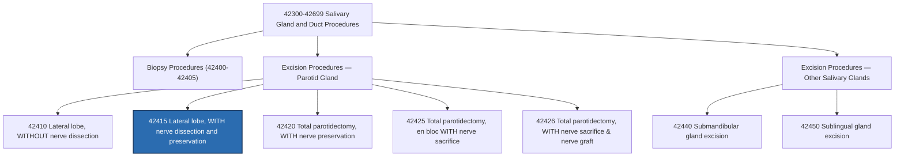

---
tags:
  - CPT
  - surgery
  - parotid-gland
  - parotid-tumor
  - parotidectomy
  - otolaryngology
  - digestive-system
code: "42415"
code_type: CPT
code_title: Excision of parotid tumor or parotid gland; lateral lobe, with dissection and preservation of facial nerve
description: Surgical excision of the lateral (superficial) lobe of the parotid gland with careful identification, dissection, and preservation of the facial nerve (cranial nerve VII) and its branches.
category: Surgery
subcategory: Digestive System — Salivary Gland and Ducts
specialty:
  - Otolaryngology (ENT) / Head and Neck Surgery
  - General Surgery / Surgical Oncology
  - Oral and Maxillofacial Surgery
body_system: Digestive System — Salivary Glands / Head and Neck
body_region: Parotid Gland / Lateral Facial Region
global_period: "090"
wRVU: 16.73
assistant_surgeon_indicator: "2"
co_surgeon_indicator: "1"
place_of_service:
  - POS 21 - Inpatient Hospital
  - POS 22 - Outpatient Hospital
  - POS 24 - ASC
ms_drg_note: When performed during an inpatient stay, CPT 42415 groups to MDC 03 (Ear, Nose, Mouth, and Throat), mapping to MS-DRG 139 (Salivary Gland Procedures) or MS-DRGs 146-148 (Ear, Nose, Mouth & Throat Malignancy with MCC, with CC, without CC/MCC).
common_icd10_pairings:
  - D11.0 - Benign neoplasm of parotid gland
  - C07 - Malignant neoplasm of parotid gland
  - K11.22 - Chronic sialoadenitis
  - K11.23 - Parotitis
  - K11.5 - Sialolithiasis (parotid)
  - D00.02 - Carcinoma in situ of parotid gland
common_modifiers:
  - -RT
  - -LT
  - "-51"
  - "-52"
  - "-53"
  - "-58"
  - "-59"
  - "-78"
  - "-79"
  - "-80"
  - "-81"
  - "-82"
  - -AS
created: 2026-02-27
last_reviewed: 2026-08-29
status: Active ✅
note_type: code-reference
---

# 🧬 CPT 42415 — Excision of Parotid Tumor or Parotid Gland; Lateral Lobe, With Dissection and Preservation of Facial Nerve

## 📋 Code Information

| Field | Value |
| :--- | :--- |
| **CPT Code** | **[[42415]]** |
| **Descriptor** | Excision of parotid tumor or parotid gland; lateral lobe, with dissection and preservation of facial nerve |
| **Section** | Salivary Gland and Duct Procedures (**[[42300]]-[[42699]]**) |
| **Approach** | Open surgical |
| **Global Period** | **090** days (Major Surgical Package) |
| **Global Breakdown** | Pre-op: 9% \| Intra-op: 81% \| Post-op: 10% |
| **Bilateral Indicator** | **0** (150% bilateral adjustment does **not** apply) |
| **Assistant Surgeon** | **Indicator 2** (Payment restriction does **not** apply; assistant allowed) |
| **Co-Surgeon** | **Indicator 1** (Co-surgeons allowed with medical necessity documentation) |
| **Team Surgery** | **Indicator 0** (Team surgery not permitted) |
| **Effective Date** | 1990 (approx.) |
| **Status / Year** | Active ✅ (2026 CMS PFS) |

---

## 📖 Clinical Description

**CPT [[42415]]** describes a superficial (lateral lobe) parotidectomy performed for benign or low-grade malignant tumors, chronic inflammation, or cysts located within the lateral lobe of the parotid gland. The defining hallmark of this procedure is the **formal identification, mobilization, dissection, and skeletonization of the facial nerve (cranial nerve VII)** and its terminal branch divisions, ensuring the integrity of the nerve is preserved while the overlying parotid tissue and lesion are excised.

### Anatomical Context

The parotid gland is an inverted pyramidal-shaped paired salivary gland located in the preauricular region and retromandibular fossa.
- **Lateral (Superficial) Lobe**: Represents approximately 80% of the gland volume and lies superficial to the plane of the facial nerve, overlying the masseter muscle and ascending ramus of the mandible.
- **Medial (Deep) Lobe**: Lies medial and deep to the facial nerve, extending toward the stylomandibular tunnel and parapharyngeal space.
- **Facial Nerve (CN VII) Pathway**: The main trunk exits the skull base through the stylomastoid foramen, enters the posteromedial surface of the parotid gland, and bifurcates at the pes anserinus into two primary divisions (temporofacial and cervicofacial) before branching into five terminal branches:
  1. [[Temporal]] (frontal) branch
  2. [[Zygomatic]] branch
  3. [[Buccal]] branch
  4. [[Marginal mandibular]] branch
  5. [[Cervical]] branch

### Key Surgical Steps

1. **Incision & Flap Elevation**: A modified Blair incision (preauricular crease curving beneath the lobule and extending into an upper cervical skin crease) is made. A superficial musculoaponeurotic system (SMAS) / skin flap is elevated anteriorly over the parotid fascia.
2. **Identification of Main Nerve Trunk**: The main trunk of CN VII is localized using standard surgical landmarks:
   - The cartilaginous **tragal pointer** (nerve typically exits ~1.0–1.5 cm deep and inferior).
   - The **posterior belly of the digastric muscle** (nerve lies immediately superior).
   - The **tympanomastoid suture line**.
   - The **styloid process**.
1. **Branch [[Dissection]] & Nerve Sparing**: Antegrade dissection is performed along the nerve trunk, splitting the parotid tissue directly off the branching divisions. Each branch is carefully skeletonized and gently mobilized away from the tumor capsule.
2. **Lobe & Tumor Resection**: The lateral lobe containing the neoplasm is excised *en bloc* with a margin of healthy parotid tissue, keeping the tumor capsule intact to prevent tumor spillage (crucial for pleomorphic adenoma recurrence prevention).
3. **[[Hemostasis]], Drainage & Closure**: Hemostasis is achieved using bipolar electrocautery and fine ligatures. A closed suction drain is placed via a counter-incision, and the wound is closed in anatomical layers.

---

## 🔍 Clinical Indications & Medical Necessity

- **Benign parotid neoplasms** (**e.g., pleomorphic [[adenoma]], Warthin [[tumor]]/[[cystadenolymphoma]], [[oncocytoma]]**) residing in the superficial lobe.
- **Malignant parotid neoplasms** (**e.g., low-grade mucoepidermoid [[carcinoma]], acinic cell carcinoma**) confined to the lateral lobe without direct invasion into CN VII.
- **Carcinoma in situ** or localized salivary gland neoplasms (**[[D00.02]]**, **[[C07]]**).
- **Chronic recurrent sialadenitis** / parotitis resistant to conservative medical therapy or [[sialendoscopy]] (**[[K11.22]]**, **[[K11.23]]**).
- **Intraglandular [[sialolithiasis]]** with associated chronic glandular damage or strictures (**[[K11.5]]**).
- **Benign lymphoepithelial cysts** or chronic salivary fistulas (**[[K11.4]]**).

---

## 🔍 Includes vs. Excludes

### Includes (Bundled Services)
- Complete surgical excision of the lateral (**superficial**) lobe of the parotid gland.
- Formal **identification, neurolysis, branch tracing, and surgical preservation of CN VII and its branches**.
- Operating surgeon-performed intraoperative facial nerve stimulation / monitoring.
- Exploration of **parotid bed, local [[hemostasis]], and placement of closed suction drains**.
- Layered plastic/cosmetic closure of the **surgical defect.**
- Routine **pre-operative workup** and 90 days of normal post-operative care.

### Excludes & Differentiating Codes

| Code | Descriptor | Key Clinical Distinction |
| :--- | :--- | :--- |
| **[[42410]]** | Lateral lobe, **without nerve dissection** | Minimal nerve identification only; no formal branch dissection |
| **[[42415]]** | Lateral lobe, **with dissection and preservation of facial nerve** | **Superficial lobectomy with formal CN VII branch skeletonization (This Code)** |
| **[[42420]]** | Total parotidectomy, **with nerve preservation** | Complete gland resection (superficial AND deep lobes) with CN VII preservation |
| **[[42425]]** | Total parotidectomy, **en bloc with nerve sacrifice** | Complete gland resection with intentional sacrifice of CN VII (malignancy) |
| **[[42426]]** | Total parotidectomy, **with nerve sacrifice and nerve graft** | Total parotidectomy with CN VII sacrifice + immediate autologous/allograft nerve grafting |
| **[[38720]]** | Cervical lymphadenectomy (complete neck dissection) | Standalone neck dissection; may be separately reported if supported |
| **[[38724]]** | Cervical lymphadenectomy (modified radical neck dissection) | Selective/modified neck dissection; reported separately with modifier -59/-X{EPSU} |
| **[[42400]]** | Biopsy of salivary gland, needle | Diagnostic needle aspiration/core biopsy |
| **[[42405]]** | Biopsy of salivary gland, incisional | Diagnostic open wedge biopsy |

---

## 📊 Code Hierarchy

---

## 💰 2026 CMS Reimbursement & RVU Breakdown

Under the 2026 Medicare Physician Fee Schedule (PFS PPR RVU 2026):

| RVU / Payment Component | Facility Value | Non-Facility Value | Regulatory Notes |
| :--- | :---: | :---: | :--- |
| **Work RVU (wRVU)** | **16.73** | **16.73** | Physician intra-service work value |
| **Practice Expense (PE) RVU** | **8.31** | NA | Facility overhead expense |
| **Malpractice (MP) RVU** | **2.51** | **2.51** | Professional liability component |
| **Total RVU** | **27.55** | NA | Standard facility total RVU |
| **2026 Conversion Factor (CF)** | **$33.4009** | **$33.4009** | 2026 Medicare non-QPP base conversion factor |
| **Estimated National Medicare Base** | **~$920.19** | NA | Geographic GPCI formula adjustments apply |

> [!info] 2026 Fee Schedule Note
> **CMS payment calculations** reflect the **2026 Medicare Physician Fee Schedule Final Rule baseline**. Payment amounts vary locally based on **geographic practice cost indices (GPCIs)**.

---

## 🔄 Modifiers and Billing Guidelines

### Common Modifiers for CPT 42415

| Modifier | Description | Practical Application & Guidelines |
| :---: | :--- | :--- |
| **[[-LT]] / [[-RT]]** | Left / Right Laterality | Report to establish the anatomic side of the excised parotid gland. |
| **[[-22]]** | Increased Procedural Services | Used when operative work is significantly greater than typical (e.g., severe scarring from prior surgery/radiation, extensive inflammatory adhesions around nerve branches). Requires detailed documentation and rationale (>50% additional time/complexity). |
| **[[-50]]** | Bilateral Procedure | **CMS Bilateral Indicator 0**: The 150% bilateral payment adjustment does **not** apply. If bilateral lateral parotidectomies are performed, bill two separate line items with `-RT` and `-LT` modifiers. |
| **[[-51]]** | Multiple Procedures | Append to secondary surgical procedures performed in the same session (e.g., neck dissection [[38724]]). |
| **[[-52]]** | Reduced Services | Append if lateral lobectomy is partially reduced at physician discretion. |
| **[[-53]]** | Discontinued Procedure | Append if procedure is aborted due to patient instability or extenuating circumstances after anesthesia induction. |
| **[[-58]]** | Staged / Related Procedure | Append if a planned re-excision or second-stage procedure is performed during the 90-day global period. |
| **[[-59]]** / **-X{EPSU}** | Distinct Procedural Service | Used to unbundle independent, non-overlapping surgical procedures performed in a distinct anatomical area during the same operative session. |
| **[[-78]]** | Unplanned Return to OR | Append when returning to the operating room for complications during the 90-day global period (e.g., postoperative hematoma evacuation billed with code `35800-78`). |
| **[[-79]]** | Unrelated Procedure in Global | Append for unrelated surgical procedures performed by the same surgeon during the 90-day global period. |
| **[[-80]] / [[-82]] / [[-AS]]** | Assistant at Surgery | **Assistant Indicator 2**: Assistant surgeon is payable with medical necessity documentation. Report `-80` (MD/DO), `-82` (resident unavailable), or `-AS` (PA/NP). |
| **[[-62]]** | Two Surgeons (Co-Surgery) | **Co-Surgeon Indicator 1**: Allowed when two distinct surgical specialists (e.g., Otolaryngologist and Microvascular Reconstructive Surgeon) act as co-surgeons; individual operative reports detailing distinct roles required. |

---

## ⚡ Intraoperative Neurophysiology Monitoring (IONM) Rules

- **Surgeon-Performed Monitoring**: When the primary surgeon operates the nerve stimulator or monitors facial nerve action potentials, the service is **integral** to **CPT [[42415]]** and is bundled (cannot be billed separately).
- **Independent Monitoring Professional (Neurologist / PhD Neurophysiologist)**:
  - **In-Person Attendance in OR**: May bill add-on code **+95940** (Continuous intraoperative neurophysiology monitoring in the OR, per 15 min) in conjunction with primary baseline testing codes (**e.g., [[95867]]-[[95868]] or [[95925]]-[[95937]]**).
  - **Remote / Outside the OR (Medicare Policy)**: Under CMS rules, monitoring from outside the OR must be billed with HCPCS code **G0453** (**Intraoperative neurophysiology monitoring from outside the OR, per patient, per 15 minutes**), capped at allowable concurrent cases.

---

## 📋 Critical Documentation Elements

To defend against post-payment audits, payer downcoding, or bundling denials:

1. **Laterality & Anatomic Site**: Explicitly specify the left or right parotid gland.
2. **Superficial / Lateral Resection**: Clearly document that the **lateral (superficial) lobe** was removed, distinguishing it from total parotidectomy.
3. **Facial Nerve Dissection & Preservation**: Operative report must contain explicit prose confirming:
   - Identification of the main trunk of cranial nerve VII (**e.g., via tragal pointer, digastric muscle**).
   - Antegrade/retrograde **[[dissection]]** and **[[skeletonization]]** of facial nerve branches.
   - Confirmation that the nerve remained structurally and functionally intact at the conclusion of the resection.
1. **Pathology Correlation**: Align operative findings with **histopathology** for precise ICD-10-CM diagnosis assignment.
2. **Wound Closure & Drains**: Document layered anatomical closure and placement of suction drains.

---

## 📊 ICD-10-CM & HCC Risk Adjustment Crosswalk

### Common Primary Diagnoses

| ICD-10-CM Code | Description | CMS-HCC V24 | CMS-HCC V28 (2026) |
| :---: | :--- | :---: | :---: |
| **[[C07]]** | **Malignant neoplasm of parotid gland** | **HCC 10** | **HCC 21** |
| **[[D11.0]]** | **Benign neoplasm of parotid gland** | Non-HCC | Non-HCC |
| **[[D11.7]]** | Benign neoplasm of other major salivary glands | Non-HCC | Non-HCC |
| **[[D11.9]]** | Benign neoplasm of major salivary gland, unspecified | Non-HCC | Non-HCC |
| **[[D00.02]]** | Carcinoma in situ of parotid gland | Non-HCC | Non-HCC |
| **[[K11.20]]** | Sialoadenitis, unspecified | Non-HCC | Non-HCC |
| **[[K11.22]]** | Chronic sialoadenitis | Non-HCC | Non-HCC |
| **[[K11.23]]** | Parotitis | Non-HCC | Non-HCC |
| **[[K11.5]]** | Sialolithiasis | Non-HCC | Non-HCC |
| **[[K11.4]]** | Fistula of salivary gland | Non-HCC | Non-HCC |
| **[[R22.1]]** | Localized swelling, mass and lump, neck | Non-HCC | Non-HCC |
| **[[Z85.819]]** | Personal history of malignant neoplasm of oral cavity and pharynx | Non-HCC | Non-HCC |

---

## 🏥 Facility & Inpatient Coding (MS-DRG & ICD-10-PCS)

### MS-DRG Grouper (MDC 03 — Diseases & Disorders of Ear, Nose, Mouth & Throat)

When reported in the hospital inpatient setting, surgical procedures on the parotid gland group as follows:

| MS-DRG | Description | Relative Weight (Approx.) |
| :---: | :--- | :---: |
| **139** | **Salivary Gland Procedures** | ~1.35 |
| **146** | Ear, Nose, Mouth & Throat Malignancy with MCC | ~2.55 |
| **147** | Ear, Nose, Mouth & Throat Malignancy with CC | ~1.50 |
| **148** | Ear, Nose, Mouth & Throat Malignancy without CC/MCC | ~1.05 |

### ICD-10-PCS Procedure Codes

In ICD-10-PCS, lateral (partial) parotidectomy is classified under root operation **Excision (`B`)**, whereas total parotidectomy is classified under root operation **Resection (`T`)**:

| Procedure | PCS Code | Description |
| :--- | :---: | :--- |
| **Right Lateral Parotidectomy (Partial)** | **0GB30ZZ** | Excision of Right Parotid Gland, Open Approach |
| **Left Lateral Parotidectomy (Partial)** | **0GB40ZZ** | Excision of Left Parotid Gland, Open Approach |
| **Bilateral Lateral Parotidectomy (Partial)** | **0GB50ZZ** | Excision of Bilateral Parotid Glands, Open Approach |
| *Total Parotidectomy, Right (Reference)* | *0GTC0ZZ* | *Resection of Right Parotid Gland, Open Approach* |
| *Total Parotidectomy, Left (Reference)* | *0GTD0ZZ* | *Resection of Left Parotid Gland, Open Approach* |

---

## 📝 Practical Coding Scenarios

### Scenario 1: Superficial Parotidectomy for Pleomorphic Adenoma
- **History**: A 48-year-old male presents with an enlarging, painless 3.0 cm mass in the right superficial parotid gland. Through a modified Blair incision, the main trunk of the facial nerve was identified using the tragal pointer. The individual branches (temporal, zygomatic, buccal, marginal mandibular, and cervical) were dissected and preserved intact. The lateral lobe and tumor were resected *en bloc*. Pathology confirms benign pleomorphic adenoma.
- **Coding**:
  - CPT: `42415-RT`
  - ICD-10-CM: `D11.0`

### Scenario 2: Lateral Parotidectomy with Selective Neck Dissection
- **History**: A 64-year-old female presents with biopsy-proven mucoepidermoid carcinoma of the left lateral parotid gland. The surgeon performs a left superficial parotidectomy with facial nerve dissection and preservation, followed by a selective neck dissection (Levels I–III).
- **Coding**:
  - CPT Primary: `42415-LT`
  - CPT Secondary: `38724-59-LT` (or `38724-XS-LT`)
  - ICD-10-CM: `C07`

### Scenario 3: Return to OR for Post-Operative Hematoma Evacuation
- **History**: On post-operative day 1 following a right lateral parotidectomy, the patient develops an expanding wound hematoma causing tension on the flap. The surgeon returns the patient to the OR for reopening of the incision, evacuation of the hematoma, and bipolar hemostasis of a bleeding vessel.
- **Coding**:
  - Primary Initial Procedure: `42415-RT` (performed previously)
  - Return to OR Procedure: `35800-78-RT` (Exploration for postoperative hemorrhage, neck)
  - ICD-10-CM: `T81.0XXA` (Hemorrhage and hematoma complicating a procedure)

---

## 🔗 Related Specialty & CPT Codes

- **[[42410]]** — Excision of parotid tumor or parotid gland; lateral lobe, without nerve dissection
- **[[42420]]** — Excision of parotid tumor or parotid gland; total, with dissection and preservation of facial nerve
- **[[42425]]** — Excision of parotid tumor or parotid gland; total, en bloc removal with sacrifice of facial nerve
- **[[42426]]** — Excision of parotid tumor or parotid gland; total, with sacrifice of facial nerve and nerve graft
- **[[38720]]** — Cervical lymphadenectomy (complete neck dissection)
- **[[38724]]** — Cervical lymphadenectomy (modified radical neck dissection)
- **[[35800]]** — Exploration for postoperative hemorrhage, neck
- **[[95940]]** / **G0453** — Intraoperative neurophysiology monitoring

---

## 📚 References & Regulatory Citations

1. American Medical Association (AMA). *CPT 2026 Professional Edition*. Salivary Gland and Duct Guidelines.
2. Centers for Medicare & Medicaid Services (CMS). *2026 Medicare Physician Fee Schedule (PFS) Relative Value Files (PPR RVU 2026)*.
3. CMS National Correct Coding Initiative (NCCI) Policy Manual for Medicare Services (2026), Chapter 8 (Digestive System).
4. AHA Coding Clinic for ICD-10-CM/PCS, Root Operation Excision vs. Resection Guidelines.
5. American Academy of Otolaryngology–Head and Neck Surgery (AAO-HNS). *Clinical Practice Guideline: Parotidectomy and Facial Nerve Management*.
