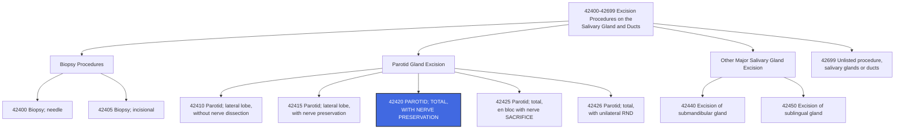

---
tags:
  - cpt
  - parotidectomy
  - total-parotidectomy
  - parotid-gland
  - facial-nerve
  - salivary-gland
  - ent
  - head-and-neck
  - oncology
  - oral-surgery
  - otolaryngology
cpt: 42420
descriptor: Excision of parotid tumor or parotid gland; total, with dissection and preservation of facial nerve
category: Excision Procedures on the Salivary Gland and Ducts
specialty:
  - Otolaryngology (ENT)
  - Head and Neck Surgery
  - Oral and Maxillofacial Surgery
  - General Surgery
type: Procedure
status: Active ✅
approach: Open (preauricular/modified Blair incision)
anesthesia: General
global_days: 90
effective_date: Pre-1990 (legacy code)
last_updated: 2026-01-01
parent_category: Excision Procedures on the Salivary Gland and Ducts (42400-42699)
aliases:
  - Total parotidectomy with facial nerve preservation
  - Total parotidectomy nerve-sparing
  - Complete parotidectomy facial nerve preserved
  - Parotidectomy total CN VII preserved
sections:
  - Excision Procedures on the Salivary Gland and Ducts (42400-42699)
cpt_guidelines: Complete removal of entire parotid gland (both superficial and deep lobes) with identification, dissection, and preservation of the facial nerve (CN VII) and all its branches; distinct from superficial/lateral lobe only (42415) and from total parotidectomy with facial nerve sacrifice (42425); facial nerve identification and preservation must be explicitly documented in the operative report
work_rvu_2026: Consult CMS MPFS RVU26A for current value; subject to 2.5% efficiency adjustment
---

# 🧬 CPT  42420: Excision of Parotid Tumor or Parotid Gland; Total, with Dissection and Preservation of Facial Nerve

## 📋 Code Information

| Field | Value |
| :--- | :--- |
| **CPT Code** | **[[42420]]** |
| **Descriptor** | **Excision of parotid tumor or parotid gland; total, with dissection and preservation of facial nerve** |
| **Section** | Excision Procedures on the Salivary Gland and Ducts ([[42400]]-[[42699]]) |
| **Approach** | Open (preauricular/modified Blair incision) |
| **Global Period** | **90 days (Major Surgery)** |
| **Effective Date** | Pre-1990 (legacy code) |
| **Last Updated** | 2026-01-01 (no change from 2025) |

## 📖 Clinical Description

**CPT [[42420]]** describes a **total parotidectomy with dissection and preservation of the facial nerve (CN VII)**. The surgeon removes the entire parotid gland — including both the superficial (**lateral**) lobe and the deep lobe — while meticulously identifying, dissecting around, and preserving all branches of the facial nerve. This is a technically demanding procedure requiring careful dissection through the substance of the gland to avoid injury to CN VII and its five main branch divisions.[1][7][10]

This code is distinct from [[42415]] (**lateral lobe only, nerve-sparing**), [[42425]] (total with unilateral radical neck dissection), and [[42426]] (**total with bilateral radical neck dissection**). The critical defining features of [[42420]] are: **(1)** total gland removal (both lobes), **(2)** active facial nerve dissection, and **(3)** successful preservation of CN VII.[8][9]

### Anatomical Definition

The **parotid gland** is the largest of the three paired major salivary glands:
- Located in the **preauricular region**, anterior and inferior to the ear, superficial to the masseter muscle and mandibular ramus
- Divided anatomically by the **facial nerve** into a **superficial (lateral) lobe** and a **deep lobe**; these are not true anatomic lobes separated by fascia — the division is entirely defined by the plane of CN VII
- The **facial nerve (CN VII)** exits the **stylomastoid foramen**, passes through the parotid gland, and divides into five major branches: **temporal, zygomatic, buccal, marginal mandibular, and cervical**
- The **parotid duct (Stensen's duct)** exits the anterior aspect of the gland and crosses the masseter muscle to enter the oral cavity at the level of the upper second molar

### Procedure Steps

1. **Anesthesia and Positioning**: General anesthesia with endotracheal intubation; patient supine with head turned contralaterally; shoulder roll placed; facial nerve monitoring leads applied.
2. **Incision**: Modified Blair incision — begins in the preauricular crease, curves around the earlobe, and extends into the neck along a skin crease posterior to the angle of the mandible.
3. **Skin Flap Elevation**: Anteriorly based skin flap raised in the sub-SMAS plane over the parotid fascia.
4. **Facial Nerve Identification**: The main trunk of CN VII is identified at the stylomastoid foramen using anatomic landmarks (**tragal pointer, posterior belly of digastric muscle, tympanomastoid suture**). Intraoperative nerve monitoring is commonly employed.
5. **Superficial Lobe Dissection**: The superficial lobe is dissected off the facial nerve branches in an antegrade direction, preserving all five branch divisions.
6. **Deep Lobe Dissection**: After complete superficial lobe removal, the deep lobe is dissected from between the facial nerve branches (**working "through the nerve"**) and removed from the parapharyngeal and deep parotid space.
7. **Parotid Duct Ligation**: Stensen's duct is ligated and divided.
8. **Hemostasis**: Meticulous hemostasis with bipolar cautery and suture ligation; avoid monopolar cautery near nerve branches.
9. **Drain Placement**: Closed suction drain placed to prevent seroma/[[hematoma]] formation.
10. **Closure**: SMAS and platysma are closed; skin closed with absorbable or nylon sutures.

### Indications

- Parotid gland malignancy requiring total removal with nerve preservation (**T1-T2 without nerve invasion**)
- Deep lobe parotid tumor (**benign or malignant**) extending beyond the reach of superficial parotidectomy
- Recurrent pleomorphic adenoma following prior parotidectomy (**re-operative field**)
- Deeply situated Warthin tumor (**papillary cystadenoma lymphomatosum**)
- Chronic parotitis with recurrent abscesses not amenable to conservative management
- Any parotid mass where the deep lobe is involved and CN VII is not invaded

## 🔍 Includes and Inclusions

- **Complete removal of the entire parotid gland** (superficial and deep lobes, including the parotid duct)[1][7]
- **Identification, dissection, and preservation** of the facial nerve trunk and all five branch divisions[1][7]
- **Parotid duct ligation**[7]
- **Drain placement** (closed suction drain, if performed at the same session)[1]
- **Hemostasis** and wound closure[1]
- All routine pre- and post-operative care within the **90-day global period**[3]
- One pre-operative day included in the global period[3]

## 🚫 Excludes and Differentiating Codes

### Parotidectomy Code Selection — The Critical Matrix

> ⚠️ **The extent of gland removal AND the fate of the facial nerve together determine the correct parotidectomy code.** Both elements must be explicitly documented in the operative report.

| Code      | Description                                                         | Extent of Resection           | Facial Nerve Status                                           |
| :-------- | :------------------------------------------------------------------ | :---------------------------- | :------------------------------------------------------------ |
| **[[42410]]** | Excision; lateral lobe, without nerve dissection                    | Superficial/lateral lobe only | Nerve NOT formally dissected (uncommon; deep tumors excluded) |
| **[[42415]]** | Excision; lateral lobe, **with dissection and preservation**        | Superficial/lateral lobe only | Nerve formally dissected and preserved                        |
| **[[42420]]** | Excision; **total**, with dissection and preservation               | **Entire gland** (both lobes) | **Nerve formally dissected and PRESERVED** — **THIS CODE**    |
| **[[42425]]** | Excision; total, en bloc removal **with sacrifice** of facial nerve | Entire gland                  | Nerve **SACRIFICED** (intentional)                            |
| **[[42426]]** | Excision; total, with **unilateral radical neck dissection**        | Entire gland + RND            | Nerve sacrifice implied (check op note)                       |

### Procedures Not Reported Separately with [[42420]]

| Item                                                  | Rationale                                                                          |
| :---------------------------------------------------- | :--------------------------------------------------------------------------------- |
| **Routine drain placement**                               | Included in the global surgical package                                            |
| **Parotid duct ligation**                                 | Component of parotidectomy                                                         |
| **Intraoperative facial nerve monitoring interpretation** | Bundled; monitoring setup coded separately if applicable ([[95940]]) — verify NCCI |
| **Post-op visits within 90 days**                         | 90-day global period                                                               |

### Procedures That MAY Be Separately Reportable

| Code                       | Description                                                               | Notes                                                                                             |
| :------------------------- | :------------------------------------------------------------------------ | :------------------------------------------------------------------------------------------------ |
| **[[38720]]**              | Cervical lymphadenectomy (radical neck dissection)                        | If full RND performed concurrently — check NCCI; use [[42425]] or [[42426]] instead if applicable |
| **[[38724]]**              | Cervical lymphadenectomy (modified radical neck dissection)               | Modified RND may be separately reportable with modifier [[59]]; verify NCCI pairing               |
| **[[15757]] or [[15758]]** | Free flap reconstruction                                                  | If free tissue transfer performed for reconstruction; separately reportable                       |
| **[[64864]]**              | Nerve repair, facial nerve; intratemporal, lateral to geniculate ganglion | If nerve repair required — different scenario from [[42420]]                                      |
| **[[95940]]**              | Continuous intraoperative neurophysiology monitoring, per hour            | Separately reportable if neurophysiologist provides separate real-time monitoring service         |

## 📊 Code Tree and Hierarchy

## 🔄 Modifiers and Billing Nuances

### Applicable Modifiers for [[42420]]

| Modifier    | Description                                | Application                                                                                                                                                                                                                                                   |
| :---------- | :----------------------------------------- | :------------------------------------------------------------------------------------------------------------------------------------------------------------------------------------------------------------------------------------------------------------ |
| **[[-LT]]** | Left Side                                  | Append to specify left parotid gland; some payers require laterality modifiers[6]                                                                                                                                                                  |
| **[[-RT]]** | Right Side                                 | Append to specify right parotid gland                                                                                                                                                                                                                         |
| **[[-22]]** | Increased Procedural Services              | Use when work is substantially greater than typical (e.g., re-operative field after prior parotidectomy, severe scarring, radiation changes, vascular anomalies requiring prolonged nerve dissection); must document additional operative time and complexity |
| **[[-51]]** | Multiple Procedures                        | Use when [[42420]] is performed with other separately reportable procedures in the same session; Medicare applies automatically                                                                                                                               |
| **[[-52]]** | Reduced Services                           | Use if procedure is partially reduced at physician's discretion                                                                                                                                                                                               |
| **[[-53]]** | Discontinued Procedure                     | Use if procedure started but discontinued due to patient safety concerns                                                                                                                                                                                      |
| **[[-54]]** | Surgical Care Only                         | Use when surgeon performs surgery but transfers post-op care; CMS requires documentation of formal transfer for 90-day global procedures[3]                                                                                                        |
| **[[-55]]** | Postoperative Management Only              | Use by receiving provider who accepts post-op care from surgeon using modifier [[54]]                                                                                                                                                                         |
| **[[-57]]** | Decision for Surgery                       | **Required** on E/M performed on day of or day before major surgery when that E/M constitutes the initial decision for surgery; without [[57]], the E/M is bundled into the 90-day global[3][4]                                                    |
| **[[-58]]** | Staged or Related Procedure                | Use for a planned staged or more extensive procedure during the 90-day post-op period                                                                                                                                                                         |
| **[[-59]]** | Distinct Procedural Service                | Use to indicate a separately reportable procedure is distinct and independent from [[42420]] on the same date                                                                                                                                                 |
| **[[-76]]** | Repeat Procedure, Same Physician           | Repeat of same procedure same day by same provider                                                                                                                                                                                                            |
| **[[-77]]** | Repeat Procedure, Another Physician        | Repeated by a different provider same day                                                                                                                                                                                                                     |
| **[[-78]]** | Unplanned Return to OR — Related Procedure | Use for related unplanned return to OR during the 90-day global (e.g., hematoma evacuation, Frey's syndrome management)                                                                                                                                       |
| **[[-79]]** | Unrelated Procedure During Post-op Period  | Use for an unrelated procedure performed during the 90-day global period                                                                                                                                                                                      |

### Assistant Surgeon Modifiers for [[42420]]

| Modifier | Description                                | Application                                                                                  |
| :------- | :----------------------------------------- | :------------------------------------------------------------------------------------------- |
| **[[-80]]**  | Assistant Surgeon                          | **Generally payable** for this major, technically complex procedure; verify MPFSDB indicator |
| **[[-81]]**  | Minimum Assistant Surgeon                  | Minimal assistance during a portion of the surgery                                           |
| **[[-82]]**  | Assistant Surgeon (resident not available) | Teaching hospital when no qualified resident is available                                    |
| **[[-AS]]**  | Non-Physician Assistant at Surgery         | PA, NP, RNFA, CNS assisting; Medicare reimburses at 13.6% of MPFS amount[11]      |

### Key Billing Nuances

- **Laterality Modifiers LT/RT**: Because the parotid gland is a paired structure, most payers (**including some MACs**) expect laterality to be clearly reflected in the operative report. AAPC guidance specifically directs coders to append LT or RT to indicate which parotid gland was excised.[6]
- **Modifier [[-57]] — Decision for Surgery E/M**: [[42420]] carries a 90-day global period. An E/M on the day of or day before surgery that results in the initial decision to perform surgery must have modifier [[-57]] appended to the E/M code or it will be bundled and denied.[3][4]
- **Deep Lobe Involvement Upcode Trap**: Coders sometimes see "superficial parotidectomy" and then find deep lobe work described later in the op note. Always read the entire operative report — if the deep lobe was removed, [[42420]] is correct; if only the lateral lobe was removed, [[42415]] applies. The distinction between total and lateral-only must come from the surgeon's documentation of what was removed, not from the procedure title alone.[8][9]
- **Re-Operative Field — Modifier [[-22]]**: Revision parotidectomy in a previously operated, scarred, or irradiated field significantly increases operative risk and time. Modifier [[-22]] is appropriate when these circumstances are well-documented in the operative report, typically with specific mention of added operative time and difficulty.[1]

## 👨‍⚕️ Assistant Surgeon (Modifier [[-80]]) Payability

### Assistant Surgeon Information

For a major, technically demanding procedure like [[42420]], an assistant surgeon is **commonly medically necessary** — particularly given the need for facial nerve preservation, retraction of delicate structures, and management of the deep lobe.

### Medicare Payment Indicators

Check the MPFSDB "Asst Surg" indicator for [[42420]]:

| Indicator | Meaning |
| :--- | :--- |
| **0** | Payment restriction; supporting documentation required |
| **1** | Statutory payment restriction; assistants not paid |
| **2** | Payment restriction does NOT apply; assistants may be paid |
| **9** | Concept does not apply |

> ✅ **Clinical Reality**: Given the complexity of total parotidectomy with facial nerve dissection, assistant surgeon services are **generally medically justified** and typically payable for [[42420]]. Always verify the current MPFSDB indicator and your specific MAC policy. Medicare reimburses physician assistants at surgery at **16% of the MPFS amount**; non-physician assistants at **13.6%**.[11]

### Documentation for Teaching Hospitals

If the indicator is 0 or 1:
- No qualified resident was available, OR
- Exceptional medical circumstances existed, OR
- Primary surgeon has an across-the-board policy of not involving residents

## 💰 Work RVU (wRVU) and Reimbursement

### Work RVU Information

The wRVU for [[42420]] is updated annually by CMS. For current 2026 values:

- **2026 Reference**: Consult the CMS MPFS RVU26A file or the AMA RBRVS DataManager[2][5]
- **2026 Efficiency Adjustment**: CMS finalized a **-2.5% efficiency adjustment** to wRVUs for non-time-based surgical codes, including [[42420]][5][12]

### 2026 Medicare Payment Updates

| Factor | Value |
| :--- | :--- |
| **Conversion Factor (non-QP)** | $33.4009 |
| **Conversion Factor (QP/APM)** | $33.5675 |
| **Efficiency Adjustment** | -2.5% applied to wRVUs for non-time-based surgical codes including [[42420]] |
| **Global Period** | **90 days** (Major Surgery) — 1 pre-op day + day of surgery + 90 post-op days |

### National Average Reimbursement

National average reimbursement for **CPT [[42420]]** is consistent with a major head and neck procedure with facial nerve dissection. Reimbursement varies significantly by MAC region, payer contract, and facility vs. non-facility setting. Consult your payer-specific fee schedule and the CMS MPFS lookup tool for current rates.[2]

### Common Places of Service

| POS | Description |
| :--- | :--- |
| **22** | On-Campus Outpatient Hospital |
| **24** | Ambulatory Surgical Center (ASC) |
| **21** | Inpatient Hospital (common for complex/malignant cases) |

## 📋 Documentation Requirements

To support billing of **[[42420]]**, the operative report must explicitly document:[1][6][8][9]

- **Preoperative Diagnosis**: Specific indication (e.g., "right parotid deep lobe pleomorphic [[adenoma]]," "**left parotid mucoepidermoid carcinoma, low-grade**")
- **Total Gland Removal**: Documentation confirming BOTH the superficial (lateral) lobe AND the deep lobe were removed — distinguishes [[42420]] from [[42415]]
- **Facial Nerve Identification**: Explicit statement that CN VII main trunk was identified (**e.g., "the facial nerve was identified at the stylomastoid foramen using the tragal pointer landmark"**)
- **Facial Nerve Dissection**: Documentation of dissection of the nerve through the gland substance (**antegrade dissection**)
- **Facial Nerve Preservation**: Explicit statement that all branches of CN VII were preserved and remained intact at the conclusion of the procedure
- **Intraoperative Nerve Monitoring**: Note whether electromyographic (EMG) nerve monitoring was used; if so, monitoring service may be separately reported
- **Parotid Duct**: Ligation and division of Stensen's duct documented
- **Laterality**: Right or left parotid gland clearly specified
- **Drain**: Type and location of drain placement
- **Post-op Nerve Function**: Documentation of facial nerve function assessment before extubation or in PACU

### Critical Documentation Elements

| Element | Why It Matters |
| :--- | :--- |
| **"Total parotidectomy" — both lobes removed** | Distinguishes [[42420]] from [[42415]] (lateral lobe only); underdocumentation = downcoding risk |
| **Facial nerve identified, dissected, and PRESERVED** | Without this, [[42420]] cannot be justified; if nerve was sacrificed, correct code is [[42425]] |
| **Laterality (RT/LT)** | Required for accurate claim submission and laterality modifier use |
| **No radical neck dissection documented** | Confirms [[42420]] is correct; if RND performed concurrently, [[42425]] or [[42426]] may apply |

## 📊 ICD-10 Crosswalk and HCC Information

### Primary ICD-10 Diagnoses for [[42420]]

| ICD-10 Code | Description                                                                                   | HCC Applicability     |
| :---------- | :-------------------------------------------------------------------------------------------- | :-------------------- |
| **[[C07]]**     | **Malignant neoplasm of parotid gland**                                                       | **Yes** (HCC 8 or 10) |
| **[[C79.89]]**  | Secondary malignant neoplasm of other specified sites (parotid metastasis)                    | **Yes** (HCC 8 or 10) |
| **[[D00.00]]**  | Carcinoma in situ of oral cavity, unspecified (parotid in situ)                               | Varies by model       |
| **[[D11.0]]**   | **Benign neoplasm of parotid gland**                                                          | No (0)                |
| **[[D37.030]]** | Neoplasm of uncertain behavior of parotid gland                                               | No (0)                |
| **[[D49.0]]**   | Neoplasm of unspecified behavior of digestive system (parotid NOS)                            | No (0)                |
| **[[K11.21]]**  | Acute sialadenitis (chronic parotitis as indication)                                          | No (0)                |
| **[[K11.22]]**  | Acute recurrent sialadenitis                                                                  | No (0)                |
| **[[K11.23]]**  | Chronic sialadenitis                                                                          | No (0)                |
| **[[K11.3]]**   | Abscess of salivary gland                                                                     | No (0)                |
| **[[K11.8]]**   | Other diseases of salivary glands (Warthin tumor, oncocytoma, benign lymphoepithelial lesion) | No (0)                |
| **[[Z85.818]]** | Personal history of malignant neoplasm of other digestive organs (post-treatment follow-up)   | No (0)                |

### ICD-10 Neoplasm Table — Parotid Gland Reference

| Behavior                                    | ICD-10 Code |
| :------------------------------------------ | :---------- |
| Malignant primary                           | **[[C07]]**     |
| Malignant secondary (metastasis to parotid) | **[[C79.89]]**  |
| Carcinoma in situ                           | **[[D00.00]]**  |
| Benign                                      | **[[D11.0]]**   |
| Uncertain behavior                          | **[[D37.030]]** |
| Unspecified behavior                        | **[[D49.0]]**   |

### HCC Note

- **C07 (Malignant neoplasm of parotid gland)** is a significant HCC risk adjustor, mapping to **HCC 8 or 10** depending on the CMS-HCC model version
- **Benign and inflammatory** parotid conditions (D11.0, K11.x) are **not HCC contributors** in the standard CMS-HCC model
- For inpatient profee coding, document all active comorbidities — these drive CC/MCC status and directly affect MS-DRG assignment and reimbursement

## 🏥 MS-DRG Assignment

[[42420]] may be performed in an outpatient or inpatient setting depending on the complexity and diagnosis. Malignant cases and complex reconstructions commonly require inpatient admission.[13]

### For Parotid Malignancy (e.g., C07)

| MS-DRG | Description |
| :--- | :--- |
| **146** | Ear, nose, mouth and throat malignancy with MCC |
| **147** | Ear, nose, mouth and throat malignancy with CC |
| **148** | Ear, nose, mouth and throat malignancy without CC/MCC |

### For Salivary Gland / Mouth Procedures (Benign)

| MS-DRG | Description |
| :--- | :--- |
| **137** | Mouth procedures with CC/MCC |
| **138** | Mouth procedures without CC/MCC |

### ICD-10-PCS Procedure Codes

For hospital **inpatient** coding:

| Approach | ICD-10-PCS Code | Description                                      |
| :------- | :-------------- | :----------------------------------------------- |
| Open     | **0CB80ZZ**         | Excision of Parotid Gland, Right, Open Approach  |
| Open     | **0CB90ZZ**         | Excision of Parotid Gland, Left, Open Approach   |
| Open     | **0CT80ZZ**         | Resection of Parotid Gland, Right, Open Approach |
| Open     | **0CT90ZZ**         | Resection of Parotid Gland, Left, Open Approach  |

> ⚠️ **ICD-10-PCS** distinguishes between **Excision** (removing a portion) and **Resection** (removing the entire organ). For a **total parotidectomy**, the correct root operation is **Resection** (**0CT80ZZ or 0CT90ZZ**). For profee, only **CPT [[42420]]** is used on the **CMS-1500; ICD-10-PCS** is for the facility UB-04 only.

## 📝 Coding Examples and Scenarios

### Example 1: Total Parotidectomy for Deep Lobe Pleomorphic Adenoma
**Scenario**: A 52-year-old male with a right parotid deep lobe pleomorphic adenoma. Prior imaging shows the mass is entirely deep to the facial nerve. The surgeon performs a total right parotidectomy via a modified Blair incision. CN VII main trunk and all five branches are identified, carefully dissected, and preserved. Both lobes are removed en bloc with the tumor. Drain placed.
**Coding**:
- [[42420]]-RT — Excision of parotid tumor; total, with dissection and preservation of facial nerve (right side)
- [[D11.0]] — Benign neoplasm of parotid gland
- *Rationale: Total removal of entire parotid gland (both lobes) with CN VII preservation = [[42420]]. Laterality modifier RT applied per AAPC guidance.*[1][6]

### Example 2: Total Parotidectomy for Low-Grade Mucoepidermoid Carcinoma
**Scenario**: A 65-year-old female with left parotid low-grade mucoepidermoid carcinoma, T2N0. The surgeon performs total left parotidectomy with formal facial nerve dissection. CN VII is preserved; all five branches functionally intact at procedure end. No neck dissection performed.
**Coding**:
- [[42420]]-LT — Excision of parotid tumor; total, with dissection and preservation of facial nerve (left side)
- [[C07]] — Malignant neoplasm of parotid gland
- *Rationale: Total parotidectomy with facial nerve preservation, no neck dissection, malignant diagnosis = [[42420]]. If RND had been performed, [[42425]] or [[42426]] would be appropriate instead.*[1][8]

### Example 3: The Lateral-Only vs. Total Distinction
**Scenario**: The operative note title says "superficial parotidectomy" but reading further reveals the surgeon identified CN VII, performed superficial lobe resection, then entered the deep lobe plane and removed the deep lobe tumor from between the nerve branches.
**Coding**:
- **Correct**: [[42420]] — Total, both lobes removed with CN VII preservation
- **Incorrect**: [[42415]] — Lateral lobe only
- *Rationale: The extent of resection defines the code, not the procedure title. If both lobes are removed, it's [[42420]] — always read the full op note, not just the title or procedure line.*[8][9]

### Example 4: Total Parotidectomy with Facial Nerve Sacrifice — Wrong Code Trap
**Scenario**: Patient with high-grade parotid carcinoma encasing CN VII. Surgeon performs total parotidectomy with intentional sacrifice of the facial nerve.
**Coding**:
- **Correct**: [[42425]] — Excision of parotid tumor; total, en bloc removal with sacrifice of facial nerve
- **Incorrect**: [[42420]]
- *Rationale: [[42420]] requires preservation of CN VII. If the nerve is sacrificed, [[42425]] is the correct code. This is a critical distinction that changes both the code and the reimbursement.*[8][9]

### Example 5: Total Parotidectomy + Modified Radical Neck Dissection
**Scenario**: Same high-grade carcinoma patient. Surgeon performs total parotidectomy (with nerve preservation possible) AND a right modified radical neck dissection (sparing the spinal accessory nerve) for nodal disease.
**Coding**:
- [[42420]]-RT — Total parotidectomy with nerve preservation
- [[38724]]-[[59]]-RT — Cervical lymphadenectomy (modified radical neck dissection); distinct procedural service
- [[C07]] — Malignant neoplasm of parotid gland
- *Rationale: A modified radical neck dissection may be separately reported from [[42420]] (unlike [[42415]]-[[42425]] which have their own neck dissection combo codes). Verify NCCI edit pairing for [[42420]] + [[38724]]. If a **complete** radical neck dissection is performed, [[42425]] may be the appropriate single code instead.*[4][8]

### Example 6: Re-Operative Parotidectomy — Modifier [[-22]]
**Scenario**: A 60-year-old with prior left superficial parotidectomy 10 years ago presents with recurrent pleomorphic adenoma. Total completion parotidectomy with facial nerve preservation is performed. Operative time is 4.5 hours due to extensive scar tissue and distorted anatomy. Facial nerve dissection was extremely difficult with 30% longer operative time documented.
**Coding**:
- [[42420]]-[[22]]-LT — Total parotidectomy with facial nerve preservation; increased procedural services
- [[D11.0]] — Benign neoplasm of parotid gland (recurrent)
- *Rationale: Modifier [[22]] captures the substantially increased work. The operative note must specifically document the unusual difficulty, scar tissue, distorted anatomy, and extended operative time to support the modifier.*[1]

### Example 7: Decision for Surgery E/M — Modifier [[-57]]
**Scenario**: A patient presents to a new ENT surgeon who performs a comprehensive evaluation, reviews imaging, and determines the patient requires a total parotidectomy. Surgery is scheduled and performed the same day.
**Coding**:
- E/M code (e.g., [[99244]] consultation or [[99205]] new patient) — [[57]]
- [[42420]] — Total parotidectomy with facial nerve preservation
- *Rationale: Modifier [[57]] is required on the E/M because this is a major surgery (90-day global) and the visit constituted the initial decision for surgery. Without [[57]], the E/M would be bundled into [[42420]]'s global period.*[3][4]

## ⚠️ Important Coding Notes

### The Four-Code Parotidectomy Matrix

| Code      | Lobe(s) Removed        | Facial Nerve                      |
| :-------- | :--------------------- | :-------------------------------- |
| **[[42410]]** | Lateral only           | Not formally dissected            |
| **[[42415]]** | Lateral only           | Dissected and PRESERVED           |
| **[[42420]]** | **Total (both lobes)** | Dissected and **PRESERVED**       |
| **[[42425]]** | Total (both lobes)     | **SACRIFICED**                    |
| **[[42426]]** | Total (both lobes)     | Sacrifice implied + bilateral RND |

### Global Period — 90 Days

- **[[42420]]** carries a **90-day major surgery global period**
- Includes: 1 pre-op day, day of surgery, 90 post-op days
- Bundled during global period: routine post-op E/M, suture/drain removal, standard wound checks
- Separately payable: unrelated E/M (**modifier [[-24]]**), unrelated procedure (**modifier [[-79]]**), staged procedure (**modifier [[-58]]**), return to OR for complications (**modifier [[-78]]**)

### Frey's Syndrome Consideration

Auriculotemporal nerve syndrome (**Frey's syndrome — gustatory sweating**) is a known post-[[parotidectomy]] complication. If management procedures are required during the 90-day global period and they constitute a **return to the OR for a related complication**, use modifier [[-78]]. If managed conservatively in the office (**e.g., Botox injection**), the Botox injection is likely separately reportable as an unrelated procedure (**modifier [[-79]]) or potentially a new problem (modifier [[-24]] if E/M only**).

### Intraoperative Nerve Monitoring

When a separate qualified individual (**neurophysiologist or trained technician supervised by a physician**) provides continuous real-time intraoperative facial nerve monitoring:
- The operating surgeon does NOT separately bill for nerve monitoring
- The monitoring physician/technician may bill [[95940]] (**continuous intraoperative neurophysiology monitoring, per hour**)
- This is a separate professional service and does not affect [[42420]] billing

### 2026 Efficiency Adjustment

The -2.5% CMS efficiency adjustment applies to [[42420]] for 2026. Organizations using wRVU-based physician compensation should audit their compensation models to account for this structural change across all major surgical procedures.

## 🔗 Related Codes

### Parotid Gland Excision Family

| Code      | Description                                                                               |
| :-------- | :---------------------------------------------------------------------------------------- |
| **[[42410]]** | Excision of parotid tumor; lateral lobe, without nerve dissection                         |
| **[[42415]]** | Excision of parotid tumor; lateral lobe, with dissection and preservation of facial nerve |
| **[[42425]]** | Excision of parotid tumor; total, en bloc removal with sacrifice of facial nerve          |
| **[[42426]]** | Excision of parotid gland; total, with unilateral radical neck dissection                 |

### Other Major Salivary Gland Excision

| Code      | Description                                    |
| :-------- | :--------------------------------------------- |
| **[[42440]]** | Excision of submandibular (submaxillary) gland |
| **[[42450]]** | Excision of sublingual gland                   |

### Parotid Biopsy Codes

| Code      | Description                          |
| :-------- | :----------------------------------- |
| **[[42400]]** | Biopsy of salivary gland; needle     |
| **[[42405]]** | Biopsy of salivary gland; incisional |

### Neck Dissection Codes (Potentially Concurrent)

| Code      | Description                                                 |
| :-------- | :---------------------------------------------------------- |
| **[[38700]]** | Suprahyoid lymphadenectomy                                  |
| **[[38720]]** | Cervical lymphadenectomy (radical neck dissection)          |
| **[[38724]]** | Cervical lymphadenectomy (modified radical neck dissection) |

### Reconstruction Codes (If Concurrent)

| Code      | Description                                         |
| :-------- | :-------------------------------------------------- |
| **[[15757]]** | Free skin flap with microvascular anastomosis       |
| **[[15758]]** | Free fascial flap with microvascular anastomosis    |
| **[[15731]]** | Forehead flap with preservation of vascular pedicle |

### Facial Nerve Repair (If Required)

| Code      | Description                                                     |
| :-------- | :-------------------------------------------------------------- |
| **[[64864]]** | Suture of facial nerve; extracranial                            |
| **[[64865]]** | Suture of facial nerve; infratemporal, with or without grafting |

## References

<small>
1 MD Clarity. "CPT Code 42420: What It Is, Modifiers, Reimbursement." (2024). https://www.mdclarity.com/cpt-code/42420
2 CMS. "Calendar Year 2026 Medicare Physician Fee Schedule Final Rule (CMS-1832-F)." (2025). https://www.cms.gov/newsroom/fact-sheets/calendar-year-cy-2026-medicare-physician-fee-schedule-final-rule-cms-1832-f
3 CMS. "MLN907166 - Global Surgery Booklet." https://www.cms.gov/files/document/mln907166-global-surgery-booklet.pdf
4 CMS. "Medicare NCCI 2026 Coding Policy Manual - Chapter 13." (2025). https://www.cms.gov/files/document/13-chapter13-ncci-medicare-policy-manual-2026-final.pdf
5 PYA. "2026 wRVU Changes and Physician Compensation Planning." (2026). https://www.pyapc.com/insights/2026-wrvu-changes-are-here-what-organizations-need-to-know-for-physician-compensation-planning/
6 AAPC Otolaryngology Coding Alert. "Reader Question: Turn to 42420 for Parotidectomy." (2015). https://www.aapc.com/codes/coding-newsletters/my-otolaryngology-coding-alert/reader-question-turn-to-42420-for-parotidectomy
7 GenHealth.ai. "42420 - Excision of Parotid Tumor or Parotid Gland; Total, with Dissection and Preservation of Facial Nerve." (2026). https://genhealth.ai/code/cpt4/42420-excision-of-parotid-tumor-or-parotid-gland-total-with-dissection-and-preservation-of-facial
8 AAO-HNS. "Clinical Indicators: Parotidectomy." https://www.entnet.org/wp-content/uploads/files/Parotidectomy-CI.pdf
9 SEER. "Surgery Codes — Parotid and Other Unspecified Glands 2026." https://seer.cancer.gov/manuals/2026/AppendixC/Surgery_Codes_Parotid_2026.pdf
10 AAPC. "CPT® Code 42420 - Excision Procedures on the Salivary Gland and Ducts." (2024). https://www.aapc.com/codes/cpt-codes/42420
11 FCSO Medicare. "Appropriate Use of Assistant at Surgery Modifiers and Payment Indicators." (2025). https://medicare.fcso.com/coding/appropriate-use-assistant-surgery-modifiers-and-payment-indicators
12 MedAxiom. "CMS Releases 2026 Final Physician Fee Schedule Rule." (2025). https://www.medaxiom.com/news/2025/11/05/news/cms-releases-2026-final-physician-fee-schedule-rule/
13 ICD List. "ICD-10-CM Diagnosis Code D11.0 — Benign Neoplasm of Parotid Gland." (2026). https://icdlist.com/icd-10/D11.0; FindACode. "C07 Malignant Neoplasm of Parotid Gland." https://www.findacode.com/icd-10-cm/c07-malignant-neoplasm-parotid-gland-icd10cm-code.html
</small>