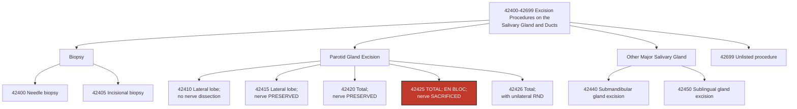

---
tags:
  - cpt
  - parotidectomy
  - radical-parotidectomy
  - parotid-gland
  - facial-nerve-sacrifice
  - en-bloc-resection
  - salivary-gland
  - ent
  - head-and-neck
  - oncology
  - malignancy
  - otolaryngology
cpt: 42425
descriptor: Excision of parotid tumor or parotid gland; total, en bloc removal with sacrifice of facial nerve
category: Excision Procedures on the Salivary Gland and Ducts
specialty:
  - Otolaryngology (ENT)
  - Head and Neck Surgery
  - Oral and Maxillofacial Surgery
type: Procedure
status: Active ✅
approach: Open (preauricular/modified Blair incision with neck extension)
anesthesia: General
global_days: 90
effective_date: Pre-1990 (legacy code)
last_updated: 2026-01-01
parent_category: Excision Procedures on the Salivary Gland and Ducts (42400-42699)
aliases:
  - Radical parotidectomy
  - Total parotidectomy with facial nerve sacrifice
  - Parotidectomy en bloc CN VII sacrifice
  - Total parotidectomy nerve sacrifice
sections:
  - Excision Procedures on the Salivary Gland and Ducts (42400-42699)
cpt_guidelines: Complete removal of the entire parotid gland (both lobes) AND the facial nerve (CN VII) as a single en bloc specimen; performed for high-grade or invasive parotid malignancies where CN VII is encased or invaded; facial nerve sacrifice must be intentional and documented; concurrent facial reanimation procedures (nerve graft, free flap) may be separately reportable; distinguish from 42420 (nerve preserved) and 42426 (total + unilateral RND)
work_rvu_2026: Consult CMS MPFS RVU26A for current value; subject to 2.5% efficiency adjustment
---

# 🧬 CPT   42425: Excision of Parotid Tumor or Parotid Gland; Total, En Bloc Removal with Sacrifice of Facial Nerve

## 📋 Code Information

| Field              | Value                                                                                                 |
| :----------------- | :---------------------------------------------------------------------------------------------------- |
| **CPT Code**       | **[[42425]]**                                                                                         |
| **Descriptor**     | **Excision of parotid tumor or parotid gland; total, en bloc removal with sacrifice of facial nerve** |
| **Section**        | Excision Procedures on the Salivary Gland and Ducts (**[[42400]]-[[42699]]**)                         |
| **Approach**       | Open (preauricular/modified Blair incision with neck extension)                                       |
| **Global Period**  | **90 days (Major Surgery)**                                              |
| **Effective Date** | Pre-1990 (legacy code)                                                                                |
| **Last Updated**   | 2026-01-01 (no change from 2025)                                                                      |

## 📖 Clinical Description

**CPT [[42425]]** describes a **radical parotidectomy** — the total removal of the entire parotid gland (**both superficial and deep lobes**) together with the **facial nerve (CN VII)** as a single **en bloc specimen**. This is the most oncologically aggressive [[parotidectomy]] code and is reserved for parotid malignancies where the tumor directly invades, encases, or is inseparable from the facial nerve, making nerve-sparing surgery oncologically unsafe.[1][7][10]

The defining feature distinguishing [[42425]] from [[42420]] is the **intentional sacrifice of CN VII**. The nerve is not merely unavoidably injured — it is deliberately divided and removed with the specimen. Because this results in complete ipsilateral facial [[paralysis]], concurrent facial reanimation procedures (**nerve grafting, free tissue transfer, or static slings**) are frequently performed and may be separately reportable.[8][9]

### Anatomical and Oncological Context[7][8][9]

The **facial nerve (CN VII)** divides the parotid gland into its superficial and deep lobes and provides all motor innervation to the muscles of facial expression. Sacrifice of CN VII results in:
- **Complete ipsilateral facial paralysis** — forehead, eye, midface, mouth
- **Inability to close the eye** (lagophthalmos) — corneal exposure risk
- **Facial asymmetry and functional disability** — eating, speaking, social interaction
- **Profound psychological impact** — body image, quality of life

The decision to sacrifice CN VII requires pre-operative documentation that the nerve is **encased, invaded, or inseparable** from the tumor. Pre-operative facial nerve dysfunction (**partial or complete palsy**) strongly supports the oncologic need for nerve sacrifice.

**Tumor types most commonly requiring [[42425]]**:[9][10]
- High-grade mucoepidermoid carcinoma
- Salivary duct [[carcinoma]]
- Carcinoma ex pleomorphic adenoma (**malignant transformation**)
- Adenoid cystic carcinoma with perineural invasion of CN VII
- High-grade [[adenocarcinoma]]
- Metastatic [[cutaneous]] squamous cell carcinoma with extracapsular spread (ECS)
- Undifferentiated carcinoma

### Procedure Steps[1][7]

1. **Anesthesia and Positioning**: General anesthesia; patient supine with head turned contralaterally; shoulder roll; intraoperative facial nerve monitoring leads placed (for documentation of baseline function and to confirm nerve identity before sacrifice).
2. **Incision**: Modified Blair incision — preauricular crease extending around earlobe into posterior neck; may be extended for concurrent neck dissection.
3. **Skin Flap Elevation**: Sub-SMAS flap elevated anteriorly to expose the parotid fascia.
4. **Facial Nerve Identification**: CN VII main trunk identified at the stylomastoid foramen; the entire course of the nerve through the gland is confirmed before sacrifice.
5. **En Bloc Resection**: The entire parotid gland — superficial lobe, deep lobe, tumor, and the full extent of CN VII (**main trunk and branches**) — is excised as a single continuous specimen. The nerve is divided proximally at the stylomastoid foramen and distally at the peripheral branches.
6. **Parotid Duct Ligation**: Stensen's duct ligated and divided.
7. **Margin Assessment**: The surgical bed is assessed for completeness of resection; frozen sections of margins may be sent.
8. **Facial Reanimation (if concurrent)**: Nerve grafting (e.g., sural nerve graft), gold weight implantation, static slings, or free flap reconstruction may be performed concurrently — these are separately reportable.
9. **Hemostasis and Drain Placement**: Closed suction drain placed.
10. **Closure**: Layer-by-layer closure.

### Indications

- Parotid malignancy with **direct facial nerve invasion** on pre-operative imaging or intraoperative finding
- Pre-operative facial nerve **palsy or paresis** attributable to the parotid tumor
- High-grade parotid carcinoma where **en bloc resection margins require CN VII sacrifice**
- Recurrent parotid malignancy with nerve encasement
- Metastatic [[cutaneous]] squamous cell [[carcinoma]] with **extracapsular spread** involving CN VII
- Intraoperative finding that nerve-sparing would compromise oncologic margins

## 🔍 Includes and Inclusions

- **Complete removal of the entire parotid gland** (superficial and deep lobes)[1][7]
- **En bloc sacrifice of the facial nerve (CN VII)** — main trunk and all branches[1][7]
- **Parotid duct ligation**[7]
- **Intraoperative margin assessment** (frozen section requests are separately billable by the pathologist)[7]
- **Drain placement** at the same session[1]
- **Hemostasis** and wound closure[1]
- All routine pre- and post-operative care within the **90-day global period**[3]
- One pre-operative day included in the global period[3]

## 🚫 Excludes and Differentiating Codes

### Parotidectomy Code Matrix — The Four-Code Decision Tree

> ⚠️ **The fate of CN VII AND the extent of gland removal together define the correct code.** Both elements must be explicitly documented in the operative report. Confusing [[42425]] with [[42420]] is an egregious coding error — one documents nerve preservation, the other documents nerve sacrifice, and these are clinically and legally distinct.

| Code      | Extent of Resection    | Facial Nerve (CN VII) Status           |
| :-------- | :--------------------- | :------------------------------------- |
| **[[42410]]** | Lateral lobe only      | NOT formally dissected                 |
| **[[42415]]** | Lateral lobe only      | Dissected and PRESERVED                |
| **[[42420]]** | Total (both lobes)     | Dissected and PRESERVED                |
| **[[42425]]** | **Total (both lobes)** | **SACRIFICED en bloc** — **THIS CODE** |
| **[[42426]]** | Total (both lobes)     | Sacrifice implied + **unilateral RND** |

### Does [[42426]] Apply Instead?

> ⚠️ If a **unilateral radical neck dissection** is performed concurrently with radical parotidectomy with nerve sacrifice, [[42426]] may be the appropriate single code rather than [[42425]] + a separate neck dissection code. Verify the operative report and check NCCI edits before reporting both codes. If a **modified** radical neck dissection (nerve-sparing) is performed rather than a true radical neck dissection, [[42425]] + [[38724]] with modifier [[-59]] may apply — always verify.

### Procedures That MAY Be Separately Reportable with 42425

| Code          | Description                                                    | Notes                                                                                                                                                                                  |
| :------------ | :------------------------------------------------------------- | :------------------------------------------------------------------------------------------------------------------------------------------------------------------------------------- |
| **[[38724]]** | Cervical lymphadenectomy (modified radical neck dissection)    | May be separately reportable if modified (not true radical) neck dissection performed; verify NCCI; if true RND, use [[42426]] instead                                                 |
| **[[64885]]** | Nerve graft; face or scalp, each additional 4 cm               | Sural nerve graft for facial reanimation after CN VII sacrifice — separately reportable; ACS-NSQIP data confirm concurrent reanimation is performed in minority of cases[9] |
| **[[64886]]** | Nerve graft; face or scalp, greater nerve segment              | Same context as [[64885]]                                                                                                                                                              |
| **[[15757]]** | Free skin flap with microvascular anastomosis                  | Free flap reconstruction for defect coverage after radical parotidectomy                                                                                                               |
| **[[15758]]** | Free fascial flap with microvascular anastomosis               | Same context                                                                                                                                                                           |
| **[[67912]]** | Correction of lagophthalmos; gold weight implantation          | Upper eyelid gold weight for corneal protection after CN VII sacrifice                                                                                                                 |
| **[[95940]]** | Continuous intraoperative neurophysiology monitoring, per hour | If separate neurophysiologist provides real-time CN VII monitoring                                                                                                                     |

### Procedures NOT Reported Separately with 42425

| Item | Rationale |
| :--- | :--- |
| Routine drain placement | Included in the surgical global package |
| Parotid duct ligation | Component of parotidectomy |
| Post-op visits within 90 days | 90-day global period |
| Routine hemostasis | Bundled |

## 📊 Code Tree and Hierarchy

## 🔄 Modifiers and Billing Nuances

### Applicable Modifiers for [[42425]]

| Modifier    | Description                                | Application                                                                                                                                                                                                                                                                   |
| :---------- | :----------------------------------------- | :---------------------------------------------------------------------------------------------------------------------------------------------------------------------------------------------------------------------------------------------------------------------------- |
| **[[-LT]]** | Left Side                                  | Append to indicate left parotid gland; required by most payers for paired organ laterality                                                                                                                                                                                    |
| **[[-RT]]** | Right Side                                 | Append to indicate right parotid gland                                                                                                                                                                                                                                        |
| **[[-22]]** | Increased Procedural Services              | Use when work is substantially greater than typical (e.g., re-operative field after prior parotidectomy, radiation-induced fibrosis, extensive vascular involvement, significantly prolonged operative time); must document specific added complexity and time in the op note |
| **[[-51]]** | Multiple Procedures                        | Use when [[42425]] is performed with other separately reportable procedures in the same session (e.g., concurrent free flap reconstruction, nerve grafting); Medicare applies automatically                                                                                   |
| **[[-52]]** | Reduced Services                           | Use when procedure is reduced at physician's discretion                                                                                                                                                                                                                       |
| **[[-53]]** | Discontinued Procedure                     | Use when procedure started but discontinued due to patient safety concerns                                                                                                                                                                                                    |
| **[[-54]]** | Surgical Care Only                         | Use when surgeon performs surgery but transfers 90-day post-op management; CMS requires documentation of formal transfer[3]                                                                                                                                        |
| **[[-55]]** | Postoperative Management Only              | Use by receiving provider who accepts post-op care from surgeon using [[54]]                                                                                                                                                                                                  |
| **[[-57]]** | Decision for Surgery                       | **Required** on E/M performed on the day of or day before major surgery when that visit constitutes the initial decision for surgery; without [[57]], the E/M is bundled into the 90-day global[3][4]                                                              |
| **[[-58]]** | Staged or Related Procedure                | Use for a planned staged or more extensive procedure during the 90-day global period (e.g., planned delayed reconstruction)                                                                                                                                                   |
| **[[-59]]** | Distinct Procedural Service                | Use to indicate separately reportable procedures (e.g., concurrent nerve graft, neck dissection) are distinct and independent                                                                                                                                                 |
| **[[-76]]** | Repeat Procedure, Same Physician           | Repeat of same procedure same day by same provider                                                                                                                                                                                                                            |
| **[[-77]]** | Repeat Procedure, Another Physician        | Repeated by a different provider same day                                                                                                                                                                                                                                     |
| **[[-78]]** | Unplanned Return to OR — Related Procedure | Use for related, unplanned return to OR during the 90-day global (e.g., hematoma evacuation, wound dehiscence)                                                                                                                                                                |
| **[[-79]]** | Unrelated Procedure During Post-op Period  | Use for an unrelated procedure during the 90-day global period                                                                                                                                                                                                                |

### Assistant Surgeon Modifiers for 42425

| Modifier | Description                                | Application                                                                                                                             |
| :------- | :----------------------------------------- | :-------------------------------------------------------------------------------------------------------------------------------------- |
| **[[-80]]**  | Assistant Surgeon                          | **Generally payable** for this major, high-complexity oncologic procedure; Medicare reimburses at **16% of MPFS amount**[12] |
| **[[-81]]**  | Minimum Assistant Surgeon                  | Minimal assistance during a portion of the surgery                                                                                      |
| **[[-82]]**  | Assistant Surgeon (resident not available) | Teaching hospital when no qualified resident is available; reimbursed at same 16% rate as modifier [[80]][12]                |
| **[[-AS]]**  | Non-Physician Assistant at Surgery         | PA, NP, RNFA, CNS assisting; Medicare reimburses at **13.6% of MPFS amount**[12]                                             |

### Key Billing Nuances

- **Laterality Modifiers -LT/-RT**: The parotid gland is a paired structure — append LT or RT to identify which side was operated on. This is standard AAPC guidance for paired organs and is required by most MACs and commercial payers.[6]
- **Modifier [[-57]] — Decision for Surgery**: Because [[42425]] carries a **90-day global period**, any E/M on the day of or day before surgery that constitutes the initial decision to perform surgery must have modifier [[-57]] appended to the E/M code — otherwise the E/M is bundled and non-payable.[3][4]
- **Concurrent Reanimation Billing**: ACS-NSQIP data show that facial reanimation is performed concurrently with [[42425]] in only about 25% of cases.[9] When performed, reanimation codes ([[64885]], [[64886]], [[67912]], free flap codes) are separately reportable with modifier [[-51]] (**or [[-59]] if NCCI edits require unbundling documentation**). Each reanimation code should be separately documented in the operative report.
- **True RND vs. Modified RND — Code Selection Trap**: If a **true radical neck dissection** (removing internal jugular vein, sternocleidomastoid muscle, and spinal accessory nerve) is performed concurrently, [[42426]] — not [[42425]] + a neck dissection code — is the appropriate single code. If a **modified** radical neck dissection is performed (**preserving some structures**), [[42425]] + [[38724]]-[[-59]] may be appropriate. Always verify the NCCI edit pairing and verify against the operative description of what was and was not preserved.[8]
- **Pre-operative Palsy Documentation**: When the indication for CN VII sacrifice is pre-operative facial nerve dysfunction, documenting the pre-operative palsy (House-Brackmann grade) in the clinic note or surgical consent is critical for medical necessity and audit defense. This links the ICD-10 diagnosis of nerve invasion (**and the resulting facial palsy**) directly to the need for [[42425]] rather than [[42420]].[9]

## 👨‍⚕️ Assistant Surgeon (Modifier [[80]]) Payability

### Assistant Surgeon Information

For a high-complexity oncologic major surgery like **[[42425]]**, an assistant surgeon is **commonly medically necessary** — particularly given the extent of en bloc dissection, need for concurrent reconstruction, and complex wound management.

### Medicare Payment Indicators

Check the MPFSDB "Asst Surg" indicator for [[42425]]:

| Indicator | Meaning |
| :--- | :--- |
| **0** | Payment restriction; supporting documentation required |
| **1** | Statutory payment restriction; assistants not paid |
| **2** | Payment restriction does NOT apply; assistants may be paid |
| **9** | Concept does not apply |

> ✅ **Clinical Reality**: Given the major surgery designation (90-day global), oncologic complexity, and frequent concurrent reconstruction, assistant surgeon services are **generally medically justified and payable** for [[42425]]. Always verify the current MPFSDB indicator and your MAC's policy. Medicare reimburses:
> - **Modifier [[-80]]/[[-82]]** (physician assistant at surgery): **16% of MPFS allowable**[12]
> - **Modifier [[-AS]]** (non-physician assistant): **13.6% of MPFS allowable**[12]

### Documentation for Teaching Hospitals

**If the indicator is 0 or 1:**
- No qualified resident was available, OR
- Exceptional medical circumstances existed, OR
- Primary surgeon has an across-the-board policy of not involving residents

## 💰 Work RVU (wRVU) and Reimbursement

### Work RVU Information

The wRVU for [[42425]] is updated annually by CMS. For current 2026 values:

- **2026 Reference**: Consult the CMS MPFS RVU26A file or the AMA RBRVS DataManager[2][5]
- **2026 Efficiency Adjustment**: CMS finalized a **-2.5% efficiency adjustment** to wRVUs for non-time-based surgical codes, including [[42425]][5][13]
- **Historical reference**: A CPT reference database lists a fee schedule value of approximately **$1,800** for [[42425]] (pre-2026, reference only); actual 2026 Medicare reimbursement will reflect the current CF and wRVU[6]

### 2026 Medicare Payment Updates

| Factor | Value |
| :--- | :--- |
| **Conversion Factor (non-QP)** | $33.4009 |
| **Conversion Factor (QP/APM)** | $33.5675 |
| **Efficiency Adjustment** | -2.5% applied to wRVUs for non-time-based surgical codes including [[42425]] |
| **Global Period** | 90 days (Major Surgery) — 1 pre-op day + day of surgery + 90 post-op days |

### Common Places of Service

| POS | Description |
| :--- | :--- |
| **21** | Inpatient Hospital — **most common** for [[42425]] given oncologic complexity and reconstruction |
| **22** | On-Campus Outpatient Hospital |
| **24** | Ambulatory Surgical Center (less common; typically reserved for simpler concurrent procedures) |

## 📋 Documentation Requirements

To support billing of [[42425]], the operative report must explicitly document all of the following:[1][6][8][9]

- **Preoperative Diagnosis**: Specific malignancy with staging (e.g., "right parotid salivary duct carcinoma, T3N0, with pre-operative right facial nerve palsy House-Brackmann Grade IV")
- **Indication for Nerve Sacrifice**: Clear statement of **why** CN VII was sacrificed — tumor invasion confirmed on imaging, pre-operative palsy, or intraoperative finding of nerve encasement; this is the critical medical necessity element
- **Total Gland Removal**: Documentation confirming BOTH superficial and deep lobes were removed — distinguishes [[42425]] from lateral-lobe-only codes
- **En Bloc Resection**: Statement that the gland, tumor, and facial nerve were removed **as a single continuous specimen**
- **Facial Nerve Sacrifice**: Explicit, unambiguous statement — "the facial nerve was sacrificed," "CN VII was divided and removed with the specimen," or equivalent
- **Nerve Division Points**: Where CN VII was divided proximally (stylomastoid foramen) and distally (branch level)
- **Laterality**: Right or left parotid gland
- **Margins**: Documentation of gross margin assessment; frozen section results if obtained
- **Concurrent Procedures**: Separate documentation of any reanimation or reconstruction procedures
- **Drain**: Type and location
- **Post-op Facial Nerve Status**: Documentation of expected complete ipsilateral facial paralysis

### Critical Documentation Elements

| Element | Why It Matters |
| :--- | :--- |
| **Explicit statement of CN VII sacrifice** | Without this, [[42420]] (nerve preserved) would be the default; confirms [[42425]] is correct |
| **Medical necessity for sacrifice documented** | Required for audit defense; must link to tumor invasion, perineural invasion, or pre-op palsy |
| **Total (both lobe) removal confirmed** | Distinguishes from [[42415]] (lateral only); without this, downcode risk to [[42415]] |
| **En bloc resection language** | Supports the specific descriptor of [[42425]]; important for SEER registry and tumor board documentation |
| **Laterality stated** | Required for LT/RT modifier; paired organ — both sides have a parotid gland |

## 📊 ICD-10 Crosswalk and HCC Information

### Primary ICD-10 Diagnoses for [[42425]]

| ICD-10 Code | Description                                                                         | HCC Applicability                                                 |
| :---------- | :---------------------------------------------------------------------------------- | :---------------------------------------------------------------- |
| **[[C07]]**     | **Malignant neoplasm of parotid gland**                                             | **Yes** (HCC 8 or 10)                                             |
| **[[C08.0]]**   | Malignant neoplasm of submandibular gland                                           | Yes (HCC 8 or 10)                                                 |
| **[[C08.9]]**   | Malignant neoplasm of major salivary gland, unspecified                             | Yes (HCC 8 or 10)                                                 |
| **[[C79.89]]**  | Secondary malignant neoplasm of other sites (parotid metastasis)                    | Yes (HCC 8 or 10)                                                 |
| **[[G51.0]]**   | Bell's palsy / facial nerve palsy (pre-op palsy from tumor)                         | No (0) — but documents clinical justification for nerve sacrifice |
| **[[G51.8]]**   | Other disorders of facial nerve (perineural invasion-related palsy)                 | No (0)                                                            |
| **[[C44.311]]** | Squamous cell carcinoma of skin of nose (metastatic to parotid)                     | Yes (HCC 8 or 10)                                                 |
| **[[C44.319]]** | Squamous cell carcinoma of skin of other parts of face (metastatic CSCC to parotid) | Yes (HCC 8 or 10)                                                 |

### ICD-10 Neoplasm Table — Parotid Gland Reference

| Behavior                                    | ICD-10 Code |
| :------------------------------------------ | :---------- |
| Malignant primary                           | **[[C07]]**     |
| Malignant secondary (metastasis to parotid) | **[[C79.89]]**  |
| Carcinoma in situ                           | **[[D00.00]]**  |
| Benign                                      | **[[D11.0]]**   |
| Uncertain behavior                          | **[[D37.030]]** |
| Unspecified behavior                        | **[[D49.0]]**   |

### HCC Note

- **C07 (Malignant neoplasm of parotid gland)** maps to **HCC 8 or 10** (solid tumor/cancer) and is a significant risk score contributor
- For inpatient profee coding, capture **all comorbidities** — perineural invasion, lymphovascular invasion, extracapsular spread, pre-op facial palsy — as these affect complexity documentation and may influence MS-DRG through CC/MCC status
- **G51.0 or G51.8** (**facial palsy from CN VII involvement**) should be coded as a secondary/complicating diagnosis when pre-operative palsy is documented; supports the medical necessity narrative for [[42425]]

## 🏥 MS-DRG Assignment

**[[42425]]** is almost always performed as an **inpatient admission** given the extent of resection, common concurrent reconstruction, need for airway management, and significant post-operative care complexity.[8]

### For Parotid Malignancy (Primary Diagnosis C07)

| MS-DRG | Description |
| :--- | :--- |
| **146** | Ear, nose, mouth and throat malignancy with MCC |
| **147** | Ear, nose, mouth and throat malignancy with CC |
| **148** | Ear, nose, mouth and throat malignancy without CC/MCC |

### For Complex Oral/Mouth Procedures (Benign or other)

| MS-DRG | Description |
| :--- | :--- |
| **137** | Mouth procedures with CC/MCC |
| **138** | Mouth procedures without CC/MCC |

### ICD-10-PCS Procedure Codes

For hospital **inpatient** coding:

| Approach           | ICD-10-PCS Code | Description                                      |
| :----------------- | :-------------- | :----------------------------------------------- |
| Open               | **0CT80ZZ**         | Resection of Parotid Gland, Right, Open Approach |
| Open               | **0CT90ZZ**         | Resection of Parotid Gland, Left, Open Approach  |
| Open (with CN VII) | **00BK0ZZ**         | Excision of Facial Nerve, Open Approach          |

> ⚠️ **ICD-10-PCS** distinguishes **Excision** (**partial removal**) from **Resection** (**complete organ removal**). For a **total parotidectomy**, the correct root operation is **Resection** (**0CT80CT9**). The concurrent **facial nerve excision** is coded separately with **00BK0ZZ** on the inpatient claim. For profee billing, only **CPT [[42425]]** is used on the **CMS-1500**; **ICD-10-PCS** codes are for the facility UB-04 only.

## 📝 Coding Examples and Scenarios

### Example 1: Standard Radical Parotidectomy — High-Grade Salivary Duct Carcinoma
**Scenario**: A 70-year-old with right salivary duct carcinoma, T3, and pre-operative House-Brackmann Grade III right facial nerve palsy. Imaging shows tumor encasing the main trunk of CN VII. Surgeon performs total right parotidectomy with en bloc sacrifice of the facial nerve from the stylomastoid foramen to peripheral branches. No neck dissection performed. Drain placed.
**Coding**:
- [[42425]]-RT — Excision of parotid tumor; total, en bloc removal with sacrifice of facial nerve
- [[C07]] — Malignant neoplasm of parotid gland
- [[G51.8]] — Other disorders of facial nerve (pre-op palsy from tumor — secondary dx)
- *Rationale: Total parotidectomy + intentional CN VII sacrifice = [[42425]]. Laterality modifier RT. Pre-op palsy coded as secondary for medical necessity support.*[1][8]

### Example 2: Radical Parotidectomy with Concurrent Facial Nerve Graft
**Scenario**: Same patient as Example 1. Immediately following [[42425]], the surgeon harvests a right sural nerve graft and performs cable nerve grafting from the proximal CN VII stump to the distal branches for facial reanimation. Total case time is 5.5 hours.
**Coding**:
- [[42425]]-RT — Radical parotidectomy with CN VII sacrifice
- [[64885]]-[[-59]]-RT — Nerve graft, face or scalp (sural nerve graft for CN VII reanimation; distinct procedure, same session)
- [[C07]] — Malignant neoplasm of parotid gland
- [[G51.8]] — Pre-op facial nerve palsy (secondary)
- *Rationale: Nerve grafting for facial reanimation is separately reportable from [[42425]]. Modifier [[-59]] documents distinct procedural service. ACS-NSQIP data confirm concurrent reanimation should be reported separately.*[4][9]

### Example 3: [[42425]] vs. [[42426]] — Neck Dissection Decision
**Scenario**: A 65-year-old with T4 parotid carcinoma with CN VII invasion and ipsilateral cervical nodal metastases. The surgeon performs total radical parotidectomy with CN VII sacrifice AND a concurrent **true** right radical neck dissection (removing the internal jugular vein, sternocleidomastoid muscle, and spinal accessory nerve).
**Coding**:
- **Correct**: [[42426]]-RT — Excision of parotid gland; total, with unilateral radical neck dissection (one code captures the entire procedure)
- **Incorrect**: [[42425]]-RT + [[38720]]-RT-[[-59]] (the true radical neck dissection is built into [[42426]])
- *Rationale: When a true radical neck dissection is performed concurrently with radical parotidectomy, [[42426]] is the single correct code. Reserve [[42425]] for cases where NO neck dissection (or only a modified/selective neck dissection) is performed.*[8][9]

### Example 4: [[42425]] + Modified Radical Neck Dissection (Modified = NOT True RND)
**Scenario**: Same oncologic scenario, but the neck dissection spares the spinal accessory nerve (modified radical neck dissection Type II/III).
**Coding**:
- [[42425]]-RT — Radical parotidectomy with CN VII sacrifice
- [[38724]]-[[-59]]-RT — Cervical lymphadenectomy (modified radical neck dissection); distinct procedural service
- [[C07]] — Malignant neoplasm of parotid gland
- *Rationale: A modified (nerve-sparing) neck dissection is NOT a true radical neck dissection and does not trigger [[42426]]. Report [[42425]] + [[38724]]-[[-59]]. Verify NCCI edit pairing before submission.*[8]

### Example 5: [[42425]] vs. [[42420]] — The One-Word Distinction
**Scenario**: Op note reads "Total right parotidectomy was performed. The facial nerve was carefully identified... In spite of our best efforts, the facial nerve was unable to be preserved due to direct tumor invasion."
**Coding**:
- **Correct**: [[42425]]-RT — The facial nerve was sacrificed (even if "unintentional" is implied, the operative outcome is CN VII sacrifice; some payers and auditors require pre-operative documentation of the anticipated sacrifice for [[42425]])
- *Rationale: If the nerve was removed with the specimen — regardless of intent — the operative description matches [[42425]], not [[42420]]. However, best practice is to document the **pre-operative intent** to sacrifice the nerve (based on imaging or pre-op palsy) to avoid confusion on audit. Query the surgeon if documentation is ambiguous.*[8][9]

### Example 6: Decision for Surgery E/M — Modifier [[-57]]
**Scenario**: New patient referred for evaluation of right parotid mass with 3-month progressive facial weakness. ENT surgeon performs comprehensive new patient E/M, reviews MRI showing CN VII encasement, counsels patient on radical parotidectomy with nerve sacrifice, and schedules surgery for the following morning.
**Coding** (Day of E/M — day before surgery):
- [[99205]] or [[99244]] — [[-57]] (new patient E/M; modifier [[-57]] because the visit constituted the decision for major surgery; surgery is the following day = "day before surgery")
- [[42425]] — (on the surgery date claim)
- *Rationale: [[-57]] is required on the E/M code when the visit results in the decision for a 90-day global surgery. Without modifier [[-57]], the E/M on the day before surgery would be bundled into [[42425]]'s global period and denied.*[3][4]

### Example 7: Post-op Hematoma During Global Period
**Scenario**: Five days after [[42425]], the patient returns to the OR emergently for drainage of a large post-operative neck hematoma compressing the airway.
**Coding**:
- Appropriate hematoma drainage/control code — [[-78]] (Unplanned return to OR, related procedure during post-op period)
- *Rationale: Post-operative hematoma drainage is a related procedure during the 90-day global. Report the drainage code + modifier [[-78]] — do NOT re-bill [[42425]]. Modifier [[-78]] triggers intraoperative percentage payment only, not the full allowable.*[3][4]

## ⚠️ Important Coding Notes

### The Critical [[42425]] vs. [[42420]] Rule

> ⚠️ **This is the single most important coding distinction in the entire parotidectomy code family.** [[42420]] = nerve PRESERVED. [[42425]] = nerve SACRIFICED. These are not interchangeable. Coding [[42420]] when CN VII was sacrificed is undercoding (and misrepresentation of the procedure). Coding [[42425]] when CN VII was preserved is upcoding and fraudulent. The op note must be unambiguous on the fate of CN VII.

### [[42425]] vs. [[42426]] — The Neck Dissection Rule

| Neck Dissection Type                                                | Code                                                      |
| :------------------------------------------------------------------ | :-------------------------------------------------------- |
| No neck dissection                                                  | **[[42425]]**                                                 |
| **True** radical neck dissection (IJ vein + SCM + CN XI sacrificed) | **[[42426]]**                                                 |
| Modified radical neck dissection (any structure spared)             | **[[42425]] + [[38724]]-[[-59]]**                             |
| Selective neck dissection                                           | **[[42425]] + appropriate neck dissection code with [[-59]]** |

### Global Period — 90 Days

- [[42425]] carries a **90-day major surgery global period**
- Includes: 1 pre-op day, day of surgery, 90 post-op days
- Separately payable during global: unrelated E/M (modifier [[-24]]), staged procedure (modifier [[-58]]), return to OR for complications (modifier [[-78]]), unrelated procedure (modifier [[-79]])

### Facial Reanimation — Timing Matters for Billing

- **Concurrent reanimation** (**same operative session**): Separately reportable with modifier [[-59]]/[[-51]]
- **Delayed reanimation** (**during the 90-day global period**): Use modifier [[-58]] (staged/related procedure)
- **Delayed reanimation** (**after 90-day global expires**): Report normally without global period modifier

### 2026 Efficiency Adjustment

The -2.5% CMS efficiency adjustment applies to [[42425]] for 2026. For complex oncologic procedures like this, organizations using **wRVU**-based physician compensation should review their modeling to ensure the adjustment is accurately reflected.

## 🔗 Related Codes

### Parotid Gland Excision Family

| Code      | Description                                                                               |
| :-------- | :---------------------------------------------------------------------------------------- |
| **[[42410]]** | Excision of parotid tumor; lateral lobe, without nerve dissection                         |
| **[[42415]]** | Excision of parotid tumor; lateral lobe, with dissection and preservation of facial nerve |
| **[[42420]]** | Excision of parotid tumor; total, with dissection and preservation of facial nerve        |
| **[[42426]]** | Excision of parotid gland; total, with unilateral radical neck dissection                 |

### Neck Dissection Codes

| Code      | Description                                                 |
| :-------- | :---------------------------------------------------------- |
| **[[38700]]** | Suprahyoid lymphadenectomy                                  |
| **[[38720]]** | Cervical lymphadenectomy (radical neck dissection)          |
| **[[38724]]** | Cervical lymphadenectomy (modified radical neck dissection) |

### Facial Reanimation Codes (Often Concurrent)

| Code      | Description                                                       |
| :-------- | :---------------------------------------------------------------- |
| **[[64885]]** | Nerve graft; face or scalp, each additional 4 cm                  |
| **[[64886]]** | Nerve graft; face or scalp, greater nerve segment                 |
| **[[64905]]** | Nerve pedicle transfer; first stage                               |
| **[[64907]]** | Nerve pedicle transfer; second stage                              |
| **[[67912]]** | Correction of lagophthalmos; gold weight implantation into eyelid |

### Reconstruction Codes (If Concurrent)

| Code      | Description                                         |
| :-------- | :-------------------------------------------------- |
| **[[15757]]** | Free skin flap with microvascular anastomosis       |
| **[[15758]]** | Free fascial flap with microvascular anastomosis    |
| **[[15731]]** | Forehead flap with preservation of vascular pedicle |

### Salivary Gland Biopsy (Pre-op Diagnostic)

| Code      | Description                          |
| :-------- | :----------------------------------- |
| **[[42400]]** | Biopsy of salivary gland; needle     |
| **[[42405]]** | Biopsy of salivary gland; incisional |

## References

<small>
1 MD Clarity. "CPT Code 42425: What It Is, Modifiers, Reimbursement." (2024). https://www.mdclarity.com/cpt-code/42425
2 CMS. "Calendar Year 2026 Medicare Physician Fee Schedule Final Rule (CMS-1832-F)." (2025). https://www.cms.gov/newsroom/fact-sheets/calendar-year-cy-2026-medicare-physician-fee-schedule-final-rule-cms-1832-f
3 CMS. "MLN907166 - Global Surgery Booklet." https://www.cms.gov/files/document/mln907166-global-surgery-booklet.pdf
4 CMS. "Medicare NCCI 2026 Coding Policy Manual — Chapter 13." (2025). https://www.cms.gov/files/document/13-chapter13-ncci-medicare-policy-manual-2026-final.pdf
5 PYA. "2026 wRVU Changes and Physician Compensation Planning." (2026). https://www.pyapc.com/insights/2026-wrvu-changes-are-here-what-organizations-need-to-know-for-physician-compensation-planning/
6 Steven Bernard CPT Reference. "CPT Reference for Commonly Used Codes — Parotid." https://matthew-carlson-di7f.squarespace.com/s/CPT-codes.pdf
7 GenHealth.ai. "42425 - Excision of Parotid Tumor or Parotid Gland; Total, En Bloc Removal with Sacrifice of Facial Nerve." (2026). https://genhealth.ai/code/cpt4/42425-excision-of-parotid-tumor-or-parotid-gland-total-en-bloc-removal-with-sacrifice-of-facial-n
8 AAO-HNS. "Clinical Indicators: Parotidectomy." https://www.entnet.org/wp-content/uploads/files/Parotidectomy-CI.pdf
9 Patel et al. "Analysis of Facial Reanimation Procedures Performed Concurrently With Total Parotidectomy and Facial Nerve Sacrifice." JAMA Otolaryngol Head Neck Surg. (2019). PMC6439722. https://pmc.ncbi.nlm.nih.gov/articles/PMC6439722/
10 AAPC. "CPT® Code 42425 — Excision Procedures on the Salivary Gland and Ducts." (2024). https://www.aapc.com/codes/cpt-codes/42425
11 Novitas Solutions. "Assistant at Surgery Modifiers Fact Sheet." https://www.novitas-solutions.com/webcenter/portal/MedicareJL/pagebyid?contentId=00144529
12 KZA Consulting. "Reimbursement: Assistant Surgeon." (2016). https://www.kzanow.com/coding-coaches/reimbursement-assistant-surgeon-ortho; CMS Transmittal R1620CP. "Pub 100-04 Medicare Claims Processing — Assistant at Surgery." https://www.cms.gov/Regulations-and-Guidance/Guidance/Transmittals/downloads/R1620CP.pdf
13 MedAxiom. "CMS Releases 2026 Final Physician Fee Schedule Rule." (2025). https://www.medaxiom.com/news/2025/11/05/news/cms-releases-2026-final-physician-fee-schedule-rule/
14 SEER. "Surgery Codes — Parotid and Other Unspecified Glands 2026." https://seer.cancer.gov/manuals/2026/AppendixC/Surgery_Codes_Parotid_2026.pdf
</small>