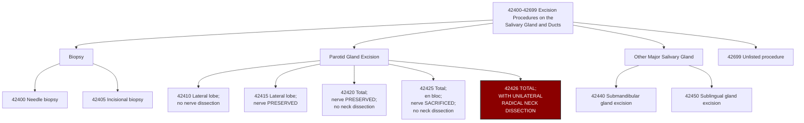

---
tags:
  - cpt
  - parotidectomy
  - radical-parotidectomy
  - parotid-gland
  - radical-neck-dissection
  - unilateral-rnd
  - salivary-gland
  - ent
  - head-and-neck
  - oncology
  - malignancy
  - composite-resection
  - otolaryngology
cpt: 42426
descriptor: "Excision of parotid tumor or parotid gland; total, with unilateral radical neck dissection"
category: Excision Procedures on the Salivary Gland and Ducts
specialty:
  - Otolaryngology (ENT)
  - Head and Neck Surgery
  - Oral and Maxillofacial Surgery
type: Procedure
status: Active ✅
approach: Open (preauricular/modified Blair incision with neck extension)
anesthesia: General
global_days: 90
effective_date: Pre-1990 (legacy code)
last_updated: 2026-01-01
parent_category: Excision Procedures on the Salivary Gland and Ducts (42400-42699)
aliases:
  - Total parotidectomy with unilateral RND
  - Radical parotidectomy with neck dissection
  - Parotidectomy total + radical neck dissection
  - Composite parotid and neck resection
sections:
  - Excision Procedures on the Salivary Gland and Ducts (42400-42699)
cpt_guidelines: Complete removal of the entire parotid gland (both lobes) combined with unilateral radical neck dissection (RND); this is a single composite code — do NOT separately report parotidectomy + neck dissection codes when a TRUE radical neck dissection is performed concurrently; facial nerve status (preserved vs. sacrificed) is NOT specified in the descriptor and must be documented in the op note; facial nerve sacrifice is common but not definitionally required; distinguish from 42425 (total parotidectomy with nerve sacrifice, NO neck dissection)
work_rvu_2026: Consult CMS MPFS RVU26A for current value; subject to 2.5% efficiency adjustment
---

# 🧬 CPT  42426: Excision of Parotid Tumor or Parotid Gland; Total, with Unilateral Radical Neck Dissection

## 📋 Code Information

| Field | Value |
| :--- | :--- |
| **CPT Code** | **[[42426]]** |
| **Descriptor** | **Excision of parotid tumor or parotid gland; total, with unilateral radical neck dissection** |
| **Section** | Excision Procedures on the Salivary Gland and Ducts ([[42400]]-[[42699]]) |
| **Approach** | Open (preauricular/modified Blair incision with neck extension) |
| **Global Period** | **90 days (Major Surgery)** |
| **Effective Date** | Pre-1990 (legacy code) |
| **Last Updated** | 2026-01-01 (no change from 2025) |

## 📖 Clinical Description

**CPT [[42426]]** describes the most extensive parotidectomy code in the CPT family — a **total parotidectomy combined with a unilateral radical neck dissection (RND)** performed as a single composite oncologic resection. The surgeon removes the entire parotid gland (**both superficial and deep lobes**) together with the regional cervical lymphatics in a true radical neck dissection, which by definition removes the internal jugular vein (**IJV**), the sternocleidomastoid muscle (**SCM**), and the spinal accessory nerve (**SAN/CN XI**) along with all lymph node levels I-V on the ipsilateral side.[1][7][8]

**CPT [[42426]]** is a **composite code** — it packages the total parotidectomy and the radical neck dissection into a single billable unit. This means that when a true RND is performed concurrently with total [[parotidectomy]], you do **not** separately report **[[42420]]** or **[[42425]]** plus a neck dissection code. The composite nature of **[[42426]]** is the single most important coding rule for this procedure.[8][9]

### Critical Distinction — Facial Nerve Status

> ⚠️ **CPT [[42426]]'s descriptor does NOT specify whether the facial nerve is preserved or sacrificed.** This is a frequently misunderstood aspect of this code. The correct code selection between [[42425]] and [[42426]] is driven by **whether a radical neck dissection is performed** — not by the fate of CN VII.
>
> - Facial nerve **preserved**, no neck dissection → [[42420]]
> - Facial nerve **sacrificed**, no neck dissection → [[42425]]
> - Total parotidectomy + **true RND** (regardless of CN VII status) → [[42426]]
>
> In practice, when [[42426]] is performed for advanced malignancy requiring RND, CN VII sacrifice is common — but it is not a definitional requirement of this code. The op note must document CN VII status regardless.

### Anatomical Scope of [[42426]]

**Total Parotidectomy Component**:
- Complete removal of the **superficial (lateral) lobe** and **deep lobe** of the parotid gland
- Ligation and division of **Stensen's duct**
- CN VII dissection (**status — preserved or sacrificed — must be documente**d)

**Unilateral Radical Neck Dissection (RND) Component** — by definition includes:[9][10]
- **Internal jugular vein (IJV)** — ligated and removed
- **Sternocleidomastoid muscle (SCM)** — removed
- **Spinal accessory nerve (CN XI/SAN)** — sacrificed
- **Lymph node levels I-V** (ipsilateral) — en bloc removal
- Submandibular gland (often included in Level I dissection)

> ⚠️ If ANY of the three non-lymphatic structures (IJV, SCM, CN XI) are **preserved**, the procedure is a **modified** radical neck dissection — **NOT** a true RND — and **[[42426]]** does NOT apply. In that scenario, **[[42420]]** or **[[42425]]** + **[[38724]]-[[-59]]** is the correct reporting.[9][10]

### Procedure Steps

1. **Anesthesia and Positioning**: General anesthesia; patient supine with head turned contralaterally; shoulder roll; intraoperative facial nerve monitoring leads placed.
2. **Incision**: Extended modified Blair incision — preauricular crease curving around the earlobe and extending into the neck along a skin crease; a horizontal or oblique neck extension is added to provide access to the cervical lymphatics.
3. **Skin Flap Elevation**: Sub-SMAS flap elevated over the parotid and platysma-based flap raised over the neck to expose the cervical contents.
4. **Parotidectomy**: Total parotidectomy performed as described in [[42420]] or [[42425]] (CN VII identified; status determined by tumor involvement).
5. **RND — SCM**: The sternocleidomastoid muscle is divided superiorly at the mastoid and inferiorly at the clavicle and removed.
6. **RND — IJV**: The internal jugular vein is ligated and divided superiorly (**at or above the level of CN XII**) and inferiorly (**at the clavicle/thoracic inlet**).
7. **RND — Lymph Node Levels I-V**: All cervical lymph node groups are removed en bloc, including submandibular (I), upper jugular (II), mid-jugular (III), lower jugular (IV), and posterior triangle (V) nodes.
8. **RND — CN XI**: The spinal accessory nerve is sacrificed.
9. **Hemostasis**: Meticulous hemostasis; carotid artery protected throughout.
10. **Drain Placement**: One or more closed-suction drains placed.
11. **Closure**: Platysma and skin closed in layers.

### Indications

- Advanced parotid malignancy with **confirmed or suspected cervical lymph node metastases** (most common indication)
- Parotid [[carcinoma]] with **extracapsular nodal spread (ECS)** requiring en bloc resection
- High-grade parotid malignancy where **elective neck dissection** is oncologically indicated (even if N0 neck)
- Recurrent parotid malignancy with cervical nodal disease
- Parotid malignancy in a previously irradiated neck where true RND is the only feasible dissection
- Any clinical scenario requiring **total parotidectomy** + **unilateral true RND** in a single operative session

## 🔍 Includes and Inclusions

- **Complete removal of the entire parotid gland** (superficial and deep lobes)[1][7]
- **Parotid duct ligation**[7]
- **Unilateral radical neck dissection** including removal of IJV, SCM, CN XI, and all ipsilateral lymph node levels I-V[1][8][9]
- **Submandibular gland** (removed as part of Level I neck dissection — do NOT separately report **[[42440]]**)[8]
- **Drain placement** at the same session[1]
- **Hemostasis** and wound closure[1]
- All routine pre- and post-operative care within the **90-day global period**[3]
- One pre-operative day included in the global period[3]

## 🚫 Excludes and Differentiating Codes

### The Complete Parotidectomy Code Matrix

> ⚠️ **This is the most important table in this note.** Code selection is driven by TWO variables: extent of parotid resection AND whether a radical (**vs. modified**) neck dissection is performed. Facial nerve status, while critical for documentation, does not change code selection between **[[42425]]** and **[[42426]]** — the presence or absence of a **true RND** does.

| Code      | Parotid Extent         | Facial Nerve                 | Neck Dissection                                                     |
| :-------- | :--------------------- | :--------------------------- | :------------------------------------------------------------------ |
| **[[42410]]** | Lateral lobe only      | Not dissected                | None                                                                |
| **[[42415]]** | Lateral lobe only      | Preserved                    | None                                                                |
| **[[42420]]** | Total (both lobes)     | Preserved                    | None                                                                |
| **[[42425]]** | Total (both lobes)     | Sacrificed                   | None                                                                |
| **[[42426]]** | **Total (both lobes)** | Either (document in op note) | **TRUE Radical (IJV + SCM + CN XI all sacrificed)** — **THIS CODE** |

### True RND vs. Modified RND — The Critical [[42426]] Gate

| Neck Dissection Type | Correct Reporting |
| :--- | :--- |
| **True Radical (removes IJV + SCM + CN XI)** | [[42426]] — composite code; DO NOT separately bill parotidectomy + neck dissection |
| **Modified Radical** (any one of IJV/SCM/CN XI preserved) | [[42420]] or [[42425]] + [[38724]]-[[59]] |
| **Selective** (levels only, all 3 non-lymphatic structures preserved) | [[42420]] or [[42425]] + appropriate selective neck dissection code + [[59]] |
| **No neck dissection** | [[42420]] (nerve preserved) or [[42425]] (nerve sacrificed) |

### Procedures Bundled INTO [[42426]] — Do NOT Report Separately

| Item                                                     | Rationale                                                                   |
| :------------------------------------------------------- | :-------------------------------------------------------------------------- |
| **[[42420]] or [[42425]] (parotidectomy)**                   | Bundled — [[42426]] IS the total parotidectomy + RND composite              |
| **[[38720]] (complete cervical lymphadenectomy / true RND)** | Bundled — the RND is built into [[42426]]'s descriptor                      |
| **[[42440]] (submandibular gland excision)**                 | Bundled — submandibular gland is removed as part of Level I neck dissection |
| **Routine drain placement**                                  | Included in global surgical package                                         |
| **Post-op visits within 90 days**                            | 90-day global period                                                        |

### Procedures That MAY Be Separately Reportable with [[42426]]

| Code                                | Description                                                                                                                             | Notes                                                                                                    |
| :---------------------------------- | :-------------------------------------------------------------------------------------------------------------------------------------- | :------------------------------------------------------------------------------------------------------- |
| **[[64885]]**                           | Nerve graft; face or scalp, each additional 4 cm                                                                                        | Sural nerve graft for facial reanimation if CN VII sacrificed — separately reportable with [[51]]/[[59]] |
| **[[64886]]**                           | Nerve graft; face or scalp, greater nerve segment                                                                                       | Same context                                                                                             |
| **[[15757]]**                           | Free skin flap with microvascular anastomosis                                                                                           | Free flap reconstruction for large defect coverage                                                       |
| **[[15758]]**                           | Free fascial flap with microvascular anastomosis                                                                                        | Same context                                                                                             |
| **[[67912]]**                           | Correction of lagophthalmos; gold weight implantation                                                                                   | Eyelid gold weight for corneal protection if CN VII sacrificed                                           |
| **[[95940]]**                           | Continuous intraoperative neurophysiology monitoring, per hour                                                                          | If separate qualified neurophysiologist provides real-time monitoring service                            |
| **Contralateral neck dissection codes** | Neck dissections are unilateral — if bilateral neck dissection performed, the contralateral side is separately reportable[9] | [[38724]] or [[38720]] + LT/RT modifiers for contralateral side                                          |

## 📊 Code Tree and Hierarchy

## 🔄 Modifiers and Billing Nuances

### Applicable Modifiers for [[42426]]

| Modifier    | Description                                | Application                                                                                                                                                                                                                                                    |
| :---------- | :----------------------------------------- | :------------------------------------------------------------------------------------------------------------------------------------------------------------------------------------------------------------------------------------------------------------- |
| **[[-LT]]** | Left Side                                  | Append to indicate left-sided procedure; most payers require laterality for paired organ/structures                                                                                                                                                            |
| **[[-RT]]** | Right Side                                 | Append to indicate right-sided procedure                                                                                                                                                                                                                       |
| **[[-22]]** | Increased Procedural Services              | Use when work is substantially greater than typical (e.g., re-operative field, prior radiation, unusual vascular anatomy, carotid artery involvement, significantly extended operative time); must document specific complexity in the operative report        |
| **[[-51]]** | Multiple Procedures                        | Use when [[42426]] is performed with other separately reportable procedures in the same session (e.g., concurrent free flap reconstruction, nerve grafting, contralateral neck dissection); Medicare applies automatically                                     |
| **[[-52]]** | Reduced Services                           | Use when procedure is reduced at the physician's discretion                                                                                                                                                                                                    |
| **[[-53]]** | Discontinued Procedure                     | Use when the procedure is started but discontinued due to patient safety concerns                                                                                                                                                                              |
| **[[-54]]** | Surgical Care Only                         | Use when the surgeon performs surgery but transfers 90-day post-op management; CMS requires documentation of formal transfer[3]                                                                                                                     |
| **[[-55]]** | Postoperative Management Only              | Use by receiving provider who accepts post-op care from surgeon using [[-54]]                                                                                                                                                                                  |
| **[[-57]]** | Decision for Surgery                       | **Required** on E/M performed on the day of or day before major surgery when that visit constitutes the initial decision for surgery; without [[57]], the E/M is bundled into the 90-day global[3][4]                                               |
| **[[-58]]** | Staged or Related Procedure                | Use for a planned staged or more extensive procedure during the 90-day global period (e.g., planned delayed reconstruction, adjuvant post-op care in OR setting)                                                                                               |
| **[[-59]]** | Distinct Procedural Service                | Use to indicate concurrently performed procedures (nerve graft, free flap, contralateral neck dissection) are distinct and independently reportable                                                                                                            |
| **[[-62]]** | Two Surgeons                               | Use when two surgeons from different specialties each perform distinct portions of the procedure (e.g., head and neck surgeon performs parotidectomy; vascular surgeon provides carotid artery management) — each surgeon bills [[42426]]-[[62]][4] |
| **[[-76]]** | Repeat Procedure, Same Physician           | Repeat of same procedure same day by same provider                                                                                                                                                                                                             |
| **[[-77]]** | Repeat Procedure, Another Physician        | Repeated by a different provider same day                                                                                                                                                                                                                      |
| **[[-78]]** | Unplanned Return to OR — Related Procedure | Use for related, unplanned return to OR during the 90-day global period (e.g., hematoma, chyle leak requiring reoperation, wound breakdown)                                                                                                                    |
| **[[-79]]** | Unrelated Procedure During Post-op Period  | Use for an unrelated procedure during the 90-day global period                                                                                                                                                                                                 |

### Assistant Surgeon Modifiers for [[42426]]

| Modifier | Description                                | Application                                                                                                                            |
| :------- | :----------------------------------------- | :------------------------------------------------------------------------------------------------------------------------------------- |
| **[[-80]]**  | Assistant Surgeon                          | **Generally payable** for this high-complexity major oncologic procedure; Medicare reimburses at **16% of MPFS amount**[11] |
| **[[-81]]**  | Minimum Assistant Surgeon                  | Minimal assistance during a portion of the surgery                                                                                     |
| **[[-82]]**  | Assistant Surgeon (resident not available) | Teaching hospital when no qualified resident is available; same 16% rate as [[80]][11]                                      |
| **[[-AS]]**  | Non-Physician Assistant at Surgery         | PA, NP, RNFA, CNS assisting; Medicare reimburses at **13.6% of MPFS amount**[11]                                            |

### Key Billing Nuances

- **CPT [[42426]] Is Composite — Never Split It**: The single most common coding error is reporting **[[42420]] or [[42425]] + [[38720]] (RND)** separately when a true radical neck dissection is performed with total parotidectomy. [[42426]] is the single correct code for that scenario. Splitting the composite = NCCI violation + potential overpayment.[8][9]
- **Laterality Modifiers LT/RT**: Both the parotid gland and the neck dissection are unilateral, ipsilateral procedures. Append -LT or -RT per AAPC guidance and payer requirements. PayerPrice data shows -LT and -RT as the most common modifiers used with [[42426]] in claims data.[12]
- **Modifier [[-62]] — Co-Surgery**: When a vascular or thoracic surgeon is required to manage the carotid artery or subclavian vessels during a high-risk neck dissection, modifier [[-62]] (two surgeons) may apply. Both surgeons report [[42426]]-[[-62]] with distinct documentation of each surgeon's unique, non-overlapping contribution. This is distinct from an assistant surgeon ([[-80]]) who assists throughout but does not independently perform a separately identifiable component.[4]
- **Modifier [[-57]] — Decision for Surgery**: With a 90-day global, any E/M on the day of or day before surgery that resulted in the decision for surgery requires modifier [[-57]] on the E/M code — without it, the E/M is bundled and denied.[3][4]
- **Contralateral Neck Dissection**: Neck dissections are inherently unilateral procedures. If a bilateral neck dissection is performed concurrently, the ipsilateral dissection is included in [[42426]], but the **contralateral neck dissection** is separately reportable (e.g., [[38724]]-[[-59]]-LT/RT for the contralateral side).[9][10]

## 👨‍⚕️ Assistant Surgeon (Modifier [[80]]) Payability

### Assistant Surgeon Information

For the most extensive [[parotidectomy]] code in **CPT, [[42426]]** represents a high-complexity, major oncologic composite resection. An assistant surgeon is **virtually always medically necessary** given the operative scope, vascular risk, and frequent concurrent reconstruction.

### Medicare Payment Indicators

Check the MPFSDB "Asst Surg" indicator for [[42426]]:

| Indicator | Meaning |
| :--- | :--- |
| **0** | Payment restriction; supporting documentation required |
| **1** | Statutory payment restriction; assistants not paid |
| **2** | Payment restriction does NOT apply; assistants may be paid |
| **9** | Concept does not apply |

> ✅ **Clinical Reality**: Given the 90-day global major surgery designation, the composite nature of the procedure (total parotidectomy + RND), and the common need for concurrent reconstruction, assistant surgeon services are **strongly medically justified and generally payable** for [[42426]]. Medicare reimburses:
> - Modifier [[80]]/[[82]] (physician assistant at surgery): **16% of MPFS allowable**[11]
> - Modifier [[AS]] (non-physician assistant): **13.6% of MPFS allowable**[11]

### Documentation for Teaching Hospitals

If the indicator is 0 or 1:
- No qualified resident was available, OR
- Exceptional medical circumstances existed, OR
- Primary surgeon has an across-the-board policy of not involving residents

## 💰 Work RVU (wRVU) and Reimbursement

### Work RVU Information

The wRVU for [[42426]] is updated annually by CMS. For current 2026 values:

- **2026 Reference**: Consult the CMS MPFS RVU26A file or the AMA RBRVS DataManager[2][5]
- **2026 Efficiency Adjustment**: CMS finalized a **-2.5% efficiency adjustment** to wRVUs for non-time-based surgical codes, including [[42426]][5][13]

### 2026 Medicare Payment Updates

| Factor | Value |
| :--- | :--- |
| **Conversion Factor (non-QP)** | $33.4009 |
| **Conversion Factor (QP/APM)** | $33.5675 |
| **Efficiency Adjustment** | -2.5% applied to wRVUs for non-time-based surgical codes including [[42426]] |
| **Global Period** | 90 days (Major Surgery) — 1 pre-op day + day of surgery + 90 post-op days |

### National Average Reimbursement

National average reimbursement for CPT [[42426]] by major payers is approximately:

| Payer Type | Approximate Average |
| :--- | :--- |
| Payer range (PayerPrice data, Nov 2025) | **$1,830-$2,253** |
| Complexity Level | High |

> **Note**: These figures represent national averages from payer price transparency data and should be verified against current CMS MPFS and individual payer fee schedules.[12]

### Common Places of Service

| POS | Description |
| :--- | :--- |
| **21** | Inpatient Hospital — **most common** for [[42426]] given operative scope, ICU needs, and complex post-op care |
| **22** | On-Campus Outpatient Hospital (uncommon; reserved for select lower-complexity cases) |

## 📋 Documentation Requirements

To support billing of [[42426]], the operative report must explicitly document all of the following:[1][6][8][9]

- **Preoperative Diagnosis**: Specific malignancy with staging (**e.g., "right parotid mucoepidermoid carcinoma, T3N2b, high-grade"**)
- **Total Parotidectomy**: Explicit documentation that BOTH the superficial/lateral lobe AND the deep lobe were removed
- **Parotid Duct**: Ligation and division of Stensen's duct
- **Facial Nerve Status**: Whether CN VII was preserved or sacrificed — this is critical for the medical record, SEER registry, quality reporting, and any concurrent reanimation billing even though it does not change the CPT code itself
- **True Radical Neck Dissection Confirmed**: Documentation must reflect removal of **all three non-lymphatic structures** — IJV ligated and divided, SCM removed, CN XI (**spinal accessory nerve**) sacrificed — AND all lymph node levels I-V on the ipsilateral side
- **Laterality**: Right or left; both the parotid and the neck dissection side
- **Lymph Node Levels Dissected**: Levels I-V (**all levels for a true RND**)
- **Carotid Artery Integrity**: Documentation that the carotid artery was identified and protected
- **Submandibular Gland**: Removed as part of Level I — do not separately bill [[42440]]
- **Drain Placement**: Type, number, and location
- **Concurrent Procedures**: Separate documentation of reanimation (nerve grafting, gold weight) or free flap if performed

### Critical Documentation Checklist

| Element | Why It Matters |
| :--- | :--- |
| **"Total parotidectomy" — both lobes** | Distinguishes [[42426]] from lateral-lobe-only codes |
| **IJV ligated and removed** | Required to confirm TRUE (not modified) RND → justifies [[42426]] vs. [[42425]] + [[38724]] |
| **SCM removed** | Required for true RND |
| **CN XI (spinal accessory nerve) sacrificed** | Required for true RND |
| **Levels I-V dissected** | Confirms scope of neck dissection |
| **Facial nerve status documented** | Critical for clinical record; supports separate reanimation billing if applicable |
| **Laterality stated** | Required for LT/RT modifier |
| **Submandibular gland removal noted** | Confirms bundling into [[42426]]; prevents erroneous separate [[42440]] billing |

## 📊 ICD-10 Crosswalk and HCC Information

### Primary ICD-10 Diagnoses for [[42426]]

| ICD-10 Code | Description                                                                        | HCC Applicability                  |
| :---------- | :--------------------------------------------------------------------------------- | :--------------------------------- |
| **[[C07]]**     | **Malignant neoplasm of parotid gland**                                            | **Yes** (HCC 8 or 10)              |
| **[[C08.0]]**   | Malignant neoplasm of submandibular gland                                          | Yes (HCC 8 or 10)                  |
| **[[C08.9]]**   | Malignant neoplasm of major salivary gland, unspecified                            | Yes (HCC 8 or 10)                  |
| **[[C77.0]]**   | Secondary and unspecified malignant neoplasm of lymph nodes of head, face and neck | **Yes** (HCC 8 or 10)              |
| **[[C79.89]]**  | Secondary malignant neoplasm of other specified sites                              | Yes (HCC 8 or 10)                  |
| **[[G51.0]]**   | Bell's palsy / facial nerve palsy (pre-op CN VII involvement)                      | No (0) — documents CN VII invasion |
| **[[G51.8]]**   | Other disorders of facial nerve (perineural invasion palsy)                        | No (0)                             |
| **[[C44.311]]** | SCC of skin of nose — parotid metastasis (primary site)                            | Yes (HCC 8 or 10)                  |
| **[[C44.319]]** | SCC of skin, other face — parotid metastasis                                       | Yes (HCC 8 or 10)                  |
| **[[Z80.0]]**   | Family history of malignant neoplasm of digestive organs                           | No (0)                             |

### ICD-10 Neoplasm Table — Parotid Gland Reference

| Behavior                                    | ICD-10 Code |
| :------------------------------------------ | :---------- |
| Malignant primary                           | **[[C07]]**     |
| Malignant secondary (metastasis to parotid) | **[[C79.89]]**  |
| Carcinoma in situ                           | **[[D00.00]]**  |
| Benign                                      | **[[D11.0]]**   |
| Uncertain behavior                          | **[[D37.030]]** |
| Unspecified behavior                        | **[[D49.0]]**   |

### HCC Note

- **C07 (Malignant neoplasm of parotid gland)** maps to **HCC 8 or 10** and is a significant risk score contributor
- **C77.0 (Secondary malignant neoplasm of head, face, and neck lymph nodes)** may also carry HCC weight — code the nodal disease separately when confirmed
- For inpatient profee coding, capture **all active oncologic and comorbid diagnoses** — perineural invasion, lymphovascular invasion, extracapsular spread, pre-op CN VII palsy — these affect CC/MCC status and directly drive MS-DRG assignment

## 🏥 MS-DRG Assignment

[[42426]] is performed as an **inpatient admission** in virtually all cases given the extensive combined resection, frequent post-op ICU monitoring needs, drain management, and complex wound care.[8][14]

### For Parotid Malignancy (Primary Diagnosis C07, C77.0)

| MS-DRG | Description |
| :--- | :--- |
| **146** | Ear, nose, mouth and throat malignancy with MCC |
| **147** | Ear, nose, mouth and throat malignancy with CC |
| **148** | Ear, nose, mouth and throat malignancy without CC/MCC |

### For Mouth/Oral Procedures (Less Common Context)

| MS-DRG | Description |
| :--- | :--- |
| **137** | Mouth procedures with CC/MCC |
| **138** | Mouth procedures without CC/MCC |

> 💡 **Profee coding note**: For inpatient admissions, maximizing CC/MCC capture is critical. Common secondary diagnoses that carry MCC/CC weight in the head and neck oncology context include: malnutrition ([[E44.0]], E41), **sepsis** ([[A41.9]]), respiratory failure (J96.x), [[hyponatremia]] ([[E87.1]]), and diabetes (E11.x). Always code every active condition managed during the admission.

### ICD-10-PCS Procedure Codes

For hospital **inpatient** coding:

| Approach               | ICD-10-PCS Code | Description                                      |
| :--------------------- | :-------------- | :----------------------------------------------- |
| Open                   | **0CT80ZZ**         | Resection of Parotid Gland, Right, Open Approach |
| Open                   | **0CT90ZZ**         | Resection of Parotid Gland, Left, Open Approach  |
| Open (IJV)             | **06LQ0ZZ**         | Occlusion of Right Internal Jugular Vein, Open   |
| Open (SCM removal)     | **0KBM0ZZ**         | Excision of Neck Muscle, Open Approach           |
| Open (CN XI sacrifice) | **00BK0ZZ**         | Excision of Facial Nerve, Open Approach          |
| Open (lymph nodes)     | **07T20ZZ**         | Resection of Right Neck Lymphatic, Open Approach |

> ⚠️ For inpatient profee coding, **CPT [[42426]]** is used on the professional (**CMS-1500**) claim. ICD-10-PCS codes are used on the facility (**UB-04**) claim only. The **ICD-10-PCS** codes above represent the major components of [[42426]]; the exact PCS codes used depend on what was resected, and each significant resective step is coded separately in ICD-10-PCS.

## 📝 Coding Examples and Scenarios

### Example 1: Classic [[42426]] — Advanced Parotid Carcinoma with N2 Neck
**Scenario**: A 68-year-old with T3N2b right parotid salivary duct carcinoma, pre-operative right facial nerve palsy (House-Brackmann IV). Surgeon performs total right parotidectomy with en bloc CN VII sacrifice and a complete unilateral right radical neck dissection removing the IJV, SCM, CN XI, and lymph node levels I-V.
**Coding**:
- [[42426]]-RT — Excision of parotid tumor; total, with unilateral radical neck dissection
- [[C07]] — Malignant neoplasm of parotid gland
- [[C77.0]] — Secondary malignant neoplasm of lymph nodes of head, face and neck
- [[G51.8]] — Other disorders of facial nerve (secondary — documents pre-op CN VII involvement)
- *Rationale: Total parotidectomy + true RND (IJV + SCM + CN XI all removed) = [[42426]], single composite code. Do NOT separately report [[42425]] + [[38720]].*[1][8]

### Example 2: [[42426]] with Concurrent Facial Nerve Graft — Reanimation Billing
**Scenario**: Same as Example 1. Immediately following parotidectomy and RND, the reconstructive surgeon harvests a sural nerve graft from the right lower extremity and performs interpositional cable nerve grafting for facial reanimation.
**Coding**:
- [[42426]]-RT — Total parotidectomy with unilateral RND
- [[64885]]-[[59]]-RT — Nerve graft, face or scalp (sural nerve interposition graft for CN VII reanimation; distinct separately reportable procedure)
- [[C07]] — Malignant neoplasm of parotid gland
- [[C77.0]] — Cervical nodal metastasis
- *Rationale: Concurrent facial reanimation is separately reportable from [[42426]]. Modifier [[59]] indicates distinct service. Each concurrent reanimation procedure should be separately documented in the operative report.*[4][9]

### Example 3: The Modified RND Trap — [[42426]] Does NOT Apply
**Scenario**: A surgeon performs total right parotidectomy + right neck dissection. The op note reads: "Right modified radical neck dissection was performed, preserving the spinal accessory nerve."
**Coding**:
- **Incorrect**: [[42426]] — This requires a TRUE RND (all three non-lymphatic structures sacrificed)
- **Correct**: [[42420]]-RT or [[42425]]-RT (depending on CN VII status) + [[38724]]-[[59]]-RT (modified radical neck dissection, distinct procedure)
- *Rationale: Preserving CN XI means this is a MODIFIED radical neck dissection (MRND), not a true RND. [[42426]] is reserved for true radical neck dissections only. Using [[42426]] when CN XI was spared is upcoding.*[9][10]

### Example 4: Co-Surgery with Vascular Surgery — Modifier [[62]]
**Scenario**: Same advanced parotid carcinoma. The tumor abuts the common carotid artery. The head and neck surgeon performs the total parotidectomy and RND while the vascular surgeon simultaneously manages the carotid artery, performing carotid endarterectomy to achieve clear margins.
**Coding** (Head and Neck Surgeon):
- [[42426]]-[[62]]-RT — Total parotidectomy with unilateral RND; co-surgery
**Coding** (Vascular Surgeon):
- [[42426]]-[[62]]-RT — Co-surgery; distinct separately identifiable portion
- *Rationale: Modifier [[62]] is used when two surgeons each perform distinct, non-overlapping portions of the same procedure. Each surgeon must document their unique, independently performed component. Each surgeon is reimbursed at approximately 62.5% of the [[42426]] allowable.*[4]

### Example 5: Bilateral Neck Disease — Contralateral Side Is Separately Reportable
**Scenario**: Patient with bilateral cervical nodal disease. Surgeon performs total left parotidectomy + left true RND AND a concurrent right selective neck dissection (levels II-IV only).
**Coding**:
- [[42426]]-LT — Total parotidectomy + unilateral (left) radical neck dissection
- [[38724]]-[[59]]-RT — Right cervical lymphadenectomy (modified radical / selective); distinct procedure, contralateral side
- [[C07]] — Malignant neoplasm of parotid gland
- *Rationale: Neck dissections are unilateral. The left RND is included in [[42426]]. The contralateral (right) neck dissection is separately reportable. [[38724]]-[[59]]-RT captures the right-sided modified/selective neck dissection.*[9][10]

### Example 6: Post-op Chyle Leak — Return to OR During Global Period
**Scenario**: Seven days after [[42426]], the patient develops a high-output chyle leak requiring operative ligation of the thoracic duct.
**Coding**:
- Appropriate thoracic duct ligation code — [[78]] — Unplanned return to OR for related procedure during 90-day global period
- *Rationale: Chyle leak is a recognized complication of radical neck dissection (thoracic duct injury). Operative management during the 90-day global = modifier [[78]] on the thoracic duct ligation code. Do NOT re-bill [[42426]].*[3]

### Example 7: Decision for Surgery E/M Same Day — Modifier [[57]]
**Scenario**: A new patient is seen for a new right parotid mass with cervical adenopathy. The head and neck surgeon performs a comprehensive new patient evaluation, reviews imaging, determines the need for total parotidectomy with RND, and takes the patient to the OR the same day.
**Coding** (same day):
- [[99205]]-[[57]] — New patient E/M; modifier [[57]] because this visit constitutes the decision for major surgery (90-day global) performed same day
- [[42426]]-RT — Total parotidectomy with unilateral RND
- *Rationale: [[57]] is required on the E/M code when the visit results in the decision for a 90-day global procedure performed on that day or the next day. Without [[57]], the E/M is bundled into [[42426]] and denied.*[3][4]

## ⚠️ Important Coding Notes

### The [[42426]] Composite Rule — Say It Three Times

> ⚠️ [[42426]] is a composite code. When a total parotidectomy is performed with a **true** radical neck dissection:
> 1. Report **only [[42426]]** — not [[42420]] or [[42425]] + [[38720]]
> 2. The submandibular gland (Level I) is **included** — do not add [[42440]]
> 3. The key trigger is **true RND** — if ANY of the three structures (IJV/SCM/CN XI) is preserved, it is NOT a true RND, and [[42426]] does NOT apply

### Facial Nerve Status — Document Always, Code Separately Never

- CN VII status does NOT change the CPT code when a true RND is performed — [[42426]] applies whether the nerve is preserved or sacrificed
- But CN VII status **must be documented** for: clinical record accuracy, SEER cancer registry reporting, quality metrics, and separate reanimation code billing
- If CN VII is sacrificed and reanimation is performed, the reanimation codes ([[64885]], [[64886]], [[67912]]) are separately reportable

### Global Period — 90 Days

- **90-day major surgery global period** — includes 1 pre-op day, day of surgery, and 90 post-op days
- Bundled: routine post-op E/M, drain removal, wound checks, suture removal
- Separately payable: unrelated E/M (modifier [[-24]]), staged procedure (modifier [[-58]]), return to OR for complication (modifier [[-78]]), unrelated procedure (modifier [[-79]])

### SEER Registry Coding Context

The 2026 SEER Surgery Codes for parotid gland reflect the oncologic scope of [[42426]]:

| SEER Code | Description                                                                  |
| :-------- | :--------------------------------------------------------------------------- |
| **A500**  | Radical [[parotidectomy]], NOS; radical removal of major salivary gland, NOS |

This aligns with [[42426]]'s role as the most extensive coded parotid resection procedure.

### 2026 Efficiency Adjustment

The -2.5% CMS efficiency adjustment applies to [[42426]] for 2026. For high-volume head and neck oncology programs with wRVU-based compensation, this structural reduction should be reflected in physician compensation planning and contracting reviews.

## 🔗 Related Codes

### Parotid Gland Excision Family

| Code      | Description                                                                               |
| :-------- | :---------------------------------------------------------------------------------------- |
| **[[42410]]** | Excision of parotid tumor; lateral lobe, without nerve dissection                         |
| **[[42415]]** | Excision of parotid tumor; lateral lobe, with dissection and preservation of facial nerve |
| **[[42420]]** | Excision of parotid tumor; total, with dissection and preservation of facial nerve        |
| **[[42425]]** | Excision of parotid tumor; total, en bloc removal with sacrifice of facial nerve          |

### Neck Dissection Codes (Context — Do Not Report with [[42426]] When True RND Performed)

| Code      | Description                                   |
| :-------- | :-------------------------------------------- |
| **[[38700]]** | Suprahyoid lymphadenectomy                    |
| **[[38720]]** | Cervical lymphadenectomy (radical — complete) |
| **[[38724]]** | Cervical lymphadenectomy (modified radical)   |

### Facial Reanimation (Often Concurrent — Separately Reportable)

| Code      | Description                                           |
| :-------- | :---------------------------------------------------- |
| **[[64885]]** | Nerve graft; face or scalp, each additional 4 cm      |
| **[[64886]]** | Nerve graft; face or scalp, greater nerve segment     |
| **[[67912]]** | Correction of lagophthalmos; gold weight implantation |

### Reconstruction Codes (If Concurrent)[10]

| Code      | Description                                      |
| :-------- | :----------------------------------------------- |
| **[[15757]]** | Free skin flap with microvascular anastomosis    |
| **[[15758]]** | Free fascial flap with microvascular anastomosis |

### Salivary Gland Diagnostic Codes

| Code      | Description                          |
| :-------- | :----------------------------------- |
| **[[42400]]** | Biopsy of salivary gland; needle     |
| **[[42405]]** | Biopsy of salivary gland; incisional |

### Unlisted Code

| Code | Description |
| :--- | :--- |
| **[[42699]]** | Unlisted procedure, salivary glands or ducts |

## References

<small>
1 MD Clarity. "CPT Code 42426: What It Is, Modifiers, Reimbursement." (2024). https://www.mdclarity.com/cpt-code/42426
2 CMS. "Calendar Year 2026 Medicare Physician Fee Schedule Final Rule (CMS-1832-F)." (2025). https://www.cms.gov/newsroom/fact-sheets/calendar-year-cy-2026-medicare-physician-fee-schedule-final-rule-cms-1832-f
3 CMS. "MLN907166 - Global Surgery Booklet." https://www.cms.gov/files/document/mln907166-global-surgery-booklet.pdf
4 CMS. "Medicare NCCI 2026 Coding Policy Manual — Chapter 13." (2025). https://www.cms.gov/files/document/13-chapter13-ncci-medicare-policy-manual-2026-final.pdf
5 PYA. "2026 wRVU Changes and Physician Compensation Planning." (2026). https://www.pyapc.com/insights/2026-wrvu-changes-are-here-what-organizations-need-to-know-for-physician-compensation-planning/
6 AAPC Otolaryngology Coding Alert. "Reader Question: Turn to 42420 for Parotidectomy." (2015). https://www.aapc.com/codes/coding-newsletters/my-otolaryngology-coding-alert/reader-question-turn-to-42420-for-parotidectomy
7 GenHealth.ai. "42420 — Excision of Parotid Tumor or Parotid Gland; Total, with Dissection and Preservation of Facial Nerve." (2026). https://genhealth.ai/code/cpt4/42420-excision-of-parotid-tumor-or-parotid-gland-total-with-dissection-and-preservation-of-facial
8 AAO-HNS. "Clinical Indicators: Parotidectomy." https://www.entnet.org/wp-content/uploads/files/Parotidectomy-CI.pdf
9 AAPC. "Dive Into the Details of Neck Dissection Coding." Otolaryngology Coding Alert. (2023). https://www.aapc.com/codes/coding-newsletters/my-otolaryngology-coding-alert/cpt-coding-dive-into-the-details-of-neck-dissection
10 AAPC. "CPT® Code 42426 — Excision Procedures on the Salivary Gland and Ducts." (2024). https://www.aapc.com/codes/cpt-codes/42426
11 Novitas Solutions. "Assistant at Surgery Modifiers Fact Sheet." https://www.novitas-solutions.com/webcenter/portal/MedicareJL/pagebyid?contentId=00144529
12 PayerPrice. "CPT Code 42426 — Description and Fee Schedule 2026." (2025). https://payerprice.com/rates/42426-CPT-fee-schedule
13 MedAxiom. "CMS Releases 2026 Final Physician Fee Schedule Rule." (2025). https://www.medaxiom.com/news/2025/11/05/news/cms-releases-2026-final-physician-fee-schedule-rule/
14 SEER. "Surgery Codes — Parotid and Other Unspecified Glands 2026." https://seer.cancer.gov/manuals/2026/AppendixC/Surgery_Codes_Parotid_2026.pdf; CMS. "ICD-10-CM/PCS MS-DRG v37.0 Definitions Manual." https://www.cms.gov/icd10m/version37-fullcode-cms/fullcode_cms/P0091.html
</small>