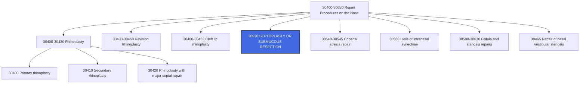

---
tags:
  - cpt
  - ent
  - septoplasty
  - nasal-surgery
  - airway
  - rhinoplasty
  - functional
  - nasal-obstruction
  - deviated-septum
cpt: 30520
descriptor: Septoplasty or submucous resection, with or without cartilage scoring, contouring or replacement with graft
category: Surgical Procedures on the Nose
specialty:
  - Otolaryngology (ENT)
  - Head and Neck Surgery
  - Facial Plastic Surgery
  - Rhinology
type: Procedure
approach: Endonasal (transnasal) or Open
anesthesia: General or Local with Sedation
global_days: 90
status: Active ✅
effective_date: 1990-01-01 (approx.)
last_updated: 2026-01-01
parent_category: Repair Procedures on the Nose (30400-30630)
aliases:
  - Nasal septal repair
  - Deviated septum correction
  - Submucous resection of septum
  - SMR
  - Septal reconstruction
sections:
  - Repair Procedures on the Nose (30400-30630)
  - Septoplasty Procedures
cpt_guidelines: Surgical correction of nasal septal deviation to improve nasal airway; includes cartilage scoring, contouring, or graft placement
work_rvu_2026: Consult CMS MPFS for current value; subject to 2.5% efficiency adjustment
---
# 🧬CPT Code 30520: Septoplasty or Submucous Resection

## 📋 Code Information

| Field | Value |
| :--- | :--- |
| **CPT Code** | [[30520]] |
| **Descriptor** | Septoplasty or submucous resection, with or without cartilage scoring, contouring or replacement with graft |
| **Section** | Repair Procedures on the Nose ([[30400]]-[[30630]]) |
| **Approach** | Endonasal (transnasal) or open |
| **Global Period** | **90 days** |
| **Effective Date** | 1990 (approx.) |
| **Last Updated** | 2026-01-01 (no change from 2025) |

## 📖 Clinical Description

**CPT [[30520]]** describes a surgical procedure to correct a deviated nasal septum, the wall of cartilage and bone that separates the two nostrils. This functional surgery is performed to improve nasal airflow, relieve nasal obstruction, and alleviate symptoms such as difficulty breathing, chronic nasal congestion, recurrent sinusitis, and sleep-disordered breathing.[1][2][6][10]

### Anatomical Context

The nasal septum is composed of:
- **Quadrangular cartilage** (anterior portion)
- **Perpendicular plate of the ethmoid bone** (superior/posterior)
- **Vomer bone** (inferior/posterior)

Deviation can occur in any of these components and may be congenital or result from trauma.

### Procedure Steps[10]

1.  **Incision**: The surgeon makes an incision inside the nostril (hemitransfixion or Killian incision) to access the septal mucosa.
2.  **Mucoperichondrial Flap Elevation**: The mucosal lining is carefully elevated off the septal cartilage and bone on one or both sides.
3.  **Resection/Recontouring**: Deviated portions of cartilage and bone are trimmed, reshaped, scored, or partially removed while preserving adequate dorsal and caudal support to prevent saddle nose deformity.
4.  **Grafting (if needed)**: Resected cartilage may be repositioned as a graft, or additional cartilage (e.g., from auricle or rib) may be used for reconstruction.
5.  **Flap Repositioning**: The mucosal flaps are repositioned and typically held in place with absorbable sutures or nasal packing.
6.  **Packing/Splints (optional)**: Internal nasal splints or packing may be placed temporarily to stabilize the septum and prevent hematoma.

### Indications[2][5]

- Symptomatic nasal obstruction due to septal deviation
- Recurrent sinusitis associated with septal deviation
- Septal spur causing contact headache or facial pain
- Failed medical management (nasal steroids, decongestants)
- Obstructive sleep apnea (as part of comprehensive airway surgery)[2]
- Access for transsphenoidal surgery
- Septal harvest for graft material in rhinoplasty

## 🔍 Includes and Inclusions

- **Septoplasty**: Surgical straightening of the nasal septum[6]
- **Submucous Resection (SMR)**: Removal of deviated cartilage and bone while preserving overlying mucosa[6]
- **Cartilage Scoring**: Partial-thickness cuts to alter cartilage shape[6][10]
- **Cartilage Contouring**: Shaping or reshaping of septal cartilage[6]
- **Graft Placement**: Replacement of resected cartilage with graft material (septal, auricular, rib)[6]
- **Unilateral Procedure**: Code is inherently unilateral; no modifier [[50]] needed as septum is a single midline structure[10]

## 🚫 Excludes and Differentiating Codes

### Rhinoplasty Codes (Cosmetic vs. Functional)[5][6]

| Code | Description | When to Use |
| :--- | :--- | :--- |
| [[30520]] | Septoplasty (functional airway surgery) | Primary indication is airway improvement |
| [[30420]] | Rhinoplasty including major septal repair | Combined cosmetic/facial reshaping with septal work[5][6] |
| [[30400]] | Rhinoplasty, primary; lateral and alar cartilages and/or elevation of nasal tip | Cosmetic tip surgery without major septal repair[6] |
| [[30465]] | Repair of nasal vestibular stenosis | Stenosis repair, not primary septal deviation[5][6] |

### Key Distinction: Septoplasty Alone vs. Septorhinoplasty[5]

| Scenario | Correct Code |
| :--- | :--- |
| Septal deviation causing obstruction, no external nasal changes | [[30520]] |
| Septal deviation with external nasal deformity requiring rhinoplasty | [[30420]] (Rhinoplasty with major septal repair)[5][6] |

### Turbinate Procedures[9]

| Code | Description | Relationship to 30520 |
| :--- | :--- | :--- |
| [[30930]] | Fracture nasal inferior turbinate(s), therapeutic | May be reported separately with 30520; not bundled[9] |
| [[30801]]/[[30802]] | Cautery/ablation of inferior turbinates | May be reported separately if performed |

### Sinus Surgery Codes[2]

| Code | Description |
| :--- | :--- |
| [[31253]]-[[31288]] | Functional endoscopic sinus surgery (FESS) codes[2] |

### Balloon Septoplasty[10]

- **Traditional septoplasty with incisions**: Use [[30520]][10]
- **Balloon dilation without incisions**: Use unlisted code [[30999]] (Unlisted procedure, nose) with comparison code [[31295]][10]
- **Balloon dilation plus incisions**: Use [[30520]] (incisions were made)[10]

## 📊 Code Tree and Hierarchy

## 🔄 Modifiers and Billing Nuances

### Applicable Modifiers for [[30520]][1]

| Modifier | Description | Application |
| :--- | :--- | :--- |
| [[22]] | Increased Procedural Services | Use when work required is substantially greater than typical (e.g., extensive scarring, severe deviation, revision surgery). Documentation must support additional work.[1] |
| [[51]] | Multiple Procedures | Use when multiple procedures are performed during same session (e.g., septoplasty + turbinate reduction). Medicare applies automatically.[1] |
| [[52]] | Reduced Services | Use when service is partially reduced or eliminated.[1] |
| [[59]] | Distinct Procedural Service | Use to indicate procedure is distinct from other services; rarely needed for 30520 alone but may apply with other nasal/sinus procedures at separate sites.[1] |
| [[76]] | Repeat Procedure by Same Physician | Use if procedure repeated on same day.[1] |
| [[77]] | Repeat Procedure by Another Physician | Use if repeated by different physician on same day.[1] |
| [[78]] | Unplanned Return to OR | Use for related procedure during postoperative period (e.g., evacuation of septal hematoma).[1] |
| [[79]] | Unrelated Procedure | Use for unrelated procedure during postoperative period.[1] |
| [[99]] | Multiple Modifiers | Use when two or more modifiers are necessary.[1] |

### Assistant Surgeon Modifiers for [[30520]][1][4]

| Modifier | Description | Payment Status |
| :--- | :--- | :--- |
| [[80]] | Assistant Surgeon | **Payment restrictions may apply** - check MPFS indicator[1] |
| [[82]] | Assistant Surgeon (resident not available) | Teaching hospital when resident unavailable[1][4] |
| [[AS]] | Non-Physician Assistant at Surgery | PA, NP, RNFA, CNS assisting[4] |

### Important Modifier Notes

- **No Laterality Modifiers**: The nasal septum is a midline structure. Do **not** use modifiers [[LT]], [[RT]], or [[50]] with [[30520]].[10]
- **Modifier [[22]] Documentation**: When billing for increased complexity, the operative report must clearly document unusual circumstances (e.g., "severely deviated septum with extensive bony spur requiring drill-out," "revision surgery with dense scar tissue").[1]
- **Modifier [[59]] with Turbinates**: If payer denies bundled [[30930]] with [[30520]], modifier [[59]] may be used as a last resort after appealing with 2006 descriptor change argument.[9]

## 👨‍⚕️ Assistant Surgeon (Modifier [[80]]) Payability

### Assistant Surgeon Status for [[30520]]

For a routine septoplasty, an assistant surgeon is **rarely medically necessary**. This procedure is typically performed by a single surgeon.

### Medicare Payment Indicators[4]

To determine whether assistant surgeon services are payable for [[30520]], check the Medicare Physician Fee Schedule Database (MPFSDB) "Asst Surg" indicator:

| Indicator | Meaning | Likely Status for 30520 |
| :--- | :--- | :--- |
| **0** | Payment restriction applies; supporting documentation required | **Likely** (minor to moderate procedure) |
| **1** | Statutory payment restriction; assistants **not** paid | Possible |
| **2** | Payment restriction does NOT apply; assistants may be paid | Unlikely |
| **9** | Concept does not apply | — |

### Assistant Surgeon Modifier Usage[4]

- **[[80]]**: Physician assistant at surgery - requires documentation of medical necessity
- **[[82]]**: Assistant when qualified resident not available - for teaching hospitals only
- **[[AS]]**: Non-physician assistant (NP, PA, RNFA) - billed under the assistant's NPI[4]

### Documentation Requirements for Teaching Hospitals[4]

If an assistant surgeon is used, documentation must support one of the following when surgery is performed in a teaching hospital:
- A statement that **no qualified resident was available** to perform the service
- A statement indicating that **exceptional medical circumstances** exist
- A statement indicating the primary surgeon has an **across-the-board policy** of never involving residents in patient care

### Clinical Reality

For [[30520]], assistant surgeon services are **not typically billed or reimbursed**. The procedure is generally straightforward and does not require an assistant. Billing with assistant modifiers would likely trigger medical necessity review and potential denial.

## 💰 Work RVU (wRVU) and Reimbursement

### Work RVU Information

The Work Relative Value Units (wRVU) for [[30520]] are updated annually by CMS. For current values:

- **2026 Reference**: Consult the most recent CMS Physician Fee Schedule (PFS) Final Rule or the AMA RBRVS DataManager
- **Reimbursement Factors**: Final payment determined by:
  - Total RVUs (Work + Practice Expense + Malpractice)
  - Geographic Practice Cost Index (GPCI) for your area
  - National conversion factor

### 2026 Medicare Payment Updates

| Factor | Value |
| :--- | :--- |
| **Conversion Factor (non-QP)** | $33.4009 |
| **Conversion Factor (QP)** | $33.5675 |
| **Efficiency Adjustment** | -2.5% applied to work RVUs for non-time-based codes, including [[30520]] |

**Important Note**: CMS has finalized a -2.5% productivity/efficiency adjustment applied to work RVUs for approximately 7,700 non-time-based codes, including surgical procedures. This will affect the 2026 wRVU values compared to prior years.

### Medicare Coverage[1]

- [[30520]] is reimbursed by Medicare when deemed medically necessary
- Code is listed on the Medicare Physician Fee Schedule (MPFS)[1]
- Coverage and reimbursement may vary depending on the specific Medicare Administrative Contractor (MAC) in your region[1]
- Medical necessity must be clearly documented (e.g., nasal obstruction, failed medical management)[1]

## 📋 Documentation Requirements

To support billing of [[30520]], the operative report should clearly document:[1][10]

- **Preoperative Diagnosis**: "Deviated nasal septum," "nasal septal deviation," or specific code
- **Symptoms**: Nasal obstruction, difficulty breathing, recurrent sinusitis, etc.
- **Failed Medical Management**: Trial of nasal steroids, decongestants, or other conservative therapy
- **Procedure Performed**: "Septoplasty" or "submucous resection of nasal septum"
- **Findings**: Description of the deviation (location, severity, components involved - cartilage, bone, spur)
- **Technique**: Incision type, extent of resection, cartilage scoring, contouring, graft placement
- **Graft Details**: If graft used, source (septal, auricular, rib) and purpose
- **Concurrent Procedures**: If turbinate reduction performed, document separately
- **Packing/Splints**: Whether packing or internal splints were placed
- **Estimated Blood Loss**: Standard documentation
- **Complications**: Any intraoperative issues

### Critical Documentation Elements[9][10]

| Element | Why It Matters |
| :--- | :--- |
| **Deviation Description** | Supports medical necessity |
| **Failed Conservative Therapy** | Supports medical necessity for Medicare |
| **Graft Documentation** | Supports code descriptor ("with graft") |
| **Turbinate Procedure Documentation** | Supports separate reporting of 30930 if performed[9] |

### ICD-10 Documentation Tips[2]

Document the specific type and cause of deviation:
- Congenital vs. traumatic
- Anterior vs. posterior
- Cartilaginous vs. bony
- Associated conditions (e.g., sinusitis, sleep apnea)[2]

## 📊 ICD-10 Crosswalk and HCC Information

### Primary ICD-10 Diagnoses for [[30520]][2]

| ICD-10 Code | Description | HCC Applicability |
| :--- | :--- | :--- |
| [[J34.2]] | **Deviated nasal septum** | No (0) |
| [[J34.89]] | Other specified disorders of nose and nasal sinuses | No (0) |
| [[J34.3]] | Hypertrophy of nasal turbinates (when with septal deviation) | No (0) |
| [[J32.9]] | Chronic sinusitis, unspecified (when associated with septal deviation)[2] | No (0) |
| [[J32.0]]-[[J32.4]], [[J32.8]] | Other chronic sinusitis codes[2] | No (0) |
| [[J33]] | Nasal polyp (when with septal deviation)[2] | No (0) |
| [[J33.0]] | Polyp of nasal cavity[2] | No (0) |
| [[J33.8]] | Other polyp of sinus[2] | No (0) |
| [[J33.9]] | Nasal polyp, unspecified[2] | No (0) |
| [[G47.33]] | Obstructive sleep apnea (adult) (pediatric) (when septoplasty for OSA)[2] | **Yes** (HCC depending on model) |
| [[R06.5]] | Mouth breathing (symptom) | No (0) |
| [[R06.83]] | Snoring | No (0) |
| [[S03.8xxA]] | Sprain of joints and ligaments of other parts of head (traumatic deviation) | No (Trauma) |
| [[S09.8xxA]] | Other specified injuries of head (traumatic deviation) | No (Trauma) |
| [[Z87.49]] | Personal history of other diseases of the respiratory system | No (0) |

### Associated Conditions[2]

| ICD-10 Code | Description | HCC Applicability |
| :--- | :--- | :--- |
| [[J45]] | Asthma (when exacerbated by nasal obstruction)[2] | **Yes** (HCC 110-112 depending on severity) |
| [[I10]]-[[I16]] | Hypertension (comorbid)[2] | **Yes** (HCC depending on model) |
| [[E08]]-[[E13]] | Diabetes mellitus (comorbid)[2] | **Yes** (HCC depending on model) |
| [[E65]]-[[E68]] | Obesity (comorbid)[2] | **Yes** (HCC 22) |
| [[F17]] | Nicotine dependence (comorbid)[2] | **Yes** (HCC depending on model) |
| [[F40]]-[[F48]] | Anxiety (comorbid)[2] | **Yes** (HCC 57-59) |
| [[F33]] | Major depressive disorder (comorbid)[2] | **Yes** (HCC 57-59) |

### HCC Note[2]

- **Deviated septum ([[J34.2]])** is **not** an HCC risk adjuster
- **Obstructive sleep apnea ([[G47.33]])** may map to HCC depending on model version[2]
- **Comorbid conditions** (asthma, diabetes, obesity, hypertension) are significant risk adjusters[2]
- The procedure code itself ([[30520]]) is a CPT code and does not contribute to HCC risk adjustment

## 🏥 MS-DRG Assignment

When performed in an inpatient setting (rare; typically outpatient), septoplasty maps to the following Medicare Severity-Diagnosis Related Groups (MS-DRGs):

### For Mouth/Nose Procedures

| MS-DRG | Description |
| :--- | :--- |
| **137** | Mouth procedures with CC/MCC |
| **138** | Mouth procedures without CC/MCC |

### For Sleep Apnea (if principal diagnosis)

| MS-DRG | Description |
| :--- | :--- |
| **152** | Otitis media and URI with MCC |
| **153** | Otitis media and URI without MCC |

### ICD-10-PCS Procedure Code[7]

For hospital inpatient coding, septoplasty is reported with ICD-10-PCS codes:

| Approach | ICD-10-PCS Code | Description |
| :--- | :--- | :--- |
| Open | [[09SM0ZZ]] | Reposition Nasal Septum, Open Approach[7] |

### ICD-9 Crosswalk[7]

| ICD-9-CM Code | Description | Mapping Type |
| :--- | :--- | :--- |
| **21.88** | Other septoplasty | Approximate/GEM[7] |

## 📝 Coding Examples and Scenarios

### Example 1: Simple Septoplasty
**Scenario**: A 35-year-old patient with nasal obstruction due to deviated nasal septum (J34.2) fails medical management with nasal steroids. The surgeon performs an endonasal septoplasty with resection of deviated cartilage and bone. No turbinate work performed.
**Coding**:
- [[30520]] (Septoplasty or submucous resection)
- [[J34.2]] (Deviated nasal septum)
- *Rationale: Classic septoplasty for functional airway improvement.*[1][2][6]

### Example 2: Septoplasty with Inferior Turbinate Outfracture
**Scenario**: A 45-year-old patient with nasal obstruction due to deviated septum and bilateral inferior turbinate hypertrophy. The surgeon performs septoplasty and bilateral inferior turbinate outfracture.
**Coding**:
- [[30520]] (Septoplasty or submucous resection)
- [[30930]] - [[50]] (Fracture nasal inferior turbinate(s), therapeutic, bilateral)
- [[J34.2]] (Deviated nasal septum)
- [[J34.3]] (Hypertrophy of nasal turbinates)
- *Rationale: Inferior turbinate outfracture is not bundled with septoplasty and may be reported separately. No modifier needed for 30930 with 30520.*[9]

### Example 3: Septoplasty with Cartilage Graft
**Scenario**: A 50-year-old patient with severe caudal septal deviation requires septoplasty with removal of deviated cartilage and repositioning as a graft to support the nasal tip.
**Coding**:
- [[30520]] (Septoplasty or submucous resection, with graft)
- [[J34.2]] (Deviated nasal septum)
- *Rationale: Code descriptor includes graft placement.*[6]

### Example 4: Septoplasty with Turbinate Cautery - Denied Claim
**Scenario**: Surgeon performs septoplasty and bilateral turbinate cautery. Payer denies the turbinate cautery as bundled with septoplasty.
**Coding Appeal**:
- **Initial Coding**: [[30520]] + [[30802]] - [[50]]
- **Denial Reason**: Payer cites CPT Assistant 2002 guidelines bundling turbinate procedures
- **Appeal Argument**: Reference the 2006 CPT descriptor change for [[30930]] (now specific to inferior turbinates) and argue that turbinate cautery (30802) is also a separate, non-incidental procedure. If payer remains unmoved, consider modifier [[59]] as last resort.[9]

### Example 5: Septorhinoplasty (Functional + Cosmetic)
**Scenario**: A 40-year-old patient has nasal obstruction due to deviated septum and desires improvement of external nasal appearance (dorsal hump). The surgeon performs rhinoplasty with dorsal reduction and septoplasty.
**Coding**:
- **Correct**: [[30420]] (Rhinoplasty, primary; including major septal repair)[5][6]
- **Incorrect**: [[30520]] + rhinoplasty codes
- *Rationale: When septal repair is performed as part of cosmetic rhinoplasty, use the combined code 30420.*[5][6]

### Example 6: Balloon Septoplasty (Without Incisions)
**Scenario**: Surgeon performs septoplasty using balloon dilation device without making incisions into septal mucosa.
**Coding**:
- **Correct**: [[30999]] (Unlisted procedure, nose) with comparison code [[31295]][10]
- **Incorrect**: [[30520]]
- *Rationale: Code 30520 requires incisions into septal mucosa. Balloon-only approach requires unlisted code.*[10]

### Example 7: Balloon Septoplasty with Incisions
**Scenario**: Surgeon makes incisions into septal mucosa, performs some resection, and also uses balloon dilation device.
**Coding**:
- **Correct**: [[30520]] (Septoplasty or submucous resection)
- *Rationale: Since incisions were made and resection performed, code 30520 is appropriate.*[10]

### Example 8: Septoplasty with FESS
**Scenario**: Patient undergoes septoplasty and bilateral functional endoscopic sinus surgery for chronic sinusitis.
**Coding**:
- [[30520]] (Septoplasty)
- Appropriate FESS codes (e.g., [[31254]], [[31255]], [[31256]], [[31267]], [[31276]], [[31287]], [[31288]]) with modifier [[51]][2]
- [[J34.2]] (Deviated nasal septum)
- [[J32.9]] (Chronic sinusitis)[2]
- *Rationale: Septoplasty and FESS are distinct procedures performed for different indications.*[2]

### Example 9: Septoplasty with Obstructive Sleep Apnea
**Scenario**: Patient with documented obstructive sleep apnea (G47.33) and nasal obstruction due to deviated septum undergoes septoplasty as part of comprehensive airway surgery.
**Coding**:
- [[30520]] (Septoplasty)
- [[G47.33]] (Obstructive sleep apnea)[2]
- *Rationale: Sleep apnea may be coded as comorbidity; document relationship to nasal obstruction.*[2]

## ⚠️ Important Coding Notes

### Bilateral Surgery Indicator[10]

- [[30520]] has a **bilateral surgery indicator of "0"**
- **150% payment adjustment does NOT apply**
- Do **not** use modifiers [[50]], [[LT]], or [[RT]][10]

### Traditional Septoplasty vs. Balloon Septoplasty[10]

| Procedure | Incisions? | Code |
| :--- | :--- | :--- |
| Traditional septoplasty | Yes | [[30520]][10] |
| Balloon dilation without incisions | No | [[30999]] + comparison code[10] |
| Balloon dilation with incisions | Yes | [[30520]][10] |

### Turbinate Procedures - Bundling History[9]

- **Pre-2006**: [[30930]] was "any turbinate" and bundled with septoplasty[9]
- **Post-2006**: [[30930]] is specific to **inferior turbinate only** and is **not** bundled[9]
- **Appeal Strategy**: If payer denies, reference 2006 CPT descriptor change[9]
- **Last Resort**: Add modifier [[59]] if appeal fails[9]

### Medical Necessity for Medicare[1]

- Document **failed conservative therapy** (e.g., nasal steroids for 4-6 weeks)
- Document **symptoms** (nasal obstruction, difficulty breathing)
- Document **findings** (degree of deviation, location)
- Verify with local MAC for any specific coverage requirements[1]

### Global Period[1]

- [[30520]] has a **90-day global period**
- All routine post-operative care is included
- Complications requiring return to OR may be billed with modifier [[78]][1]
- Unrelated procedures during the global period may be billed with modifier [[79]][1]

## 🔗 Related Codes

### Septoplasty and Rhinoplasty Codes[5][6]

| Code | Description |
| :--- | :--- |
| [[30400]] | Rhinoplasty, primary; lateral and alar cartilages and/or elevation of nasal tip[6] |
| [[30410]] | Rhinoplasty, primary; complete |
| [[30420]] | Rhinoplasty, primary; including major septal repair[5][6] |
| [[30430]] | Rhinoplasty, secondary; minor revision |
| [[30435]] | Rhinoplasty, secondary; intermediate revision |
| [[30450]] | Rhinoplasty, secondary; major revision |
| [[30460]] | Rhinoplasty for nasal deformity secondary to congenital cleft lip and/or palate |
| [[30462]] | Rhinoplasty for nasal deformity secondary to congenital cleft lip and/or palate |
| [[30465]] | Repair of nasal vestibular stenosis (e.g., spreader grafting, lateral nasal wall reconstruction)[5][6] |

### Turbinate Procedures[9]

| Code | Description |
| :--- | :--- |
| [[30930]] | Fracture nasal inferior turbinate(s), therapeutic[9] |
| [[30801]] | Cautery and/or ablation, mucosa of inferior turbinates; superficial |
| [[30802]] | Cautery and/or ablation, mucosa of inferior turbinates; intramural |

### Sinus Surgery Codes[2]

| Code | Description |
| :--- | :--- |
| [[31253]] | FESS, ethmoidectomy |
| [[31254]] | Nasal/sinus endoscopy, surgical, with ethmoidectomy; partial (anterior)[2] |
| [[31255]] | Nasal/sinus endoscopy, surgical, with ethmoidectomy; total (anterior and posterior)[2] |
| [[31256]] | Nasal/sinus endoscopy, surgical, with maxillary antrostomy[2] |
| [[31267]] | Nasal/sinus endoscopy, surgical, with maxillary antrostomy; with removal of tissue[2] |
| [[31276]] | Nasal/sinus endoscopy, surgical, with frontal sinus exploration[2] |
| [[31287]] | Nasal/sinus endoscopy, surgical, with sphenoidotomy[2] |
| [[31288]] | Nasal/sinus endoscopy, surgical, with sphenoidotomy; with removal of tissue[2] |

### Sleep Apnea Codes[2]

| Code | Description |
| :--- | :--- |
| [[64582]] | Hypoglossal nerve stimulator (e.g., for OSA)[2] |
| [[42145]] | Uvulopalatopharyngoplasty[2] |
| [[94660]] | Continuous positive airway pressure initiation and management[2] |

### Graft Codes[5][6]

| Code | Description |
| :--- | :--- |
| [[20912]] | Cartilage graft; nasal septum[5][6] |
| [[20900]] | Cartilage graft; rib, autogenous |
| [[20902]] | Cartilage graft; rib, homologous |
| [[21235]] | Graft; ear cartilage, autogenous |

### Unlisted Codes[10]

| Code | Description |
| :--- | :--- |
| [[30999]] | Unlisted procedure, nose[10] |
| [[21299]] | Unlisted craniofacial and maxillofacial procedure |

## References

1 MD Clarity. "CPT Code 30520: What It Is, Modifiers, Reimbursement." (2026)
2 NIH/NCBI. "Table 1. Diagnosis and CPT Codes." (2024)
3 Bristol Healthcare Services. "CPT® 2026 Overhaul." (2026)
4 AAPC Forum. "HOW TO BILL FOR A CERTIFIED NURSE PRACTITIONER SURGICAL ASSIST." (2025)
5 NIH/NCBI. "Table 6. Management and Coding: Patient case scenarios." (2018)
6 NIH/NCBI. "Table 7. Current Procedural Terminology (CPT) Code Definitions." (2018)
7 emedcodes.com. "09SM0ZZ - Reposition Nasal Septum, Open Approach." (2026)
8 MedLearn Publishing. "Peripheral & Cardiology Coder - 2026 Edition." (2026)
9 AAPC. "Unbundle Inferior Turbinates From Septoplasty : READER QUESTIONS." (2010)
10 AAPC. "Get the Full Scoop on Septoplasty Procedures Involving Balloon Dilation." (2020)