---
tags:
  - cpt
  - ent
  - salivary-gland
  - sublingual
  - ranula
  - cyst
  - oral-surgery
  - head-neck
  - excision
cpt: 42408
status: Active ✅
descriptor: Excision of sublingual salivary cyst (ranula)
category: Surgical Procedures on the Salivary Glands and Ducts
specialty:
  - Otolaryngology (ENT)
  - Oral and Maxillofacial Surgery
  - General Surgery
  - Head and Neck Surgery
type: Procedure
approach: Open (Intraoral)
anesthesia: General or Local with Sedation
global_days: 90
effective_date: 1990-01-01 (approx.)
last_updated: 2026-01-01
parent_category: Salivary Gland and Duct Procedures (42300-42699)
aliases:
  - Ranula excision
  - Sublingual gland cyst removal
  - Excision of oral ranula
  - Sublingual salivary cyst excision
sections:
  - Excision Procedures on Salivary Glands and Ducts (42400-42450)
cpt_guidelines: Specific code for removal of ranula (sublingual salivary cyst); not for mucoceles in other oral sites
work_rvu_2026: Consult CMS MPFS for current value; subject to 2.5% efficiency adjustment
---

# 🧬CPT Code 42408: Excision of Sublingual Salivary Cyst (Ranula)

## 📋 Code Information

| Field | Value |
| :--- | :--- |
| **CPT Code** | [[42408]] |
| **Descriptor** | Excision of sublingual salivary cyst (ranula) |
| **Section** | Salivary Gland and Duct Procedures ([[42300]]-[[42699]]) |
| **Approach** | Open surgical (intraoral incision) |
| **Global Period** | 90 days |
| **Effective Date** | 1990 (approx.) |
| **Last Updated** | 2026-01-01 (no change from 2025) |

## 📖 Clinical Description

**[[42408]]** describes a surgical procedure to excise a ranula, which is a mucocele (mucus-filled cyst) that occurs specifically in the floor of the mouth, arising from the sublingual salivary gland. The term "ranula" comes from the Latin word *rana* meaning "frog," as the swelling resembles a frog's underbelly.[1][2][8]

### Anatomical Specificity[2][8]

- **Location**: The ranula is located in the **floor of the mouth**, beneath the tongue (sublingual space)
- **Origin**: Arises from the **sublingual salivary gland** or its ducts
- **Appearance**: Soft, bluish, translucent, fluid-filled swelling

### Critical Distinction[2][8]

This code is **highly specific** to the ranula. It is **not** appropriate for:
- Mucoceles located elsewhere in the oral cavity (e.g., buccal mucosa, lips, vestibule)
- Simple mucoceles that are not true ranulas
- Cysts arising from minor salivary glands outside the floor of the mouth

### Procedure Steps[1]

1.  **Incision**: The surgeon makes an intraoral incision in the floor of the mouth overlying the cyst.
2.  **Dissection**: The cyst is carefully dissected from the surrounding sublingual tissues.
3.  **Excision**: The ranula is removed in its entirety, often along with the involved sublingual gland to prevent recurrence.
4.  **Closure**: The incision is closed, sometimes with placement of a drain if necessary.

### Indications

- Symptomatic ranula causing discomfort or difficulty swallowing/speaking
- Large ranula interfering with oral function
- Recurrent ranula after aspiration or marsupialization
- Cosmetic concerns
- Suspicion of neoplasm (rare)

## 🔍 Includes and Inclusions

- **Excision of Sublingual Salivary Cyst**: Complete surgical removal of the ranula[1][2][8]
- **Ranula Excision**: Specific to the floor of mouth cyst arising from sublingual gland[2][8]
- **Unilateral Procedure**: Code describes one side; use modifier [[50]] for bilateral[1]

## 🚫 Excludes and Differentiating Codes

### Critical Distinction: Ranula vs. Mucocele[2][8]

| Code | Description | Indication |
| :--- | :--- | :--- |
| [[42408]] | Excision of sublingual salivary cyst (ranula) | **Ranula only** (floor of mouth, sublingual origin)[2][8] |
| [[40810]] | Excision of lesion, vestibule of mouth; without repair | Mucocele of lip, cheek, or vestibule[2][8] |
| [[40812]] | Excision of lesion, vestibule of mouth; with simple repair | Mucocele requiring repair[8] |
| [[40814]] | Excision of lesion, vestibule of mouth; with complex repair | Mucocele requiring complex closure[8] |
| [[40820]] | Destruction of lesion, vestibule of mouth by physical methods | Laser/cryo destruction of mucocele[8] |

### Other Salivary Gland Excision Codes

| Code | Description | Differentiating Factor |
| :--- | :--- | :--- |
| [[42410]] | Excision of parotid tumor or parotid gland; lateral lobe | Parotid gland (not sublingual) |
| [[42415]] | Excision of parotid tumor or parotid gland; total, with dissection and preservation of facial nerve | Parotid gland |
| [[42420]] | Excision of parotid tumor or parotid gland; total, with sacrifice of facial nerve | Parotid gland |
| [[42425]] | Excision of parotid tumor or parotid gland; total, en bloc removal with sacrifice of facial nerve | Parotid gland |
| [[42440]] | Excision of submandibular (submaxillary) gland | Submandibular gland |
| [[42450]] | Excision of sublingual gland | Sublingual gland excision (may be included in 42408) |

### Procedures Not Reported with [[42408]]

| Situation | Rationale |
| :--- | :--- |
| Simple mucocele of lip/buccal mucosa | Use 40810-40814 or 40820[2][8] |
| Marsupialization (when not true excision) | Different procedure; unlisted code may be needed |
| Ranula excision with sublingual gland | Included in 42408 (gland often removed with cyst) |

## 📊 Code Tree and Hierarchy

```mermaid
flowchart TD
    A["42300-42699 Salivary Gland and Duct Procedures"] --> B["Incision and Drainage"]
    B --> C["42300 Drainage of parotid abscess"]
    B --> D["42305 Drainage of parotid abscess; complicated"]
    B --> E["42310 Drainage of submandibular/sublingual abscess; intraoral"]
    B --> F["42320 Drainage of submandibular/sublingual abscess; external"]
    
    A --> G["Excision Procedures"]
    G --> H["42400 Biopsy of salivary gland; needle"]
    G --> I["42405 Biopsy of salivary gland; incisional"]
    G --> J["42408 EXCISION OF SUBLINGUAL SALIVARY CYST (RANULA)"]
    G --> K["42409 Marsupialization of sublingual salivary cyst"]
    G --> L["42410-42420 Parotid gland excision"]
    G --> M["42440 Excision of submandibular gland"]
    G --> N["42450 Excision of sublingual gland"]
    
    A --> O["Repair Procedures"]
    O --> P["42500 Plastic repair of salivary duct"]
    O --> Q["42505 Plastic repair of salivary duct; with advancement"]
    
    style J fill:#4169E1,stroke:#333,stroke-width:2px,color:white
```

## 🔄 Modifiers and Billing Nuances

### Applicable Modifiers for [[42408]][1]

| Modifier | Description | Application |
| :--- | :--- | :--- |
| [[22]] | Increased Procedural Services | Use when work required is substantially greater than typical (e.g., extensive adhesions, large cyst, difficult dissection)[1] |
| [[50]] | Bilateral Procedure | Use if bilateral ranulas are excised during the same operative session[1] |
| [[51]] | Multiple Procedures | Use when multiple procedures are performed during the same session; Medicare applies automatically[1] |
| [[52]] | Reduced Services | Use when service is partially reduced or eliminated[1] |
| [[53]] | Discontinued Procedure | Use if procedure started but discontinued due to patient instability or unforeseen circumstances[1] |
| [[59]] | Distinct Procedural Service | Use to indicate procedure is distinct from other services performed on same day[1] |
| [[76]] | Repeat Procedure by Same Physician | Use if procedure repeated on same day[1] |
| [[77]] | Repeat Procedure by Another Physician | Use if repeated by different physician on same day[1] |
| [[78]] | Unplanned Return to OR | Use for related procedure during postoperative period (e.g., evacuation of hematoma)[1] |
| [[79]] | Unrelated Procedure | Use for unrelated procedure during postoperative period[1] |

### Assistant Surgeon Modifiers for [[42408]][1][4][10]

| Modifier | Description | Application |
| :--- | :--- | :--- |
| [[80]] | Assistant Surgeon | Physician assistant at surgery[1][4][10] |
| [[81]] | Minimum Assistant Surgeon | Minimal assistance during portion of surgery[1][10] |
| [[82]] | Assistant Surgeon (resident not available) | Teaching hospital when resident unavailable[1][4][10] |
| [[AS]] | Non-Physician Assistant at Surgery | PA, NP, RNFA, CNS assisting[1][10] |

### Important Modifier Notes

- **Modifier [[22]] Documentation**: When billing for increased complexity, the operative report must clearly document the unusual circumstances (e.g., "cyst extending into deep sublingual space requiring extensive dissection," "significant scarring from prior procedure")[1]
- **Modifier [[50]] for Bilateral**: If bilateral ranulas are excised, append modifier [[50]] to a single line item, or use two line items with modifiers [[LT]] and [[RT]] depending on payer preference[1]

## 👨‍⚕️ Assistant Surgeon (Modifier [[80]]) Payability

### Assistant Surgeon Status for Salivary Procedures

For a procedure like [[42408]], an assistant surgeon is **rarely medically necessary**. This is typically a straightforward procedure performed by a single surgeon.

### Medicare Payment Indicators[4]

To determine whether assistant surgeon services are payable for [[42408]], you must check the Medicare Physician Fee Schedule Database (MPFSDB) "Asst Surg" indicator:

| Indicator | Meaning | Likely Status for 42408 |
| :--- | :--- | :--- |
| **0** | Payment restriction applies; supporting documentation required | **Likely** (minor to moderate procedure) |
| **1** | Statutory payment restriction; assistants **not** paid | Possible |
| **2** | Payment restriction does NOT apply; assistants may be paid | Unlikely |
| **9** | Concept does not apply (procedure is not a surgery) | No |

### Documentation Requirements for Teaching Hospitals[4]

If an assistant surgeon is used and the indicator is 0, documentation must support one of the following when the surgery is performed in a teaching hospital:
- A statement that **no qualified resident was available** to perform the service
- A statement indicating that **exceptional medical circumstances** exist
- A statement indicating the primary surgeon has an **across-the-board policy** of never involving residents in patient care

### Clinical Reality

For [[42408]], assistant surgeon services are **not typically billed or reimbursed**. The procedure is generally straightforward and does not require an assistant. Billing with assistant modifiers would likely trigger medical necessity review and potential denial.

## 💰 Work RVU (wRVU) and Reimbursement

### Work RVU Information

The Work Relative Value Units (wRVU) for [[42408]] are updated annually by CMS. For current values:

- **2026 Reference**: Consult the most recent CMS Physician Fee Schedule (PFS) Final Rule or the AMA RBRVS DataManager
- **Reimbursement Factors**: Final payment determined by:
  - Total RVUs (Work + Practice Expense + Malpractice)
  - Geographic Practice Cost Index (GPCI) for your area
  - National conversion factor

### 2026 Medicare Payment Updates

| Factor | Value |
| :--- | :--- |
| **Conversion Factor (non-QP)** | $33.4009 |
| **Conversion Factor (QP)** | $33.5675 |
| **Efficiency Adjustment** | -2.5% applied to work RVUs for non-time-based codes, including [[42408]] |

**Important Note**: CMS has finalized a -2.5% productivity/efficiency adjustment applied to work RVUs for approximately 7,700 non-time-based codes, including surgical procedures. This will affect the 2026 wRVU values compared to prior years.

### Medicare Coverage[1]

- [[42408]] is reimbursed by Medicare
- Code is listed on the Medicare Physician Fee Schedule (MPFS), indicating it is a covered service
- Coverage and reimbursement may vary depending on the specific Medicare Administrative Contractor (MAC) in your region[1]
- Verify with your local MAC for any specific local coverage determinations (LCDs) that could affect reimbursement[1]

## 📋 Documentation Requirements

To support billing of [[42408]], the operative report should clearly document:[1][2][8]

- **Preoperative Diagnosis**: "Ranula," "sublingual salivary cyst," or specific diagnosis
- **Anatomical Location**: Explicitly document that the cyst is in the **floor of the mouth** and **sublingual** in origin (critical for distinguishing from mucoceles elsewhere)[2][8]
- **Procedure Performed**: "Excision of sublingual salivary cyst" or "ranula excision"
- **Size and Description**: Dimensions and characteristics of the cyst
- **Dissection Details**: Extent of dissection and whether sublingual gland was removed
- **Findings**: Description of cyst contents and any unusual features
- **Closure**: Method of wound closure and drain placement (if any)
- **Complications**: Any intraoperative issues

### Critical Documentation Elements[2][8]

| Element | Why It Matters |
| :--- | :--- |
| **Exact Anatomical Location** | Distinguishes ranula (42408) from mucocele (40810-40814) |
| **Sublingual Origin** | Confirms appropriateness of 42408 |
| **Cyst Description** | Supports medical necessity |
| **Gland Involvement** | May justify complexity if documented |

## 📊 ICD-10 Crosswalk and HCC Information

### Primary ICD-10 Diagnoses for [[42408]][2][6][8]

| ICD-10 Code | Description | HCC Applicability |
| :--- | :--- | :--- |
| [[K11.6]] | **Mucocele of salivary gland** (includes ranula) | No (0)[2][8] |
| [[K11.8]] | Other diseases of salivary glands | No (0) |
| [[K11.9]] | Disease of salivary gland, unspecified | No (0) |
| [[C08.1]] | **Malignant neoplasm of sublingual gland** | **Yes** (HCC 8 or 10)[6] |
| [[D11.0]] | Benign neoplasm of parotid gland | No (0) |
| [[D11.7]] | Benign neoplasm of other major salivary glands | No (0) |
| [[D11.9]] | Benign neoplasm of major salivary gland, unspecified | No (0) |
| [[Q18.6]] | Congenital ranula | No (0) |
| [[Q18.8]] | Other specified congenital malformations of face and neck | No (0) |

### HCC Note[6]

- **Malignant neoplasms** of the salivary glands ([[C08.1]]) are significant risk adjusters in HCC models, typically mapping to HCC 8 or 10 depending on the specific CMS-HCC model version[6]
- **Benign neoplasms** and **non-neoplastic conditions** ([[K11.6]], [[K11.8]], etc.) do **not** contribute to HCC risk scores
- The excision procedure code itself (42408) is a CPT code and does not contribute to HCC risk adjustment

### ICD-9 Crosswalk[2][8]

| ICD-9-CM Code | Description | Mapping Type |
| :--- | :--- | :--- |
| **527.6** | Mucocele of salivary gland | Approximate/GEM |

## 🏥 MS-DRG Assignment

When performed in an inpatient setting (rare; typically outpatient), salivary gland procedures map to the following Medicare Severity-Diagnosis Related Groups (MS-DRGs):[7]

### For Salivary Gland Procedures[7]

| MS-DRG | Description |
| :--- | :--- |
| **139** | Salivary gland procedures |

### For Malignant Diagnoses (e.g., C08.1)[7]

| MS-DRG | Description |
| :--- | :--- |
| **146** | Ear, nose, mouth and throat malignancy with MCC |
| **147** | Ear, nose, mouth and throat malignancy with CC |
| **148** | Ear, nose, mouth and throat malignancy without CC/MCC |

### For Other Mouth Procedures[7]

| MS-DRG | Description |
| :--- | :--- |
| **137** | Mouth procedures with CC/MCC |
| **138** | Mouth procedures without CC/MCC |

### ICD-10-PCS Procedure Codes[5]

For hospital inpatient coding, sublingual gland excision procedures are reported with ICD-10-PCS codes:

| Approach | ICD-10-PCS Code | Description |
| :--- | :--- | :--- |
| Open | [[0CB50ZZ]] | Excision of Right Sublingual Gland, Open Approach |
| Open | [[0CB60ZZ]] | Excision of Left Sublingual Gland, Open Approach |
| Percutaneous | [[0CB53ZZ]] | Excision of Right Sublingual Gland, Percutaneous Approach[5] |
| Percutaneous | [[0CB63ZZ]] | Excision of Left Sublingual Gland, Percutaneous Approach |
| Percutaneous Endoscopic | [[0CB54ZZ]] | Excision of Right Sublingual Gland, Percutaneous Endoscopic Approach |
| Percutaneous Endoscopic | [[0CB64ZZ]] | Excision of Left Sublingual Gland, Percutaneous Endoscopic Approach |

## 📝 Coding Examples and Scenarios

### Example 1: Simple Ranula Excision
**Scenario**: A 35-year-old patient presents with a 2 cm bluish swelling in the floor of the mouth under the tongue. The oral surgeon performs an excision of the ranula via intraoral approach. The sublingual gland is partially removed with the cyst to prevent recurrence.
**Coding**:
- [[42408]] (Excision of sublingual salivary cyst [ranula])
- [[K11.6]] (Mucocele of salivary gland)
- *Rationale: Classic ranula excision. Sublingual gland removal is typically included when performed with cyst excision.*[1][2][8]

### Example 2: Bilateral Ranula Excision
**Scenario**: A patient presents with bilateral ranulas in the floor of the mouth. The surgeon excises both during the same operative session.
**Coding**:
- [[42408]] - [[50]] (Excision of sublingual salivary cyst [ranula], bilateral)
- [[K11.6]] (Mucocele of salivary gland)
- *Rationale: Modifier 50 indicates bilateral procedure. Some payers may prefer two line items with modifiers LT and RT.*[1]

### Example 3: Complex Ranula Excision with Increased Work
**Scenario**: A patient presents with a recurrent ranula that has been previously marsupialized. There is extensive scarring and adhesions. The excision requires extensive dissection and takes significantly longer than usual.
**Coding**:
- [[42408]] - [[22]] (Excision of sublingual salivary cyst [ranula], increased procedural services)
- [[K11.6]] (Mucocele of salivary gland)
- *Rationale: Modifier 22 is appropriate when the work required is substantially greater than typical. Documentation must support the increased complexity (recurrent cyst, scarring, extensive dissection).*[1]

### Example 4: Ranula Excision with Assistant Surgeon
**Scenario**: A patient with a very large ranula extending into the deep sublingual space undergoes excision. Due to the proximity to the lingual nerve and Wharton's duct, an assistant surgeon is necessary.
**Coding**:
- Primary Surgeon: [[42408]] (Excision of sublingual salivary cyst [ranula])
- Assistant Surgeon: [[42408]] - [[80]] (Excision of sublingual salivary cyst [ranula], with assistant surgeon)
- *Rationale: If 42408 has an assistant surgeon indicator allowing payment, documentation must support the medical necessity for an assistant.*[1][4]

### Example 5: Incorrect Coding - Mucocele of Lower Lip
**Scenario**: A patient presents with a mucocele on the lower lip (buccal mucosa). The surgeon excises the lesion. The coder reports [[42408]].
**Coding**:
- **Correct**: [[40810]] (Excision of lesion, vestibule of mouth; without repair)
- **Incorrect**: [[42408]]
- *Rationale: 42408 is specific to ranula of the floor of mouth. Mucoceles elsewhere require vestibule of mouth excision codes (40810-40814).*[2][8]

### Example 6: Incorrect Coding - Simple Mucocele of Buccal Mucosa
**Scenario**: A patient has a mucocele of the right buccal mucosa. The surgeon excises it and performs simple closure.
**Coding**:
- **Correct**: [[40812]] (Excision of lesion, vestibule of mouth; with simple repair)
- **Incorrect**: [[42408]]
- *Rationale: Even though the diagnosis is mucocele (K11.6), the anatomical site (buccal mucosa) requires a vestibule code, not the ranula-specific code.*[2][8]

### Example 7: Ranula Excision with Marsupialization
**Scenario**: The surgeon performs excision of a ranula, but due to its size and location, also performs marsupialization to ensure drainage.
**Coding**:
- [[42408]] (Excision of sublingual salivary cyst [ranula])
- *Rationale: Marsupialization, when performed with excision, is considered part of the procedure and not separately reportable. If marsupialization alone is performed without excision, consider unlisted code 42409.*

### Example 8: Malignant Neoplasm of Sublingual Gland
**Scenario**: A patient is diagnosed with malignant neoplasm of the sublingual gland (C08.1). The surgeon performs excision of the sublingual gland and the associated cyst.
**Coding**:
- [[42450]] (Excision of sublingual gland) - or [[42408]] depending on extent
- [[C08.1]] (Malignant neoplasm of sublingual gland)
- *Rationale: For malignant neoplasms, the appropriate excision code may depend on the extent of surgery. Malignant diagnoses carry HCC implications.*[6]

## ⚠️ Important Coding Notes

### Ranula vs. Mucocele Distinction is Critical[2][8]

The single most important factor in correct coding is **anatomical location**:

| Lesion Location | Correct Code |
| :--- | :--- |
| Floor of mouth, sublingual origin (ranula) | 42408 |
| Lip (mucocele) | 40810-40814 |
| Buccal mucosa (mucocele) | 40810-40814 |
| Vestibule of mouth (mucocele) | 40810-40814 |

### Same Diagnosis, Different Codes[2][8]

Both ranula and other oral mucoceles share the same diagnosis code ([[K11.6]]), but require **different procedure codes** based on anatomical site. Always verify the operative report for location, not just the diagnosis.

### Global Period[1]

- [[42408]] has a **90-day global period**
- All routine post-operative care is included in the global period
- Complications requiring return to OR may be billed with modifier [[78]]
- Unrelated procedures during the global period may be billed with modifier [[79]]

### Marsupialization Alternative

If the surgeon performs marsupialization (creating a pouch) instead of excision:
- No specific CPT code exists for marsupialization of ranula
- Code [[42409]] (Marsupialization of sublingual salivary cyst) is **not a valid CPT code** as of 2026
- Consider unlisted code [[41899]] (Unlisted procedure, dentoalveolar) or [[42699]] (Unlisted procedure, salivary glands and ducts)

### Sublingual Gland Excision (42450) vs. Ranula Excision (42408)

| Code | Indication | Includes Gland? |
| :--- | :--- | :--- |
| 42408 | Ranula excision | May include partial gland removal |
| 42450 | Sublingual gland excision | Complete gland removal |

If the primary indication is the ranula and the gland is partially removed to prevent recurrence, [[42408]] is appropriate. If the primary indication is a diseased gland with secondary cyst, [[42450]] may be more appropriate.

### Pediatric Considerations

Ranulas can occur in pediatric patients. [[42408]] may be used for patients of any age. No age-specific modifier is required unless the patient is under 4 kg (modifier [[63]]).

## 🔗 Related Codes

### Salivary Gland Biopsy Codes

| Code | Description |
| :--- | :--- |
| [[42400]] | Biopsy of salivary gland; needle |
| [[42405]] | Biopsy of salivary gland; incisional |

### Salivary Gland Excision Codes

| Code | Description |
| :--- | :--- |
| [[42410]] | Excision of parotid tumor or parotid gland; lateral lobe |
| [[42415]] | Excision of parotid tumor or parotid gland; total, with dissection and preservation of facial nerve |
| [[42420]] | Excision of parotid tumor or parotid gland; total, with sacrifice of facial nerve |
| [[42425]] | Excision of parotid tumor or parotid gland; total, en bloc removal with sacrifice of facial nerve |
| [[42440]] | Excision of submandibular (submaxillary) gland |
| [[42450]] | Excision of sublingual gland |

### Salivary Duct Procedures

| Code | Description |
| :--- | :--- |
| [[42330]] | Sialolithotomy; submandibular (submaxillary), sublingual or parotid, uncomplicated, intraoral |
| [[42335]] | Sialolithotomy; submandibular (submaxillary), complicated, intraoral |
| [[42500]] | Plastic repair of salivary duct |
| [[42505]] | Plastic repair of salivary duct; with advancement |
| [[42507]] | Parotid duct diversion |

### Unlisted Codes

| Code | Description |
| :--- | :--- |
| [[42699]] | Unlisted procedure, salivary glands and ducts |
| [[41899]] | Unlisted procedure, dentoalveolar structures |

## References

1 MD Clarity. "CPT Code 42408: What It Is, Modifiers, Reimbursement." (2026)
2 AAPC. "You Be the Coder: Cyst Excision: 11440 or 40810?" (2007, reviewed 2015)
3 Bristol Healthcare Services. "CPT® 2026 Overhaul." (2026)
4 DEX Diagnostics Exchange. "CPT Modifier 80." (2025)
5 emedcodes.com. "0CB53ZX - Excision of Right Sublingual Gland, Percutaneous Approach, Diagnostic." (2026)
6 National Cancer Institute. "Malignant Sublingual Gland Neoplasm (Code C3527)." (2026)
7 CMS. "ICD-10-CM/PCS MS-DRG v41.0 Definitions Manual." (2024)
8 AAPC. "Reporting 42408 For Mucocele Removal? Not so Fast." (2015)
9 MedLearn Publishing. "Peripheral & Cardiology Coder - 2026 Edition." (2026)
10 Priority Health. "Modifiers 80, 81, 82, assistant at surgery." (2025)