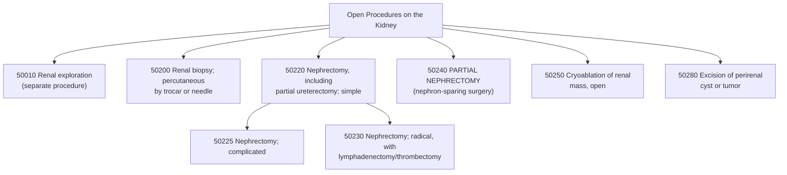

# ⚕️ CPT Code 50240: Open Partial Nephrectomy

**CPT [[50240]]** is a CPT code that describes **an open surgical procedure to remove a portion of the kidney**. This nephron-sparing surgery is typically performed to excise a tumor or diseased tissue while preserving as much healthy kidney [[parenchyma]] as possible. The goal of a **partial nephrectomy** is to maintain kidney function and minimize the impact on the patient's overall renal health, making it the preferred approach for small renal masses when technically feasible.[1][6]

## Clinical Description
An **open partial nephrectomy** is performed through an incision (**open approach**) to access the kidney and remove only the affected portion while preserving the remaining functional kidney tissue. This approach may be chosen over laparoscopic methods due to t**umor complexity, location, size, or patient-specific factors**.[6]

During the procedure:[1]

1.  **Patient Positioning and Preparation**: The patient is positioned appropriately (often in a lateral decubitus or flank position) under general anesthesia. The surgical site is prepared with antiseptic solution and draped in a sterile manner.
2.  **Incision**: The surgeon makes an incision in the flank or abdomen to access the retroperitoneal space and the kidney. This may require rib resection for adequate exposure in some cases.
3.  **Kidney Exposure and Tumor Identification**: The kidney is exposed, and the tumor or diseased portion is identified. Intraoperative ultrasound may be used to delineate tumor margins, especially for endophytic (deep) lesions.
4.  **Vascular Control**: The renal artery (and sometimes vein) is temporarily clamped to reduce blood flow (ischemia) during tumor excision, minimizing blood loss. In some cases, cold **ischemia** techniques may be employed.
5.  **Tumor Excision**: The tumor is excised with a margin of healthy tissue to ensure complete removal.
6.  **Renal Reconstruction**: The remaining kidney tissue is sutured closed (**renorrhaphy**) to control bleeding and repair the defect. This may involve suturing over a bolster of hemostatic material.
7.  **Closure**: The incision is closed in layers, and a drain may be placed.

## Key Components and Includes
- **Partial Nephrectomy**: Removal of only a portion of the kidney (nephron-sparing surgery).[1][6]
- **Open Approach**: Traditional incision-based technique (not laparoscopic or robotic).[1]
- **Tumor Excision**: Removal of renal mass with preservation of remaining healthy kidney tissue.
- **Renal Reconstruction**: Suturing of the kidney defect (**renorrhaphy**) is included in the procedure.
- **Vascular Control**: Temporary clamping of renal vessels (if performed) is included.

## Excludes and Differentiating Codes
It is critical to differentiate [[50240]] from other [[nephrectomy]] codes based on the extent of resection and approach.[1][4][6]

- **[[50543]] (Laparoscopic Partial Nephrectomy)**: Use this code for a partial nephrectomy performed via a minimally invasive laparoscopic approach.[1]
- **[[50220]] (Open Nephrectomy)**: Use this code for complete removal of the kidney for benign disease, not partial [[resection]].[6]
- **[[50230 1]] (Open Radical Nephrectomy)**: Use this code for complete removal of the kidney, **Gerota's fascia**, perinephric fat, regional lymph nodes, and ipsilateral adrenal gland for malignancy.[6]
- **[[60540]] ([[Adrenalectomy]])**: This code is **bundled into** [[50240]] when performed on the same side. Do not report separately unless the adrenalectomy is performed for a distinct pathological process on the opposite side or with modifier [[-XS]] (Separate structure).[4]
- **[[50010]] (Renal Exploration)**: Do not report separately with [[50240]]. Renal exploration is an integral part of any **nephrectomy** procedure.[6]

## Code Tree and Hierarchy
This tree helps visualize where [[50240]] fits within the spectrum of open kidney procedures.

## Modifiers and Billing Nuances
Several modifiers may be applicable to [[50240]] depending on the specific circumstances of the procedure.[1]

| Modifier    | Description                                    | Application to 50240                                                                                                                                                                                                                                                                            |
| :---------- | :--------------------------------------------- | :---------------------------------------------------------------------------------------------------------------------------------------------------------------------------------------------------------------------------------------------------------------------------------------------- |
| **[[-22]]** | **Increased Procedural Services**              | Use when the work required is substantially greater than typical (e.g., difficult tumor location, excessive bleeding, significant adhesions, need for cold ischemia). Requires exceptional documentation.[1]                                                                         |
| **[[-51]]** | **Multiple Procedures**                        | Use when [[50240]] is performed during the same surgical session as another distinct procedure (e.g., bilateral partial nephrectomies, or partial followed by radical for positive margins). For Medicare, do not append modifier 51, as the carrier applies it automatically.[1][6] |
| **[[-52]]** | **Reduced Services**                           | Use when a service or procedure is partially reduced or eliminated at the physician's discretion.[1]                                                                                                                                                                                 |
| **[[-59]]** | **Distinct Procedural Service**                | Use to indicate that a procedure or service was distinct or independent from other services performed on the same day. May be used to unbundle [[60540]] if performed on the contralateral side.[1][4]                                                                               |
| **[[-62]]** | **Two Surgeons**                               | Use when two surgeons work together as primary surgeons performing distinct parts of a procedure. Both surgeons report [[50240]] with modifier [[62]].[1]                                                                                                                            |
| **[[-66]]** | **Surgical Team**                              | Use for highly complex procedures requiring several physicians of different specialties. Rare for this procedure.[1]                                                                                                                                                                 |
| **[[-76]]** | **Repeat Procedure by Same Physician**         | Use if the same physician performs a repeat partial nephrectomy procedure on the same day.[1]                                                                                                                                                                                        |
| **[[-77]]** | **Repeat Procedure by Another Physician**      | Use if a different physician performs a repeat partial nephrectomy on the same day.[1]                                                                                                                                                                                               |
| **[[-78]]** | **Unplanned Return to OR**                     | Use if the patient needs to return to the operating room for a related procedure during the postoperative period (e.g., to control bleeding).[1]                                                                                                                                     |
| **[[-79]]** | **Unrelated Procedure**                        | Use when an unrelated procedure is performed by the same physician during the postoperative period.[1]                                                                                                                                                                               |
| **[[-80]]** | **Assistant Surgeon**                          | Use when a physician provides assistant-at-surgery services throughout the procedure.[1]                                                                                                                                                                                             |
| **[[-81]]** | **Minimum Assistant Surgeon**                  | Use when an assistant surgeon is required on a minimal basis.[1]                                                                                                                                                                                                                     |
| **[[-82]]** | **Assistant Surgeon (resident not available)** | Use when an assistant surgeon is necessary and a qualified resident surgeon is not available.[1]                                                                                                                                                                                     |
| **[[-AS]]** | **Non-Physician Assistant**                    | Use for a PA, NP, or clinical nurse specialist assisting in surgery.[1]                                                                                                                                                                                                              |

## Assistant Surgeon (Modifier [[-80]]) Payability
The complexity of **open partial nephrectomy** often justifies the use of an assistant surgeon. Payability depends on the Medicare indicator and payer policy.[1]

- **Assistant Modifiers**: See table above for correct modifier usage.[1]
- **Medicare Payment Indicators**: To determine whether assistant surgeon services are payable for [[50240]], you must check the **Medicare Physician Fee Schedule Database (MPFSDB)** "Asst Surg" indicator:[1]
    - **Indicator 0**: Payment restriction applies. Supporting documentation describing the medical necessity for an assistant must be submitted with the claim.
    - **Indicator 1**: Statutory payment restriction. Assistants at surgery will **not** be paid.
    - **Indicator 2**: Payment restriction does not apply. Assistants at surgery may be paid.
    - **Indicator 9**: Concept does not apply (the procedure is not a surgery).
- **Teaching Hospital Requirements**: When the surgery is performed in a teaching hospital, documentation must support that no qualified resident was available or that exceptional medical circumstances exist for assistant surgeon reimbursement.

## Work RVU (wRVU) and Reimbursement
The Work Relative Value Units (**wRVU**) reflect the physician's work. This value is updated annually by the CMS.[3]

- **2026 Reference**: The exact value for [[50240]] should be obtained from the most recent **CMS Physician Fee Schedule (PFS)** Final Rule or the AMA RBRVS DataManager. Reimbursement rates can be verified by consulting the MPFS and the relevant **Medicare Administrative Contractor (MAC)** for your region.[1][3]
- **Important Note**: The 2026 MPFS includes an efficiency adjustment that affects work RVUs for surgical procedures. Providers should consult the final rule for specific values.[3]
- **Conversion Factor (CF) for 2026**: **$33.40** for non-APM participants; **$33.57** for qualifying APM participants.[3]
- **Reimbursement Factors**: Final payment is determined by multiplying the total RVUs (**Work, Practice Expense, and Malpractice**) by the Geographic Practice Cost Index (GPCI) for your area and the national conversion factor.[3]
- **MAC Authority**: **Medicare Administrative Contractors (MACs)** have the authority to make local coverage determinations (**LCDs**) that can affect whether and how a particular CPT code is reimbursed. Providers should verify specific reimbursement details with their respective MAC.[1]

## ICD-10 Crosswalk and HCC Association
The following are common ICD-10-CM diagnoses that support the medical necessity for an open partial [[nephrectomy]]. These codes map to Hierarchical Condition Categories (HCCs) for risk adjustment in Medicare Advantage plans.

| ICD-10-CM Code           | Description                                                                                       | HCC Applicability (Risk Adjustment) |
| :----------------------- | :------------------------------------------------------------------------------------------------ | :---------------------------------- |
| [[C64]] - [[C64.9]]      | **Malignant neoplasm of kidney, except renal pelvis** (renal cell carcinoma)                      | **Yes (HCC 10)**                    |
| [[C64.1]]                | Malignant neoplasm of right kidney, except renal pelvis                                           | **Yes (HCC 10)**                    |
| [[C64.2]]                | Malignant neoplasm of left kidney, except renal pelvis                                            | **Yes (HCC 10)**                    |
| [[C65]] - [[C65.9]]      | Malignant neoplasm of renal pelvis                                                                | **Yes (HCC 10)**                    |
| [[D41.0]] - [[D41.02]]   | Neoplasm of uncertain behavior of kidney                                                          | **Varies**                          |
| [[D30.0]] - [[D30.02]]   | **Benign neoplasm of kidney** (e.g., oncocytoma, angiomyolipoma)                                  | **No (0)**                          |
| [[D30.1]] - [[D30.12]]   | Benign neoplasm of renal pelvis                                                                   | **No (0)**                          |
| [[D49.51]] - [[D49.519]] | Neoplasm of unspecified behavior of kidney                                                        | **Varies**                          |
| [[N28.1]]                | Cyst of kidney, acquired                                                                          | **No (0)**                          |
| [[Q61.02]]               | Congenital solitary renal cyst                                                                    | **No (0)**                          |
| [[Z85.528]]              | Personal history of other malignant neoplasm of kidney (for surveillance after prior nephrectomy) | **No (0)**                          |

> **Note on HCCs**: A diagnosis of renal cell carcinoma ([[C64]]) is a significant risk adjuster in HCC models, typically mapping to a high-value HCC (**e.g., HCC 10**). The exact score depends on the specific CMS-HCC model version (**v24, v28, etc.**). Benign neoplasms and personal history codes do not affect the risk score.

## Inpatient MS-DRG Assignment
As a major open surgical procedure, [[50240]] is typically performed in an inpatient hospital setting. It will map to one of the following Medicare Severity-Diagnosis Related Groups (MS-DRGs), depending on the presence of neoplasm as the diagnosis and the presence of comorbidities or complications (MCC/CC).

- **MS-DRG 656**: Kidney and Ureter Procedures for Neoplasm with MCC
- **MS-DRG 657**: Kidney and Ureter Procedures for Neoplasm with CC
- **MS-DRG 658**: Kidney and Ureter Procedures for Neoplasm without CC/MCC
- **MS-DRG 659**: Kidney and Ureter Procedures for Non-Neoplasm with MCC
- **MS-DRG 660**: Kidney and Ureter Procedures for Non-Neoplasm with CC
- **MS-DRG 661**: Kidney and Ureter Procedures for Non-Neoplasm without CC/MCC

*Note: The appropriate DRG depends on whether the primary diagnosis is a neoplasm (malignant or benign) and the patient's complication status.*

## Coding Examples and Scenarios
### Example 1: Standard Open Partial Nephrectomy for Malignancy
**Scenario**: A 62-year-old patient is found to have a 4 cm renal mass in the right kidney. Due to its central location adjacent to the collecting system, the surgeon performs an **open partial nephrectomy**, excising the mass with negative margins and preserving the remaining kidney.
**Coding**:
- [[50240]] ([[Nephrectomy]], partial)
- [[C64.1]] (Malignant neoplasm of right kidney, except renal pelvis)

### Example 2: Open Partial Nephrectomy for Benign Neoplasm
**Scenario**: A 45-year-old patient has a 5 cm angiomyolipoma in the left kidney. The surgeon performs an open partial nephrectomy to remove the tumor and preserve renal function. Pathology confirms benign [[angiomyolipoma]].
**Coding**:
- [[50240]] (Nephrectomy, partial)
- [[D30.02]] (Benign neoplasm of left kidney)
- *Rationale: The procedure is coded based on the reason for surgery (preoperative diagnosis of benign neoplasm), even though the indication is not malignancy.*

### Example 3: Partial Nephrectomy Followed by Radical Nephrectomy for Positive Margins
**Scenario**: The surgeon performs an open partial nephrectomy for a 5 cm renal mass. Frozen section analysis shows positive margins. The surgeon then proceeds to complete a radical nephrectomy during the same operative session.
**Coding**:
- [[50240]] (Nephrectomy, partial)
- [[50230 1]] - [[-51]] (Nephrectomy, radical, with regional [[lymphadenectomy]], Multiple procedures)
- [[C64.2]] (Malignant neoplasm of left kidney, except renal pelvis)
- *Rationale: Since both procedures were performed and completed, both may be reported with modifier -51 for non-Medicare payers. For Medicare, do not append modifier -51.*[6]

### Example 4: Partial Nephrectomy with Adrenalectomy - Different Diagnosis
**Scenario**: A patient has a left renal mass and a separate, distinct left adrenal mass (**adrenal adenoma**). The surgeon performs an open partial nephrectomy for the renal mass and a left adrenalectomy for the adrenal adenoma.
**Coding**:
- [[50240]] (Nephrectomy, partial)
- [[60540]] - [[59]] or [[XS]] ([[Adrenalectomy]], partial or complete, Distinct procedural service/Separate structure)
- [[C64.2]] (Malignant neoplasm of left kidney)
- [[D35.02]] (Benign neoplasm of left adrenal gland)
- *Rationale: Adrenalectomy is normally bundled into [[50240]], but may be separately reported when performed for a distinct pathological process in the same anatomic area. Modifier [[-59]] or [[-XS]] indicates the procedures were distinct.*[4]

### Example 5: Incorrect Coding - Laparoscopic Partial Nephrectomy
**Scenario**: A patient undergoes a laparoscopic partial [[nephrectomy]] for a 3 cm renal tumor. The coder reports [[50240]].
**Coding**:
- **Correct**: [[50543]] (Laparoscopy, surgical; partial nephrectomy)
- **Incorrect**: [[50240]]
- *Rationale: [[50240]] is specifically for open partial nephrectomy. Laparoscopic partial nephrectomy is coded with [[50543]].[1]

## References
1 MD Clarity. "CPT Code 50240: What It Is, Modifiers, Reimbursement."
2 Find-A-Code. (Unrelated ICD-9 page - not used).
3 FastRVU. "RVU Calculator 2026 - Free Work RVU Calculator." (2026).
4 AAPC. "CCI Edits Bundle 60540 Into 50240 : Reader Question." (2017).
5 SalaryDr. "Physician Salary Components 2026." (2026).
6 AAPC. "'Test Yourself' Answers to Nephrectomy Scenarios : Procedure Focus." (2017).
7 Physicians Practice. "Five questions to ask about wRVU compensation." (2026).