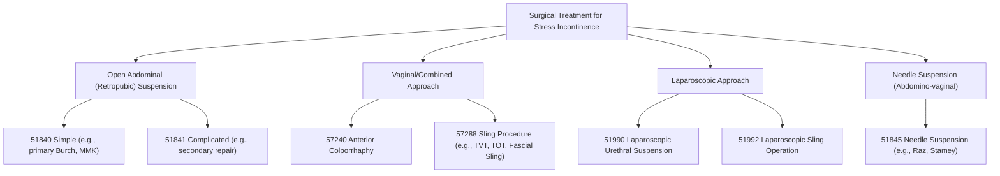

# ⚕️CPT Code 51840: Anterior Vesicourethropexy (Simple)

**CPT [[51840]]** is a CPT code that describes an open surgical procedure to treat **stress urinary incontinence (SUI)** in women. This procedure, known as an anterior [[vesicourethropexy]] or [[urethropexy]], involves suspending the bladder neck and urethra to restore their proper anatomical position. The code specifically refers to the **simple** version of well-known techniques such as the **Marshall-Marchetti-Krantz (MMK)** or **Burch** procedure, performed via an abdominal incision.[1]

## Clinical Description
**Stress urinary incontinence** often results from the weakening or stretching of pelvic ligaments, frequently associated with vaginal wall prolapse or childbirth. The goal of [[51840]] is to provide support to the **urethrovesical junction** (**the connection between the bladder and urethra**).[1]

During the procedure:
1.  **Incision and Exposure**: The surgeon makes a low transverse (**Pfannenstiel**) or midline abdominal incision to access the retropubic space (**space of Retzius**).
2.  **Suspension**: The bladder neck and urethra are identified. Sutures are placed through the [[paravaginal]] fascia on either side of the **urethrovesical junction**.
    - In a **Marshall-Marchetti-Krantz (MMK)** procedure, these sutures are anchored to the [[periosteum]] of the pubic bone or the pubic symphysis cartilage.[2]
    - In a **Burch** procedure, the sutures are anchored to Cooper's ligament (**[[iliopectineal]] ligament**), which provides a more superior and lateral suspension.[1][2]
3.  **Closure**: The sutures are tied to elevate and stabilize the **urethrovesical junction**, correcting the hypermobility that contributes to incontinence. The incision is then closed in layers.

## Key Components and Includes
- **Simple Procedure**: This code is designated for a primary repair with no significant complicating factors.[1]
- **Open Abdominal Approach**: The procedure is performed through an incision in the abdomen, not vaginally or laparoscopically.
- **Bilateral Suspension**: The descriptor implies suspension of both sides of the urethra, which is inherent to the procedure.
- **Named Techniques**: Includes the classic **MMK** and **Burch** [[colposuspension]] techniques.[1][2]

## Excludes and Differentiating Codes
It is critical to differentiate [[51840]] from other incontinence procedures based on approach, complexity, and technique.

- **[[51841]] (Complicated)**: Use this code instead of [[51840]] if the procedure is a secondary repair (**re-operation**), or if the surgeon encounters significant complicating factors such as extensive bleeding, adhesions from prior surgery, aberrant anatomy, or patient obesity that increases the difficulty and time of the surgery.[2][5]
- **[[51845]] (Needle Suspension)**: Reports an abdomino-vaginal needle suspension (**e.g., Raz, Stamey, Pereyra**), which is a different, less common technique.[2][7]
- **[[51990]] (Laparoscopic Urethral Suspension)**: Used for a laparoscopic approach to urethral suspension, which is minimally invasive.[2][5]
- **[[57288]] (Sling Procedure)**: Reports a sling operation (**e.g., using fascia or synthetic mesh like TVT/TOT**), which is a different surgical principle often performed via a combined vaginal/abdominal or minimally invasive approach.[5][7]
- **[[57240]] (Anterior Colporrhaphy)**: Reports a vaginal repair for a cystocele, which may or may not include a urethral suspension.[5]

## Code Tree and Hierarchy
This tree helps visualize where [[51840]] fits within the surgical options for female stress incontinence.

## Modifiers and Billing Nuances
- **[[-50]] (Bilateral Procedure)**: While the suspension is inherently bilateral, modifier [[-50]] is generally not applied as the work is bundled into a single code. Check with specific payers for their guidance.
- **[[-51]] (Multiple Procedures)**: Append this when [[51840]] is performed during the same surgical session as another distinct procedure (e.g., a [[hysterectomy]] or a [[colporrhaphy]]). The multiple procedure payment reduction will apply to the second and subsequent procedures.[5]
- **[[-22]] (Increased Procedural Services)**: Use this modifier if the simple procedure was significantly more difficult than usual, but not quite to the level of a "**complicated**" procedure ([[51841]]). This requires exceptional documentation in the operative note and is subject to payer review.
- **Assistant Surgeon Modifiers**: See section below.

## Assistant Surgeon (Modifier [[-80]]) Payability
The need for an assistant in a simple Burch or MMK is not routine, but may be justified by patient factors (**e.g., morbid obesity**) or concurrent procedures. Payability depends on the Medicare indicator and payer policy.

- **Assistant Modifiers**:
    - **[[-80]] (Assistant Surgeon)**: Used for a physician assistant throughout the procedure.[4]
    - **[[-81]] (Minimum Assistant Surgeon)**: Used for minimal assistance or when an assistant is present for only a portion.[4]
    - **[[-82]] (Assistant Surgeon when Qualified Resident Not Available)**: Used in teaching settings.[4]
    - **[[-AS]] (Non-Physician Assistant)**: Used for a PA, NP, or RNFA assisting in surgery.[4]
- **Reimbursement**: Assistant surgeon reimbursement is typically a percentage of the primary surgeon's fee (e.g., 16-20% for modifiers [[-80]]/[[-82]]/[[-AS]]).[9] Medical necessity must be clearly documented if required by the payer.[4]

## Work RVU (wRVU) and Reimbursement
The Work Relative Value Units (**wRVU**) reflect the physician's work. This value is updated annually by the CMS.

- **2026 Reference**: The exact value for [[51840]] is not listed in the search results. To find the current value, you should consult the most recent **CMS Physician Fee Schedule (PFS) Final Rule** or the AMA RBRVS DataManager.
    - For context, other major surgical procedures in 2026 have **wRVU** values in the range of 7.66 to 23.21.[10] You can look up the specific 2026 wRVU for [[51840]] on the CMS website.
- **Reimbursement Factors**: Final payment is determined by multiplying the total RVUs (**Work, Practice Expense, and Malpractice**) by the Geographic Practice Cost Index (GPCI) for your area and the national conversion factor.

## ICD-10 Crosswalk and HCC Association
The following are common ICD-10-CM diagnoses that support the medical necessity for a procedure like [[51840]]. These codes replace the older ICD-9 codes (**625.6, 618.x, 788.33**) found in legacy coding articles.[2][7]

| ICD-10-CM Code | Description | HCC Applicability (Risk Adjustment) |
| :--- | :--- | :--- |
| [[N39.3]] | **Stress incontinence (female)** (most common) | No (0) |
| [[N39.41]] | Mixed incontinence (urge and stress) | No (0) |
| [[N81.1]] | Cystocele, midline | Varies |
| [[N81.10]] - [[N81.12]] | Cystocele, unspecified, lateral, or with other pelvic prolapse | Varies |
| [[N81.2]] | Incomplete uterovaginal prolapse | Varies |
| [[N81.3]] | Complete uterovaginal prolapse | Varies |
| [[N81.6]] | Rectocele | Varies |
| [[N81.89]] | Other female genital prolapse | Varies |
| [[N81.9]] | Female genital prolapse, unspecified | Varies |

> **Note on HCCs**: Incontinence and prolapse diagnoses are generally not hierarchical condition categories (HCCs) that trigger risk adjustment payments in Medicare Advantage models. They are captured for coding completeness but do not typically affect the risk score.

## Inpatient MS-DRG Assignment
As an open abdominal procedure with a 90-day global period, [[51840]] is typically performed in an inpatient hospital setting. It will map to one of the following Medicare Severity-Diagnosis Related Groups (MS-DRGs), depending on the presence of comorbidities or complications (MCC/CC) and the primary diagnosis.

- **MS-DRG 742**: Uterine and Adnexa Procedures for Non-Malignancy with CC/MCC
- **MS-DRG 743**: Uterine and Adnexa Procedures for Non-Malignancy without CC/MCC
- **MS-DRG 760**: Menstrual and Other Female Reproductive System Disorders
- *Note: If performed with a hysterectomy for prolapse, it will fall under the uterine/adnexa DRGs. If performed in isolation for incontinence, it may fall under DRG 760.*

## Coding Examples and Scenarios
### Example 1: Simple Primary Burch Procedure
**Scenario**: A 52-year-old female with a history of stress urinary incontinence ([[N39.3]]) and no prior surgeries. The surgeon performs an open Burch colposuspension via a Pfannenstiel incision, anchoring sutures to Cooper's ligament bilaterally.
**Coding**:
- [[51840]] (Anterior vesicourethropexy; simple)
- [[N39.3]] (Stress incontinence)

### Example 2: Burch Procedure with Total Abdominal Hysterectomy
**Scenario**: A 48-year-old female with **symptomatic uterine prolapse** ([[N81.3]]) and stress incontinence (N39.3) undergoes a total abdominal hysterectomy. The surgeon also performs a Burch procedure to correct the incontinence.
**Coding**:
- [[58150]] (**Total abdominal hysterectomy**)
- [[51840]] - [[51]] (**Anterior vesicourethropexy; simple, Multiple procedures**)
- [[N81.3]], [[N39.3]] (**Diagnoses**)
- *Rationale: **Modifier -51** indicates multiple procedures were performed during the same session. The hysterectomy is the primary procedure, and the Burch is the secondary.*[5]

### Example 3: Marshall-Marchetti-Krantz Procedure
**Scenario**: A 60-year-old female with stress incontinence undergoes an open MMK procedure. The surgeon suspends the urethra by placing sutures through the vaginal wall and anchoring them to the pubic bone.
**Coding**:
- [[51840]] (Anterior vesicourethropexy; simple)
- *Rationale: The descriptor explicitly includes the MMK procedure.*[1][2]

### Example 4: Incorrect Use of Sling Code
**Scenario**: The surgeon performs a mid-urethral sling procedure (TVT) for stress incontinence using a combined vaginal approach. The coder reports [[51840]].
**Coding**:
- **Correct**: [[57288]] (Sling operation for stress incontinence)
- **Incorrect**: [[51840]]
- *Rationale: [[51840]] is for open abdominal suspensions, not for sling procedures, even if they treat the same condition.*[5][7]

## References
1 Coding Ahead. "CPT® Code 51840."
2 AAPC. "Learn The Secret to Coding Female Urinary Incontinence Surgical Procedures." (2006).
3 Priority Health. "Modifiers 80, 81, 82, assistant at surgery." (2025).
4 DMBA. "Surgery Modifier Payment Table."
5 AAPC. "Confidently Approach SUI Treatment Coding With 4 Pointers." (2010).
6 AAPC. "Unlock Coding Secrets To Female UI Surgical Procedures." (2006).
7 ISASS. "2026 CPT® Code Updates for Spine Surgery." (For wRVU context).