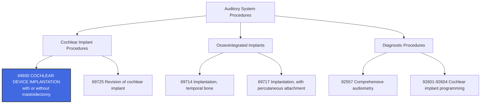

---
tags:
  - cpt
  - ent
  - cochlear-implant
  - auditory
  - hearing-loss
  - neurotology
  - mastoidectomy
  - implant
  - sensorineural
  - pediatric-ent
cpt: 69930
descriptor: Cochlear device implantation, with or without mastoidectomy
category: Surgical Procedures on the Auditory System
specialty:
  - Otolaryngology (ENT)
  - Neurotology
  - Pediatric Otolaryngology
  - Audiology
type: Procedure
approach: Open Surgical
anesthesia: General
global_days: 90
effective_date: 1990-01-01 (approx.)
last_updated: 2026-01-01
parent_category: Operating Microscope Procedures (69990) and Auditory System Procedures
aliases:
  - Cochlear implant surgery
  - Cochlear device placement
  - Inner ear implant
  - Auditory prosthesis implantation
  - Bionic ear implantation
sections:
  - Surgical Procedures on the Auditory System
  - Operating Microscope Procedures
cpt_guidelines: Do not report 69930 in conjunction with 69990 when performed for cochlear implant
work_rvu_2026: Consult CMS MPFS for current value; historically high-complexity procedure
---

# 🧬 CPT Code 69930: Cochlear Device Implantation

## 📋 Code Information

| Field | Value |
| :--- | :--- |
| **CPT Code** | [[69930]] |
| **Descriptor** | Cochlear device implantation, with or without mastoidectomy |
| **Section** | Surgical Procedures on the Auditory System |
| **Approach** | Open surgical (post-auricular incision) |
| **Global Period** | 90 days |
| **Effective Date** | 1990 (approx.) |
| **Last Updated** | 2026-01-01 (no change from 2025) |

## 📖 Clinical Description

**[[69930]]** describes a surgical procedure to implant a cochlear device, an advanced electronic prosthesis designed to restore functional hearing in individuals with severe-to-profound bilateral sensorineural hearing loss. This type of hearing loss results from damage to the inner ear (**cochlea**) or the auditory nerve pathways to the brain. The **cochlear implant** bypasses damaged hair cells in the cochlea and directly stimulates the auditory nerve fibers, enabling the perception of sound.[1]

### Device Components[1]

**The cochlear implant system consists of two main components:**

1.  **Internal Component**: A surgically implanted receiver-stimulator package with an electrode array that is placed within the cochlea.
2.  **External Component**: A wearable speech processor with a microphone that captures sound, converts it to electrical signals, and transmits them to the internal device.

### Procedure Steps[1]

1.  **Incision and Exposure**: The surgeon creates a C-shaped incision above and behind the ear **(post-auricular region**) to access the mastoid bone and the temporal bone.
2.  **Mastoidectomy (if performed)**: Depending on the surgical technique and patient anatomy, a [[mastoidectomy]] may be performed to remove mastoid air cells, providing access to the middle ear and the round window.
3.  **Cochleostomy/Electrode Insertion**: A small opening is made in the cochlea (**either through the round window or a separate [[cochleostomy]]**). The electrode array is carefully inserted into the scala tympani of the cochlea.
4.  **Receiver Placement**: A depression is created in the temporal bone (mastoid or squama) to seat the internal receiver-stimulator package securely.
5.  **Device Securing and Closure**: The device is fixed in place, the wound is irrigated, and the incision is closed in layers.

### Indications

- Bilateral moderate-to-profound sensorineural hearing loss
- Limited benefit from conventional hearing aids
- Appropriate candidacy per FDA criteria (**varies by device and age**)
- Adequate cochlear anatomy for electrode insertion
- Motivated patient/family with realistic expectations for auditory rehabilitation

## 🔍 Includes and Inclusions

- **Cochlear Device Implantation**: Placement of the internal component of a cochlear implant system
- **Mastoidectomy (if performed)**: When required for surgical access, the mastoidectomy is included and not separately billable
- **Electrode Insertion**: Placement of electrode array into the cochlea
- **Receiver-Stimulator Placement**: Securing of the internal device in the temporal bone
- **Unilateral Procedure**: Code describes implantation in one ear (use modifier [[-50]] for bilateral)

## 🚫 Excludes and Differentiating Codes

### Do Not Report [[69930]] With

| Code | Description | Rationale |
| :--- | :--- | :--- |
| [[69990]] | Operating microscope | Microscope use is inherent to cochlear implant surgery; CMS and many payers bundle this |
| [[69501]] | Mastoidectomy | When performed as part of cochlear implant approach, it is bundled |
| [[69631]] | Tympanoplasty | Not typically performed with cochlear implant; separate procedure if indicated |

### Related Auditory System Procedures

| Code | Description |
| :--- | :--- |
| [[69710]] | Implantation or replacement of electromagnetic bone conduction hearing device |
| [[69714]] | Implantation, osseointegrated implant, temporal bone |
| [[69717]] | Implantation, osseointegrated implant, with percutaneous attachment |
| [[69725]] | Revision of cochlear implant |
| [[92601-92604]] | Cochlear implant programming and diagnostic analysis |

### Post-Operative Care and Programming

Initial programming (**stimulation**) and subsequent programming visits are reported with audiology codes [[92601]]-[[92604]] (**diagnostic analysis with programming**) and are not included in the surgical global period.

## 📊 Code Tree and Hierarchy

## 🔄 Modifiers and Billing Nuances

### Applicable Modifiers for [[69930]]

| Modifier | Description | Application |
| :--- | :--- | :--- |
| [[50]] | Bilateral Procedure | Use when simultaneous bilateral cochlear implantation is performed |
| [[51]] | Multiple Procedures | Apply when multiple procedures performed during same session; Medicare applies automatically |
| [[22]] | Increased Procedural Services | Use when work required is substantially greater than typical (e.g., ossified cochlea, congenital anomalies) |
| [[52]] | Reduced Services | Use when service is partially reduced or eliminated |
| [[53]] | Discontinued Procedure | Use if procedure started but discontinued due to extenuating circumstances |
| [[62]] | Two Surgeons | Rare; may apply when otologist and neurotologist work as co-surgeons in complex cases |
| [[78]] | Unplanned Return to OR | Use for related procedure during postoperative period (e.g., post-op hematoma evacuation) |
| [[79]] | Unrelated Procedure | Use for unrelated procedure during postoperative period |
| [[80]] | Assistant Surgeon | Use when a physician provides assistant-at-surgery services throughout the procedure |
| [[81]] | Minimum Assistant Surgeon | Use when assistant is required for minimal portion of procedure |
| [[82]] | Assistant Surgeon (resident not available) | Use in teaching settings when qualified resident unavailable |
| [[AS]] | Non-Physician Assistant | Use for PA, NP, RNFA assisting in surgery |

### Important Modifier Notes

- **Modifier [[22]] Documentation**: When billing for increased complexity, the operative report must clearly document the unusual circumstances (e.g., ossified cochlea requiring drill-out, cochlear malformation, difficult anatomy)
- **Bilateral Implantation**: While not universally covered by all payers, simultaneous bilateral implantation may be reported with modifier [[50]]. Check payer-specific medical policies.

## 👨‍⚕️ Assistant Surgeon (Modifier [[80]]) Payability

### Assistant Surgeon Status for Cochlear Implant

Cochlear implantation is a complex procedure that often requires an assistant surgeon, particularly in teaching settings or when the patient has challenging anatomy. Payability depends on the Medicare indicator assigned to the code.

### Assistant Surgeon Payment Indicators

| Indicator | Meaning | Application to 69930 |
| :--- | :--- | :--- |
| **0** | Payment restriction applies; supporting documentation required | Check MPFSDB for current status |
| **1** | Statutory payment restriction; assistants **not** paid | — |
| **2** | **Payment restriction does NOT apply; assistants may be paid** | Likely applicable to complex surgery like cochlear implant |
| **9** | Concept does not apply | — |

### Assistant Surgeon Modifiers and Usage

| Modifier | Description | Documentation Requirements |
| :--- | :--- | :--- |
| [[80]] | Assistant Surgeon (physician) | Operative note should describe assistant's role and active participation |
| [[81]] | Minimum Assistant Surgeon | Specify portion of procedure where assistance was provided |
| [[82]] | Assistant (resident not available) | Document that qualified resident was unavailable |
| [[AS]] | Non-Physician Assistant (PA, NP, RNFA) | Provider must accept assignment; document role in op note |

### Documentation Tips for Assistant Surgeons

- The operative note should clearly document the assistant surgeon's role and active participation
- Documentation must provide a clinical picture of the patient and support the medical necessity for an assistant
- Include the name of the assistant in the operative report
- For modifier [[82]], the medical record must document that a resident surgeon was not available
- The primary surgeon's signature is sufficient; the assistant is not required to sign

## 💰 Work RVU (wRVU) and Reimbursement

### Work RVU Information

The Work Relative Value Units (wRVU) for [[69930]] are updated annually by CMS. For current values:

- **2026 Reference**: Consult the most recent CMS Physician Fee Schedule (PFS) Final Rule or the AMA RBRVS DataManager
- **Reimbursement Factors**: Final payment determined by:
  - Total RVUs (Work + Practice Expense + Malpractice)
  - Geographic Practice Cost Index (GPCI) for your area
  - National conversion factor

### 2026 Medicare Payment Updates

The CY 2026 MPFS Final Rule includes several changes affecting procedural reimbursement:

| Factor | Value |
| :--- | :--- |
| **Conversion Factor (non-QP)** | $33.4009 |
| **Conversion Factor (QP)** | $33.5675 |
| **Efficiency Adjustment** | -2.5% applied to work RVUs for non-time-based codes |
| **Indirect PE Reduction** | 50% reduction in indirect practice expense for facility settings |

**Important Note**: CMS has finalized a -2.5% productivity/efficiency adjustment applied to work RVUs for approximately 7,700 non-time-based codes, including many surgical procedures. This will affect the 2026 wRVU values for [[69930]] compared to prior years.

### Medicare Administrative Contractor (MAC) Considerations

Reimbursement may vary based on:
- Local Coverage Determinations (LCDs) in your region
- Specific MAC policies regarding medical necessity for cochlear implantation
- Coverage criteria for pediatric vs. adult populations
- Bilateral implantation coverage policies

## 📋 Documentation Requirements

To support billing of [[69930]], the operative report should clearly document:

- **Preoperative Diagnosis**: Severe-to-profound sensorineural hearing loss with specific etiology (if known)
- **Candidacy Documentation**: Confirmation that patient meets FDA criteria for implantation
- **Procedure Performed**: "Cochlear device implantation" with device brand/model specified
- **Surgical Approach**: Whether mastoidectomy was performed (included, not separate)
- **Electrode Insertion**: Method (round window vs. cochleostomy) and depth of insertion
- **Device Testing**: Confirmation of device function (electrode impedance, neural response telemetry)
- **Laterality**: Right, left, or bilateral
- **Findings**: Anatomical variations, ossification, or anomalies encountered
- **Complications**: Any intraoperative issues and their management

### Critical Documentation Elements

| Element | Why It Matters |
| :--- | :--- |
| **Device Information** | Supports medical necessity and device-specific coverage policies |
| **Surgical Complexity** | Justifies modifier [[22]] if applicable |
| **Assistant Surgeon Role** | Supports separate billing for assistant if used |

## 📊 ICD-10 Crosswalk and HCC Information

### Primary ICD-10 Diagnoses for Cochlear Implantation

| ICD-10 Code | Description | HCC Applicability |
| :--- | :--- | :--- |
| [[H90.3]] | Sensorineural hearing loss, bilateral | No (0) |
| [[H90.41]] | Sensorineural hearing loss, unilateral, right ear, with unrestricted hearing on the contralateral side | No (0) |
| [[H90.42]] | Sensorineural hearing loss, unilateral, left ear, with unrestricted hearing on the contralateral side | No (0) |
| [[H91.3]] | Deaf nonspeaking, not elsewhere classified | No (0) |
| [[H91.8]] | Other specified hearing loss | No (0) |
| [[H91.9]] | Hearing loss, unspecified | No (0) |
| [[H90.5]] | Unspecified sensorineural hearing loss | No (0) |
| [[Q16.1]] | Congenital absence, atresia and stricture of auditory canal (congenital malformation) | No (0) |
| [[Q16.4]] | Other congenital malformations of middle ear | No (0) |
| [[Q16.5]] | Congenital malformation of inner ear | No (0) |
| [[Q86.2]] | Congenital malformations due to alcohol | No (0) |
| [[P35.0]] | Congenital rubella syndrome | No (0) |

### Status Codes for Post-Implantation

| ICD-10 Code | Description | HCC Applicability |
| :--- | :--- | :--- |
| [[Z96.21]] | **Cochlear implant status** (for encounters after implantation) | No (0) |

### Code History for [[Z96.21]]

| Year | Effective Date | Change |
| :--- | :--- | :--- |
| 2016 | October 1, 2015 | New code |
| 2017-2026 | October 1, 2016-2025 | No change |

### HCC Note

Hearing loss diagnoses are **not** hierarchical condition categories (HCCs) that affect risk adjustment payments in Medicare Advantage models. They are captured for coding completeness but do not impact risk scores. The cochlear implant procedure code itself is a CPT code and does not contribute to HCC risk adjustment.

## 🏥 MS-DRG Assignment

When performed in an inpatient setting, cochlear implantation maps to the following Medicare Severity-Diagnosis Related Groups (MS-DRGs):

| MS-DRG | Description |
| :--- | :--- |
| **129** | Major head and neck procedures with CC/MCC |
| **130** | Major head and neck procedures without CC/MCC |
| **152** | Otitis media and URI with MCC |
| **153** | Otitis media and URI without MCC |

**Note**: Cochlear implantation may be performed in either inpatient or outpatient settings depending on patient factors, institutional protocols, and payer requirements. Many pediatric cases and complex adult cases are performed inpatient.

### ICD-10-PCS Procedure Codes

For hospital inpatient coding, cochlear implant procedures are reported with ICD-10-PCS codes:

| Approach | ICD-10-PCS Code Range | Description |
| :--- | :--- | :--- |
| Open | [[09HE00Z]] | Insertion of cochlear implant into left inner ear |
| Open | [[09HD00Z]] | Insertion of cochlear implant into right inner ear |
| Various | Section F codes | Cochlear implant assessment and rehabilitation |

## 📝 Coding Examples and Scenarios

### Example 1: Standard Unilateral Cochlear Implantation
**Scenario**: A 65-year-old patient with bilateral severe sensorineural hearing loss (H90.3) who derives minimal benefit from hearing aids undergoes right cochlear implantation. A mastoidectomy is performed for access, and the electrode array is inserted via round window. No unusual complexity.
**Coding**:
- [[69930]] - [[RT]] (Cochlear device implantation, right ear)
- [[H90.3]] (Sensorineural hearing loss, bilateral)

### Example 2: Bilateral Simultaneous Cochlear Implantation
**Scenario**: A 2-year-old child with congenital severe sensorineural hearing loss (H90.3) undergoes simultaneous bilateral cochlear implantation. Surgeon performs the procedure on both ears during the same operative session.
**Coding**:
- [[69930]] - [[50]] (Cochlear device implantation, bilateral)
- [[H90.3]] (Sensorineural hearing loss, bilateral)
- *Note: Check payer policy for bilateral coverage; some payers require medical necessity documentation for simultaneous bilateral implantation.*

### Example 3: Complex Cochlear Implantation with Ossified Cochlea
**Scenario**: A 55-year-old patient with post-meningitic hearing loss undergoes cochlear implantation. The cochlea is partially ossified, requiring drill-out for electrode insertion. The procedure takes significantly longer than usual due to the ossification.
**Coding**:
- [[69930]] - [[22]] (Cochlear device implantation, increased procedural services)
- [[H90.3]] (Sensorineural hearing loss, bilateral)
- *Rationale: Modifier 22 is appropriate when the work required is substantially greater than typical. Documentation must support the increased complexity (ossified cochlea, drill-out procedure).*

### Example 4: Cochlear Implantation with Assistant Surgeon
**Scenario**: A 70-year-old with cochlear malformation undergoes cochlear implantation. Due to complex anatomy and the patient's comorbid conditions, an assistant surgeon is necessary to ensure safe completion of the procedure.
**Coding**:
- Primary Surgeon: [[69930]] (Cochlear device implantation)
- Assistant Surgeon: [[69930]] - [[80]] (Cochlear device implantation, with assistant surgeon)
- *Rationale: If 69930 has an assistant surgeon indicator of 2, payment restrictions do not apply. Documentation should support the medical necessity for an assistant.*

### Example 5: Cochlear Implantation with Operating Microscope - Correct Coding
**Scenario**: Surgeon performs cochlear implantation and uses an operating microscope throughout the procedure. Coder considers adding [[69990]].
**Coding**:
- **Correct**: [[69930]] only
- **Incorrect**: [[69930]] + [[69990]]
- *Rationale: Microscope use is inherent to cochlear implant surgery and is bundled into the procedure code. Do not report 69990 separately.*

### Example 6: Post-Operative Cochlear Implant Programming
**Scenario**: Four weeks after surgery, the patient returns for initial activation and programming of the cochlear implant.
**Coding**:
- [[92601]] (Diagnostic analysis of cochlear implant, with programming)
- [[Z96.21]] (Cochlear implant status)
- *Rationale: Initial and subsequent programming are reported with audiology codes, not surgical codes.*

### Example 7: Revision Cochlear Implantation
**Scenario**: A patient with an existing cochlear implant experiences device failure. The surgeon removes the failed device and implants a new device in the same ear.
**Coding**:
- **Correct**: [[69725]] (Revision of cochlear implant)
- **Incorrect**: [[69930]]
- *Rationale: Revision of an existing cochlear implant has its own specific code (69725) and should not be reported with 69930.*

## ⚠️ Important Coding Notes

### Microscope Use Bundling

**Critical Rule**: Do not report [[69990]] (Operating Microscope) in conjunction with [[69930]]. The use of the operating microscope is considered inherent to cochlear implant surgery and is bundled into the procedure code.

### Device Cost and Reimbursement

Cochlear implant devices are high-cost implants. Reimbursement for the procedure typically does **not** include the cost of the device itself, which is billed separately by the hospital or facility. Surgeons should verify:
- Whether the facility or surgeon purchases and bills for the device
- Any device-specific coverage policies or prior authorization requirements
- National coverage determinations (NCD) for cochlear implantation

### FDA Criteria and Coverage Policies

Coverage for cochlear implantation is typically tied to FDA-approved criteria:
- **Adults**: Moderate-to-profound hearing loss in both ears with limited benefit from hearing aids
- **Children** (12-24 months): Profound sensorineural hearing loss in both ears
- **Children** (2-18 years): Severe-to-profound hearing loss with limited benefit from hearing aids

Documentation should confirm that the patient meets these criteria.

### Global Period and Post-Op Care

With a 90-day global period, the following are included:
- All routine post-operative visits
- Suture removal
- Management of minor complications
- Initial surgical site checks

**Not included** (separately billable):
- Cochlear implant programming ([[92601]]-[[92604]])
- Treatment of unrelated conditions
- Significant complications requiring return to OR

### Bilateral Implantation Considerations

- Not all payers cover simultaneous bilateral implantation
- Some require staged implantation (separate procedures)
- Medical necessity documentation should address why bilateral (simultaneous or staged) is appropriate
- If bilateral, use modifier [[50]] for simultaneous; if staged, report each procedure separately with appropriate laterality modifiers

## 🔗 Related Resources

### Pre-Operative Evaluation Codes
- [[92557]] - Comprehensive audiometry
- [[92567]] - Tympanometry
- [[92550]] - Tympanometry and reflex threshold measurements
- [[92588]] - Comprehensive otoacoustic emissions
- [[92626]] - Evaluation of auditory rehabilitation status

### Post-Operative Programming Codes
- [[92601]] - Diagnostic analysis with programming, younger than 7 years; first 12 months
- [[92602]] - Diagnostic analysis with programming, younger than 7 years; subsequent
- [[92603]] - Diagnostic analysis with programming, age 7 years or older; first 12 months
- [[92604]] - Diagnostic analysis with programming, age 7 years or older; subsequent

### Auditory Rehabilitation Codes
- [[92630]] - Auditory rehabilitation; pre-lingual hearing loss
- [[92633]] - Auditory rehabilitation; post-lingual hearing loss

## References

1 Coding Ahead. "CPT® Code 69930 - Cochlear device implantation, with or without mastoidectomy." (2026)
2 ICD10Data.com. "2026 ICD-10-CM Diagnosis Code Z96.21 - Cochlear implant status." (2026)
3 LUGPA. "CMS Releases 2026 Medicare PFS Final Rule." (November 2025)
4 Anthem. "Reminder: Reimbursement is allowed for Assistant Surgery payment indicator 2." (February 2026)
5 Changchun Municipal Government. "咨询关于人工耳蜗置入手术的病组付费等问题的咨询." (January 2026)
6 ICD10Data.com. "2026 ICD-10-PCS Codes F0B*: Cochlear Implant Treatment." (2026)
7 Ventra Health. "Billing and Coding Tips: Assistant Surgeon." (February 2026)
8 Health Information Associates. "ICD-10-PCS Code Updates - April 1, 2026." (February 2026)
9 ICD10Data.com. "2026 ICD-10-PCS Codes F14Z*: None." (2026)
10 Modifier Mondays. "Assistant Surgeon Modifiers - Part 1." (January 2026)