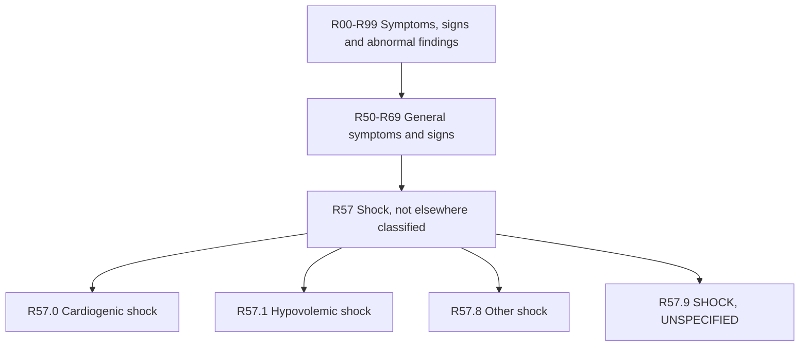

---
tags:
  - icd10
  - shock
  - circulatory-collapse
  - emergency-medicine
  - critical-care
  - hypotension
  - symptoms
  - unspecified
  - r-code
  - general-symptoms
  - ICD-10-CM
ICD-10 Code: R57.9
descriptor: Shock, unspecified
category: Symptoms, signs and abnormal clinical and laboratory findings, not elsewhere classified
specialty:
  - Emergency Medicine
  - Critical Care
  - Internal Medicine
  - Cardiology
  - Hospital Medicine
type: ICD-10-CM
billable: true
status: active
effective_date: 2025-10-01
implementation_date: 2015-10-01
last_updated: 2025-10-01
chapter_range: R00-R99
block_range: R50-R69
parent: R57 - Shock, not elsewhere classified
aliases:
  - Failure of peripheral circulation NOS
  - Circulatory collapse NOS
  - Unspecified shock
  - Shock NOS
icd9_crosswalk: 785.50 - Shock, unspecified
---

# ⚕️ICD-10-CM R57.9: Shock, Unspecified

## 📋 Code Information

| Field | Value |
| :--- | :--- |
| **ICD-10-CM Code** | **[[R57.9]]** |
| **Descriptor** | Shock, unspecified |
| **Billable Status** | ✅ Billable/Specific Code |
| **Effective Date** | October 1, 2025 (2026 edition) |
| **Implementation Date** | October 1, 2015 |
| **Last Updated** | October 1, 2025 (no change from 2025 edition) |
| **Chapter** | Symptoms, signs and abnormal clinical and laboratory findings, not elsewhere classified (R00-R99) |
| **Block** | General symptoms and signs (R50-R69) |
| **Parent Category** | R57 - Shock, not elsewhere classified |

## 📖 Clinical Description

**[[R57.9]]** represents a life-threatening condition characterized by inadequate blood flow (**hypoperfusion**) to organs and tissues, resulting in cellular dysfunction and potential organ failure. The code is used when a specific type of shock cannot be determined at the time of coding or when documentation does not specify the etiology.[1][3]

### Clinical Features
- **Pathophysiology**: Failure of the circulatory system to maintain adequate perfusion of vital organs, leading to inadequate oxygen and nutrient delivery and insufficient removal of cellular waste products[1]
- **Key Manifestation**: Failure of peripheral circulation[1][2]
- **Consequences**: If untreated, can result in multi-organ damage and death

### Common Causes (When Type Unspecified)
- Internal or external bleeding
- Severe dehydration
- Extensive burns
- Severe vomiting and/or diarrhea
- Infections (**when septic shock not yet confirmed**)
- Cardiac events (**when cardiogenic shock not yet confirmed**)[1]

## 🔍 Includes and Inclusions

This code explicitly includes the following:[1][2][4]

| Inclusion Term | Description |
| :--- | :--- |
| **Failure of peripheral circulation NOS** | Inadequate blood flow in the peripheral circulatory system, not otherwise specified |

## 🚫 Excludes (Type 1)

The following **Type 1 Excludes** notes indicate conditions that should never be coded with [[R57.9]]. These are mutually exclusive and have their own specific codes:[1][2][9]

| Code                   | Condition                                                                                        | Notes                                        |
| :--------------------- | :----------------------------------------------------------------------------------------------- | :------------------------------------------- |
| **[[A48.3]]**          | **Toxic shock syndrome**                                                                         | Specific bacterial toxin-mediated shock      |
| **[[F43.0]]**          | **Psychic shock**                                                                                | Acute stress reaction, not hemodynamic shock |
| **O00-O07, [[O08.3]]** | **Shock complicating or following ectopic or molar pregnancy**                                   | Obstetric-specific codes                     |
| **[[O75.1]]**          | **Obstetric shock**                                                                              | Shock during or following labor and delivery |
| **[[R65.21]]**         | **Septic shock**                                                                                 | Severe sepsis with septic shock              |
| **[[T67.1]]**          | **Heat syncope**                                                                                 | Not shock                                    |
| **[[T75.01]]**         | **Shock due to lightning**                                                                       | External cause-related                       |
| **[[T75.4]]**          | **Electric shock**                                                                               | External cause-related                       |
| **T78.0-**             | **Anaphylactic reaction/shock due to adverse food reaction**                                     | Specific anaphylaxis codes                   |
| **[[T78.2]]**          | **Anaphylactic shock NOS**                                                                       | Specific anaphylaxis code                    |
| **[[T79.4]]**          | **Traumatic shock**                                                                              | Shock following injury                       |
| **T80.5-**             | **Anaphylactic shock due to serum**                                                              | Specific anaphylaxis code                    |
| **T81.1-**             | **Postprocedural shock**                                                                         | Shock resulting from a procedure             |
| **[[T88.2]]**          | **Shock due to anesthesia**                                                                      | Specific anesthesia-related code             |
| **[[T88.6]]**          | **Anaphylactic shock due to adverse effect of correct drug or medicament properly administered** | Specific drug-related anaphylaxis            |

## 🔄 Related Codes and Annotations

### Codes with Annotation Back-References to [[R57.9]][1][9]

#### Code First Notes
For [[I21.A1]] (Myocardial infarction type 2), the following instruction applies:
> Code first, if applicable, the underlying cause, such as: ... shock (R57.0-R57.9)[1][9]

#### Type 1 Excludes Notes
The following codes explicitly exclude [[R57.9]]:

| Code          | Description                     | Context                                                 |
| :------------ | :------------------------------ | :------------------------------------------------------ |
| I95           | **Hypotension**                 | Excludes cardiovascular collapse (R57.9)[1]  |
| **[[I95.3]]** | **Hypotension of hemodialysis** | Excludes cardiovascular collapse (R57.9)[10] |
| **[[R55]]**   | **Syncope and collapse**        | Excludes shock NOS (R57.9)[5][6]             |
| [[T79.4]]     | Traumatic shock                 | Excludes shock NOS (R57.9)[1]                |

### Diagnosis Index Entries[1]

The following index entries point to [[R57.9]]:
- **Circulation, failure (peripheral)** → [[R57.9]]
- **Collapse** → [[R55]] (**Syncope and collapse**) - Note this is a different condition

## 📊 Code Tree and Hierarchy

### Sibling Codes (Same Level)[3]

| Code      | Description       |
| :-------- | :---------------- |
| **[[R57.0]]** | Cardiogenic shock |
| **[[R57.1]]** | Hypovolemic shock |
| **[[R57.8]]** | Other shock       |

## 🏥 HCC (Hierarchical Condition Category) Information

### HCC Applicability

| Factor | Value |
| :--- | :--- |
| **HCC Status** | ❌ Not a primary HCC risk adjuster |
| **Risk Adjustment Model** | N/A (symptom code, not disease-specific) |
| **RAF Score Contribution** | 0 (zero) |

### Important Note on HCCs
**[[R57.9]] is a symptom code** from Chapter 18 of ICD-10-CM. In risk adjustment models (HCCs), symptom codes generally do **not** contribute to the risk score. Once a definitive diagnosis for the underlying cause of shock is established, that specific code (**e.g., [[R65.21]] for septic shock, [[I46.9]] for cardiac arrest, T79.4 for traumatic shock**) should be used, and those codes may have HCC implications depending on the specific condition.[1]

## 💰 wRVU and CPT Association

### Note on wRVUs
**[[R57.9]] is an ICD-10-CM diagnosis code**, not a CPT procedure code. As such, it does **not** have an assigned Work Relative Value Unit (wRVU). wRVUs are associated with CPT codes that represent physician work.

### Commonly Associated CPT Codes
When a patient presents with shock, the following CPT codes may be relevant for evaluation and management or procedures:

| CPT Code                | Description                                                                     |
| :---------------------- | :------------------------------------------------------------------------------ |
| **[[99221]]-[[99223]]** | Initial hospital inpatient care (critical care may apply)                       |
| **[[99291]]**           | Critical care, first 30-74 minutes                                              |
| **[[99292]]**           | Critical care, each additional 30 minutes                                       |
| **[[36556]]**           | Insertion of non-tunneled centrally inserted central venous catheter            |
| **[[36620]]**           | Arterial catheterization or cannulation for sampling, monitoring or transfusion |
| **[[93005]]**           | Electrocardiogram, tracing only                                                 |
| **[[82803]]**           | Blood gases, any combination of pH, pCO2, pO2, CO2, HCO3                        |

## 👨‍⚕️ Assistant Surgeon Information

### Note on Assistant Surgeon Payability
The concept of an assistant surgeon applies to **surgical procedures (CPT codes)** , not to diagnosis codes. [[R57.9]] is a diagnosis code and therefore has no assistant surgeon payability indicator.

For patients in shock requiring surgical intervention, the assistant surgeon payability would be determined by the specific **CPT code** for the procedure performed (**e.g., emergency [[laparotomy]], [[vascular]] repair**), not by the diagnosis code.

## 📝 MS-DRG Assignment

When [[R57.9]] is the principal diagnosis for an inpatient admission, it may map to the following Medicare Severity-Diagnosis Related Groups (**MS-DRGs**):[1][3]

| MS-DRG | Description |
| :--- | :--- |
| **291** | Heart failure and shock with MCC |
| **292** | Heart failure and shock with CC |
| **293** | Heart failure and shock without CC/MCC |
| **791** | Prematurity with major problems |
| **793** | Full term neonate with major problems |

### Additional DRG Mappings[3]

For more complex scenarios involving cardiac devices or interventions:

| MS-DRG | Description |
| :--- | :--- |
| **222** | Cardiac defibrillator implant with cardiac cath with AMI/HF/shock with MCC |
| **223** | Cardiac defibrillator implant with cardiac cath with AMI/HF/shock without MCC |
| **224** | Cardiac defibrillator implant with cardiac cath without AMI/HF/shock with MCC |
| **225** | Cardiac defibrillator implant with cardiac cath without AMI/HF/shock without MCC |
| **226** | Cardiac defibrillator implant without cardiac cath with MCC |
| **227** | Cardiac defibrillator implant without cardiac cath without MCC |

*Note: MCC = Major Complication/Comorbidity; CC = Complication/Comorbidity; AMI = Acute Myocardial Infarction; HF = Heart Failure*

## 📋 Documentation Requirements

To support the use of [[R57.9]], clinical documentation should include:[1][2]

- Clinical findings consistent with shock (**hypotension, tachycardia, altered mental status, decreased urine output**)
- Evidence of end-organ hypoperfusion
- Hemodynamic parameters if available
- Reason why a more specific type of shock cannot be assigned
- Treatment initiated and patient response

## 💊 Coding Guidelines

### When to Use [[R57.9]][1][2]

- Patient presents with clinical signs of shock, but the specific type is not yet determined
- Documentation specifies only "**shock**" without further qualification
- Failure of peripheral circulation is documented, but etiology is unknown
- Initial encounter before diagnostic testing confirms the specific type

### When NOT to Use [[R57.9]][1][2]

- **Septic shock confirmed** → Use [[R65.21]] (**Severe sepsis with septic shock**)
- **Traumatic shock** → Use T79.4-
- **Postprocedural shock** → Use T81.1-
- **Obstetric shock** → Use [[O75.1]]
- **Anaphylactic shock** → Use appropriate T78.- or T88.6 codes
- **Cardiogenic shock confirmed** → Use [[R57.0]]
- **Hypovolemic shock confirmed** → Use [[R57.1]]
- **Toxic shock syndrome** → Use [[A48.3]]
- **Electric shock** → Use [[T75.4]]

### ICD-10-CM Chapter Guidelines[1]

Codes in Chapter 18 (R00-R99) are generally used when:
- No more specific diagnosis can be made even after investigation
- Signs/symptoms exist at initial encounter but are transient with unknown cause
- Provisional diagnosis is made but patient fails to return for further care
- Cases referred elsewhere before diagnosis was made
- A more precise diagnosis is not available for any other reason

## 📅 Code History

| Year | Effective Date | Change |
| :--- | :--- | :--- |
| 2016 | October 1, 2015 | New code (first year of non-draft ICD-10-CM) |
| 2017-2025 | October 1, 2016 - 2024 | No change |
| 2026 | October 1, 2025 | No change from 2025 edition[1] |

## 🔗 ICD-9 Crosswalk

For historical reference and conversion purposes, [[R57.9]] maps to the following ICD-9-CM code:[3]

| ICD-9-CM Code | Description | Mapping Type |
| :--- | :--- | :--- |
| **785.50** | Shock, unspecified | Exact/GEM |

## 🧩 Coding Examples and Scenarios

### Example 1: Emergency Department Presentation - Undifferentiated Shock
**Scenario**: A 65-year-old patient is brought to the emergency department with hypotension (BP 70/40), tachycardia, and altered mental status. The etiology is unclear pending labs and imaging. The physician documents "shock, type unspecified, initial encounter."
**Coding**:
- [[R57.9]] (Shock, unspecified)
- *Rationale: At initial presentation before diagnostic testing confirms the specific type, the unspecified code is appropriate.*[1]

### Example 2: Admission for Shock, Later Diagnosed as Septic
**Scenario**: A patient is admitted with hypotension and fever. Initial diagnosis is "shock, unspecified." After blood cultures return positive, the physician updates the diagnosis to septic shock.
**Coding**:
- **Initial coding**: [[R57.9]] (Shock, unspecified)
- **Final coding after confirmation**: [[R65.21]] (Severe sepsis with septic shock)
- *Rationale: The unspecified code is used initially, but once a specific type is confirmed, the definitive code should be assigned.*[1]

### Example 3: Type 2 Myocardial Infarction with Shock
**Scenario**: A patient presents with type 2 myocardial infarction due to gastrointestinal bleeding, resulting in hypovolemic shock. The physician documents "hypovolemic shock secondary to GI bleed, causing type 2 MI."
**Coding**:
- [[R57.1]] (Hypovolemic shock)
- [[K92.2]] (Gastrointestinal hemorrhage, unspecified)
- [[I21.A1]] (Myocardial infarction type 2)
- *Note: According to coding guidelines for [[I21.A1]], the underlying cause (shock and GI bleed) should be coded first, followed by the MI.*[1][9]

### Example 4: Incorrect Use - Syncope vs. Shock
**Scenario**: A patient experiences a brief loss of consciousness after standing up quickly, with rapid return to baseline. The physician documents "syncopal episode."
**Coding**:
- **Correct**: [[R55]] (Syncope and collapse)
- **Incorrect**: [[R57.9]] (Shock, unspecified)
- *Rationale: Syncope is transient loss of consciousness from cerebral hypoperfusion with spontaneous recovery, while shock is a persistent state of circulatory failure requiring intervention. These are mutually exclusive conditions (Type 1 Excludes).*[5][6]

## 🌐 International Versions

Note that [[R57.9]] is the American ICD-10-CM version of this code. Other international versions of ICD-10 may have different coding specifications or inclusion terms.[1]

## References

1 ICD10Data.com. "2026 ICD-10-CM Diagnosis Code R57.9 - Shock, unspecified."
2 AAPC. "ICD-10-CM Code for Shock, unspecified - R57.9."
3 EmedCodes.com. "R57.9 - Shock, unspecified."
4 ICD-10-Code.org. "R57.9 - Shock, unspecified | ICD-10 Code Lookup (2025)."
5 ICD10Data.com. "2026 ICD-10-CM Codes R55*: Syncope and collapse."
6 AAPC. "ICD-10-CM Code for Syncope and collapse - R55."
7 MDS-extranet.de. "DRG-Kodierempfehlungen Nr. 163." (German coding recommendation)
8 FHIR.org. "274729009: Shock, unspecified (disorder)." (SNOMED CT)
9 ICD10Data.com. "Search Page: R57.9."
10 AAPC. "ICD-10-CM Code for Hypotension of hemodialysis - I95.3."