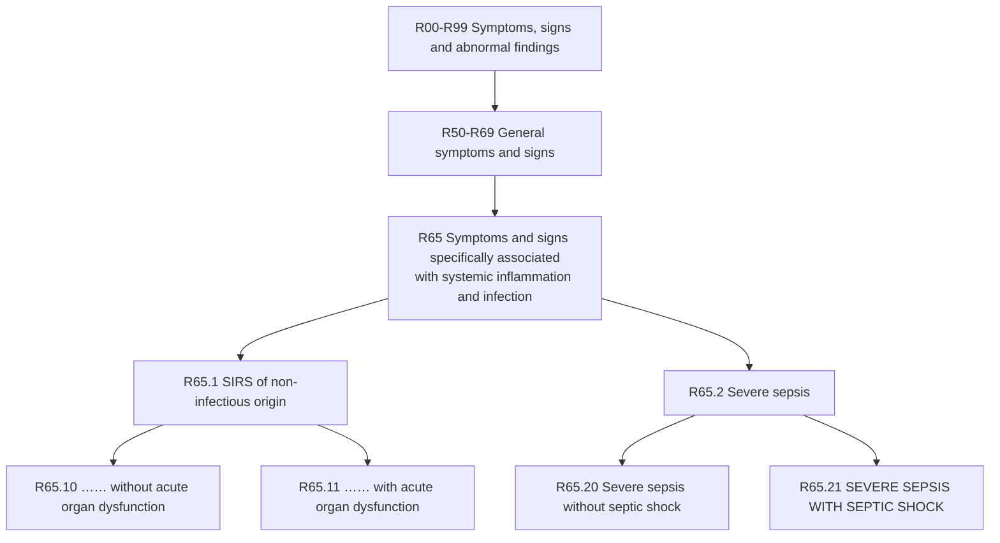

# ⚕️ICD-10-CM R65.21: Severe Sepsis with Septic Shock

## 📋 Code Information

| Field | Value |
| :--- | :--- |
| **ICD-10-CM Code** | **[[R65.21]]** |
| **Descriptor** | Severe sepsis with septic shock |
| **Billable Status** | ✅ Billable/Specific Code |
| **Effective Date** | October 1, 2025 (2026 edition) |
| **Implementation Date** | October 1, 2015 |
| **Last Updated** | October 1, 2025 (no change from 2025 edition) |
| **Chapter** | Symptoms, signs and abnormal clinical and laboratory findings, not elsewhere classified (R00-R99) |
| **Block** | General symptoms and signs (R50-R69) |
| **Parent Category** | R65.2 - Severe sepsis |

## 📖 Clinical Description

**[[R65.21]]** represents the most severe form of sepsis, characterized by the presence of severe sepsis (**infection with associated acute organ dysfunction**) complicated by **septic shock**. Septic shock is defined as persistent hypotension requiring vasopressors to maintain mean arterial pressure ≥65 mmHg and having a serum lactate level >2 mmol/L despite adequate volume resuscitation.[1][2]

### Diagnostic Criteria[1][10]

For accurate assignment of [[R65.21]], the following criteria must be met:

1. **Confirmed Infection**: Documented or clinically suspected infection identified through laboratory tests, imaging studies, or clinical evaluation.

2. **Systemic Inflammatory Response Syndrome (SIRS) Criteria**: At least two of the following:
   - Temperature >38°C (100.4°F) or <36°C (96.8°F)
   - Heart rate >90 beats per minute
   - Respiratory rate >20 breaths/minute or PaCO2 <32 mm Hg
   - WBC >12,000/mm³, <4,000/mm³, or >10% immature (band) forms

3. **Organ Dysfunction**: Evidence of acute organ dysfunction must be present, which can include:
   - [[Altered mental status]] or confusion
   - [[Hypoxemia]] (low oxygen saturation)
   - Elevated serum lactate levels (>2 mmol/L)
   - Acute kidney injury (increased creatinine or decreased urine output)
   - Coagulation abnormalities ([[thrombocytopenia]])
   - Liver dysfunction (**elevated bilirubin**)

4. **Septic Shock**: Presence of **both** of the following:
   - Persistent hypotension requiring vasopressors to maintain MAP ≥65 mmHg
   - Serum lactate >2 mmol/L despite adequate fluid resuscitation

## 🔍 Includes and Inclusions

This code explicitly includes the following:[1][2][3]

| Inclusion Term | Description |
| :--- | :--- |
| **Septic shock** | Shock resulting from severe infection |
| **Septic shock with acute organ dysfunction** | Shock with associated organ failure |
| **Severe sepsis with shock** | Sepsis complicated by both organ dysfunction and shock |

The code also encompasses numerous organism-specific presentations, including:
- Septic shock due to anaerobic septicemia
- Septic shock due to Escherichia coli
- Septic shock due to gram-negative organisms
- Septic shock due to MRSA (methicillin-resistant Staphylococcus aureus)
- Septic shock due to Pseudomonas
- Septic shock due to Streptococcus
- Septic shock due to Staphylococcus[1]

## 🚫 Excludes and Coding Instructions

### Type 1 Excludes[1][2]

The following condition should **never** be coded with [[R65.21]]:

| Code | Condition | Notes |
| :--- | :--- | :--- |
| T81.12- | Postprocedural septic shock | Use for septic shock following a surgical or medical procedure |

### Important Coding Instructions[1][2][9]

#### Code First (Sequencing Requirement)
The underlying infection must be sequenced **first**, followed by [[R65.21]]. Examples include:
- [[A41.9]] - Sepsis, unspecified organism
- T81.44- - Sepsis following a procedure
- [[O85]] - Puerperal sepsis
- [[O03.87]] - Sepsis following complete or unspecified spontaneous abortion
- [[O03.37]] - Sepsis following incomplete spontaneous abortion
- [[O04.87]] - Sepsis following (induced) termination of pregnancy
- [[O08.82]] - Sepsis following ectopic and molar pregnancy
- T80.2- - Infections following infusion, transfusion, and therapeutic injection

#### Use Additional Code
Additional codes must be used to identify the **specific acute organ dysfunction(s)**, such as:
- N17- - Acute kidney failure
- [[J96.0]]- - Acute respiratory failure
- [[G72.81]] - Critical illness myopathy
- [[G62.81]] - Critical illness polyneuropathy
- [[D65]] - Disseminated intravascular coagulopathy [DIC]
- [[G93.41]] - Encephalopathy (metabolic) (septic)
- K72.0- - Hepatic failure

## 📊 Code Tree and Hierarchy

### Sibling Codes[4]

| Code | Description |
| :--- | :--- |
| [[R65.10]] | Systemic inflammatory response syndrome (SIRS) of non-infectious origin without acute organ dysfunction |
| [[R65.11]] | Systemic inflammatory response syndrome (SIRS) of non-infectious origin with acute organ dysfunction |
| [[R65.20]] | Severe sepsis without septic shock |

## 🔄 Annotation Back-References

The following codes contain notes that reference [[R65.21]]:[1][5][10]

| Code | Description | Relationship |
| :--- | :--- | :--- |
| T79.4- | Traumatic shock | **Type 1 Excludes**: traumatic shock excludes septic shock |
| [[R57.0]] | Cardiogenic shock | **Type 2 Excludes**: cardiogenic shock excludes septic shock |
| [[B99.9]] | Unspecified infectious disease | Diagnosis index entry referencing septic shock |

## 🏥 HCC (Hierarchical Condition Category) Information

### HCC Mapping (CMS-HCC Model V28/V24)

| Factor | Value |
| :--- | :--- |
| **HCC Status** | ✅ Maps to HCC payment model |
| **CMS-HCC V24 Category** | HCC 34 (Sepsis and Other Infections) |
| **CMS-HCC V28 Category** | HCC 34 (Sepsis and Other Infections) |
| **RAF Score Contribution** | High - among the most significant risk adjusters |

### Risk Adjustment Significance[6]

**[[R65.21]] is a major risk adjuster** in Medicare Advantage and other value-based reimbursement models. Septic shock represents one of the highest-cost conditions treated in hospital settings, with significant expected healthcare utilization in the following year.

#### Key Risk Adjustment Concepts

- **MEAT Criteria**: Documentation must demonstrate the condition is being **M**onitored, **E**valuated, **A**ssessed/Addressed, or **T**reated during the encounter.
- **Annual Recapture**: While septic shock is an acute condition, patients who survive may have ongoing sequelae requiring documentation each year.
- **RADV Audit Defense**: Documentation must meet MEAT standards to withstand Risk Adjustment Data Validation (RADV) audits.

### V28 Model Considerations

The CMS-HCC model V28 (implemented with phase-in beginning 2024) maintains sepsis-related conditions in high-risk categories. Always verify current RAF coefficients using official CMS V28 mapping files and the most recent Rate Announcement.

## 💰 MS-DRG Assignment[1][3]

When [[R65.21]] is assigned for inpatient admissions, it maps to the following Medicare Severity-Diagnosis Related Groups (MS-DRGs):

| MS-DRG | Description |
| :--- | :--- |
| **870** | Septicemia or severe sepsis with mechanical ventilation >96 hours |
| **871** | Septicemia or severe sepsis without mechanical ventilation >96 hours with MCC |
| **872** | Septicemia or severe sepsis without mechanical ventilation >96 hours without MCC |

*Note: MCC = Major Complication/Comorbidity*

## 👨‍⚕️ Assistant Surgeon Information

### Note on Assistant Surgeon Payability

The concept of an assistant surgeon applies to **surgical procedures (CPT codes)** , not to diagnosis codes. [[R65.21]] is a diagnosis code and therefore has no assistant surgeon payability indicator.

For patients in septic shock requiring surgical intervention (e.g., source control procedures such as abscess drainage, laparotomy, or debridement), the assistant surgeon payability would be determined by the specific **CPT code** for the procedure performed, not by the diagnosis code.

## 💊 wRVU and CPT Association

### Note on wRVUs

**[[R65.21]] is an ICD-10-CM diagnosis code**, not a CPT procedure code. As such, it does **not** have an assigned Work Relative Value Unit (wRVU). wRVUs are associated with CPT codes that represent physician work.

### Commonly Associated CPT Codes

When a patient presents with septic shock, the following CPT codes may be relevant:

| CPT Code | Description |
| :--- | :--- |
| [[99291]] | Critical care, first 30-74 minutes |
| [[99292]] | Critical care, each additional 30 minutes |
| [[36556]] | Insertion of non-tunneled centrally inserted central venous catheter |
| [[36620]] | Arterial catheterization or cannulation for sampling, monitoring or transfusion |
| [[31500]] | Intubation, endotracheal, emergency procedure |
| [[93005]] | Electrocardiogram, tracing only |
| [[82803]] | Blood gases, any combination of pH, pCO2, pO2, CO2, HCO3 |
| [[87040]] | Blood culture, aerobic, with isolation and presumptive identification |
| [[87070]] | Culture, bacterial; any other source except urine, blood or stool |
| [[87075]] | Culture, bacterial; any source, anaerobic with isolation |

## 📋 Documentation Requirements[1][2][9]

To support the use of [[R65.21]], clinical documentation must include:

- **Underlying infection**: Clearly documented source and organism (if known)
- **SIRS criteria**: At least two criteria met and documented
- **Organ dysfunction**: Specific organ affected and clinical evidence of dysfunction
- **Septic shock criteria**: Documentation of:
  - Persistent hypotension requiring vasopressors
  - Serum lactate >2 mmol/L
  - Inadequate response to fluid resuscitation
- **MEAT criteria**: At least one of Monitor, Evaluate, Assess/Address, or Treat documented

## 🔍 ICD-9 Crosswalk[3][7]

| ICD-9-CM Code | Description | Mapping Type |
| :--- | :--- | :--- |
| **785.52** | Septic shock | Approximate/GEM (combination) |
| **995.92** | Severe sepsis | Approximate/GEM (combination) |

**Important**: In ICD-9, two codes were required to capture severe sepsis with septic shock. In ICD-10, a **single code** ([[R65.21]]) represents both conditions.[9]

## 📅 Code History[1][8]

| Year | Effective Date | Change |
| :--- | :--- | :--- |
| 2016 | October 1, 2015 | New code (first year of non-draft ICD-10-CM) |
| 2017-2025 | October 1, 2016 - 2024 | No change |
| 2026 | October 1, 2025 | No change from 2025 edition |

## 🌐 International Versions

Note that [[R65.21]] is the American ICD-10-CM version of this code. Other international versions of ICD-10 may have different coding specifications or inclusion terms.[1]

## 📝 Official Coding Guidelines[1][2][9]

### Section I.C.1.d.1.b: Severe Sepsis with Septic Shock

- **A single code ([[R65.21]]) is used to capture both severe sepsis and septic shock.**
- The code for the **underlying systemic infection** must be sequenced first, followed by [[R65.21]].
- Additional codes for **specific acute organ dysfunctions** are required.
- If the causal organism is not documented, assign code [[A41.9]], Sepsis, unspecified organism, for the infection.

### Sequencing Rules

- If severe sepsis with septic shock is **present on admission** and meets the definition of principal diagnosis, the **underlying systemic infection** should be assigned as principal diagnosis followed by [[R65.21]].
- **[[R65.21]] can never be assigned as a principal diagnosis.**
- When severe sepsis with septic shock **develops during an encounter** (not present on admission), the underlying systemic infection and [[R65.21]] should be assigned as secondary diagnoses.

## 🧩 Coding Examples and Scenarios

### Example 1: Severe Sepsis with Septic Shock Present on Admission
**Scenario**: A 72-year-old patient is admitted with fever, hypotension requiring vasopressors, and acute kidney injury. Labs confirm E. coli bacteremia. Lactate is 4.2 mmol/L. Physician documents "septic shock due to E. coli bacteremia with acute kidney injury."
**Coding**:
- [[A41.50]] (Gram-negative sepsis, unspecified) [underlying infection]
- [[R65.21]] (Severe sepsis with septic shock)
- [[N17.9]] (Acute kidney failure, unspecified) [acute organ dysfunction]
- *Rationale: Underlying infection sequenced first, followed by septic shock code and specific organ dysfunction code.*[1][2][9]

### Example 2: Septic Shock Without Documented Organism
**Scenario**: A 65-year-old patient presents with pneumonia, hypotension requiring vasopressors, and acute respiratory failure. Lactate is 3.8 mmol/L. Blood cultures are pending. Physician documents "severe sepsis with septic shock secondary to pneumonia."
**Coding**:
- [[J15.9]] (Unspecified bacterial pneumonia) [underlying infection]
- [[R65.21]] (Severe sepsis with septic shock)
- [[J96.01]] (Acute respiratory failure with hypoxia) [acute organ dysfunction]
- *Rationale: When organism is unknown, code the localized infection (pneumonia) as the underlying infection.*[1][2]

### Example 3: Postprocedural Septic Shock
**Scenario**: A patient develops septic shock five days following abdominal surgery. Physician documents "postprocedural septic shock."
**Coding**:
- **Correct**: T81.12- (Postprocedural septic shock) with appropriate seventh character
- **Incorrect**: [[R65.21]]
- *Rationale: Postprocedural septic shock is a Type 1 Excludes and has its own specific code.*[1][2]

### Example 4: Septic Shock with Multiple Organ Dysfunction
**Scenario**: Patient with urosepsis presents with septic shock requiring vasopressors, acute respiratory failure requiring intubation, acute kidney injury requiring dialysis, and DIC.
**Coding**:
- [[N39.0]] (Urinary tract infection, site not specified)
- [[R65.21]] (Severe sepsis with septic shock)
- [[J96.01]] (Acute respiratory failure with hypoxia)
- [[N17.9]] (Acute kidney failure, unspecified)
- [[D65]] (Disseminated intravascular coagulopathy [DIC])
- *Rationale: All specific organ dysfunctions are coded separately in addition to the septic shock code.*[1][2]

### Example 5: Incorrect Sequencing
**Scenario**: Patient admitted with septic shock. Coder assigns [[R65.21]] as principal diagnosis.
**Coding**:
- **Incorrect**: [[R65.21]] (Severe sepsis with septic shock) as principal
- **Correct**: Underlying infection code first (e.g., [[A41.9]]), then [[R65.21]]
- *Rationale: Official coding guidelines state that a code from subcategory R65.2 can never be assigned as a principal diagnosis.*[1][2][9]

## References

1 ICD10Data.com. "2026 ICD-10-CM Diagnosis Code R65.21 - Severe sepsis with septic shock."
2 AAPC. "ICD-10 Code for Severe sepsis with septic shock - R65.21."
3 EmedCodes.com. "R65.21 - Severe sepsis with septic shock."
4 ICD10Data.com. "Symptoms and signs specifically associated with systemic inflammation and infection R65-."
5 AAPC. "ICD-10 Code for Cardiogenic shock - R57.0."
6 Health Data Max. "Risk Adjustment Explained: A Practical Guide to HCC, RAS, and Manual Risk Scoring (V28)." (2026)
7 ICD10Data.com. "Convert ICD-10-CM R65.21 to ICD-9-CM."
8 ICD10Data.com. "New ICD-10-CM Codes in 2016." (2015)
9 AAPC. "Watch for Changes in ICD-10 Severe Sepsis Coding : Reader Question." (2014)
10 AAPC. "ICD-10 Code for Traumatic shock - T79.4."