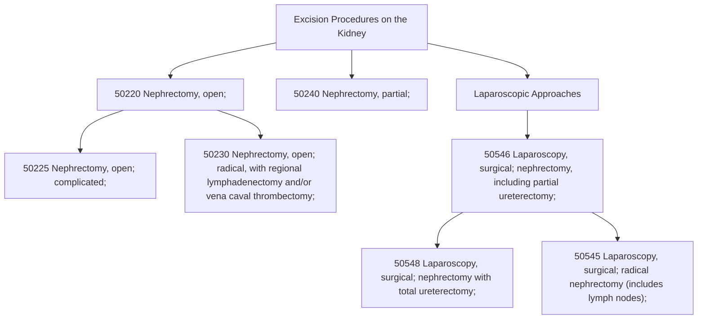

# CPT Code 50230: Radical Nephrectomy with Lymphadenectomy

**CPT [[50230]]** is a CPT code that describes a complex, open surgical procedure for the removal of an entire kidney ([[50230]]), a portion of the ureter, and potentially other structures due to malignant disease. This code is specifically designated for a **radical nephrectomy** performed via an open approach. Its defining characteristic is the inclusion of a **regional lymphadenectomy** (**removal of lymph nodes**) and/or a **vena caval thrombectomy** (**removal of a tumor thrombus from the vena cava**).[1]

## Clinical Description
A radical [[nephrectomy]] is distinct from a simple nephrectomy. It involves the en bloc removal of the entire kidney, the surrounding perinephric fatty tissue ([[Gerota's fascia)]], and the ipsilateral adrenal gland. The descriptor for [[50230]] adds two critical, complex components:[2]

1.  **Regional Lymphadenectomy**: The surgical removal of lymph nodes in the region of the kidney (**hilar, paracaval, or para-aortic**) for staging and therapeutic purposes.
2.  **Vena Caval Thrombectomy**: An extension of the procedure where the surgeon must open the inferior vena cava (**the large vein carrying blood to the heart**) to remove a tumor thrombus that has extended from the renal vein or kidney into the vena cava.

The procedure may also include a partial [[ureterectomy]] and may necessitate a rib resection to gain adequate exposure to the kidney and great vessels.[3]

## Key Components and Includes
- **Nephrectomy**: Complete removal of the affected kidney.
- **Partial Ureterectomy**: Removal of a segment of the [[ureter]] attached to the kidney.
- **Radical Excision**: Removal of the kidney within **Gerota's fascia**, which typically includes the perinephric fat and adrenal gland.
- **Regional Lymphadenectomy**: **This is a bundled component of the code.** You cannot separately bill a standard lymph node dissection when using [[50230]].[4]
- **Vena Caval Thrombectomy**: The work of removing a thrombus from the vena cava is also included in the descriptor and is not separately billable.[2]

## Excludes and Separate Procedures
- **Renal Exploration**: If a nephrectomy is performed, a separate code for renal exploration (e.g., [[50010]]) is not billed, as exploration is inherent to the excision procedure.[5]
- **Standard Lymphadenectomy**: As mentioned, a standard regional lymph node dissection is bundled.
- **Extensive Retroperitoneal Lymph Node Dissection (RPLND)**: If the lymph node dissection is unusually extensive (**e.g., extending from the diaphragm to the aortic bifurcation**) as a heroic effort for cancer control, it may be considered above and beyond the typical work. In these rare cases, you *may* consider reporting an additional code, [[38780]] ([[Retroperitoneal]] transabdominal [[lymphadenectomy]], extensive), with a modifier like [[-59]] or [[-XU]] (**for Medicare**) to indicate it was a distinct, extensive service.[4]
- **Diagnostic Procedures**: This code should not be reported for procedures performed solely for diagnostic purposes that do not result in a [[nephrectomy|Radical nephrectomy]].

## Code Tree and Hierarchy
The excision procedures on the kidney are hierarchical, ranging from partial to radical. This helps in understanding where [[50230]] fits within the spectrum of **nephrectomy** codes.

## Modifiers and Billing Nuances
Accurate coding often requires modifiers to describe special circumstances.[6]

- **[[-22]] (Increased Procedural Services)**: Use this if the procedure required significantly more work than usual (**e.g., extreme adhesions, unusual anatomy**). This requires supporting documentation in the operative note.
- **[[-51]] (Multiple Procedures)**: Append this when [[50230]] is performed during the same surgical session as another distinct procedure (**e.g., a partial nephrectomy on the contralateral kidney**). *Note: For Medicare, you do not append modifier 51, as the carrier will automatically apply it.*[5]
- **[[-59]] or [[-XU]] (Distinct Procedural Service)**: Used to unbundle codes that are typically considered part of the primary procedure. In the context of [[50230]], this is only applicable in the rare instance of reporting an extensive [[38780]] separately.[4]
- **[[-62]] (Two Surgeons)**: Used when two surgeons (**e.g., a urologist and a vascular surgeon**) work together as primary surgeons to perform distinct parts of a complex procedure, such as the **thrombectomy**.[5]
- **Assistant Surgeon Modifiers**:
    - **[[-80]] (Assistant Surgeon)**: Used when a physician provides assistant-at-surgery services throughout the procedure.[7]
    - **[[-81]] (Minimum Assistant Surgeon)**: Used when an assistant is present for only a minimal portion of the procedure.
    - **[[-82]] (Assistant Surgeon when Qualified Resident Not Available)**: Used in teaching settings when a resident is unavailable.

## Assistant Surgeon (Modifier [[-80]]) Payability
The payability of an assistant surgeon depends on the Medicare Physician Fee Schedule Database (**MPFSDB**) indicator for this code. You must verify the current "Asst Surg" indicator.[8]

- **Indicator 0**: Payment restriction applies. Payment for an assistant may be made on a conditional basis. You must submit supporting medical necessity documentation with the claim (e.g., [[-80]] modifier and a report explaining why the assistant was needed).
- **Indicator 1**: Statutory payment restriction. Assistants at surgery will **not** be paid.
- **Indicator 2**: Payment restriction does not apply. Assistants at surgery may be paid.

Given the complexity of [[50230]], it often supports medical necessity for an assistant.

## Work RVU (wRVU) and Reimbursement
The Work Relative Value Units (**wRVU**) reflect the physician's work. This value is updated annually by the CMS. For the most current values, you should consult the most recent CMS Physician Fee Schedule (PFS) Final Rule.

- **2026 Reference**: While the exact value for [[50230]] is not in the search results, similar major procedures have wRVU values in the high range. For context, complex spine fusions range from 7.66 to 11.83 wRVU.[9] You can find the specific 2026 wRVU for [[50230]] by searching the CMS website or using a tool like the "2026 AMA RBRVS DataManager".
- **Reimbursement Factors**: Final payment is determined by multiplying the total RVUs (**Work, Practice Expense, and Malpractice**) by the Geographic Practice Cost Index (GPCI) for your area and the national conversion factor.

## ICD-10 Crosswalk and HCC Association
The following are common ICD-10-CM diagnoses that support the medical necessity for a radical nephrectomy. These codes map to Hierarchical Condition Categories (HCCs) for risk adjustment in Medicare Advantage plans.[10]

| ICD-10-CM Code | Description | HCC Score Applicability |
| :--- | :--- | :--- |
| [[C64]] - [[C64.9]] | Malignant neoplasm of kidney, except renal pelvis | Yes (HCC 10) |
| [[C79.0]] | Secondary malignant neoplasm of kidney and renal pelvis | Yes (HCC 8 or 10) |
| [[D30.0]] | Benign neoplasm of kidney | No (0) |
| [[I87.01]] | Recurrent thrombosis of inferior vena cava | Varies |
| [[N13.2]] | Hydronephrosis with renal and ureteral calculous obstruction | Varies |
| [[N13.722]] | Vesicoureteral-reflux with reflux nephropathy, bilateral | Varies |
| [[S35.416]] | Laceration of unspecified renal vein (for trauma) | No (Trauma) |

>[!note] **Note on HCCs:** 
>A diagnosis of renal cell carcinoma ([[C64]]) is a significant risk adjuster in HCC models, typically mapping to a high-value HCC (**e.g., HCC 10**). The exact score depends on the specific CMS-HCC model version (**v24, v28, etc.**).[10]

## Inpatient MS-DRG Assignment
As a major open procedure, [[50230]] is always performed in an inpatient hospital setting. It will typically map to one of the following Medicare Severity-Diagnosis Related Groups (MS-DRGs), depending on the patient's comorbidities and complications (MCC/CC).

- **MS-DRG 656**: Kidney and Ureter Procedures for Neoplasm with MCC
- **MS-DRG 657**: Kidney and Ureter Procedures for Neoplasm with CC
- **MS-DRG 658**: Kidney and Ureter Procedures for Neoplasm without CC/MCC

## Coding Examples and Scenarios
### Example 1: Standard Radical Nephrectomy
**Scenario**: A patient with a 7cm renal mass suspicious for carcinoma. The surgeon performs an open radical nephrectomy, removing the kidney, surrounding fat, adrenal gland, and hilar lymph nodes.
**Coding**:
- [[50230]] (Radical nephrectomy with regional lymphadenectomy)

### Example 2: Radical Nephrectomy with Complex Caval Thrombectomy
**Scenario**: A patient has renal cell carcinoma with a level II tumor thrombus extending into the infrahepatic vena cava. A urologist and a vascular surgeon work together as co-surgeons. The urologist performs the nephrectomy and lymph node dissection, while the vascular surgeon performs the caval mobilization and thrombectomy.
**Coding**:
- [[50230]] - [[62]] (for the Urologist)
- [[50230]] - [[62]] (for the Vascular Surgeon)
- *Rationale: Modifier 62 indicates that two primary surgeons were required due to the complexity of the case.*[5]

### Example 3: Unsuccessful Partial Nephrectomy Converted to Radical
**Scenario**: A laparoscopic partial nephrectomy is attempted. Upon inspection, the tumor is more extensive than anticipated and located centrally. The surgeon converts to an open approach and performs a radical nephrectomy with lymph node dissection.
**Coding**:
- [[50230]] (Radical nephrectomy)
- [[50240]] - [[52]] (Partial nephrectomy, Reduced Services) *or* **Do not bill** the partial nephrectomy.
- *Rationale: According to guidelines, if the partial was initiated but not completed, you may only bill for the completed radical procedure. Check payer policy for the appropriateness of modifier [[52]].*[5]

### Example 4: Incorrect Coding of Exploration
**Scenario**: The surgeon documents an open radical nephrectomy. The coder considers adding a separate code for "renal exploration."
**Coding**:
- **Correct**: [[50230]]
- **Incorrect**: [[50230]] + [[50010]]
- *Rationale: Renal exploration ([[50010]]) is an integral component of any open nephrectomy and is not separately billable.*[5]

## References
1 Urology Times. "How to code an open radical nephrectomy with retroperitoneal lymph node dissection."
2 GenHealth.ai. "50230 Code Data and Crosswalk."
3 John Snow Labs. "Mapping ICD-10-CM Codes with Corresponding Billable and Hierarchical Condition Category (HCC) Scores."
4 Find-A-Code. "CPT® Code 50240."
5 AAPC. "CPT® Code 50230 - Excision Procedures on the Kidney."
6 MD Clarity. "CPT Code 50230: What It Is, Modifiers, Reimbursement."
7 DEX Diagnostic Exchange. "CPT Modifier 80."
8 AAPC. "Untangle Assistant Surgeon Puzzle."
9 ISASS. "2026 CPT® Code Updates for Spine Surgery." (For wRVU context).
10 CMS-HCC Model Documentation (v24/v28).