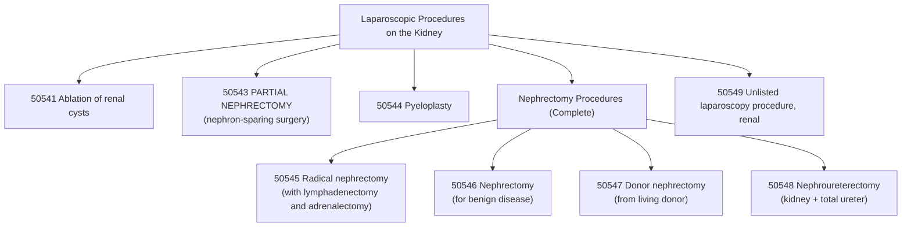

# ⚕️CPT Code 50543: Laparoscopic Partial Nephrectomy

**CPT [[50543]]** is a CPT code that describes **a minimally invasive surgical procedure to remove a portion of the kidney.** This nephron-sparing surgery is typically performed to excise a tumor or diseased tissue while preserving as much healthy kidney parenchyma as possible. The laparoscopic approach **involves small incisions and the use of a camera and specialized instruments**, which generally results in less postoperative pain, shorter hospital stays, and quicker recovery times compared to traditional open surgery.[1][6][7]

## Clinical Description
A **laparoscopic partial nephrectomy** is performed to treat kidney masses, most commonly small renal tumors, by removing only the affected portion while preserving the remaining functional kidney tissue.[6][7]

During the procedure:[6][7]

1.  **Patient Positioning and Preparation**: The patient is positioned appropriately (**often in a lateral decubitus or flank position**) under general anesthesia. The surgical site is prepared with antiseptic solution and draped in a sterile manner.
2.  **Incision and Access**: The surgeon makes 3-4 small incisions below the rib cage to access the abdominal cavity. The abdomen is inflated with carbon dioxide (**pneumoperitoneum**) to create a working space.[6][7]
3.  **Laparoscope Insertion**: A laparoscope (**a thin tube with a camera and light**) is inserted through one incision, providing visualization of the surgical field on video monitors.[6][7]
4.  **Kidney Exposure and Tumor Identification**: The kidney is exposed, and the tumor or diseased portion is identified, often with the assistance of intraoperative ultrasound.
5.  **Vascular Control**: The renal artery (**and sometimes vein**) may be temporarily clamped to reduce blood flow ([[ischemia]]) during tumor excision, minimizing blood loss.
6.  **Tumor Excision**: The tumor is excised with a margin of healthy tissue to ensure complete removal. Specialized laparoscopic instruments are used for precise [[dissection]].[6][7]
7.  **Renal Reconstruction**: The remaining kidney tissue is sutured closed ([[renorrhaphy]]) to control bleeding and repair the defect.
8.  **Specimen Removal**: The excised tumor is placed in a retrieval bag and removed through one of the incisions.
9.  **Closure**: The incisions are closed using sutures or surgical glue.

## Key Components and Includes
- **Partial Nephrectomy**: Removal of only a portion of the kidney (nephron-sparing surgery).[1][6][7]
- **Laparoscopic Approach**: Minimally invasive technique using small incisions and camera guidance.[6][7]
- **Tumor Excision**: Removal of renal mass with preservation of remaining healthy kidney tissue.[6]
- **Renal Reconstruction**: Suturing of the kidney defect ([[renorrhaphy]]) is included in the procedure.
- **Vascular Control**: Temporary clamping of renal vessels (if performed) is included.

## Excludes and Differentiating Codes
It is critical to differentiate [[50543]] from other [[nephrectomy]] codes based on the extent of resection and approach.[1][6]

- **[[50240]] (Open Partial Nephrectomy)**: Use this code for a partial nephrectomy performed via an open incision rather than laparoscopically.[1]
- **[[50545]] (Laparoscopic Radical Nephrectomy)**: Use this code for a laparoscopic radical nephrectomy, which involves removal of the entire kidney, **Gerota's fascia**, perinephric fat, regional lymph nodes, and ipsilateral adrenal gland.[1][6]
- **[[50546]] (Laparoscopic Nephrectomy)**: Use this code for a laparoscopic nephrectomy performed for benign disease (e.g., non-functioning kidney), which removes the entire kidney but does not include radical [[resection]] of surrounding tissues.[1][6]
- **[[50547]] (Laparoscopic Donor Nephrectomy)**: Use this code for removal of a healthy kidney from a living donor for transplantation.[1]
- **[[50548]] (Laparoscopic Nephroureterectomy)**: Use this code when the entire kidney and total [[ureter]] are removed (e.g., for upper tract [[urothelial carcinoma]]).[1][6]
- **[[50541]] (Laparoscopic Ablation of Renal Cysts)**: Use this code for cyst ablation, not partial nephrectomy.
- **[[50544]] (Laparoscopic Pyeloplasty)**: Use this code for repair of ureteropelvic junction obstruction, not nephrectomy.
- **[[52354]] ([[Cystourethroscopy]] with Ureteroscopic [[Pyelotomy]])**: Use this code for endoscopic incision of ureteropelvic junction, not partial nephrectomy.

## Code Tree and Hierarchy
This tree helps visualize where [[50543]] fits within the spectrum of laparoscopic kidney procedures.

## Modifiers and Billing Nuances
Several modifiers may be applicable to [[50543]] depending on the specific circumstances of the procedure.[7]

| Modifier    | Description                                    | Application to 50543                                                                                                                                                                                                            |
| :---------- | :--------------------------------------------- | :------------------------------------------------------------------------------------------------------------------------------------------------------------------------------------------------------------------------------ |
| **[[-22]]** | **Increased Procedural Services**              | Use when the work required is substantially greater than typical (e.g., difficult tumor location, excessive bleeding, significant adhesions). Requires exceptional documentation.[7]                                 |
| **[[-51]]** | **Multiple Procedures**                        | Use when [[50543]] is performed during the same surgical session as another distinct procedure (e.g., contralateral procedure). For Medicare, do not append modifier 51, as the carrier applies it automatically.[7] |
| **[[-52]]** | **Reduced Services**                           | Use when a service or procedure is partially reduced or eliminated at the physician's discretion.[7]                                                                                                                 |
| **[[-53]]** | **Discontinued Procedure**                     | Use if the procedure is started but discontinued due to extenuating circumstances or those that threaten the well-being of the patient.[7]                                                                           |
| **[[-59]]** | **Distinct Procedural Service**                | Use to indicate that a procedure or service was distinct or independent from other services performed on the same day.[7]                                                                                            |
| **[[-62]]** | **Two Surgeons**                               | Use when two surgeons work together as primary surgeons performing distinct parts of a procedure. Both surgeons report [[50543]] with modifier [[62]].[7]                                                            |
| **[[-66]]** | **Surgical Team**                              | Use for highly complex procedures requiring several physicians of different specialties. Rare for this procedure.[7]                                                                                                 |
| **[[-78]]** | **Unplanned Return to OR**                     | Use if the patient needs to return to the operating room for a related procedure during the postoperative period (e.g., to control bleeding).[7]                                                                     |
| **[[-79]]** | **Unrelated Procedure**                        | Use when an unrelated procedure is performed by the same physician during the postoperative period.[7]                                                                                                               |
| **[[-80]]** | **Assistant Surgeon**                          | Use when a physician provides assistant-at-surgery services throughout the procedure.[4][7]                                                                                                                          |
| **[[-81]]** | **Minimum Assistant Surgeon**                  | Use when an assistant surgeon is required on a minimal basis.[7]                                                                                                                                                     |
| **[[-82]]** | **Assistant Surgeon (resident not available)** | Use when an assistant surgeon is necessary because a qualified resident surgeon is not available.[4][7][10]                                                                                                          |

## Assistant Surgeon (Modifier [[-80]]) Payability
The complexity of laparoscopic partial nephrectomy often justifies the use of an assistant surgeon. Payability depends on the Medicare indicator and payer policy.[4][7]

- **Assistant Modifiers**: See table above for correct modifier usage.[4][7]
- **Medicare Payment Indicators**: To determine whether assistant surgeon services are payable for [[50543]], you must check the **Medicare Physician Fee Schedule Database (MPFSDB)** "Asst Surg" indicator:[4]
    - **Indicator 0**: Payment restriction applies. Supporting documentation describing the medical necessity for an assistant must be submitted with the claim.
    - **Indicator 1**: Statutory payment restriction. Assistants at surgery will **not** be paid.
    - **Indicator 2**: Payment restriction does not apply. Assistants at surgery may be paid.
    - **Indicator 9**: Concept does not apply (**the procedure is not a surgery**).
- **Teaching Hospital Requirements**: When the surgery is performed in a teaching hospital, documentation must support one of the following situations for assistant surgeon reimbursement:[4][10]
    - A statement that no qualified resident was available to perform the service
    - A statement indicating that exceptional medical circumstances exist
    - A statement indicating the primary surgeon has an across-the-board policy of never involving residents in the preoperative, operative, or postoperative care of their patients
- **Fellow as Assistant**: Fellows are generally considered residents when practicing within their GME program, so their services as surgical assistants are typically not billable. However, fellows in private (**non-GME-funded**) fellowships may be billable.[10]

## Work RVU (wRVU) and Reimbursement
The Work Relative Value Units (wRVU) reflect the physician's work. This value is updated annually by the CMS.[3]

- **2026 Reference**: The exact value for [[50543]] should be obtained from the most recent **CMS Physician Fee Schedule (PFS)** Final Rule or the AMA RBRVS DataManager. Reimbursement rates can be verified by consulting the MPFS and the relevant **Medicare Administrative Contractor (MAC)** for your region.[3][7][9]
- **Important Note**: The 2026 MPFS finalized an **efficiency adjustment of –2.5%** to work RVUs for nearly all non-time-based services, including surgical procedures like [[50543]]. This means 2026 wRVU values will be lower than 2025 values for the same work.[3]
- **Conversion Factor (CF) for 2026**:[3]
    - Non-APM participants: **$33.40**
    - Qualifying APM participants: **$33.57**
- **Reimbursement Factors**: Final payment is determined by multiplying the total RVUs (**Work, Practice Expense, and Malpractice**) by the Geographic Practice Cost Index (GPCI) for your area and the national conversion factor.[3][7]
- **MAC Authority**: Medicare Administrative Contractors (MACs) have the authority to make **local coverage determinations (LCDs)** that can affect whether and how a particular CPT code is reimbursed. Providers should verify specific reimbursement details with their respective MAC.[7]

## ICD-10 Crosswalk and HCC Association
The following are common ICD-10-CM diagnoses that support the medical necessity for a **laparoscopic partial nephrectomy**. These codes map to Hierarchical Condition Categories (HCCs) for risk adjustment in Medicare Advantage plans.[2][8]

| ICD-10-CM Code           | Description                                                                                           | HCC Applicability (Risk Adjustment) |
| :----------------------- | :---------------------------------------------------------------------------------------------------- | :---------------------------------- |
| [[C64]] - [[C64.9]]      | **Malignant neoplasm of kidney, except renal pelvis** (renal cell carcinoma)                          | **Yes (HCC 10)**                        |
| [[C64.1]]                | Malignant neoplasm of right kidney, except renal pelvis                                               | **Yes (HCC 10)**                        |
| [[C64.2]]                | Malignant neoplasm of left kidney, except renal pelvis                                                | **Yes (HCC 10)**                        |
| [[C64.9]]                | Malignant neoplasm of unspecified kidney, except renal pelvis                                         | **Yes (HCC 10)**                        |
| [[C65]] - [[C65.9]]      | Malignant neoplasm of renal pelvis                                                                    | **Yes (HCC 10)**                        |
| [[D41.0]] - [[D41.02]]   | Neoplasm of uncertain behavior of kidney                                                              | **Varies**                              |
| [[D41.1]] - [[D41.12]]   | Neoplasm of uncertain behavior of renal pelvis                                                        | **Varies**                              |
| [[D30.0]] - [[D30.02]]   | **Benign neoplasm of kidney** (e.g., oncocytoma)                                                      | **No (0)**                              |
| [[D30.1]] - [[D30.12]]   | Benign neoplasm of renal pelvis                                                                       | **No (0)**                              |
| [[D49.51]] - [[D49.519]] | Neoplasm of unspecified behavior of kidney                                                            | **Varies**                              |
| [[N28.1]]                | Cyst of kidney, acquired                                                                              | **No (0)**                              |
| [[Q61.02]]               | Congenital solitary renal cyst                                                                        | **No (0)**                              |
| [[Z85.528]]              | **Personal history of other malignant neoplasm of kidney** (for surveillance after prior nephrectomy) | **No (0)**                              |

> **Note on HCCs**: A diagnosis of renal cell carcinoma ([[C64]]) is a significant risk adjuster in HCC models, typically mapping to a high-value HCC (e.g., HCC 10). The exact score depends on the specific CMS-HCC model version (v24, v28, etc.). Benign neoplasms and personal history codes do not affect the risk score.[2][8]

## Inpatient MS-DRG Assignment
As a major laparoscopic procedure, [[50543]] is typically performed in an inpatient hospital setting. It will map to one of the following Medicare Severity-Diagnosis Related Groups (MS-DRGs), depending on the presence of neoplasm as the diagnosis and the presence of comorbidities or complications (MCC/CC).[5]

- **MS-DRG 656**: Kidney and Ureter Procedures for Neoplasm with MCC
- **MS-DRG 657**: Kidney and Ureter Procedures for Neoplasm with CC
- **MS-DRG 658**: Kidney and Ureter Procedures for Neoplasm without CC/MCC
- **MS-DRG 659**: Kidney and Ureter Procedures for Non-Neoplasm with MCC
- **MS-DRG 660**: Kidney and Ureter Procedures for Non-Neoplasm with CC
- **MS-DRG 661**: Kidney and Ureter Procedures for Non-Neoplasm without CC/MCC

*Note: The appropriate DRG depends on whether the primary diagnosis is a neoplasm (malignant or benign) and the patient's complication status.*[5]

## Coding Examples and Scenarios
### Example 1: Standard Laparoscopic Partial Nephrectomy for Malignancy
**Scenario**: A 58-year-old patient is found to have a 3.5 cm renal mass in the left kidney. The surgeon performs a laparoscopic partial nephrectomy, excising the mass with negative margins and preserving the remaining kidney.
**Coding**:
- [[50543]] (Laparoscopy, surgical; partial nephrectomy)
- [[C64.2]] (Malignant neoplasm of left kidney, except renal pelvis)

### Example 2: Laparoscopic Partial Nephrectomy for Benign Neoplasm
**Scenario**: A 45-year-old patient has a 4 cm solid renal mass. The surgeon performs a laparoscopic partial nephrectomy. Pathology returns as oncocytoma (benign).
**Coding**:
- [[50543]] (Laparoscopy, surgical; partial nephrectomy)
- [[D30.02]] (Benign neoplasm of left kidney)
- *Rationale: The procedure is coded based on the reason for surgery (preoperative diagnosis), even if the final pathology is benign.*

### Example 3: Laparoscopic Partial Nephrectomy with Increased Complexity
**Scenario**: A 62-year-old patient has a 3 cm completely endophytic renal tumor (located deep within the kidney parenchyma). The surgeon performs a laparoscopic partial nephrectomy requiring intraoperative ultrasound for tumor localization, complex renal reconstruction, and prolonged warm ischemia time (45 minutes).
**Coding**:
- [[50543]] - [[-22]] (Increased Procedural Services)
- [[C64.1]] (Malignant neoplasm of right kidney, except renal pelvis)
- *Rationale: Modifier -22 is appropriate when the work required is substantially greater than typically required. Documentation must support the increased complexity (endophytic location, ultrasound guidance, complex reconstruction, prolonged ischemia).*[7]

### Example 4: Laparoscopic Partial Nephrectomy with Co-Surgeons
**Scenario**: A patient has a large, centrally located renal tumor. A urologist and a transplant surgeon work together as co-surgeons. The urologist performs the tumor excision, and the transplant surgeon performs the complex renal reconstruction.
**Coding**:
- [[50543]] - [[-62]] (for the Urologist)
- [[50543]] - [[-62]] (for the Transplant Surgeon)
- *Rationale: Modifier 62 indicates that two primary surgeons were required due to the complexity of the case.*[7]

### Example 5: Laparoscopic Partial Nephrectomy Converted to Open
**Scenario**: During a laparoscopic partial nephrectomy, the surgeon encounters significant bleeding that cannot be controlled laparoscopically. The procedure is converted to an open approach to ensure patient safety.
**Coding**:
- [[50240]] (Nephrectomy, partial)
- [[C64.1]] (Malignant neoplasm of right kidney, except renal pelvis)
- [[Z53.31]] (Laparoscopic surgical procedure converted to open procedure)
- *Rationale: When a laparoscopic procedure is converted to open, you should report the open code only, as the open procedure includes the work of the laparoscopic approach.*

### Example 6: Incorrect Coding - Radical Nephrectomy
**Scenario**: A patient with a 7 cm renal tumor undergoes laparoscopic removal of the entire kidney, Gerota's fascia, and adrenal gland. The coder reports [[50543]].
**Coding**:
- **Correct**: [[50545]] (Laparoscopy, surgical; radical nephrectomy)
- **Incorrect**: [[50543]]
- *Rationale: [[50543]] is for partial nephrectomy (nephron-sparing). Complete removal of the kidney requires a nephrectomy code.*[1][6]

## References
1 NIH/NCBI. "Table 5. CPT Codes for Partial and Radical Nephrectomy Procedures." (2025).
2 Carepatron. "Renal Mass ICD-10-CM Codes." (2023).
3 American Urological Association. "Final Rule: CY 2026 Medicare Physician Fee Schedule Summary." (2025).
4 DEX Diagnostics Exchange. "CPT Modifier 80." (2025).
5 CMS. "ICD-10-CM/PCS MS-DRG v41.0 Definitions Manual." (2024).
6 AAPC. "Puzzle Out Numerous Laparoscopic Nephrectomy Codes." (2022).
7 MD Clarity. "CPT Code 50543: What It Is, Modifiers, Reimbursement."
8 ICD-10 Data. "2026 ICD-10-CM Diagnosis Code Z85.528."
9 TDS Health. "Current Procedure Codes With RVUs." (2026).
10 KZA. "Assistants at Surgery." (2024).