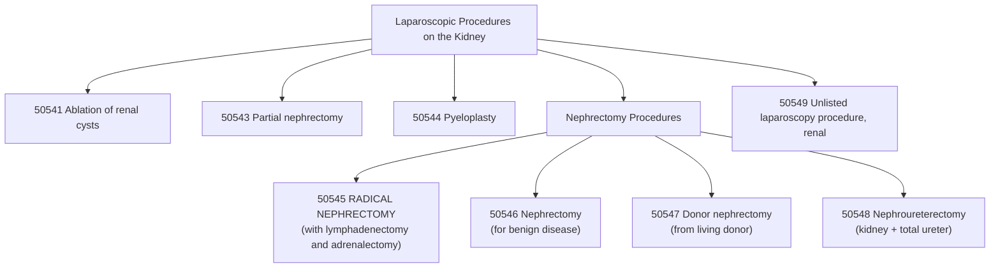

# ⚕️CPT Code 50545: Laparoscopic Radical Nephrectomy with Lymphadenectomy and Adrenalectomy

**CPT [[50545]]** is a CPT code that describes **a minimally invasive laparoscopic procedure for the radical removal of a kidney**. This code is specifically designated for the treatment of renal malignancy and is comprehensive in nature, including not only the removal of the entire kidney but also the surrounding [[perinephric]] tissues (**Gerota's fascia**), the [[ipsilateral]] adrenal gland, and regional lymph nodes.[1][6][9]

## Clinical Description
A **laparoscopic radical nephrectomy** is performed to treat kidney cancer by removing the entire organ along with the tissues most likely to contain microscopic tumor spread. The laparoscopic approach offers significant benefits over traditional open surgery, including **reduced postoperative pain, shorter hospital stays, faster recovery, and smaller incisions**.[1][6]

During the procedure:[6]

1.  **Patient Positioning and Preparation**: The patient is positioned appropriately (**often in a lateral decubitus or modified flank position**) under general anesthesia. The surgical site is prepared with antiseptic solution and draped in a sterile manner.
2.  **Incision and Access**: The surgeon makes 3-4 small incisions below the rib cage to access the abdominal cavity. The abdomen is inflated with carbon dioxide (**pneumoperitoneum**) to create a working space.[1][6]
3.  **Laparoscope Insertion**: A laparoscope (**a thin tube with a camera and light**) is inserted through one incision, providing visualization of the surgical field on video monitors.[1][6]
4.  **Mobilization and Dissection**: The surgeon carefully dissects the kidney and surrounding structures. This includes:
    - Removing the kidney within **Gerota's fascia** (the fibrous connective tissue encasing the kidney and adrenal gland)[6]
    - Performing an **adrenalectomy** (removal of the adrenal gland on the same side)[1][6][9]
    - Completing a **regional lymphadenectomy** (**removal of lymph nodes in the kidney region**)[1][6][9]
    - Disconnecting the [[ureter]] and blood vessels (**renal artery and vein**)
5.  **Specimen Removal**: Once fully mobilized, the kidney and associated tissues are placed in a retrieval bag and removed through a slightly enlarged incision.
6.  **Closure**: The incisions are closed using staples or sutures.[6]

## Key Components and Includes
- **Radical Nephrectomy**: Complete removal of the kidney with curative intent for malignancy.[1][6]
- **Gerota's Fascia Removal**: Excision of the fibrous tissue surrounding the kidney is explicitly included.[6][9]
- **Adrenalectomy**: Removal of the ipsilateral adrenal gland is bundled into this code and not separately billable.[1][6][9]
- **Regional Lymphadenectomy**: Lymph node dissection in the renal hilar region is included.[1][6][9]
- **Minimally Invasive Approach**: The laparoscopic technique is the defining characteristic, offering advantages over open surgery.[1]

## Excludes and Differentiating Codes
It is critical to differentiate [[50545]] from other nephrectomy codes based on the extent of resection and approach.[6][9]

- **[[50543]] (Laparoscopic Partial Nephrectomy)**: Use this code when only a portion of the kidney is removed (nephron-sparing surgery), not the entire organ.[6][9]
- **[[50546]] (Laparoscopic Nephrectomy)**: Use this code for a laparoscopic [[nephrectomy]] performed for benign disease (e.g., non-functioning kidney), which does not include radical resection of surrounding tissues or [[lymphadenectomy]].[9]
- **[[50547]] (Laparoscopic Donor Nephrectomy)**: Use this code for removal of a healthy kidney from a living donor for transplantation.[9]
- **[[50548]] (Laparoscopic Nephroureterectomy)**: Use this code when the entire kidney and total ureter are removed (**e.g., for upper tract urothelial carcinoma**).[9]
- **[[50230]] (Open Radical Nephrectomy)**: Use this code when the radical nephrectomy is performed via an open incision rather than laparoscopically.[9]
- **[[50541]] (Laparoscopic Ablation of Renal Cysts)**: Use this code for cyst ablation, not nephrectomy.[9]
- **[[50544]] (Laparoscopic Pyeloplasty)**: Use this code for repair of **ureteropelvic junction obstruction**, not nephrectomy.[9]
- **[[60650]] (Laparoscopic Adrenalectomy)**: Use this code for isolated [[adrenalectomy]] without nephrectomy. When performed with radical nephrectomy, it is bundled into [[50545]].[9]

## Code Tree and Hierarchy
This tree helps visualize where [[50545]] fits within the spectrum of laparoscopic kidney procedures.

## Modifiers and Billing Nuances
Several modifiers may be applicable to [[50545]] depending on the specific circumstances of the procedure.[1]

| Modifier | Description | Application to 50545 |
| :--- | :--- | :--- |
| [[-22]] | Increased Procedural Services | Use when the work required is substantially greater than typical (e.g., excessive bleeding, significant adhesions, unusual anatomy). Requires exceptional documentation.[1] |
| [[-51]] | Multiple Procedures | Use when [[50545]] is performed during the same surgical session as another distinct procedure (e.g., contralateral partial nephrectomy). For Medicare, do not append modifier 51, as the carrier applies it automatically.[1] |
| [[-52]] | Reduced Services | Use when a service or procedure is partially reduced or eliminated at the physician's discretion.[1] |
| [[-53]] | Discontinued Procedure | Use if the procedure is started but discontinued due to extenuating circumstances or those that threaten the well-being of the patient.[1] |
| [[-59]] | Distinct Procedural Service | Use to indicate that a procedure or service was distinct or independent from other services performed on the same day.[1] |
| [[-62]] | Two Surgeons | Use when two surgeons (e.g., a urologist and a vascular surgeon) work together as primary surgeons to perform distinct parts of the procedure. Both surgeons report [[50545]] with modifier [[62]].[1] |
| [[-66]] | Surgical Team | Use for highly complex procedures requiring several physicians of different specialties. Rare for this procedure.[1] |
| [[-78]] | Unplanned Return to OR | Use if the patient needs to return to the operating room for a related procedure during the postoperative period (e.g., to control bleeding).[1] |
| [[-79]] | Unrelated Procedure | Use when an unrelated procedure is performed by the same physician during the postoperative period.[1] |
| [[-80]] | Assistant Surgeon | Use when a physician provides assistant-at-surgery services throughout the procedure.[1][3] |
| [[-81]] | Minimum Assistant Surgeon | Use when an assistant is required for a minimal portion of the procedure.[1] |
| [[-82]] | Assistant Surgeon (resident not available) | Use when an assistant surgeon is necessary and a qualified resident is not available in a teaching setting.[1][3] |

## Assistant Surgeon (Modifier [[80]]) Payability
The complexity of laparoscopic radical nephrectomy often justifies the use of an assistant surgeon. Payability depends on the Medicare indicator and payer policy.

- **Assistant Modifiers**: See table above for correct modifier usage.[1][3]
- **Medicare Payment Indicators**: To determine whether assistant surgeon services are payable for [[50545]], you must check the **Medicare Physician Fee Schedule Database (MPFSDB)** "Asst Surg" indicator:[3]
    - **Indicator 0**: Payment restriction applies. Supporting documentation describing medical necessity for an assistant must be submitted with the claim.
    - **Indicator 1**: Statutory payment restriction. Assistants at surgery will **not** be paid.
    - **Indicator 2**: Payment restriction does not apply. Assistants at surgery may be paid.
    - **Indicator 9**: Concept does not apply (**the procedure is not a surgery**).
- **Teaching Hospital Requirements**: When the surgery is performed in a teaching hospital, documentation must support one of the following situations for assistant surgeon reimbursement:[3][8]
    - A statement that no qualified resident was available to perform the service
    - A statement indicating that exceptional medical circumstances exist
    - A statement indicating the primary surgeon has an across-the-board policy of never involving residents in the preoperative, operative, or postoperative care of their patients
- **Fellow as Assistant**: Fellows are generally considered residents when practicing within their GME program, so their services as surgical assistants are typically not billable. However, fellows in private (**non-GME-funded**) fellowships may be billable.[8]

## Work RVU (wRVU) and Reimbursement
The Work Relative Value Units (**wRVU**) reflect the physician's work. This value is updated annually by the CMS.

- **2026 Reference**: The exact value for [[50545]] should be obtained from the most recent CMS Physician Fee Schedule (PFS) Final Rule or the AMA RBRVS DataManager. Reimbursement rates can be verified by consulting the MPFS and the relevant **Medicare Administrative Contractor (MAC)** for your region.[1]
- **Reimbursement Factors**: Final payment is determined by multiplying the total RVUs (**Work, Practice Expense, and Malpractice**) by the Geographic Practice Cost Index (GPCI) for your area and the national conversion factor.[1]
- **MAC Authority**: Medicare Administrative Contractors (MACs) have the authority to make **local coverage determinations (LCDs)** that can affect whether and how a particular CPT code is reimbursed. Providers should verify specific reimbursement details with their respective MAC.[1]

## ICD-10 Crosswalk and HCC Association
The following are common ICD-10-CM diagnoses that support the medical necessity for a **laparoscopic radical nephrectomy**. These codes map to Hierarchical Condition Categories (HCCs) for risk adjustment in **Medicare Advantage plans**.[4][9]

| ICD-10-CM Code | Description | HCC Applicability (Risk Adjustment) |
| :--- | :--- | :--- |
| [[C64]] - [[C64.9]] | **Malignant neoplasm of kidney, except renal pelvis** (most common - renal cell carcinoma)[4] | Yes (HCC 10) |
| [[C48.0]] | Malignant neoplasm of retroperitoneum[9] | Yes (HCC 8 or 10) |
| [[C79.0]] | Secondary malignant neoplasm of kidney and renal pelvis | Yes (HCC 8 or 10) |
| [[D20.0]] | Benign neoplasm of soft tissue of retroperitoneum[9] | No (0) |
| [[D48.3]] | Neoplasm of uncertain behavior of retroperitoneum[9] | Varies |
| [[S37.813]] | Laceration of adrenal gland[9] | No (Trauma) |
| [[S31.021]] | Laceration with foreign body of lower back and pelvis with penetration into retroperitoneum[9] | No (Trauma) |
| [[K68.11]] | Postprocedural retroperitoneal abscess[9] | No (0) |
| [[Z53.31]] | Laparoscopic surgical procedure converted to open procedure[9] | No (0) |

> **Note on HCCs**: A diagnosis of renal cell carcinoma ([[C64]]) is a significant risk adjuster in HCC models, typically mapping to a high-value HCC (**e.g., HCC 10**). The exact score depends on the specific CMS-HCC model version (**v24, v28, etc.**).[4]

## Inpatient MS-DRG Assignment
As a major laparoscopic procedure for malignancy, [[50545]] is performed in an inpatient hospital setting. It will map to one of the following **Medicare Severity-Diagnosis Related Groups (MS-DRGs)**, depending on the presence of comorbidities or complications (MCC/CC).[1]

- **MS-DRG 656**: Kidney and Ureter Procedures for Neoplasm with MCC
- **MS-DRG 657**: Kidney and Ureter Procedures for Neoplasm with CC
- **MS-DRG 658**: Kidney and Ureter Procedures for Neoplasm without CC/MCC

## Coding Examples and Scenarios
### Example 1: Standard Laparoscopic Radical Nephrectomy
**Scenario**: A 65-year-old male patient diagnosed with a 7cm r**enal cell carcinoma** ([[C64.9]]). The surgeon performs a laparoscopic radical nephrectomy, removing the kidney, surrounding fatty tissue, **Gerota's fascia**, the ipsilateral adrenal gland, and hilar lymph nodes.
**Coding**:
- [[50545]] (Laparoscopy, surgical; radical nephrectomy)
- [[C64.9]] (Malignant neoplasm of kidney, except renal pelvis, unspecified)

### Example 2: Laparoscopic Radical Nephrectomy with Complex Adhesions
**Scenario**: A 70-year-old patient with [[renal cell carcinoma]] has significant intra-abdominal adhesions from prior abdominal surgery. The surgeon performs a laparoscopic radical nephrectomy, but the procedure requires 40% more time than usual due to the need for extensive [[adhesiolysis]].
**Coding**:
- [[50545]] - [[-22]] (Increased Procedural Services)
- [[C64.9]] (Malignant neoplasm of kidney, except renal pelvis, unspecified)
- *Rationale: Modifier -22 is appropriate when the work required is substantially greater than typically required. Documentation must support the increased complexity and time.*[1]

### Example 3: Laparoscopic Radical Nephrectomy with Co-Surgeons
**Scenario**: A patient has **renal cell carcinoma** with a level I tumor thrombus extending into the renal vein. A urologist and a [[vascular]] surgeon work together as co-surgeons. The urologist performs the nephrectomy and lymph node dissection, while the [[vascular]] surgeon performs the vascular control and thrombectomy.
**Coding**:
- [[50545]] - [[62]] (for the Urologist)
- [[50545]] - [[62]] (for the Vascular Surgeon)
- *Rationale: Modifier -62 indicates that two primary surgeons were required due to the complexity of the case.*[1]

### Example 4: Laparoscopic Converted to Open Radical Nephrectomy
**Scenario**: During a **laparoscopic radical nephrectomy**, the surgeon encounters significant bleeding from the renal hilum that cannot be safely controlled laparoscopically. The procedure is converted to an open approach to ensure patient safety.
**Coding**:
- [[50230]] (Nephrectomy, including partial ureterectomy, any open approach including rib resection; radical, with regional [[lymphadenectomy]] and/or vena caval [[thrombectomy]])
- [[C64.9]] (Malignant neoplasm of kidney, except renal pelvis, unspecified)
- [[Z53.31]] (Laparoscopic surgical procedure converted to open procedure)
- *Rationale: When a laparoscopic procedure is converted to open, you should report the open code only, as the open procedure includes the work of the laparoscopic approach.*[9]

### Example 5: Incorrect Coding - Partial Nephrectomy
**Scenario**: A patient with a 3cm renal mass undergoes laparoscopic removal of only the tumor with preservation of the remaining kidney. The coder reports [[50545]].
**Coding**:
- **Correct**: [[50543]] (Laparoscopy, surgical; partial [[nephrectomy]])
- **Incorrect**: [[50545]]
- *Rationale: [[50545]] is for radical (**complete**) nephrectomy. Partial nephrectomy is coded separately.*[6][9]

## References
1 MD Clarity. "CPT Code 50545: What It Is, Modifiers, Reimbursement."
2 Find-A-Code. "CPT® Code 50545 in section: Laparoscopy, surgical."
3 DEX Diagnostics Exchange. "CPT Modifier 80." (2025).
4 Krebsregister Niedersachsen. "Tumorentität und ICD-10-Code Nachsorgezeitraum." (German Cancer Registry).
5 PubMed. "Self-critical, multicenter analysis of treatment and coding quality using the example of nephroureterectomy." (2025).
6 Coding Ahead. "How To Use CPT Code 50545." (2025).
7 MedLearn Publishing. "Peripheral & Cardiology Coder." (2026).
8 KZA. "Assistants at Surgery." (2024).
9 GenHealth.ai. "50545 - Laparoscopy, surgical; radical nephrectomy."