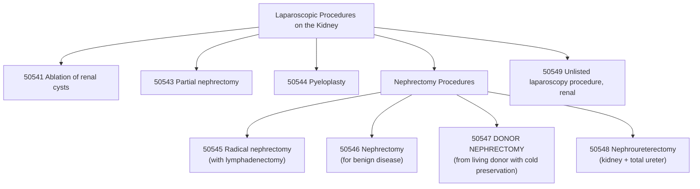

# ⚕️CPT Code 50547: Laparoscopic Donor Nephrectomy

**CPT [[50547]]** is a CPT code that describes **a minimally invasive surgical procedure to remove a healthy kidney from a living donor for the purpose of transplantation**. This laparoscopic approach involves removing the kidney through small incisions, and the code specifically includes the critical step of **cold preservation** to maintain the organ's viability until it can be transplanted into the recipient.[1][10]

## Clinical Description
**Laparoscopic donor** [[nephrectomy]] is a specialized procedure performed on a living individual who is voluntarily donating a kidney. The minimally invasive technique offers significant benefits to the donor, including reduced postoperative pain, shorter hospital stays, faster recovery, and smaller scars compared to traditional open surgery.[1][10]

During the procedure:[1][10]

1.  **Patient Positioning and Preparation**: The donor is positioned supine (**on their side**) under general anesthesia. The surgical site is prepared with antiseptic solutions.
2.  **Incision and Access**: The surgeon makes several small incisions (typically 3-4) below the rib cage. The abdomen is inflated with carbon dioxide (**pneumoperitoneum**) to create a working space for the surgeon to visualize and access the internal organs.[1]
3.  **Laparoscope Insertion**: A laparoscope (**a thin tube equipped with a camera and light**) is inserted through one incision, providing visualization of the surgical field on video monitors.[1]
4.  **Mobilization and Dissection**: The surgeon identifies and incises the lateral line of Toldt to mobilize the **peritoneum** over the kidney. The colon is carefully mobilized to gain access to the kidney, and various ligaments and [[fascia]] are divided to expose the renal hilum, where the renal artery and vein are located.[1] Specialized laparoscopic instruments are inserted through the other incisions to carefully disconnect the ureter and blood vessels (**renal artery and vein**), ensuring the [[vascular]] pedicle is not damaged and the kidney remains viable for transplantation.[1][10]
5.  **Kidney Removal and Preservation**: Once the kidney is fully mobilized and detached from its attachments, it is placed in a sterile preservation bag. The bag is removed through a slightly larger incision (**often a Pfannenstiel incision or an extension of one of the port sites**). Immediately upon removal, the kidney is flushed with a cold preservation solution to slow metabolic processes and reduce the risk of damage before transplantation. This step is included in the code and is not separately billable.[1][10]

## Key Components and Includes
- **Laparoscopic Donor Nephrectomy**: Complete removal of a healthy kidney from a living donor using minimally invasive techniques.[1][10]
- **Cold Preservation**: The work of flushing and preserving the kidney immediately after removal is bundled into this code.[1][10]
- **Living Donor**: The procedure is performed on a living individual, not a cadaveric donor.
- **Minimally Invasive Approach**: The laparoscopic technique is the defining characteristic of this code, distinguishing it from open donor nephrectomy.

## Excludes and Differentiating Codes
It is critical to differentiate [[50547]] from other nephrectomy codes based on the indication for surgery and the approach used.[10]

- **[[50320]] (Open Donor Nephrectomy)**: Use this code for an open surgical approach to remove a kidney from a living donor. This is the open counterpart to [[50547]].
- **[[50546]] (Laparoscopic Nephrectomy)**: Use this code for a laparoscopic nephrectomy performed for disease (**e.g., non-functioning kidney, benign disease**), not for living donation.[10]
- **[[50545 1]] (Laparoscopic Radical Nephrectomy)**: Use this code for a laparoscopic radical nephrectomy performed for malignancy, which includes lymph node [[dissection]].[10]
- **[[50543]] (Laparoscopic Partial [[Nephrectomy]])**: Use this code when only a portion of the kidney is removed (**e.g., for a small tumor**), not the entire organ.[10]
- **[[50548]] (Laparoscopic [[nephroureterectomy]])**: Use this code when the entire kidney and [[ureter]] are removed (e.g., for upper tract [[urothelial carcinoma]]).[10]
- **[[50544]] (Laparoscopic [[Pyeloplasty]])**: Use this code for laparoscopic repair of the **ureteropelvic junction obstruction**, not **nephrectomy**.
- **[[50541]] (Laparoscopic Ablation of Renal Cysts)**: Use this code for laparoscopic ablation of renal cysts, not **nephrectomy**.
- **Preparation and Maintenance of Allograft**: The work of preparing the kidney for transplantation on the recipient side (benchwork) is not included in this code.

## Code Tree and Hierarchy
This tree helps visualize where [[50547]] fits within the spectrum of laparoscopic kidney procedures.

## Modifiers and Billing Nuances
Several modifiers may be applicable to [[50547]] depending on the specific circumstances of the procedure.[5]

| Modifier | Description | Application to 50547 |
| :--- | :--- | :--- |
| [[-22]] | Increased Procedural Services | Use when the work required is substantially greater than typical (e.g., excessive bleeding, significant adhesions, unusual anatomy). Requires exceptional documentation.[5] |
| [[-51]] | Multiple Procedures | Use when [[50547]] is performed during the same surgical session as another distinct procedure. For Medicare, do not append modifier 51, as the carrier applies it automatically.[5] |
| [[-59]] | Distinct Procedural Service | Use to indicate that a procedure or service was distinct or independent from other services performed on the same day. Rarely used with donor nephrectomy.[5] |
| [[-62]] | Two Surgeons | Use when two surgeons (e.g., a urologist and a transplant surgeon) work together as primary surgeons to perform distinct parts of the procedure. Both surgeons report [[50547]] with modifier [[62]].[5] |
| [[-66]] | Surgical Team | Use for highly complex procedures requiring several physicians of different specialties. This is rare for donor nephrectomy but may apply in exceptional circumstances.[5] |
| [[-78]] | Unplanned Return to OR | Use if the patient needs to return to the operating room for a related procedure during the postoperative period (e.g., to control bleeding).[5] |
| [[-80]] | Assistant Surgeon | Use when a physician provides assistant-at-surgery services throughout the procedure.[4][5][9] |
| [[-81]] | Minimum Assistant Surgeon | Use when an assistant is required for a minimal portion of the procedure.[5][9] |
| [[-82]] | Assistant Surgeon (resident not available) | Use when an assistant surgeon is necessary and a qualified resident is not available in a teaching setting.[4][5][9] |
| [[-AS]] | Non-Physician Assistant | Use for a PA, NP, or RNFA assisting in surgery.[9] |

## Assistant Surgeon (Modifier [[80]]) Payability
The complexity of laparoscopic donor **nephrectomy** often justifies the use of an assistant surgeon. Payability depends on the Medicare indicator and payer policy.

- **Assistant Modifiers**: See table above for correct modifier usage.[4][5][9]
- **Medicare Payment Indicators**: To determine whether assistant surgeon services are payable for [[50547]], you must check the M**edicare Physician Fee Schedule Database (MPFSDB)** "Asst Surg" indicator:[4]
    - **Indicator 0**: Payment restriction applies. Supporting documentation describing medical necessity must be submitted with the claim.
    - **Indicator 1**: Statutory payment restriction. Assistants at surgery will **not** be paid.
    - **Indicator 2**: Payment restriction does not apply. Assistants at surgery may be paid.
    - **Indicator 9**: Concept does not apply (**the procedure is not a surgery**).
- **Documentation Requirements**: When an assistant is used, the operative report should clearly document the assistant's role, specific tasks performed, and why their involvement was medically necessary. For teaching hospitals, a statement that no qualified resident was available or that exceptional medical circumstances exist is required.[4]

## Work RVU (wRVU) and Reimbursement
The Work Relative Value Units (**wRVU**) reflect the physician's work. This value is updated annually by the CMS.

- **2026 Reference**: The exact value for [[50547]] should be obtained from the most recent **CMS Physician Fee Schedule (PFS)** Final Rule or the AMA RBRVS DataManager. Reimbursement rates can be verified by consulting the MPFS and the relevant **Medicare Administrative Contractor (MAC)** for your region.[5]
- **Reimbursement Factors**: Final payment is determined by multiplying the total RVUs (Work, Practice Expense, and Malpractice) by the Geographic Practice Cost Index (GPCI) for your area and the national conversion factor.

## ICD-10 Crosswalk and HCC Association
The following are common ICD-10-CM diagnoses associated with living kidney donation.[3]

| ICD-10-CM Code | Description | HCC Applicability (Risk Adjustment) |
| :--- | :--- | :--- |
| [[Z52.4]] | **Kidney donor** (most common) | No (0) |
| [[Z00.5]] | Encounter for examination of potential donor of organ and tissue | No (0) |
| [[Z53.31]] | Laparoscopic surgical procedure converted to open procedure | No (0) |
| [[Z52.89]] | Donor of other specified organs or tissues | No (0) |
| [[Z52.9]] | Donor of unspecified organ or tissue | No (0) |

>[!note] **Note on HCCs:** 
>Donor codes are status codes that indicate a person is a living donor. They are not hierarchical condition categories (**HCCs**) that trigger risk adjustment payments in Medicare Advantage models. They are captured for coding completeness but do not affect the risk score.[3]

## Inpatient MS-DRG Assignment
As a major laparoscopic procedure, [[50547]] is performed in an inpatient hospital setting. It will map to one of the following **Medicare Severity-Diagnosis Related Groups (MS-DRGs)**, depending on the presence of comorbidities or complications (MCC/CC).

- **MS-DRG 652**: Kidney Transplant (for the *recipient's* admission)
- **MS-DRG 673**: Other Kidney and Urinary Tract Procedures with MCC (for the *donor's* admission)
- **MS-DRG 674**: Other Kidney and Urinary Tract Procedures with CC (for the *donor's* admission)
- **MS-DRG 675**: Other Kidney and Urinary Tract Procedures without CC/MCC (for the *donor's* admission)
- *Note: The donor's admission is typically for the nephrectomy procedure, while the recipient's admission is for the transplant. These are separate admissions and billed separately. For donor admissions, MS-DRGs 673-675 apply based on complications/comorbidities.*

## Coding Examples and Scenarios
### Example 1: Standard Laparoscopic Donor Nephrectomy
**Scenario**: A 35-year-old healthy female donates her kidney to her brother. The surgeon performs a laparoscopic donor nephrectomy, removes the kidney through a small incision, and flushes it with cold preservation solution before handing it off to the transplant team.
**Coding**:
- [[50547]] (Laparoscopy, surgical; donor [[nephrectomy]] [including cold preservation], from living donor)
- [[Z52.4]] (Kidney donor)

### Example 2: Laparoscopic Donor Nephrectomy Converted to Open
**Scenario**: During a laparoscopic donor nephrectomy, the surgeon encounters significant bleeding from the renal vein that cannot be controlled laparoscopically. The procedure is converted to an open approach to ensure donor safety.
**Coding**:
- [[50320]] (Donor [[nephrectomy]]; open, from living donor)
- [[Z52.4]] (Kidney donor)
- [[Z53.31]] (Laparoscopic surgical procedure converted to open procedure)
- *Rationale: When a laparoscopic procedure is converted to open, you should report the open code only, as the open procedure includes the work of the laparoscopic approach. Modifier [[-22]] may be considered if the conversion added significant complexity.*

### Example 3: Co-Surgeons
**Scenario**: A urologist and a transplant surgeon work together as co-surgeons to perform a **laparoscopic donor nephrectomy**. The urologist performs the laparoscopic dissection, and the transplant surgeon performs the kidney extraction and cold preservation.
**Coding**:
- [[50547]] - [[62]] (for the Urologist)
- [[50547]] - [[62]] (for the Transplant Surgeon)
- *Rationale: Modifier -62 indicates that two primary surgeons were required due to the complexity of the case and the distinct skills each brought to the procedure.*[5]

### Example 4: Incorrect Coding of Disease-Related Nephrectomy
**Scenario**: A patient with a non-functioning kidney due to chronic obstruction undergoes a laparoscopic nephrectomy. The coder reports [[50547]].
**Coding**:
- **Correct**: [[50546]] (Laparoscopy, surgical; nephrectomy, including partial ureterectomy)
- **Incorrect**: [[50547]]
- *Rationale: [[50547]] is specifically for living donor nephrectomy. A nephrectomy performed for disease should be coded with the appropriate disease-related nephrectomy code.*[10]

## References
1 Coding Ahead. "CPT® Code 50547." (2026).
2 StreamlineMD. "2026 CPT Changes: Interventional, Diagnostic Imaging, Cardiology and Vascular Surgery." (2025).
3 EMedCodes. "ICD-10-CM Code Z52.4 - Kidney donor."
4 DEX Diagnostics Exchange. "CPT Modifier 80." (2025).
5 MD Clarity. "CPT Code 50547: What It Is, Modifiers, Reimbursement."
6 EmblemHealth. "Preauthorization Requirements - Changes Starting Jan. 13, 2026." (2025).
7 Wellpoint. "Professional system updates for 2026." (2026).
8 Deutsche Krankenhaus Gesellschaft. (Unrelated German hospital data - not used).
9 Priority Health. "Modifiers 80, 81, 82, assistant at surgery." (2025).
10 Coding Ahead. "How To Use CPT Code 50547." (2025).