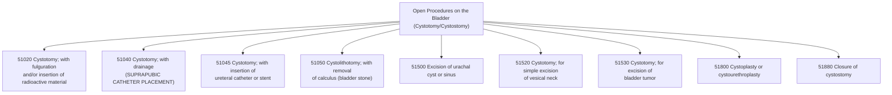

---
tags:
  - CPT
  - Surgery
  - Urology
  - Cystostomy
  - cystomy
  - drainage
  - surgical_incision
cpt: 51040
status: Active ✅
specialty: Urology, General Surgery, Obstetrics/Gynecology (OB/GYN)
surgical_section: Urinary System (Bladder)
procedure_type: Major Surgery (Drainage Procedure)
global_days: 90
approach: Open (Suprapubic)
anesthesia: General or Spinal
description: Cystostomy, cystotomy with drainage
---

# ⚕️CPT Code 51040: Cystostomy or Cystotomy with Drainage

**CPT [[51040]]** is a CPT code that describes an open surgical procedure to create an opening into the urinary bladder (**[[cystostomy]] or [[cystotomy]]**) for the purpose of inserting a drainage [[catheter]]. This procedure is most commonly performed to establish **long-term suprapubic urinary drainage** when [[urethral catheterization]] is not possible, contraindicated, or undesirable.[1][7]

## Clinical Description
A **cystostomy** with drainage involves making a surgical incision into the bladder through the lower abdomen and inserting a drainage tube ([[suprapubic catheter]]) to divert urine flow.[1]

During the procedure:
1.  **Incision and Exposure**: The surgeon makes a small transverse or vertical incision in the lower abdomen, just above the pubic bone.
2.  **Bladder Access**: The underlying muscles are separated, and the bladder is identified. The bladder may be filled with sterile saline to make it more prominent and easier to access.
3.  **Cystotomy**: An incision is made into the bladder ([[cystotomy]]).
4.  **Catheter Insertion and Drainage**: A drainage catheter (e.g., [[Foley catheter]]) is inserted through the incision into the bladder lumen. The [[catheter]] is secured in place with sutures, and the bladder incision is closed tightly around the catheter to prevent leakage.[1]
5.  **External Fixation**: The catheter is brought out through a separate stab incision in the skin and secured externally. The abdominal incision is then closed in layers.

## Key Components and Includes
- **Cystostomy/Cystotomy**: Surgical creation of an opening into the urinary bladder.
- **Drainage**: Placement of an indwelling catheter for ongoing urinary drainage.
- **Primary Indications**:
    - Long-term bladder drainage for neurogenic bladder or urinary retention
    - [[Urethral stricture]] or trauma preventing [[urethral catheterization]]
    - Following certain pelvic surgeries (**e.g., Burch procedure**) to prevent urinary retention[1]
    - When continuous bladder drainage is needed but urethral access is undesirable

## Excludes and Differentiating Codes
- **[[51010]] (Catheter Placement Only)**: Use this code for [[percutaneous]] placement of a [[catheter|suprapubic catheter]] without an open **[[cystotomy]]**. Some payers consider [[catheter]] placement separately billable from the **cystotomy**.[1]
- **[[51020]] (Cystotomy with Fulguration)**: Used when the cystotomy includes fulguration or insertion of radioactive material.[7]
- **[[51045]] (Cystotomy with Ureteral Catheter)**: Used when the procedure includes insertion of a ureteral catheter or stent.[2][7]
- **[[51050]] ([[Cystolithotomy]])**: Used when the procedure includes removal of bladder calculi (stones).[10]
- **[[51705]]/[[51710]] ([[Catheter]] Change)**: Used for subsequent routine or complicated change of an existing [[cystostomy]] tube, not initial placement.[2][7]
- **[[51880]] (Closure of Cystostomy)**: Used when the cystostomy is surgically closed after the catheter is removed.[2][7]
- **Diagnostic Cystoscopy**: This code is for open drainage, not for endoscopic procedures.

## Code Tree and Hierarchy
This tree helps visualize where [[51040]] fits within the spectrum of open bladder procedures.

## Modifiers and Billing Nuances
- **[[51]] (Multiple Procedures)**: Append this when [[51040]] is performed during the same surgical session as another distinct procedure (e.g., [[51050]] for [[stone]] removal, or [[51840]] for a Burch procedure). The multiple procedure payment [[reduction]] will apply.[10]
    - *Note: For Medicare, you do not append modifier 51, as the carrier will automatically apply it.*[10]
- **Bundling Considerations**: Some payers may consider [[51040]] an integral part of other open bladder procedures (e.g., [[51050]] [[cystolithotomy]]). In these cases, separate reimbursement may not be allowed. However, these codes are not formally bundled in the CPT manual, and if the surgeon documents that a **suprapubic** tube was placed and is medically necessary for postoperative drainage, it may be separately billable.[10]
- **[[-22]] (Increased Procedural Services)**: Use this modifier if the procedure was significantly more difficult than usual due to factors like extensive adhesions, obesity, or distorted anatomy.
- **Assistant Surgeon Modifiers**: See section below.

## Assistant Surgeon (Modifier [[80]]) Payability
The need for an assistant in a simple cystostomy is not routine, but may be justified by patient factors (**e.g., morbid obesity**) or when performed concurrently with other major procedures.

- **Assistant Modifiers**:
    - **[[-80]] (Assistant Surgeon)**: Used for a physician assistant throughout the procedure.[5][8]
    - **[[-81]] (Minimum Assistant Surgeon)**: Used for minimal assistance or when an assistant is present for only a portion.[8]
    - **[[-82]] (Assistant Surgeon when Qualified Resident Not Available)**: Used in teaching settings when a qualified resident is unavailable.[8]
    - **[[-AS]] (Non-Physician Assistant)**: Used for a PA, NP, or RNFA assisting in surgery.[8]
- **Medicare Payment Indicators**: To determine whether assistant surgeon services are payable for [[51040]], you must check the **Medicare Physician Fee Schedule Database (MPFSDB)** "Asst Surg" indicator:[5]
    - **Indicator 0**: Payment restriction applies. Supporting documentation describing medical necessity must be submitted with the claim.
    - **Indicator 1**: Statutory payment restriction. Assistants at surgery will **not** be paid.
    - **Indicator 2**: Payment restriction does not apply. Assistants at surgery may be paid.
- **Documentation Requirements**: When an assistant is used, the operative report should clearly document the assistant's role, specific tasks performed, and why their involvement was medically necessary.[8]

## Work RVU (wRVU) and Reimbursement
The Work Relative Value Units (**wRVU**) reflect the physician's work. This value is updated annually by the CMS.

- **2026 Reference**: The exact value for [[51040]] is not listed in the search results. To find the current value, you should consult the most recent **CMS Physician Fee Schedule (PFS)** Final Rule or the AMA RBRVS DataManager.
    - **Important Note**: The 2026 MPFS implemented a 2.5% "efficiency adjustment" that reduces work RVUs for nearly all non-time-based procedural codes, including surgical procedures like [[51040]]. This means 2026 wRVU values will be lower than 2025 values for the same work.[4]
- **Reimbursement Factors**: Final payment is determined by multiplying the total RVUs (**Work, Practice Expense, and Malpractice**) by the Geographic Practice Cost Index (GPCI) for your area and the national conversion factor.

## ICD-10 Crosswalk and HCC Association
The following are common ICD-10-CM diagnoses that support the medical necessity for a cystostomy with drainage.[7]

| ICD-10-CM Code | Description | HCC Applicability (Risk Adjustment) |
| :--- | :--- | :--- |
| [[Z43.5]] | **Encounter for attention to cystostomy** (for subsequent encounters) | No (0) |
| [[Z93.5]] | **Cystostomy status** (for long-term dependence) | No (0) |
| [[N99.511]] | Cystostomy infection | No (0) |
| [[N99.518]] | Other cystostomy complication | No (0) |
| [[T83.010]] | Breakdown (mechanical) of cystostomy catheter | No (0) |
| [[T83.020]] | Displacement of cystostomy catheter | No (0) |
| [[T83.030]] | Leakage of cystostomy catheter | No (0) |
| [[N31.9]] | Neuromuscular dysfunction of bladder, unspecified | No (0) |
| [[N32.0]] | Bladder neck obstruction | Varies |
| [[N35.9]] | Urethral stricture, unspecified | No (0) |
| [[R33.8]] | Other retention of urine (chronic urinary retention) | No (0) |

> **Note on HCCs**: The primary diagnoses associated with [[cystostomy]] placement or management (**obstruction, retention, status codes, complications**) are generally not hierarchical condition categories (**HCCs**) that trigger risk adjustment payments in Medicare Advantage models. They are captured for coding completeness but do not typically affect the risk score.

## Inpatient MS-DRG Assignment
As an open surgical procedure, [[51040]] may be performed in either inpatient or outpatient settings depending on the patient's condition and concurrent procedures. When performed inpatient, it will map to one of the following **Medicare Severity-Diagnosis Related Groups (MS-DRGs)**:

- **MS-DRG 673**: Other Kidney and Urinary Tract Procedures with MCC
- **MS-DRG 674**: Other Kidney and Urinary Tract Procedures with CC
- **MS-DRG 675**: Other Kidney and Urinary Tract Procedures without CC/MCC

## Coding Examples and Scenarios
### Example 1: Primary Suprapubic Catheter Placement
**Scenario**: A 65-year-old male with a traumatic urethral injury and acute urinary retention. The urologist performs an open cystostomy and places a suprapubic catheter for long-term drainage.
**Coding**:
- [[51040]] (Cystostomy, [[cystotomy]] with drainage)
- [[S37.32xA]] (Contusion of urethra, initial encounter) or other injury code

### Example 2: Cystostomy with Stone Removal
**Scenario**: A patient with a large bladder calculus and history of [[urethral stricture]]. The surgeon performs a [[cystolithotomy]] to remove the stone and places a suprapubic catheter for postoperative drainage.
**Coding**:
- [[51050]] (Cystolithotomy, cystostomy with removal of [[calculus]])
- [[51040]] - [[51]] (Cystostomy with drainage, Multiple procedures)
- *Rationale: Both procedures are performed. Check payer policy as some may bundle [[51040]] into [[51050]].*[10]
- Diagnosis: [[N21.0]] (Calculus in bladder)

### Example 3: Cystostomy During Burch Procedure
**Scenario**: During an open Burch procedure for stress incontinence, the surgeon performs a cystotomy to inspect the bladder for misplaced sutures and then places a [[suprapubic catheter]] to prevent postoperative urinary retention.
**Coding**:
- [[51840]] (Anterior vesicourethropexy; simple)
- [[51040]] - [[51]] (Cystostomy with drainage, Multiple procedures)
- *Rationale: The catheter placement is separately billable, though some payers may consider the cystotomy for suture inspection part of the primary procedure.*[1]

### Example 4: Complicated Cystostomy Tube Change
**Scenario**: A patient with an existing cystostomy presents with a displaced tube. The physician must perform a complicated revision with guidewire and fluoroscopic guidance.
**Coding**:
- [[51710]] (Change of cystostomy tube; complicated)
- *Rationale: This is not a new placement (**51040**) but a change of an existing tube.*[2][7]

### Example 5: Incorrect Use of Diagnostic Code
**Scenario**: The surgeon performs a cystoscopy with suprapubic catheter placement. The coder reports [[51040]].
**Coding**:
- **Correct**: [[52000]] (**Cystoscopy**) + [[51010]] (Suprapubic catheter placement)
- **Incorrect**: [[51040]]
- *Rationale: [[51040]] is for open cystotomy, not endoscopic placement.*[1][7]

## References
1 MDEdge/OBG Management. "Suprapubic catheter insertion." (2002).
2 GenHealth.ai. "Z93.5 - Cystostomy status."
3 Find-A-Code. (Unrelated gallbladder code - not used).
4 PYA, P.C. "2026 wRVU Changes are Here: What Organizations Need to Know." (2026).
5 DEX Diagnostics Exchange. "CPT Modifier 80." (2025).
6 CCSD. (Unrelated UK codes - not used).
7 GenHealth.ai. "51040 - Cystostomy, cystotomy with drainage."
8 UTHealth Houston. "Assistant-at-Surgery - Medical School Healthcare Billing Compliance." (2025).
9 AAPC. "You Be the Coder: Bladder Repair With Milk Infusion." (2022).
10 AAPC. "You Be the Coder: Multiple Procedures via a Cystostomy." (2006).