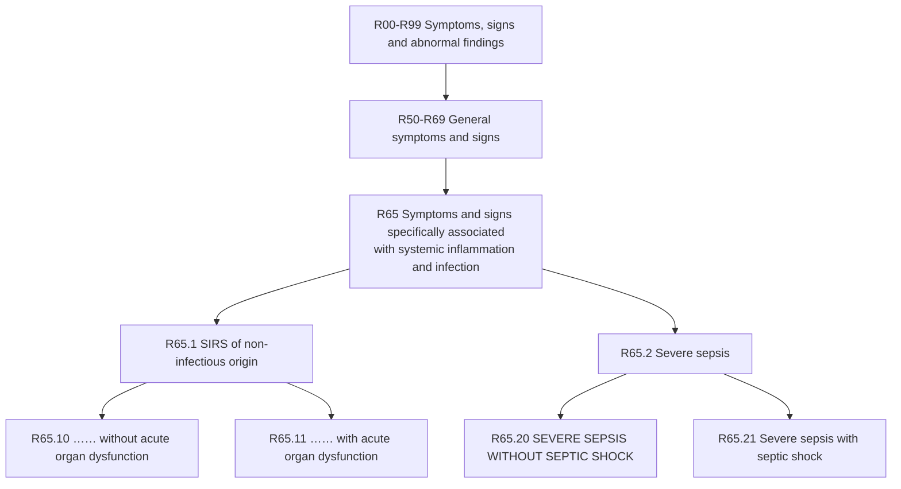

---
tags:
  - icd10
  - sepsis
  - severe-sepsis
  - organ-dysfunction
  - critical-care
  - infection
  - sirs
  - infectious-disease
  - hcc
  - risk-adjustment
icd10_code: R65.20
descriptor: Severe sepsis without septic shock
category: Symptoms, signs and abnormal clinical and laboratory findings, not elsewhere classified
specialty:
  - Infectious Disease
  - Critical Care
  - Internal Medicine
  - Emergency Medicine
  - Hospital Medicine
type: ICD-10-CM
billable: true
status: active
effective_date: 2025-10-01
implementation_date: 2015-10-01
last_updated: 2025-10-01
chapter_range: R00-R99
block_range: R50-R69
parent: R65.2 - Severe sepsis
aliases:
  - Severe sepsis NOS
  - Sepsis with acute organ dysfunction
  - Infection with associated acute organ dysfunction
  - Systemic inflammatory response syndrome due to infectious process with acute organ dysfunction
icd9_crosswalk: 995.92 - Severe sepsis (approximate)
---

# ⚕️ICD-10-CM R65.20: Severe Sepsis without Septic Shock

## 📋 Code Information

| Field | Value |
| :--- | :--- |
| **ICD-10-CM Code** | **[[R65.20]]** |
| **Descriptor** | Severe sepsis without septic shock |
| **Billable Status** | ✅ Billable/Specific Code |
| **Effective Date** | October 1, 2025 (2026 edition) |
| **Implementation Date** | October 1, 2015 |
| **Last Updated** | October 1, 2025 (no change from 2025 edition) |
| **Chapter** | Symptoms, signs and abnormal clinical and laboratory findings, not elsewhere classified (R00-R99) |
| **Block** | General symptoms and signs (R50-R69) |
| **Parent Category** | R65.2- - Severe sepsis |

## 📖 Clinical Description

**[[R65.20]]** represents a diagnosis of **severe sepsis** where the patient has sepsis (**infection with systemic inflammatory response syndrome**) accompanied by acute organ dysfunction, but has **not** developed septic shock. **Septic shock** is characterized by persistent hypotension requiring vasopressors to maintain mean arterial pressure and elevated lactate levels despite adequate fluid resuscitation.[10]

### Diagnostic Criteria[10]

For accurate assignment of [[R65.20]], the following four criteria must be met:

1. **Confirmed Infection**: Documented or clinically suspected infection identified through laboratory tests, imaging studies, or clinical evaluation.

2. **Systemic Inflammatory Response Syndrome (SIRS) Criteria**: At least two of the following:
   - Temperature >38°C (100.4°F) or <36°C (96.8°F)
   - Heart rate >90 beats per minute
   - Respiratory rate >20 breaths/minute or PaCO2 <32 mm Hg
   - WBC >12,000/mm³, <4,000/mm³, or >10% immature (band) forms

3. **Organ Dysfunction**: Evidence must be present, which can include:
   - Altered mental status or confusion
   - [[Hypoxemia]] (**low oxygen saturation**)
   - Elevated serum lactate levels
   - Acute kidney injury (**increased creatinine or decreased urine output**)
   - Coagulation abnormalities ([[thrombocytopenia]])
   - Liver dysfunction (**elevated bilirubin**)

4. **Absence of Septic Shock**: No persistent hypotension requiring vasopressors or elevated lactate >2 mmol/L despite fluid resuscitation.

## 🔍 Includes and Inclusions

This code explicitly includes the following:[1][3][4][5]

| Inclusion Term | Description |
| :--- | :--- |
| **Severe sepsis NOS** | Severe sepsis, not otherwise specified |
| **Infection with associated acute organ dysfunction** | Any infection accompanied by acute organ dysfunction |
| **Sepsis with acute organ dysfunction** | Sepsis with documented organ failure |
| **Sepsis with multiple organ dysfunction** | Sepsis affecting two or more organ systems |

## 🚫 Excludes and Coding Instructions

### Type 1 Excludes[1][8]

| Code | Condition | Notes |
| :--- | :--- | :--- |
| T81.12- | Postprocedural septic shock | Use for septic shock following a procedure |

### Important Coding Instructions[4][7]

#### Code First
The underlying infection must be sequenced **first**, followed by [[R65.20]]. Examples include:
- [[A41.9]] - Sepsis, unspecified organism
- T81.44- - Sepsis following a procedure
- [[O85]] - Puerperal sepsis
- [[O03.87]] - Sepsis following complete or unspecified spontaneous abortion
- [[O08.82]] - Sepsis following ectopic and molar pregnancy

#### Use Additional Code
Additional codes must be used to identify the **specific acute organ dysfunction**, such as:
- N17- - Acute kidney failure
- [[J96.0]]- - Acute respiratory failure
- [[G72.81]] - Critical illness myopathy
- [[G62.81]] - Critical illness polyneuropathy
- [[D65]] - Disseminated intravascular coagulopathy [DIC]
- [[G93.41]] - Encephalopathy (metabolic) (septic)
- [[K72.0]]- - Hepatic failure

## 📊 Code Tree and Hierarchy

### Adjacent Codes[1][3]

| Code | Description |
| :--- | :--- |
| [[R65.10]] | Systemic inflammatory response syndrome (SIRS) of non-infectious origin without acute organ dysfunction |
| [[R65.11]] | Systemic inflammatory response syndrome (SIRS) of non-infectious origin with acute organ dysfunction |
| [[R65.20]] | **Severe sepsis without septic shock** |
| [[R65.21]] | Severe sepsis with septic shock |

## 📝 Official Coding Guidelines[7]

### Section I.C.1.d.1: Coding of Sepsis and Severe Sepsis

**Sepsis**: For a diagnosis of [[sepsis]], assign the appropriate code for the underlying systemic infection. If the type of infection or causal organism is not further specified, assign code [[A41.9]], **Sepsis**, unspecified organism.

**A code from subcategory R65.2-, Severe sepsis, should not be assigned unless severe sepsis or an associated acute organ dysfunction is documented.**

### Section I.C.1.d.1.b: Severe Sepsis

The coding of severe sepsis requires a **minimum of 2 codes**:
1. First, a code for the **underlying systemic infection**
2. Followed by a code from subcategory R65.2-, Severe sepsis
3. Additional code(s) for the **associated acute organ dysfunction** are also required

If the causal organism is not documented, assign code [[A41.9]], Sepsis, unspecified organism, for the infection.

### Section I.C.1.d.3: Sequencing of Severe Sepsis

- If severe sepsis is **present on admission** and meets the definition of principal diagnosis, the **underlying systemic infection** should be assigned as principal diagnosis followed by the appropriate code from subcategory R65.2.
- **A code from subcategory R65.2 can never be assigned as a principal diagnosis.**
- When severe sepsis **develops during an encounter** (not present on admission), the underlying systemic infection and the appropriate code from subcategory R65.2 should be assigned as secondary diagnoses.

## 🏥 HCC (Hierarchical Condition Category) Information

### HCC Mapping (CMS-HCC Model V28/V24)

| Factor | Value |
| :--- | :--- |
| **HCC Status** | ✅ Maps to HCC payment model |
| **CMS-HCC V24 Category** | HCC 34 (Sepsis and Other Infections) |
| **CMS-HCC V28 Category** | HCC 34 (Sepsis and Other Infections) |
| **RAF Score Contribution** | Varies based on model year and coefficients |

### Risk Adjustment Significance[2][6][9]

**[[R65.20]] is a significant risk adjuster** in Medicare Advantage and other value-based reimbursement models. **Sepsis** and **severe sepsis** are high-cost conditions that substantially impact expected healthcare utilization and costs.

#### Key Risk Adjustment Concepts[6][9]

- **MEAT Criteria**: Documentation must demonstrate the condition is being **M**onitored, **E**valuated, **A**ssessed/Addressed, or **T**reated during the encounter.
- **Annual Recapture**: Chronic conditions (including sequelae of severe sepsis) must be documented each calendar year to maintain HCC eligibility.
- **RADV Audit Defense**: Documentation must meet MEAT standards to withstand Risk Adjustment Data Validation (RADV) audits.

### V28 Model Considerations[6]

The CMS-HCC model V28 (**implemented with phase-in beginning 2024**) introduced changes that may affect the RAF contribution of sepsis codes:
- Reconfigured HCC groupings
- Updated coefficients reflecting current cost data
- Constraining in some disease families

Always verify current RAF coefficients using official CMS V28 mapping files and the most recent Rate Announcement.

## 💰 MS-DRG Assignment[1][3]

When [[R65.20]] is assigned for inpatient admissions, it maps to the following Medicare Severity-Diagnosis Related Groups (MS-DRGs):

| MS-DRG | Description |
| :--- | :--- |
| **870** | Septicemia or severe sepsis with mechanical ventilation >96 hours |
| **871** | Septicemia or severe sepsis without mechanical ventilation >96 hours with MCC |
| **872** | Septicemia or severe sepsis without mechanical ventilation >96 hours without MCC |

*Note: MCC = Major Complication/Comorbidity*

## 🔗 Associated CPT Codes[10]

Common CPT codes associated with evaluation and management of severe sepsis:

| CPT Code | Description |
| :--- | :--- |
| [[99291]] | Critical care, first 30-74 minutes |
| [[99292]] | Critical care, each additional 30 minutes |
| [[36415]] | Collection of venous blood by venipuncture |
| [[87040]] | Blood culture, aerobic, with isolation and presumptive identification |
| [[87070]] | Culture, bacterial; any other source except urine, blood or stool |
| [[80053]] | Comprehensive metabolic panel |
| [[80076]] | Hepatic function panel |
| [[85025]] | Complete blood count (CBC) with differential |
| [[85610]] | Prothrombin time |

## 📋 Documentation Requirements[7][9][10]

To support the use of [[R65.20]], clinical documentation must include:

- **Underlying infection**: Clearly documented source and organism (if known)
- **SIRS criteria**: At least two criteria met and documented
- **Organ dysfunction**: Specific organ affected and clinical evidence of dysfunction
- **Absence of septic shock**: Documentation that shock is not present
- **MEAT criteria**: At least one of Monitor, Evaluate, Assess/Address, or Treat documented

## 🔍 ICD-9 Crosswalk[3]

| ICD-9-CM Code | Description | Mapping Type |
| :--- | :--- | :--- |
| **995.92** | Severe sepsis | Approximate/GEM |

## 📅 Code History[1]

| Year | Effective Date | Change |
| :--- | :--- | :--- |
| 2016 | October 1, 2015 | New code (first year of non-draft ICD-10-CM) |
| 2017-2025 | October 1, 2016 - 2024 | No change |
| 2026 | October 1, 2025 | No change from 2025 edition |

## 🧩 Coding Examples and Scenarios

### Example 1: Severe Sepsis Present on Admission
**Scenario**: A 72-year-old patient is admitted with fever, tachycardia, and tachypnea. Urinalysis confirms urinary tract infection. Labs show elevated creatinine (**acute kidney injury**) and WBC 18,000. Blood pressure responds to fluids; no vasopressors required. Physician documents "severe sepsis due to UTI with acute kidney injury."
**Coding**:
- [[N39.0]] (Urinary tract infection, site not specified) [underlying infection]
- [[R65.20]] (Severe sepsis without septic shock)
- [[N17.9]] (Acute kidney failure, unspecified) [acute organ dysfunction]
- *Rationale: Underlying infection sequenced first, followed by severe sepsis code and specific organ dysfunction code.*[4][7]

### Example 2: Sepsis with Organ Dysfunction Developing After Admission
**Scenario**: A patient admitted with [[pneumonia]] (**present on admission**) develops acute respiratory failure requiring intubation on hospital day 3. The physician documents "severe sepsis with acute respiratory failure."
**Coding**:
- [[J15.9]] (Unspecified bacterial pneumonia) [principal diagnosis - present on admission]
- [[R65.20]] (Severe sepsis without septic shock) [secondary - developed after admission]
- [[J96.01]] (Acute respiratory failure with hypoxia) [acute organ dysfunction]
- *Rationale: The localized infection (pneumonia) was present on admission and is sequenced first. Severe sepsis developed later and is sequenced secondarily.*[7]

### Example 3: Incorrect Sequencing
**Scenario**: Patient admitted with severe sepsis. Coder assigns [[R65.20]] as principal diagnosis.
**Coding**:
- **Incorrect**: [[R65.20]] (Severe sepsis without septic shock) as principal
- **Correct**: Underlying infection code first (e.g., [[A41.9]]), then [[R65.20]]
- *Rationale: Official coding guidelines state that a code from subcategory R65.2 can never be assigned as a principal diagnosis.*[4][7]

### Example 4: Severe Sepsis with Multiple Organ Dysfunction
**Scenario**: Patient with severe sepsis due to streptococcal septicemia presents with acute kidney injury, acute respiratory failure, and DIC. No septic shock.
**Coding**:
- [[A40.9]] (Streptococcal sepsis, unspecified)
- [[R65.20]] (Severe sepsis without septic shock)
- [[N17.9]] (Acute kidney failure, unspecified)
- [[J96.01]] (Acute respiratory failure with hypoxia)
- [[D65]] (Disseminated intravascular coagulopathy [DIC])
- *Rationale: All specific organ dysfunctions are coded separately in addition to the severe sepsis code.*[4][7]

## References

1 ICD10Data.com. "2026 ICD-10-CM Diagnosis Code R65.20 - Severe sepsis without septic shock."
2 Optum. "2026 Risk Adjustment Coding and HCC Guide."
3 EmedCodes.com. "R65.20 - Severe sepsis without septic shock."
4 AAPC. "ICD-10 Code for Severe sepsis without septic shock - R65.20."
5 ICD10ALL.com. "R65.20 - Severe sepsis without septic shock."
6 Health Data Max. "Risk Adjustment Explained: A Practical Guide to HCC, RAS, and Manual Risk Scoring (V28)." (2026)
7 AHA Coding Clinic. "ICD-10-CM Official Documentation Guidelines - Section I.C.1.d: Sepsis, Severe Sepsis, and Septic Shock." (2025)
8 ICD10Data.com. "Search Results: septicemia."
9 RAAPID Inc. "Risk Adjustment Coding in 2026: Complete HCC Guide."
10 MD Clarity. "ICD Code R65.20: What It Is & When to Use."